# Internship Preparation

A theory first guide for software engineering and AI internship interviews. It starts at the very root (what a computer actually does with your code) and branches out into every major area of computer science, ending with data analytics, machine learning and how to read the results of a model.

The goal is not to memorize definitions. Interviewers almost always follow up with **"why?"**, so every section tries to explain the reasoning behind the concept, not just the name of it.

---

## The Map of Computer Science

Computer science looks like a huge list of unrelated subjects, but it is really one tree. Everything grows out of **programming**: telling a machine what to do. From there it splits into five big branches. Knowing where a topic sits on this map helps in an interview, because you can connect a question to the things around it instead of answering in isolation.

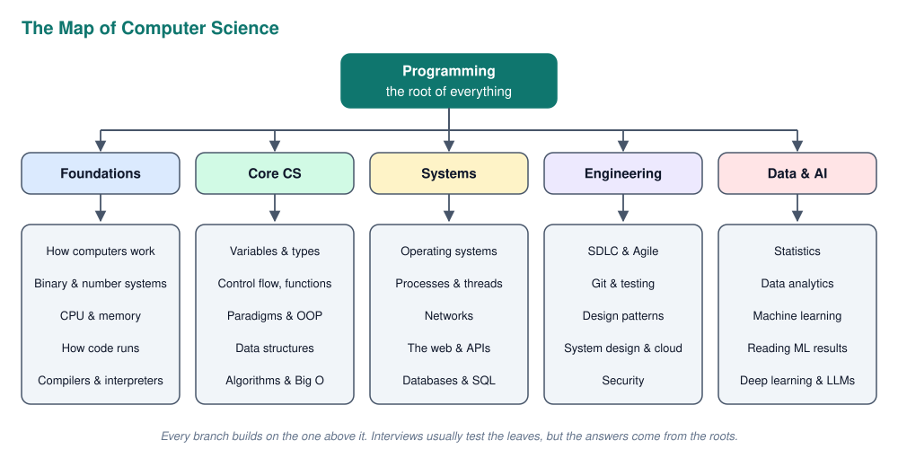

| Branch | What it answers | Typical interview question |
| --- | --- | --- |
| **Foundations** | How does hardware run my code? | "What is the difference between a compiler and an interpreter?" |
| **Core CS** | How do I structure code and data efficiently? | "What is the time complexity of a hash map lookup?" |
| **Systems** | How do programs talk to the OS, the network and databases? | "What happens when you type a URL in the browser?" |
| **Engineering** | How do teams build software that lasts? | "How would you test this feature?" |
| **Data & AI** | How do we learn from data and judge the result? | "Your model has 98% accuracy. Is it good?" |

---

## How Computers Work

Before any language or framework, there is a machine that can only do very simple things extremely fast: move numbers around, add them, compare them and jump to another instruction. Every program, from a Python script to a neural network, is eventually reduced to those operations.

### Binary, Bits and Bytes

A computer stores everything as **binary**: ones and zeros. The reason is physical. A transistor is either on or off, and two clear states are much more reliable than ten slightly different voltage levels.

| Unit | Size | Example |
| --- | --- | --- |
| **Bit** | a single 0 or 1 | a boolean |
| **Byte** | 8 bits, 256 possible values | one ASCII character like `A` |
| **Kilobyte (KB)** | ~1,000 bytes | a small text file |
| **Megabyte (MB)** | ~1,000 KB | a photo |
| **Gigabyte (GB)** | ~1,000 MB | RAM size, a movie |
| **Terabyte (TB)** | ~1,000 GB | a hard drive |

Text, images and sound are all just numbers with an agreed meaning. A letter is a number in a character table (**ASCII** for basic English, **UTF-8** for every language and emoji). A pixel is three numbers for red, green and blue. That is why "everything is data" is literally true.

### Number Systems

Programmers use three number systems. They all describe the same values, just with a different base.

| System | Base | Digits | Example for 255 | Where you see it |
| --- | --- | --- | --- | --- |
| **Decimal** | 10 | 0 to 9 | `255` | everyday maths |
| **Binary** | 2 | 0, 1 | `11111111` | how the hardware stores it |
| **Hexadecimal** | 16 | 0 to 9, A to F | `FF` | colours (`#0F766E`), memory addresses, MAC addresses |

Hex is popular because one hex digit is exactly four bits, so a byte is always two hex digits. It is a compact way to write binary.

Integers have a fixed size, which causes **overflow**: an 8 bit unsigned number can hold 0 to 255, and adding 1 to 255 wraps around to 0. Decimal fractions like `0.1` cannot be stored exactly in binary **floating point**, which is why the following prints `False` in almost every language.

```python
print(0.1 + 0.2 == 0.3)
print(0.1 + 0.2)
```

The fix is to compare with a small tolerance (`math.isclose`) or to use a decimal type for money. Never store money as a float.

### The CPU

The **CPU** (Central Processing Unit) runs a simple loop billions of times per second, called the **fetch, decode, execute** cycle:

1. **Fetch** the next instruction from memory (the **program counter** says where it is)
2. **Decode** it: figure out what operation it is and which data it needs
3. **Execute** it in the **ALU** (Arithmetic Logic Unit), then store the result in a **register**

A modern CPU has several **cores**, and each core can run its own stream of instructions. That is what makes real parallelism possible. The **clock speed** (e.g. 4 GHz) is how many cycles per second a core runs.

The **GPU** is a different kind of processor: thousands of small, simple cores that do the same operation on lots of data at once. That is perfect for graphics and for the matrix multiplications inside neural networks, which is why AI training runs on GPUs.

### The Memory Hierarchy

The CPU is much faster than memory, so computers use a hierarchy of storage. The closer to the CPU, the faster and smaller (and more expensive per GB) it is.

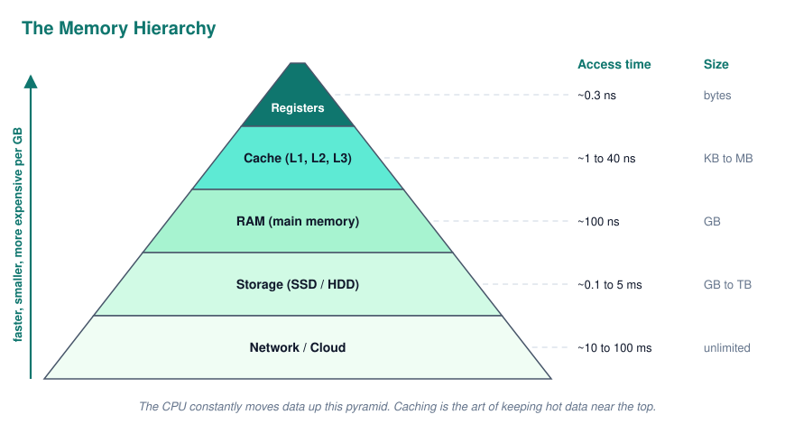

Two key distinctions come up a lot:

- **RAM vs storage.** RAM is fast but **volatile**: it is wiped when power goes off. Storage (SSD, HDD) is slow but **persistent**. A running program lives in RAM, saved files live in storage
- **Locality.** Caches work because programs tend to reuse the same data (**temporal locality**) and read neighbouring data (**spatial locality**). This is why looping over an array is much faster than jumping around a linked list, even when both are O(n)

---

## How Code Actually Runs

A CPU only understands **machine code**: binary instructions specific to its architecture (`x86`, `ARM`). Every language needs a way to turn readable source code into those instructions. There are three main strategies, and which one a language uses explains a lot about its speed, portability and typical use.

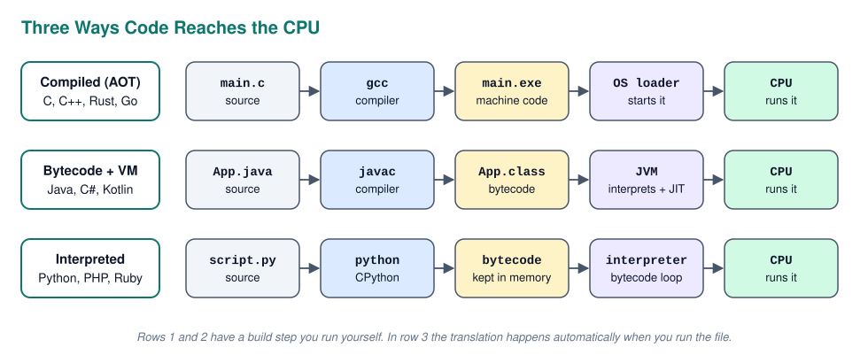

### Key Terms

These words get mixed up a lot, so it pays to have them sharp.

| Term | Meaning |
| --- | --- |
| **Source code** | The code you write (`main.c`, `App.java`, `script.py`) |
| **Compiler** | Translates the whole program into another form *before* it runs |
| **Interpreter** | Reads and executes code *while* the program runs |
| **Bytecode** | An in between format, run by a virtual machine instead of the CPU directly |
| **Virtual Machine** | A program that runs bytecode, e.g. the **JVM** (Java) or **CLR** (.NET) |
| **AOT** | Ahead Of Time compilation: everything is compiled before running |
| **JIT** | Just In Time compilation: hot code is compiled to machine code *during* execution |
| **Transpiler** | Translates one high level language into another (TypeScript to JavaScript) |

### Compiled to Machine Code

**C, C++, Rust, Go and Swift** are compiled ahead of time into a native executable. Compiling C happens in four steps: **preprocessing** (paste in `#include` files), **compiling** (C to assembly), **assembling** (assembly to object files) and **linking** (combine object files and libraries into one executable).

```bash
gcc main.c -o main
./main
```

This gives the **fastest execution** and catches type errors at compile time, but the binary only runs on the platform it was built for. A Windows `.exe` will not run on an ARM Mac. This is why embedded systems and game engines use these languages.

### Bytecode and a Virtual Machine

**Java, Kotlin, Scala and C#** compile to bytecode, and a virtual machine on the target computer runs it. This is Java's **"write once, run anywhere"** idea: the same `.class` file runs on any OS with a JVM, because the VM is the platform specific part.

```bash
javac App.java
java App
```

Modern VMs are fast because of the **JIT**: they watch which methods run often, then compile those to optimised machine code while the program runs. The cost is a slower startup ("warm up") and more memory. For a backend server that runs for weeks, that trade off is ideal.

### Interpreted

**Python, JavaScript, PHP and Ruby** run straight from source with no build step you run yourself. Under the hood most still compile: CPython turns your file into bytecode (the `.pyc` files in `__pycache__`) and then runs it in an interpreter loop. JavaScript's V8 engine goes further and JIT compiles hot functions, which is why JavaScript is much faster than Python.

Interpreted languages are the fastest to **develop** with, but the slowest to **run**, and many errors only appear at runtime. Python gets around the speed problem because libraries like NumPy and PyTorch are written in C, C++ and CUDA. Python only coordinates the work.

### The Execution Models Side by Side

The trade offs all come from *when* the translation to machine code happens.

| | Compiled (AOT) | Bytecode + VM | Interpreted / JIT |
| --- | --- | --- | --- |
| **Examples** | C, C++, Rust, Go | Java, C#, Kotlin | Python, JavaScript, PHP |
| **Execution speed** | Fastest | Fast after warm up | Slowest (JS is fast thanks to JIT) |
| **Startup** | Instant | Slower | Fast |
| **Portability** | Recompile per platform | Anywhere with the VM | Anywhere with the interpreter |
| **Errors appear** | Compile time | Mostly compile time | Mostly runtime |
| **User needs** | Nothing | The VM | The interpreter |

Strictly speaking, "compiled" and "interpreted" describe an **implementation**, not a language. PyPy runs Python with a JIT, and GraalVM can compile Java to a native binary. "Compiled language" means "a language that is *usually* compiled".

### Language Overview

This table is a quick reference for the most common languages, their toolchain and where they are used.

| Language | Compiler / Interpreter | Package Manager | Popular Libraries & Frameworks | Main Uses |
| --- | --- | --- | --- | --- |
| Python | CPython, PyPy | pip, conda, uv | NumPy, Pandas, scikit-learn, PyTorch, FastAPI, Django | AI/ML, data science, scripting, backend |
| JavaScript | V8 (Node.js, Chrome), Bun, Deno | npm, yarn, pnpm | React, Vue, Express, Next.js, Three.js | Frontend, backend, mobile |
| TypeScript | tsc, esbuild, swc | npm, yarn, pnpm | Same as JS, plus NestJS, Zod | Large typed web apps |
| Java | javac + JVM | Maven, Gradle | Spring Boot, Hibernate, JUnit | Enterprise backends, Android |
| C | GCC, Clang, MSVC | vcpkg, Conan | Standard library, SDL | Embedded, OS, drivers, firmware |
| C++ | g++, Clang++, MSVC | vcpkg, Conan | STL, Boost, Qt, OpenCV | Games, high performance, embedded |
| C# | Roslyn + .NET CLR | NuGet | ASP.NET Core, Entity Framework, Unity | Windows apps, games, enterprise |
| Go | gc (`go build`) | Go modules | Gin, gRPC, Cobra | Cloud services, CLIs, DevOps tools |
| Rust | rustc | Cargo | Tokio, Serde, Axum | Systems programming, safe fast code |
| Kotlin | kotlinc | Gradle | Jetpack Compose, Ktor | Android, JVM backends |
| Swift | swiftc | Swift Package Manager | SwiftUI, UIKit | Apple platforms |
| PHP | Zend Engine | Composer | Laravel, Symfony, WordPress | Server side web, CMS |
| R | R interpreter | CRAN | tidyverse, ggplot2, Shiny | Statistics, data analysis |
| SQL | The database engine | Comes with the database | PostGIS, procedural extensions | Querying relational data |
| Bash | bash, zsh | apt, brew | grep, sed, awk | Automation, server admin |

---

## Programming Fundamentals

Every language, no matter how different it looks, is built from the same handful of ideas. Once you understand them at this level, learning a new language is mostly learning new syntax.

### Variables and Data Types

A **variable** is a name bound to a value stored in memory. The **data type** tells the computer how to interpret those bits and which operations make sense.

| Category | Examples | Notes |
| --- | --- | --- |
| **Primitive** | `int`, `float`, `bool`, `char` | Fixed size, usually stored directly |
| **Text** | `str`, `String` | Usually **immutable**: "changing" a string creates a new one |
| **Collections** | `list`, `array`, `dict`, `set`, `tuple` | Hold many values |
| **Reference / object** | instances of classes | The variable holds a reference, the object lives on the heap |
| **Null** | `None`, `null`, `nil` | "No value". The source of the famous `NullPointerException` |

### Static vs Dynamic, Strong vs Weak Typing

These are two separate questions that people often confuse.

**Static vs dynamic** is about *when* types are checked. In a **statically typed** language (Java, C#, TypeScript, Rust) the type of every variable is known at compile time, so type errors are caught before the program runs. In a **dynamically typed** language (Python, JavaScript) types are checked at runtime, and a variable can hold anything.

**Strong vs weak** is about *how strict* the language is with mixing types. Python is **strong**: `"5" + 3` throws a `TypeError`. JavaScript is **weak**: it silently converts and gives `"53"`.

```javascript
console.log("5" + 3);
console.log("5" - 3);
console.log([] + {});
```

So Python is dynamic and strong, JavaScript is dynamic and weak, and Java is static and strong. Static typing costs a bit of typing up front but pays off massively in large codebases, which is the whole reason TypeScript exists.

### Control Flow

**Control flow** decides which line runs next. There are only three building blocks, and every algorithm is a combination of them:

- **Sequence**: run statements one after another
- **Selection**: choose a path (`if`, `else`, `switch`, `match`)
- **Iteration**: repeat (`for`, `while`, and recursion as an alternative)

Two related ideas come up in interviews. **Short circuit evaluation** means `a and b` does not evaluate `b` if `a` is already false, so `if user and user.is_admin` is safe even when `user` is `None`. **Truthiness** means values like `0`, `""`, `[]` and `None` count as false in a condition.

### Functions, Scope and Recursion

A **function** packages a piece of logic behind a name so it can be reused and tested on its own. **Parameters** are the names in the definition, **arguments** are the actual values passed in.

**Scope** decides where a variable is visible. A variable created inside a function is **local** and disappears when the function returns. A **closure** is a function that remembers variables from the scope where it was created, even after that scope has finished.

**Recursion** is a function calling itself on a smaller version of the problem. Every recursive function needs a **base case** that stops it, otherwise it keeps adding stack frames until a **stack overflow**.

```python
def factorial(n):
    if n <= 1:
        return 1
    return n * factorial(n - 1)
```

Recursion is natural for problems that are recursive by nature: trees, folder structures, divide and conquer algorithms.

### Stack and Heap Memory

A running program uses two main memory areas. The **stack** stores function calls: each call pushes a **stack frame** with its local variables, and returning pops it. It is fast and automatic but small. The **heap** stores objects whose size or lifetime is not known in advance. It is flexible, but something has to clean it up.

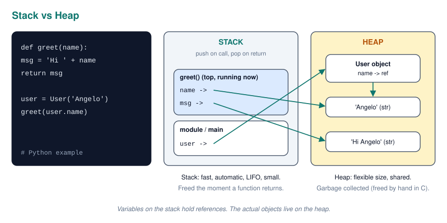

Cleaning up the heap is handled in one of three ways:

- **Manual**: C and C++ use `malloc`/`free` or `new`/`delete`. Forgetting to free causes a **memory leak**, freeing twice causes crashes
- **Garbage collection**: Java, C#, Python and JavaScript automatically free objects that nothing references anymore. Easy, but it costs some CPU and occasional pauses
- **Ownership**: Rust checks at compile time who owns each value and frees it when the owner goes out of scope. No GC and no manual frees

### Pass by Value vs Pass by Reference

When you pass a variable to a function, the function either gets a **copy of the value** or access to the **same object**.

In Java and Python the precise answer is "**pass by value of the reference**" (also called pass by sharing). The function gets a copy of the reference, so it can **mutate** the original object, but **reassigning** the parameter does not affect the caller.

```python
def change(items):
    items.append(4)
    items = [99]

nums = [1, 2, 3]
change(nums)
print(nums)
```

This prints `[1, 2, 3, 4]`. The `append` changed the shared list, the reassignment only changed the local name.

### Errors and Exceptions

Errors come in three kinds: **syntax errors** (the code cannot be parsed), **runtime errors** (it crashes while running, e.g. division by zero) and **logic errors** (it runs but gives the wrong answer, the hardest to find).

**Exceptions** let code signal an error and let a caller decide how to handle it with `try`, `catch`/`except` and `finally`. The rule of thumb is to catch only the exceptions you can actually handle, and never swallow them silently with an empty `except`.

---

## Programming Paradigms

A **paradigm** is a style of thinking about a program. Most modern languages are **multi paradigm**, so you will mix them, but knowing the differences shows you understand *why* code is written the way it is.

| Paradigm | Core idea | Typical languages |
| --- | --- | --- |
| **Imperative / procedural** | A sequence of steps that change state | C, early Python scripts |
| **Object oriented** | Model the world as objects with data and behaviour | Java, C#, Python |
| **Functional** | Build programs from pure functions and immutable data | Haskell, Elixir, also JS and Python |
| **Declarative** | Describe *what* you want, not *how* to get it | SQL, HTML, React JSX |

### Imperative vs Declarative

Imperative code tells the computer every step. Declarative code describes the result and lets the engine figure out the steps. Both of these produce the same list of adult names:

```python
adults = []
for p in people:
    if p.age >= 18:
        adults.append(p.name)

adults = [p.name for p in people if p.age >= 18]
```

The list comprehension is already more declarative. SQL goes all the way:

```sql
SELECT name FROM people WHERE age >= 18;
```

SQL is the clearest example: you never say *how* to search the table, and the database chooses the fastest way.

### Immutability and Pure Functions

A **pure function** always returns the same output for the same input and has no **side effects** (it does not change global state, write files or print). **Immutable** data cannot be changed after it is created; you create a new version instead.

These ideas matter because they make code predictable, easy to test and safe to run in parallel: if nothing can be modified, two threads cannot step on each other. React state updates and Redux are built on exactly this idea.

---

## Object Oriented Programming

**OOP** organises code around **objects** that combine data (**attributes** or **fields**) and behaviour (**methods**). It is the most asked about paradigm in interviews, especially for Java and C# roles.

### Classes and Objects

A **class** is a blueprint, an **object** is one concrete thing built from it (an **instance**). The **constructor** runs when an object is created and sets up its initial state.

```java
public class BankAccount {
    private double balance;

    public BankAccount(double start) {
        this.balance = start;
    }

    public void deposit(double amount) {
        if (amount <= 0) throw new IllegalArgumentException("Amount must be positive");
        balance += amount;
    }
}
```

`BankAccount` is the class, `new BankAccount(100)` creates an object. Static members belong to the class itself, not to any single object.

### The Four Pillars

These four ideas are the classic OOP interview question. Know a one line definition *and* the reason each one exists.

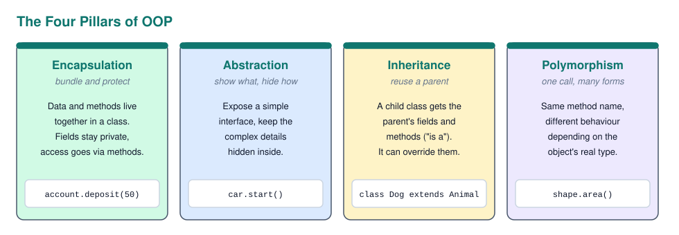

| Pillar | Definition | Why it matters |
| --- | --- | --- |
| **Encapsulation** | Keep data private and expose it only through methods | The object protects its own rules (no negative deposits) |
| **Abstraction** | Show *what* an object does, hide *how* | You can use a `List` without knowing its internals |
| **Inheritance** | A child class reuses and extends a parent class | Avoids duplicate code for "is a" relationships |
| **Polymorphism** | One method call behaves differently per object type | Code can work with `Shape` without knowing if it is a `Circle` or `Square` |

Polymorphism has two forms. **Overriding** (runtime) is a subclass replacing a parent method. **Overloading** (compile time) is several methods with the same name but different parameters.

### Abstract Classes vs Interfaces

Both describe what a class must be able to do, but they are used for different reasons.

| | Abstract class | Interface |
| --- | --- | --- |
| **Can hold state (fields)** | Yes | No (only constants) |
| **Can have implemented methods** | Yes | Only default methods (Java 8+) |
| **How many can a class use** | One (single inheritance) | Many |
| **Relationship** | "is a" (a `Dog` is an `Animal`) | "can do" (a `Dog` is `Comparable`) |

Use an abstract class to share code between closely related classes. Use an interface to define a capability that unrelated classes can have.

### Composition Over Inheritance

Inheritance creates a tight coupling: change the parent and every child might break. Deep hierarchies become hard to follow. **Composition** means building an object from other objects ("has a") instead of inheriting from them ("is a"). A `Car` *has an* `Engine`; it is not a kind of engine. Composition is usually more flexible, because you can swap the parts.

### SOLID Principles

**SOLID** is five guidelines for writing classes that are easy to change. You do not need to recite them perfectly, but knowing the idea behind each one shows design maturity.

| Letter | Principle | In plain words |
| --- | --- | --- |
| **S** | Single Responsibility | A class should have one reason to change |
| **O** | Open/Closed | Open for extension, closed for modification: add new behaviour without editing old code |
| **L** | Liskov Substitution | A subclass must work anywhere its parent is expected |
| **I** | Interface Segregation | Many small interfaces beat one giant one |
| **D** | Dependency Inversion | Depend on abstractions (interfaces), not concrete classes |

Dependency Inversion is the reason Spring uses **dependency injection**: a service asks for a `UserRepository` interface, and the framework decides which implementation to give it. That also makes testing easy, because you can inject a fake.

---

## Data Structures

A **data structure** is a way of organising data in memory so that certain operations are fast. Choosing the right one is often the difference between code that takes a millisecond and code that takes a minute.

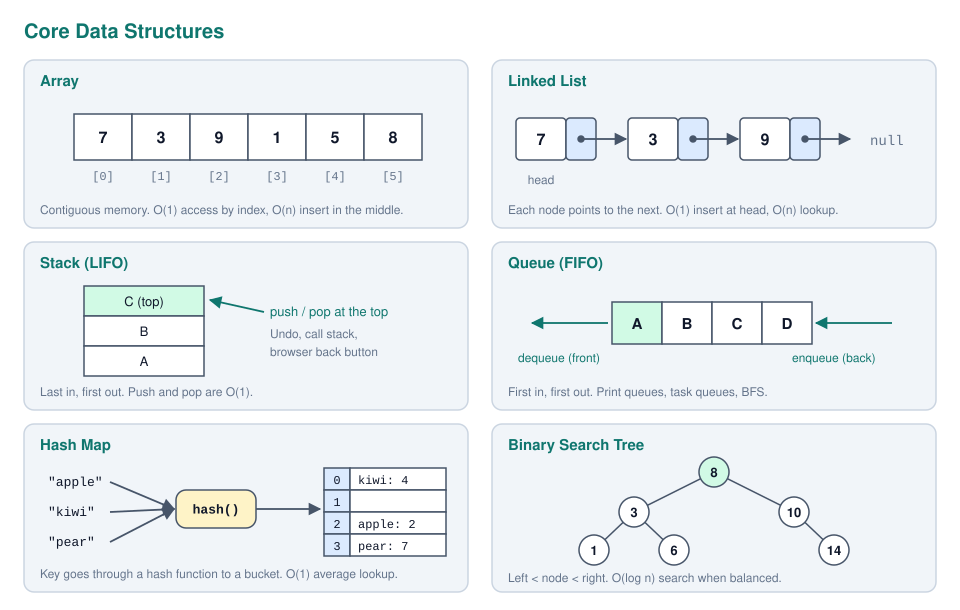

| Structure | Access | Search | Insert | Delete | Use it when |
| --- | --- | --- | --- | --- | --- |
| **Array / dynamic list** | O(1) | O(n) | O(1) at end, O(n) middle | O(n) | You need fast access by index |
| **Linked list** | O(n) | O(n) | O(1) at head | O(1) if you have the node | Lots of inserts at the ends |
| **Stack** | top only | O(n) | O(1) push | O(1) pop | Undo, backtracking, parsing |
| **Queue** | front only | O(n) | O(1) enqueue | O(1) dequeue | Processing in order, BFS |
| **Hash map / set** | n/a | O(1) average | O(1) average | O(1) average | Lookup by key, counting, deduplication |
| **Binary search tree** | O(log n) | O(log n) | O(log n) | O(log n) | Sorted data with fast lookup (balanced) |
| **Heap** | min/max O(1) | O(n) | O(log n) | O(log n) | Priority queues, "top k" problems |
| **Graph** | depends | O(V + E) | depends | depends | Networks, maps, relationships |

### Arrays vs Linked Lists

An **array** stores items next to each other in memory, so the address of item `i` can be calculated directly. That gives O(1) access, and it is very cache friendly. Inserting in the middle is slow because everything after it has to shift.

A **linked list** stores each item in a separate node that points to the next one. Inserting is cheap once you are at the right spot, but finding item `i` means walking from the head. In practice, arrays (Python `list`, Java `ArrayList`) win almost always because of the memory hierarchy.

### Stacks and Queues

These are not new structures so much as **rules** on how you add and remove items. A **stack** is **LIFO** (last in, first out), like a stack of plates. The call stack, undo history and the browser back button all work this way. A **queue** is **FIFO** (first in, first out), like a line at a shop. Print jobs, message queues and breadth first search use queues.

### Hash Maps

A **hash map** (Python `dict`, Java `HashMap`, JS `Map` or object) stores key value pairs. A **hash function** turns the key into a number, which picks a **bucket** in an underlying array. That is why lookup is O(1) on average: no searching, just a calculation.

Two different keys can land in the same bucket, a **collision**. It is handled by storing a small list per bucket (**chaining**) or by trying the next free slot (**open addressing**). With a bad hash function everything collides and lookups degrade to O(n). Keys must be **immutable** (or at least never change their hash), which is why a Python `list` cannot be a dictionary key but a `tuple` can.

### Trees and Graphs

A **tree** is a hierarchy: one **root**, each node has children, and there are no cycles. File systems, the HTML DOM and JSON are trees. In a **binary search tree** every left child is smaller and every right child is larger, so each comparison discards half of the remaining nodes. That only works if the tree stays **balanced**; insert sorted data into a naive BST and it becomes a linked list. Self balancing trees (red black, AVL) fix this, and database indexes use a related structure, the **B tree**.

A **graph** is nodes (**vertices**) connected by **edges**, with no hierarchy required. Edges can be **directed** (Twitter follows) or **undirected** (Facebook friends), and **weighted** (road distances) or not. Graphs are stored as an **adjacency list** (each node lists its neighbours, good for sparse graphs) or an **adjacency matrix** (a V x V grid, good for dense graphs).

---

## Algorithms and Complexity

An **algorithm** is a finite, step by step procedure to solve a problem. In interviews the question is rarely "does it work?" and almost always "how does it **scale**?".

### Big O Notation

**Big O** describes how the running time (or memory) of an algorithm grows as the input size `n` grows. It ignores constants and focuses on the dominant term, because for large inputs only the shape of the curve matters. It usually describes the **worst case**.

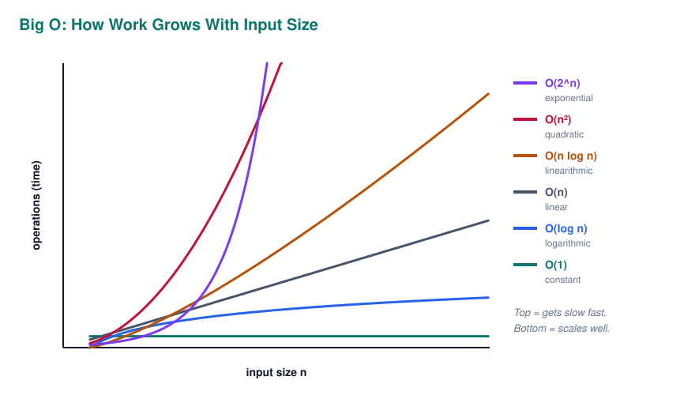

| Big O | Name | Example | n = 1,000,000 |
| --- | --- | --- | --- |
| O(1) | Constant | Array index, hash map lookup | 1 step |
| O(log n) | Logarithmic | Binary search | ~20 steps |
| O(n) | Linear | Loop over a list once | 1 million steps |
| O(n log n) | Linearithmic | Good sorting algorithms | ~20 million steps |
| O(n²) | Quadratic | Nested loop over the same list | 1 trillion steps |
| O(2^n) | Exponential | All subsets of a set | impossible |

To find the complexity of code, count the loops: one loop over `n` is O(n), a nested loop over `n` is O(n²), and halving the problem each step gives O(log n). Sequential blocks add up and the biggest term wins, so O(n) + O(n²) is just O(n²).

**Space complexity** works the same way, but for extra memory. A common trade off is spending O(n) memory on a hash set to turn an O(n²) search into O(n) time.

### Searching

**Linear search** checks every item one by one: O(n), works on any list. **Binary search** only works on **sorted** data: look at the middle, then throw away the half that cannot contain the target. Each step halves the problem, so it takes O(log n). For a million items that is about 20 comparisons instead of a million.

```python
def binary_search(arr, target):
    lo, hi = 0, len(arr) - 1
    while lo <= hi:
        mid = (lo + hi) // 2
        if arr[mid] == target:
            return mid
        if arr[mid] < target:
            lo = mid + 1
        else:
            hi = mid - 1
    return -1
```

### Sorting

You will almost never write a sort yourself, but knowing how the classic ones behave shows you understand complexity trade offs.

| Algorithm | Average | Worst | Extra memory | Stable | Idea |
| --- | --- | --- | --- | --- | --- |
| **Bubble sort** | O(n²) | O(n²) | O(1) | Yes | Swap neighbours until sorted. Only for teaching |
| **Insertion sort** | O(n²) | O(n²) | O(1) | Yes | Insert each item into the sorted part. Fast on almost sorted data |
| **Merge sort** | O(n log n) | O(n log n) | O(n) | Yes | Split in half, sort both, merge |
| **Quick sort** | O(n log n) | O(n²) | O(log n) | No | Pick a pivot, partition around it |
| **Heap sort** | O(n log n) | O(n log n) | O(1) | No | Build a heap, pull out the max repeatedly |

A **stable** sort keeps equal items in their original order, which matters when sorting by several keys. Python's `sorted()` uses **Timsort** (a merge and insertion sort hybrid), which is stable and O(n log n).

### Recursion and Divide and Conquer

**Divide and conquer** splits a problem into smaller copies of itself, solves those (often recursively) and combines the answers. Merge sort, quick sort and binary search are all examples. The O(log n) part comes from how many times you can halve `n` before reaching 1.

### Dynamic Programming

**Dynamic programming** is for problems where the same sub problems are solved again and again. Instead of recomputing them, you store the answers (**memoisation** top down, or a table built **bottom up**). The classic example is Fibonacci: the naive recursive version is O(2^n), the memoised one is O(n).

```python
from functools import lru_cache

@lru_cache(maxsize=None)
def fib(n):
    if n < 2:
        return n
    return fib(n - 1) + fib(n - 2)
```

The signal that a problem needs dynamic programming is "overlapping sub problems" plus "the best answer is built from best answers to smaller problems" (**optimal substructure**).

### Graph Traversal

There are two basic ways to visit every node in a graph or tree, and most graph algorithms build on one of them.

| | Breadth First Search (BFS) | Depth First Search (DFS) |
| --- | --- | --- |
| **Order** | Level by level, closest nodes first | Go as deep as possible, then backtrack |
| **Uses a** | Queue | Stack (or recursion) |
| **Good for** | Shortest path in an unweighted graph | Detecting cycles, exploring all paths, mazes |
| **Complexity** | O(V + E) | O(V + E) |

For shortest paths with weights (Google Maps), **Dijkstra's algorithm** extends BFS with a priority queue.

---

## Operating Systems

The **operating system** (Windows, Linux, macOS) sits between your programs and the hardware. Without it, every program would need to know how to talk to every disk, network card and screen. With it, a program just asks the OS through **system calls** like "open this file" or "send these bytes".

### What an OS Does

An OS has a handful of core jobs, and almost every OS question maps to one of them.

| Job | What it means |
| --- | --- |
| **Process management** | Start, stop and schedule programs so they share the CPU fairly |
| **Memory management** | Give each process its own memory and keep them from reading each other's |
| **File systems** | Organise data on disk into files and folders, with permissions |
| **Device drivers** | Talk to hardware (keyboard, GPU, network card) on behalf of programs |
| **Security** | Users, permissions, isolating processes |

The core of the OS is the **kernel**, which runs with full hardware access (**kernel mode**). Your programs run in **user mode** and must ask the kernel for anything privileged. **Virtual memory** gives every process the illusion of its own large, private address space; the OS maps it to real RAM and moves unused pages to disk (**swapping**) when RAM runs out.

### Processes and Threads

A **process** is a running program with its own isolated memory. A **thread** is a path of execution inside a process. One process can have many threads, and those threads **share** the process memory.

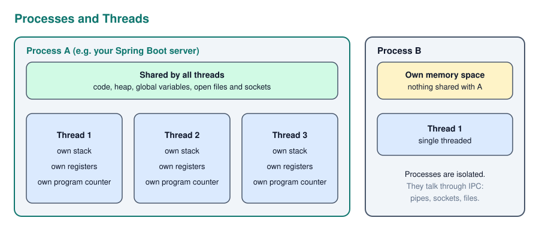

| | Process | Thread |
| --- | --- | --- |
| **Memory** | Own, isolated | Shared with other threads in the process |
| **Creation cost** | Heavy | Light |
| **Communication** | Through IPC (pipes, sockets, files) | Directly through shared variables |
| **If it crashes** | Other processes are fine | Can take down the whole process |

Chrome runs each tab as a separate process for exactly this reason: one crashing tab does not kill the browser. A web server, on the other hand, handles many requests with threads, because they are cheap and can share caches and connection pools.

The OS switches between threads with a **context switch**: it saves the registers of one thread and loads another. This is how one core appears to run many programs at once.

### Concurrency Problems

Shared memory is fast but dangerous. When two threads touch the same data at the same time, things go wrong in ways that are hard to reproduce.

A **race condition** happens when the result depends on timing. `count += 1` looks like one step but is really three (read, add, write), so two threads can both read 5 and both write 6. The fix is to make the critical part **atomic**, usually with a **lock** (also called a **mutex**): only one thread can hold it at a time.

A **deadlock** happens when threads wait for each other forever. Thread A holds lock 1 and waits for lock 2, thread B holds lock 2 and waits for lock 1. Neither can move. The simplest prevention is to always acquire locks in the same order.

Other terms worth knowing: a **semaphore** is a lock that allows N threads at once (e.g. max 10 database connections), and **starvation** is a thread that never gets its turn.

### Concurrency vs Parallelism

These are related but not the same, and interviewers like the distinction.

- **Concurrency** is about *dealing* with many things at once: tasks make progress in overlapping time periods, even on a single core, by switching between them
- **Parallelism** is about *doing* many things at once: tasks literally run at the same moment on different cores

**Async/await** (JavaScript, Python `asyncio`) is concurrency without threads: while one task waits for the network, the event loop runs another. It is perfect for **I/O bound** work (waiting on APIs and databases). For **CPU bound** work (number crunching) you need real parallelism with multiple processes or cores. In Python this is especially important because the **GIL** (Global Interpreter Lock) historically lets only one thread run Python bytecode at a time.

---

## Computer Networks

A **network** is computers exchanging data. The internet is a network of networks that all agree on the same set of rules, called **protocols**. Networking is split into layers so that each layer only has to solve one problem and can trust the layer below it.

### The Layer Models

The **OSI model** has 7 layers and is mostly used to talk and teach. The **TCP/IP model** has 4 layers and is what the internet actually runs on. When data is sent, each layer wraps it in its own header (**encapsulation**); the receiver unwraps the layers in reverse.

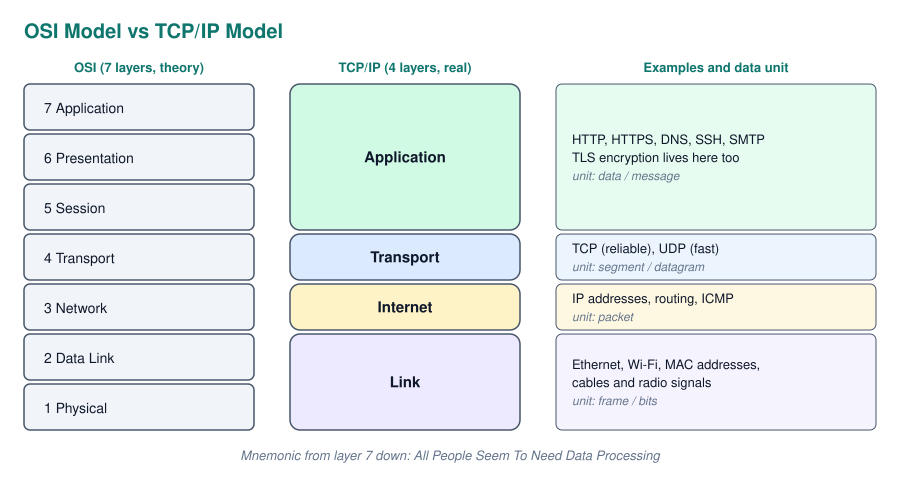

An analogy: the application layer is the letter you write, the transport layer is choosing registered mail or a postcard, the internet layer is the address on the envelope, and the link layer is the van that drives it down one street.

### IP, Ports and DNS

Three ideas together answer "how does data find the right program on the right computer?".

| Concept | What it identifies | Example |
| --- | --- | --- |
| **IP address** | A device on a network | `192.168.1.10` (IPv4), `2001:db8::1` (IPv6) |
| **Port** | A program on that device | `80` HTTP, `443` HTTPS, `22` SSH, `5432` PostgreSQL |
| **DNS** | Translates names into IP addresses | `example.com` to an IP |
| **MAC address** | A network card on the local network | `00:1A:2B:3C:4D:5E` |

**Private IPs** (`192.168.x.x`, `10.x.x.x`) only work inside your local network. Your router uses **NAT** to share one public IP between all your devices. `127.0.0.1` (**localhost**) always means "this machine".

**DNS** is the phone book of the internet. Your computer asks a resolver, which asks the root servers, then the `.com` servers, then the domain's own name servers. The answer is cached for a time (the **TTL**) so this does not happen on every request.

### TCP vs UDP

The transport layer offers two options, and the choice is a classic interview question.

| | TCP | UDP |
| --- | --- | --- |
| **Connection** | Yes, three way handshake first | No, just send |
| **Reliability** | Guaranteed delivery, in order, retransmits lost data | No guarantees |
| **Speed** | Slower, more overhead | Faster, less overhead |
| **Used for** | Web pages, APIs, email, file transfer | Video calls, online games, live streaming, DNS |

The reasoning: if one packet of a web page is lost, the page is broken, so you want TCP to resend it. If one packet of a video call is lost, resending it is pointless because that moment has passed; a tiny glitch is better than a delay.

**WebSockets** run over TCP but keep the connection open in both directions, so the server can push data to the client instantly. That is what makes chat apps and real time control (like streaming commands to a remote controlled car) feel live.

### What Happens When You Type a URL

This is probably the most common systems question of all, because it touches every layer. Walk through it in order.

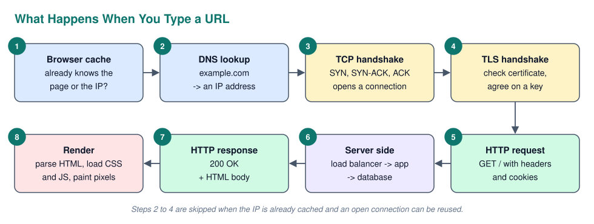

1. **Cache check**: the browser looks for a cached copy of the page or of the IP address
2. **DNS**: the domain name is resolved to an IP address
3. **TCP handshake**: `SYN`, `SYN-ACK`, `ACK` opens a reliable connection to the server on port 443
4. **TLS handshake**: the server proves its identity with a certificate, and both sides agree on an encryption key
5. **HTTP request**: the browser sends `GET /` with headers and cookies
6. **Server side**: a load balancer picks a server, the application runs its logic and probably queries a database
7. **HTTP response**: the server returns a status code (`200 OK`) and the HTML
8. **Rendering**: the browser parses the HTML into the **DOM**, downloads CSS, JS and images (more requests), runs the JavaScript and paints the page

---

## The Web and APIs

The web is built on a simple **client server** model: a client (browser, mobile app, another server) sends a request, a server sends back a response. Almost every internship project touches this, so it is worth knowing the details.

### Client and Server

The **frontend** is what runs on the user's device: HTML for structure, CSS for style and JavaScript for behaviour, usually with a framework like React or Vue. The **backend** runs on a server: it holds the business logic, talks to the database and enforces security. A **full stack** developer works on both.

The golden rule: **never trust the client**. Anything in the browser can be read and modified by the user, so validation and permission checks must always happen on the server too.

### HTTP Methods

**HTTP** is a stateless request/response protocol. **Stateless** means every request stands on its own; the server does not remember the previous one unless you send something (a cookie, a token) that identifies you.

| Method | Purpose | Safe | Idempotent |
| --- | --- | --- | --- |
| `GET` | Read a resource | Yes | Yes |
| `POST` | Create a resource or trigger an action | No | No |
| `PUT` | Replace a resource completely | No | Yes |
| `PATCH` | Update part of a resource | No | Not guaranteed |
| `DELETE` | Remove a resource | No | Yes |

**Safe** means it does not change anything on the server. **Idempotent** means sending it once or ten times has the same end result. That matters for retries: if a `PUT` times out you can safely resend it, but resending a `POST` might create two orders.

### Status Codes

The first digit of a status code tells you who is responsible: 2xx all good, 3xx look elsewhere, 4xx the **client** made a mistake, 5xx the **server** failed.

| Code | Meaning | When you see it |
| --- | --- | --- |
| `200` | OK | Successful `GET` |
| `201` | Created | Successful `POST` that created something |
| `204` | No Content | Successful `DELETE` |
| `301` / `302` | Moved permanently / temporarily | Redirects, HTTP to HTTPS |
| `304` | Not Modified | Browser can use its cached copy |
| `400` | Bad Request | Invalid input |
| `401` | Unauthorized | Not logged in (really means *unauthenticated*) |
| `403` | Forbidden | Logged in, but not allowed |
| `404` | Not Found | Resource does not exist |
| `409` | Conflict | E.g. email already registered |
| `422` | Unprocessable Content | Valid JSON, but fails validation |
| `429` | Too Many Requests | Rate limited |
| `500` | Internal Server Error | Unhandled exception on the server |
| `502` / `503` | Bad Gateway / Service Unavailable | Server behind the proxy is down or overloaded |

### REST APIs

An **API** (Application Programming Interface) is a contract for how programs talk to each other. **REST** is the most common style for web APIs. Its main ideas are: everything is a **resource** with a URL (a noun, not a verb), you act on it with HTTP methods, and every request is stateless. Data is usually sent as **JSON**.

The same resource with different methods gives you all the operations, known as **CRUD** (Create, Read, Update, Delete):

```text
GET    /api/users          list users
GET    /api/users/42       get user 42
POST   /api/users          create a user
PATCH  /api/users/42       update part of user 42
DELETE /api/users/42       delete user 42
GET    /api/users/42/orders   orders of user 42
```

Alternatives you might hear about: **GraphQL** (the client asks for exactly the fields it needs in one query) and **gRPC** (fast binary calls between internal services).

### Authentication vs Authorization

These two sound alike but are separate steps. **Authentication** is *who are you?* (login). **Authorization** is *what are you allowed to do?* (permissions, roles). A `401` is an authentication failure, a `403` is an authorization failure.

There are two common ways to remember a logged in user across stateless requests:

| | Sessions | Tokens (JWT) |
| --- | --- | --- |
| **Where state lives** | On the server (session store) | Inside the token itself, signed by the server |
| **Client holds** | A session ID in a cookie | The token, sent in the `Authorization: Bearer` header |
| **Logout / revoke** | Easy: delete the session | Hard: token is valid until it expires |
| **Scaling** | Servers need a shared session store | Any server can verify the signature |

A **JWT** is **signed, not encrypted**: anyone can decode and read it, they just cannot change it without breaking the signature. Never put secrets in it. **OAuth 2.0** is the standard behind "Log in with Google": it lets an app get limited access to your account without ever seeing your password.

### Cookies and CORS

A **cookie** is a small piece of data the server asks the browser to store and send back with every request to that site. Important flags are `HttpOnly` (JavaScript cannot read it, protects against XSS), `Secure` (HTTPS only) and `SameSite` (limits cross site sending, protects against CSRF).

**CORS** (Cross Origin Resource Sharing) confuses everyone the first time. Browsers block a page on `site-a.com` from reading responses from an API on `site-b.com` (the **same origin policy**) unless the API explicitly allows it with headers like `Access-Control-Allow-Origin`. CORS errors are fixed on the **server**, not in the frontend code. It is a browser rule only, which is why the same request works fine from Postman.

### Frontend Rendering Strategies

Where the HTML is built changes speed, SEO and server cost.

| Strategy | HTML is built | Good for | Example |
| --- | --- | --- | --- |
| **CSR** (client side) | In the browser by JavaScript | App like dashboards | Plain React (Vite) |
| **SSR** (server side) | On the server for every request | Dynamic pages that need SEO | Next.js, PHP |
| **SSG** (static) | Once, at build time | Blogs, docs, portfolios | Static site on GitHub Pages |

---

## Databases

A **database** stores data persistently and lets many users read and write it safely at the same time. A **DBMS** (PostgreSQL, MySQL, MongoDB) is the software that manages it.

### Relational Databases and Keys

A **relational database** stores data in **tables** (relations) of **rows** (records) and **columns** (attributes), with a fixed **schema**. Tables are linked through keys.

| Key | Purpose |
| --- | --- |
| **Primary key** | Uniquely identifies each row, never null (`user_id`) |
| **Foreign key** | A column that references the primary key of another table, creating a relationship |
| **Composite key** | A primary key made of several columns together |
| **Candidate key** | Any column (set) that could be the primary key, e.g. email |

Relationships come in three kinds: **one to one** (user and profile), **one to many** (customer and orders, the foreign key goes on the "many" side), and **many to many** (students and courses, which needs a **junction table** in between).

### Normalization

**Normalization** means organising tables so that every fact is stored exactly once. Duplicated data leads to **anomalies**: update a customer's address in one row but not the others, and the database now contradicts itself.

| Normal form | Rule | Plain meaning |
| --- | --- | --- |
| **1NF** | Atomic values, no repeating groups | One value per cell, no `phone1, phone2, phone3` |
| **2NF** | 1NF + no partial dependency | Every column depends on the *whole* composite key |
| **3NF** | 2NF + no transitive dependency | Columns depend only on the key, not on other non key columns |

The classic summary of 3NF: every column depends on "the key, the whole key, and nothing but the key". **Denormalization** is the deliberate opposite, duplicating some data to make reads faster, common in analytics and reporting databases.

### Joins

A **join** combines rows from two tables based on a related column. The type of join decides what happens to rows that have no match.

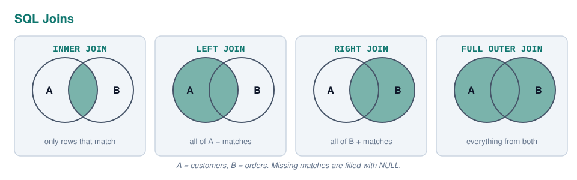

To list every customer with their orders, including customers who never ordered, you need a `LEFT JOIN`:

```sql
SELECT c.name, o.order_id, o.total
FROM customers c
LEFT JOIN orders o ON o.customer_id = c.customer_id
ORDER BY c.name;
```

Know the logical execution order of a query, because it explains many errors (like why you cannot use a `SELECT` alias inside `WHERE`): `FROM` and `JOIN`, then `WHERE`, `GROUP BY`, `HAVING`, `SELECT`, `ORDER BY`, `LIMIT`. `WHERE` filters rows *before* grouping, `HAVING` filters groups *after*.

### Indexes

An **index** is a separate sorted structure (usually a **B tree**) that lets the database find rows without scanning the whole table, just like the index at the back of a book. It turns an O(n) scan into roughly O(log n).

Indexes are not free. Every `INSERT`, `UPDATE` and `DELETE` must also update every index, and they take disk space. So you index columns that are often used in `WHERE`, `JOIN` and `ORDER BY`, not everything. Primary keys are indexed automatically. `EXPLAIN` shows you whether a query actually uses an index.

### Transactions and ACID

A **transaction** groups several operations into one unit that either fully happens or not at all. The textbook example is a bank transfer: subtracting from one account and adding to another must both succeed, or both be undone.

| Property | Meaning |
| --- | --- |
| **Atomicity** | All or nothing. A failure rolls back everything |
| **Consistency** | The database moves from one valid state to another; constraints always hold |
| **Isolation** | Concurrent transactions do not see each other's half finished work |
| **Durability** | Once committed, the data survives a crash or power cut |

In SQL the transfer is wrapped between `BEGIN` and `COMMIT`:

```sql
BEGIN;
UPDATE accounts SET balance = balance - 100 WHERE id = 1;
UPDATE accounts SET balance = balance + 100 WHERE id = 2;
COMMIT;
```

If anything fails between `BEGIN` and `COMMIT`, a `ROLLBACK` restores the original state.

### SQL vs NoSQL

**NoSQL** is a family of databases that do not use the relational table model. They trade some of the guarantees of SQL for flexibility or scale.

| Type | Example | Data looks like | Good for |
| --- | --- | --- | --- |
| **Relational (SQL)** | PostgreSQL, MySQL | Tables with a fixed schema | Structured data with relationships, transactions |
| **Document** | MongoDB, Firestore | JSON like documents | Flexible or nested data, fast iteration |
| **Key value** | Redis | `key -> value` | Caching, sessions, counters |
| **Column family** | Cassandra | Wide rows | Huge write volumes, time series |
| **Graph** | Neo4j | Nodes and edges | Social networks, recommendations |
| **Vector** | pgvector, Pinecone | Embedding vectors | Similarity search, RAG for LLMs |

The honest answer to "SQL or NoSQL?" is: start with a relational database unless you have a specific reason not to. Most business data is relational, and PostgreSQL can even store JSON when you need flexibility.

### ORMs

An **ORM** (Object Relational Mapper) like Hibernate/JPA, Entity Framework, Prisma or SQLAlchemy maps database tables to classes, so you work with objects instead of writing SQL by hand. It saves a lot of boilerplate and protects against SQL injection, but it can hide slow queries. The famous trap is the **N+1 problem**: loading 100 users and then running one extra query per user to get their orders, 101 queries instead of 1 join.

---

## Software Engineering Practices

Writing code that works is the easy part. **Software engineering** is about writing code that a team can understand, change and trust for years. This is where internship interviews check whether you can work in a real team.

### The Software Development Life Cycle

The **SDLC** describes the phases every piece of software goes through: **requirements** (what should it do?), **design** (how will it be structured?), **implementation** (writing the code), **testing**, **deployment** and **maintenance**.

The **waterfall** model does these phases once, in order. It is simple but rigid: you only find out the requirements were wrong at the very end. **Agile** does all phases in short loops, so feedback comes early and often.

### Agile and Scrum

**Agile** is a mindset: deliver working software in small increments, collaborate with the customer and respond to change instead of following a fixed plan. **Scrum** is the most popular framework to apply it.

| Scrum element | What it is |
| --- | --- |
| **Sprint** | A fixed period (usually 2 weeks) that delivers a working increment |
| **Product backlog** | Prioritised list of everything the product needs, owned by the **Product Owner** |
| **Sprint planning** | The team picks backlog items for the sprint |
| **Daily stand up** | 15 minutes: what I did, what I will do, what blocks me |
| **Sprint review** | Demo the increment to stakeholders |
| **Retrospective** | The team reflects on *how* they worked and what to improve |
| **Scrum Master** | Removes blockers and protects the process |

Work is often written as **user stories** ("As a user, I want to reset my password, so that I can get back into my account"), estimated in **story points**, and tracked on a **Kanban** board (To Do, In Progress, Review, Done).

### Version Control With Git

**Git** tracks every change to the code, lets many people work in parallel and makes it possible to go back in time. The everyday team workflow is: create a **branch** for your feature, make small **commits**, **push** it, open a **pull request**, get a **code review**, let CI run the tests, then **merge** into `main`.

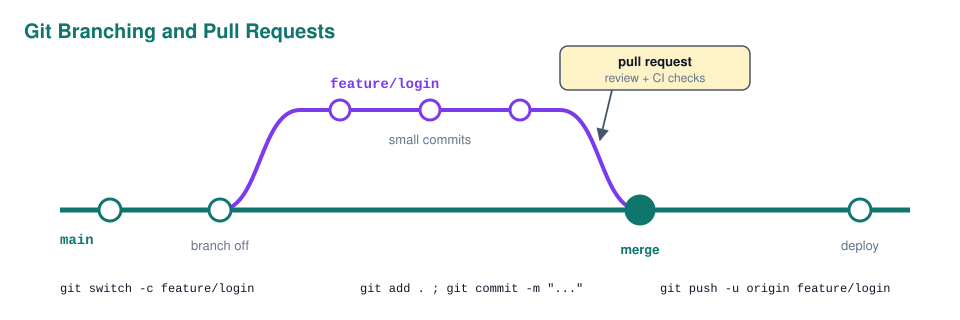

| Concept | Meaning |
| --- | --- |
| **Commit** | A snapshot of changes with a message |
| **Branch** | An independent line of work |
| **Merge** | Combine branches, keeping both histories |
| **Rebase** | Replay your commits on top of another branch for a linear history |
| **Merge conflict** | Two branches changed the same lines; a human must decide |
| **Pull request** | A request to merge, where review and discussion happen |

Good commit messages say *why* a change was made, not just *what*. The code already shows the what.

### Testing

Tests prove the code does what it should, and more importantly, that it **keeps** doing it after future changes (protection against **regressions**). The **testing pyramid** shows the healthy balance.

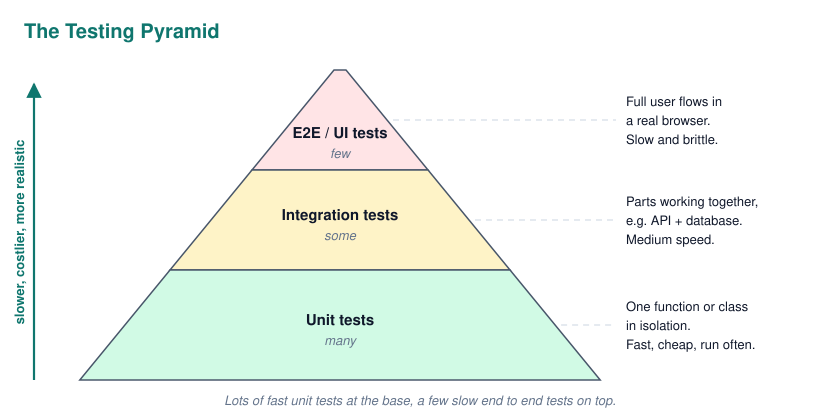

| Type | Tests | Example tools |
| --- | --- | --- |
| **Unit** | One function or class in isolation, dependencies faked with **mocks** | JUnit, pytest, Jest, Vitest |
| **Integration** | Several parts together, e.g. API plus a real test database | Spring Boot Test, Testcontainers |
| **End to end** | Full user flows through the real UI | Playwright, Cypress, Selenium |

A unit test usually follows **Arrange, Act, Assert**:

```python
def test_deposit_increases_balance():
    account = BankAccount(100)
    account.deposit(50)
    assert account.balance == 150
```

**TDD** (Test Driven Development) flips the order: write a failing test first, make it pass with the simplest code, then refactor (**red, green, refactor**). **Code coverage** measures how much code the tests execute, but 100% coverage does not mean the tests check the right things.

### CI/CD

**Continuous Integration** means every push automatically builds the code and runs the tests (GitHub Actions, GitLab CI, Jenkins), so broken code is caught within minutes instead of at release time. **Continuous Delivery** keeps the main branch always ready to release; **Continuous Deployment** goes one step further and releases every passing change automatically.

### Clean Code and Code Reviews

Code is read far more often than it is written. A few principles cover most of what "clean" means:

- **Meaningful names**: `elapsed_days` instead of `d`
- **Small functions** that do one thing
- **DRY** (Don't Repeat Yourself): one source of truth for each piece of logic
- **KISS** (Keep It Simple): the simplest solution that works
- **YAGNI** (You Aren't Gonna Need It): do not build features "just in case"

**Technical debt** is the future cost of shortcuts taken today. Some debt is fine to ship faster, as long as it is a conscious choice and gets paid back. In a **code review**, be specific, kind and focused on the code rather than the person, and receive feedback the same way.

---

## Design Patterns and Architecture

Once the code is clean at the level of functions and classes, the next question is how the bigger pieces fit together. **Design patterns** are reusable solutions to common problems inside a codebase. **Architecture** is the structure of the whole system.

### Common Design Patterns

The "Gang of Four" book defined 23 patterns in three groups: **creational** (how objects are created), **structural** (how they are composed) and **behavioural** (how they communicate). These are the ones you will actually meet:

| Pattern | Type | Problem it solves | Real example |
| --- | --- | --- | --- |
| **Singleton** | Creational | Exactly one shared instance | A config object, a logger. Overuse makes testing hard |
| **Factory** | Creational | Create objects without hard coding the exact class | `createNotification("email")` returns the right subclass |
| **Builder** | Creational | Construct complex objects step by step | `Request.builder().url(...).timeout(5).build()` |
| **Adapter** | Structural | Make an incompatible interface fit | Wrapping a third party payment API in your own interface |
| **Decorator** | Structural | Add behaviour without changing the class | Python `@decorators`, Java I/O streams |
| **Facade** | Structural | One simple interface over a complex subsystem | A `checkout()` method hiding stock, payment and email |
| **Observer** | Behavioural | Notify many objects when something changes | Event listeners, React state, pub/sub |
| **Strategy** | Behavioural | Swap algorithms at runtime | Different pricing or sorting strategies behind one interface |
| **Repository** | Architectural | Hide data access behind a collection like interface | Spring Data `UserRepository` |
| **Dependency Injection** | Architectural | Give objects their dependencies instead of creating them | Spring `@Autowired`, constructor injection |

### Architectural Styles

Architecture decides where each kind of code lives. Two styles come up constantly.

**MVC** (Model, View, Controller) separates the data and business rules (**model**), what the user sees (**view**) and the code that handles input and connects the two (**controller**). Most backends use a **layered architecture** built on the same idea: controller (HTTP), service (business logic), repository (database). Each layer only talks to the one below it, so you can change the database without touching the controllers.

**Monolith vs microservices** is the other big one:

| | Monolith | Microservices |
| --- | --- | --- |
| **Structure** | One codebase, one deployable | Many small services, each deployed independently |
| **Start up cost** | Low, simple to build and debug | High, needs networking, monitoring, DevOps |
| **Scaling** | Scale the whole thing | Scale only the busy service |
| **Failure** | One bug can take everything down | Failures are isolated (if designed well) |
| **Best for** | Small teams, new products | Large organisations with many teams |

Almost every successful microservice system started as a monolith. Splitting too early is a classic mistake.

### Scaling a System

When traffic grows, there are two directions. **Vertical scaling** (scale up) means a bigger machine: easy, but there is a ceiling and a single point of failure. **Horizontal scaling** (scale out) means more machines behind a **load balancer**: no ceiling, but the app servers must be **stateless** (sessions in a shared store, not in server memory), so any server can handle any request.

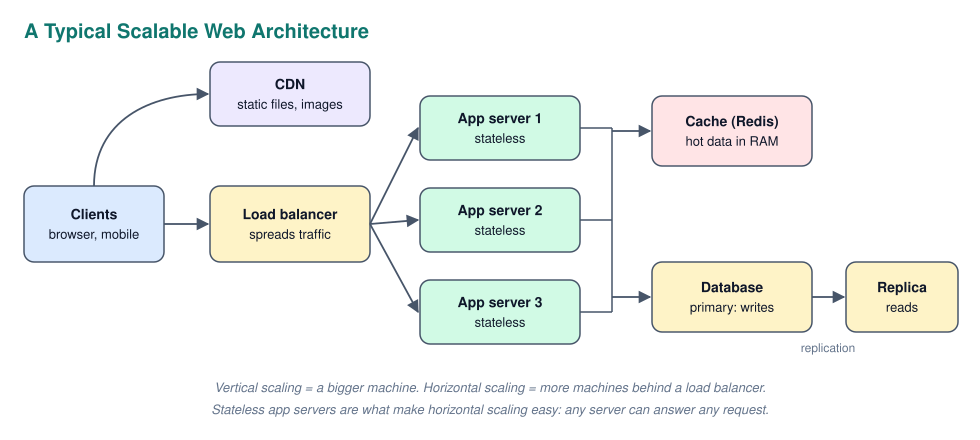

| Building block | Role |
| --- | --- |
| **Load balancer** | Spreads requests over servers, removes unhealthy ones |
| **CDN** | Serves static files from servers close to the user |
| **Cache** | Keeps frequent results in fast memory (Redis) |
| **Read replicas** | Copies of the database that take read traffic off the primary |
| **Message queue** | Lets slow work (emails, video processing) happen in the background (RabbitMQ, Kafka) |
| **Sharding** | Splits one huge database across machines by key |

### Caching

A **cache** stores the result of expensive work so the next request is fast. It shows up at every level: CPU cache, browser cache, CDN, Redis, database buffer. The hard parts are deciding when cached data is **stale** (invalidation, often with a **TTL**) and what to throw out when the cache is full (**eviction**, usually **LRU**: least recently used). There is an old joke that the two hardest problems in computer science are cache invalidation and naming things.

### The CAP Theorem

In a **distributed system** (data spread over several machines) the network can always fail, causing a **partition**. The **CAP theorem** says that during a partition you must choose between **Consistency** (every read sees the latest write, or gets an error) and **Availability** (every request gets an answer, maybe slightly outdated). A bank chooses consistency, a social media feed chooses availability. Many systems settle for **eventual consistency**: all copies agree after a short delay.

---

## Cloud, Containers and DevOps

The **cloud** means renting computing resources from a provider (AWS, Azure, Google Cloud) instead of owning servers. You pay for what you use and can scale up in minutes. **DevOps** is the culture and tooling that joins development and operations, so the people who build software also make it easy to deploy and run.

### Cloud Service Models

The service models differ in how much the provider manages for you. A useful analogy is pizza: make it at home, buy a frozen one, or go to a restaurant.

| Model | You manage | Provider manages | Example |
| --- | --- | --- | --- |
| **IaaS** (Infrastructure) | OS, runtime, app, data | Hardware, network, virtualisation | AWS EC2, Azure VMs |
| **PaaS** (Platform) | Your app and data | Everything underneath | Heroku, Render, Vercel, Azure App Service |
| **SaaS** (Software) | Just your account and data | Everything | Gmail, Notion, Slack |
| **Serverless / FaaS** | Single functions | Servers appear and disappear on demand | AWS Lambda, Cloudflare Workers |

### Virtual Machines vs Containers

Both solve "it works on my machine" by packaging software with what it needs, but at different levels.

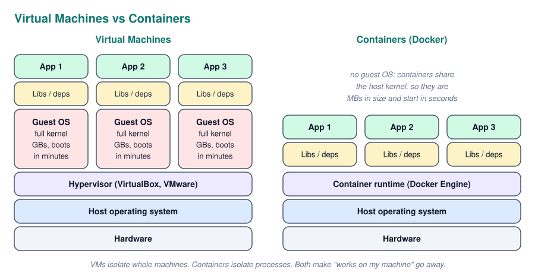

A **virtual machine** emulates a whole computer, including its own operating system, on top of a **hypervisor**. It is strongly isolated but heavy. A **container** packages only the app and its dependencies and shares the host's kernel, so it is small and starts in seconds.

### Docker and Kubernetes

**Docker** is the standard tool for containers. A **Dockerfile** is the recipe, an **image** is the built, read only package, and a **container** is a running instance of an image (class vs object again).

```dockerfile
FROM python:3.12-slim
WORKDIR /app
COPY requirements.txt .
RUN pip install -r requirements.txt
COPY . .
CMD ["uvicorn", "main:app", "--host", "0.0.0.0", "--port", "8000"]
```

**Docker Compose** runs several containers together (app, database, cache) from one file, which is ideal for local development. **Kubernetes** is the next step for production: it runs containers across many machines, restarts crashed ones, scales them with traffic and rolls out updates without downtime. **Infrastructure as Code** tools like Terraform describe servers and networks in files, so infrastructure is versioned and reviewable just like code.

---

## Security Fundamentals

Security is everyone's job, not only the security team's. Interviewers mostly want to see that you know the common attacks and the standard defences.

### The CIA Triad

Every security measure protects at least one of three properties.

| Property | Meaning | Example defence |
| --- | --- | --- |
| **Confidentiality** | Only authorised people can read the data | Encryption, access control |
| **Integrity** | Data cannot be changed without detection | Hashes, digital signatures |
| **Availability** | The system stays usable | Backups, redundancy, DDoS protection |

Two principles apply everywhere: **least privilege** (give every user and service only the permissions it needs) and **defence in depth** (several layers of protection, so one failure is not fatal).

### Hashing vs Encryption

This is one of the most common security questions, and the key difference is whether you can go back.

| | Hashing | Encryption |
| --- | --- | --- |
| **Direction** | One way, cannot be reversed | Two way, can be decrypted with the key |
| **Output** | Fixed length fingerprint | Ciphertext, roughly the size of the input |
| **Use for** | Passwords, file integrity checks | Data that must be read again later |
| **Examples** | SHA-256, bcrypt, Argon2 | AES (symmetric), RSA, ECC (asymmetric) |

**Passwords are hashed, never encrypted.** When a user logs in, you hash what they typed and compare the hashes. A **salt** (random data added per user) makes identical passwords produce different hashes and defeats precomputed **rainbow tables**. Use slow, purpose built algorithms like **bcrypt** or **Argon2**, never plain MD5 or SHA.

**Symmetric encryption** uses one shared key (fast). **Asymmetric encryption** uses a **public key** to encrypt and a **private key** to decrypt (slow, but you never have to share a secret).

### HTTPS and TLS

**HTTPS** is HTTP over **TLS**. It combines both kinds of encryption in a clever way: during the handshake, asymmetric cryptography is used to verify the server's **certificate** (signed by a trusted **Certificate Authority**) and to agree on a shared secret. After that, all data is encrypted with fast symmetric encryption using that secret. The result is confidentiality, integrity and proof that you are talking to the real server.

### Common Vulnerabilities

The **OWASP Top 10** lists the most common web application risks. These are the ones to know with their fix:

| Attack | What happens | Defence |
| --- | --- | --- |
| **SQL injection** | User input is pasted into a query and runs as SQL | **Parameterised queries** / prepared statements, ORMs |
| **XSS** (Cross Site Scripting) | Attacker's JavaScript runs in other users' browsers | Escape output, Content Security Policy, `HttpOnly` cookies |
| **CSRF** (Cross Site Request Forgery) | Another site makes your browser send a request while you are logged in | CSRF tokens, `SameSite` cookies |
| **Broken access control** | User reaches data they should not, e.g. changing `/orders/41` to `/orders/42` | Check permissions on the server for every request |
| **Secrets exposure** | API keys committed to Git | Environment variables, `.gitignore`, secret managers |
| **Vulnerable dependencies** | A library you use has a known hole | Keep dependencies updated, `npm audit`, Dependabot |

The SQL injection fix in code:

```python
cursor.execute(f"SELECT * FROM users WHERE email = '{email}'")

cursor.execute("SELECT * FROM users WHERE email = %s", (email,))
```

The first line is vulnerable: an "email" like `' OR '1'='1` returns every user. The second sends the value separately from the query, so it can never be run as SQL.

---

## Statistics for Data Analytics

Data analytics and machine learning are built on statistics. You do not need to be a mathematician, but you do need to know what the common numbers mean and, more importantly, when they lie. Most "bad analysis" in the real world comes from misreading a statistic, not from a coding error.

### Types of Data

The type of a column decides which statistics, charts and models make sense for it.

| Type | Sub type | Example | Meaningful operations |
| --- | --- | --- | --- |
| **Numerical (quantitative)** | **Continuous** | height, price, temperature | mean, std, any maths |
| | **Discrete** | number of goals, children | counts, mean |
| **Categorical (qualitative)** | **Nominal** | country, colour, club | counts, mode. No order |
| | **Ordinal** | rating 1 to 5, small/medium/large | order, median. Gaps not equal |

A classic trap: a postcode is a number, but it is categorical. Taking the average postcode is meaningless.

### Descriptive Statistics

**Descriptive statistics** summarise a dataset with a few numbers. There are two families: the **centre** (where is the typical value?) and the **spread** (how much do values vary?).

| Measure | What it is | Watch out |
| --- | --- | --- |
| **Mean** | Sum divided by count | Pulled hard by outliers |
| **Median** | Middle value when sorted | Robust to outliers |
| **Mode** | Most frequent value | The only one that works for categories |
| **Range** | Max minus min | Decided by two extreme values only |
| **Variance** | Average squared distance from the mean | Units are squared, hard to read |
| **Standard deviation (σ)** | Square root of variance | Same units as the data, "typical distance from the mean" |
| **Percentiles / quartiles** | Value below which X% of data falls | Q1 = 25th, median = 50th, Q3 = 75th |
| **IQR** | Q3 minus Q1, the middle 50% | Robust measure of spread |

Why the median matters, with five salaries in a small company:

```text
salaries: 2000, 2100, 2200, 2300, 15000
mean   = 4720
median = 2200
```

The mean says the typical salary is 4720, but four out of five people earn far less. One outlier (the owner) pulled the mean up. For skewed data, report the median.

A common rule to flag **outliers** is anything more than 1.5 x IQR below Q1 or above Q3. This is exactly what the dots on a box plot show.

### Distributions

A **distribution** describes how often each value occurs. Its shape decides which summary is honest and which models fit.

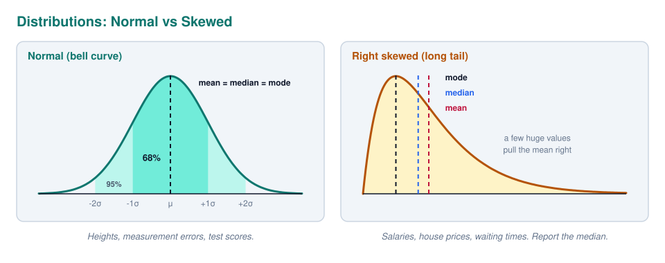

The **normal distribution** (bell curve) is symmetric, so mean, median and mode are equal. It follows the **68, 95, 99.7 rule**: about 68% of values lie within 1 standard deviation of the mean, 95% within 2, and 99.7% within 3. A **z-score** says how many standard deviations a value is from the mean, so a z-score of 3 is very unusual.

A **right skewed** distribution has a long tail of large values (incomes, house prices, website visit durations). The tail drags the mean to the right, so mean > median. **Left skewed** is the mirror image. Skewed data is often log transformed before modelling.

The **Central Limit Theorem** explains why the normal distribution appears everywhere: the *average* of many random samples is roughly normally distributed, even if the data itself is not. That is what makes confidence intervals and most statistical tests work.

### Correlation vs Causation

**Correlation** measures how strongly two variables move together. The **Pearson correlation coefficient** `r` runs from -1 (perfect negative) through 0 (no linear relationship) to +1 (perfect positive).

| r | Rough reading |
| --- | --- |
| 0.0 to 0.3 | Weak |
| 0.3 to 0.7 | Moderate |
| 0.7 to 1.0 | Strong |

(The same bands apply to negative values.) Three warnings make up the real interview answer:

- **Correlation is not causation.** Ice cream sales and drownings are correlated, but ice cream does not cause drowning. Both are caused by a hidden third variable, summer, called a **confounder**. Only a controlled experiment (like an A/B test) can really show cause and effect
- **Pearson only sees straight lines.** A perfect U shaped relationship can have `r = 0`. Always plot the data
- **Outliers and groups can fake or hide a correlation.** In **Simpson's paradox**, a trend that appears in every group reverses when the groups are combined

### Hypothesis Testing and p-values

**Hypothesis testing** answers: "is this effect real, or could it be random noise?". You start from a **null hypothesis** (H0: there is no effect, e.g. the new button does not change sign ups) and an **alternative hypothesis** (H1: there is an effect).

The **p-value** is the probability of seeing a result at least this extreme **if the null hypothesis were true**. A small p-value means "this would be surprising if nothing was going on". If it is below a chosen threshold **α** (usually 0.05), you **reject the null hypothesis** and call the result **statistically significant**.

What a p-value is **not** is just as important:

- It is **not** the probability that the null hypothesis is true
- It does **not** say how big or important the effect is. With a million users, a 0.01% improvement can be "significant" but useless. That is the difference between **statistical** and **practical significance**
- p = 0.051 and p = 0.049 are practically the same evidence. The 0.05 line is a convention, not a law

| Error | Name | Meaning | Controlled by |
| --- | --- | --- | --- |
| **Type I** | False positive | You claim an effect that is not there | α (significance level) |
| **Type II** | False negative | You miss an effect that is there | Sample size, **statistical power** |

A **95% confidence interval** gives a range of plausible values for the true effect. The correct reading: if you repeated the experiment many times, 95% of the intervals built this way would contain the true value. An interval for "difference in conversion" that includes 0 means no clear effect.

### Sampling and Bias

You almost never have data on everyone, so you study a **sample** and generalise to the **population**. That only works if the sample is representative.

- **Selection bias**: the way data was collected excludes some groups (an online survey misses people who are not online)
- **Survivorship bias**: you only see the survivors (studying only successful startups and concluding that dropping out of university leads to success)
- **Sample size**: small samples give noisy, unstable results. The **law of large numbers** says averages settle down as the sample grows

No model, however advanced, can fix biased data. **Garbage in, garbage out.**

---

## Data Analytics in Practice

**Data analytics** is the process of turning raw data into answers and decisions. It overlaps heavily with machine learning: analytics mostly explains the past, machine learning mostly predicts the future, and both share the same workflow.

### Types of Analytics

Analytics is often described as four levels, each harder and more valuable than the previous one.

| Type | Question | Example |
| --- | --- | --- |
| **Descriptive** | What happened? | Sales dropped 12% last quarter |
| **Diagnostic** | Why did it happen? | The drop came from one region after a price change |
| **Predictive** | What will happen? | Next quarter's sales forecast, churn prediction |
| **Prescriptive** | What should we do? | Which discount to offer which customer |

### The Workflow

Whether you are building a dashboard or a model, the steps are the same. This is a simplified version of **CRISP-DM**, the industry standard process. The important part is that it is a **loop**, not a straight line.

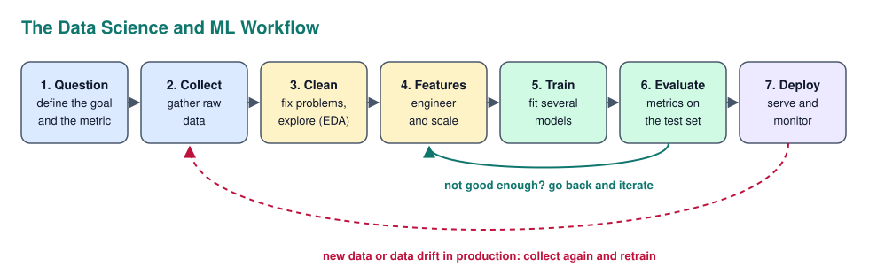

The first step is the most underrated. A model that predicts the wrong thing perfectly is worthless, so always start by defining the business question *and* how success will be measured before touching any data.

### Data Cleaning

Real data is messy, and cleaning it often takes most of the time on a project. The usual problems and fixes:

| Problem | Options |
| --- | --- |
| **Missing values** | Drop rows (if few), fill with median/mode (**imputation**), or add an "is missing" flag. Ask *why* it is missing: sometimes missing is itself information |
| **Duplicates** | Remove, but check whether they are true duplicates or legitimately repeated events |
| **Outliers** | Decide if it is an error (age 250, remove or fix) or real (a billionaire, keep, maybe transform) |
| **Inconsistent formats** | Standardise dates, units, capitalisation (`"BE"`, `"Belgium"`, `"belgium"`) |
| **Wrong data types** | Numbers stored as text, dates stored as strings |

A first look at a new dataset in pandas usually goes like this:

```python
import pandas as pd

df = pd.read_csv("data.csv")
df.info()
df.describe()
df.isna().sum()
df.duplicated().sum()
df["country"].value_counts()
```

`info()` shows types and non null counts, `describe()` gives the descriptive statistics, and the rest count missing values, duplicates and category frequencies.

### Exploratory Data Analysis

**EDA** means getting to know the data before modelling: looking at distributions, relationships and anything strange. It is where you find leakage, bad data and the features that will matter. A good EDA answers: how big is the data, what does each column look like, how is the target distributed (is it **imbalanced**?), and which features relate to the target?

### Choosing the Right Chart

A chart should answer one question at a glance. The question decides the chart type.

| Question | Chart |
| --- | --- |
| Compare categories | **Bar chart** (sorted, starting at zero) |
| Change over time | **Line chart** |
| Distribution of one variable | **Histogram** or **box plot** |
| Relationship between two numbers | **Scatter plot** |
| Correlations between many variables | **Heatmap** |
| Parts of a whole | **Stacked bar**, or a pie chart only with 2 or 3 slices |

Reading a **box plot**: the box is the IQR (middle 50%), the line inside is the median, the whiskers reach to the furthest points within 1.5 x IQR, and dots beyond them are outliers. A median line far from the centre of the box means skewed data.

Common ways charts mislead: a bar chart y axis that does not start at zero (exaggerates small differences), two y axes with different scales, cherry picked time ranges and 3D effects.

---

## Machine Learning Theory

**Machine learning** is building programs that learn patterns from data instead of following rules written by hand. A spam filter with hand written rules ("block emails containing 'free money'") breaks as soon as spammers change words. A learned model adapts to whatever patterns are in the examples.

### What Learning Means

Formally, the model learns a function `f(X) ≈ y` from examples. The vocabulary:

| Term | Meaning | Example |
| --- | --- | --- |
| **Features (X)** | The input columns | house size, rooms, location |
| **Target / label (y)** | What you want to predict | the price |
| **Model** | The function with adjustable parts | linear regression, random forest |
| **Parameters** | Values the model **learns** from data | regression coefficients, neural network weights |
| **Hyperparameters** | Settings **you** choose before training | tree depth, learning rate, number of neighbours |
| **Training** | Adjusting parameters to reduce error on examples | `model.fit(X_train, y_train)` |
| **Inference** | Using the trained model on new data | `model.predict(X_new)` |

### Types of Machine Learning

The main split is whether the training data has the answers (labels) or not.

| Type | Data | Task | Examples |
| --- | --- | --- | --- |
| **Supervised** | Labelled | **Regression**: predict a number | House price, demand forecast |
| | | **Classification**: predict a category | Spam or not, match result (H/D/A), damaged or not |
| **Unsupervised** | Unlabelled | **Clustering**: find groups | Customer segments, similar players |
| | | **Dimensionality reduction** | PCA to compress 100 features into 10 |
| | | **Anomaly detection** | Fraud, faulty sensor readings |
| **Reinforcement** | Rewards from an environment | Learn a strategy by trial and error | Game playing, robotics |
| **Self supervised** | Labels made from the data itself | Predict hidden parts of the input | How LLMs are pretrained (predict the next word) |

The quick test for regression vs classification: if the answer is a number where "close" makes sense, it is regression. If it is a category, it is classification. Logistic regression is, confusingly, a classification model.

### Train, Validation and Test Sets

A model must be judged on data it has **never seen**, otherwise you are only measuring how well it memorised. So the data is split:

| Set | Typical share | Used for |
| --- | --- | --- |
| **Training** | ~70% | Fitting the parameters |
| **Validation** | ~15% | Comparing models and tuning hyperparameters |
| **Test** | ~15% | One final, honest score. Used **once**, at the end |

An analogy: the training set is the exercises, the validation set is the practice exam, and the test set is the real exam. If you look at the real exam while studying, your grade means nothing.

Two important variations:

- **Stratified split**: keep the class proportions the same in every set. Essential for imbalanced data, otherwise the test set might contain almost no positives
- **Time based split**: for anything over time (sales, sports matches, stock prices) always train on the past and test on the future. A random split lets the model "see the future" and gives scores that are too good to be true

### Overfitting and Underfitting

This is the central problem of machine learning. **Underfitting** means the model is too simple to capture the real pattern. **Overfitting** means it is so flexible that it memorises the noise in the training data, and fails on new data.

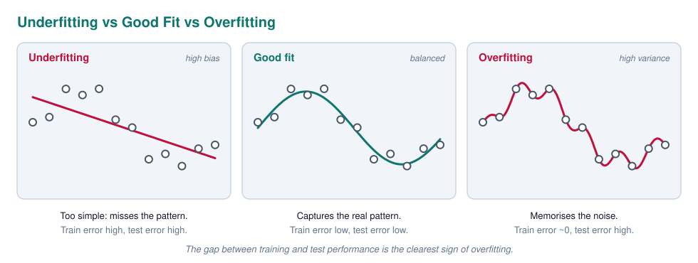

This is the **bias variance trade off**. **Bias** is error from wrong assumptions (a straight line for a curved pattern). **Variance** is error from being too sensitive to the exact training data (a different sample would give a completely different model). Making a model more complex lowers bias but raises variance. The goal is the sweet spot in between.

| Symptom | Diagnosis | Fixes |
| --- | --- | --- |
| Bad on training *and* test | **Underfitting** (high bias) | More complex model, better features, train longer, less regularisation |
| Great on training, bad on test | **Overfitting** (high variance) | More data, simpler model, **regularisation**, dropout, early stopping, fewer features |

**Regularisation** adds a penalty for complexity to the training objective. **L2** (Ridge) shrinks all weights towards zero. **L1** (Lasso) can push weights to exactly zero, which also works as feature selection.

### Cross Validation

One validation split can be lucky or unlucky. **k fold cross validation** splits the training data into `k` parts (usually 5), trains `k` times, each time holding out a different part for validation, and averages the scores.

```python
from sklearn.model_selection import cross_val_score

scores = cross_val_score(model, X_train, y_train, cv=5, scoring="f1")
print(scores.mean(), scores.std())
```

Read both numbers. The **mean** is the expected performance. The **standard deviation** tells you how stable it is. A model scoring 0.82 ± 0.01 is more trustworthy than one scoring 0.84 ± 0.09, and a difference between two models that is smaller than the std is probably noise.

### Feature Engineering and Scaling

Better features usually beat a fancier model. **Feature engineering** turns raw data into inputs that make the pattern easier to learn: extracting the day of the week from a date, computing a team's form over the last five matches, or the ratio of two columns.

Models need numbers, so categories must be **encoded**. **One hot encoding** creates a 0/1 column per category (for nominal data like country). **Ordinal encoding** maps categories to ordered numbers (only for ordinal data like small < medium < large, otherwise the model invents an order).

**Scaling** puts numerical features on comparable ranges. **Standardisation** (z-score) gives mean 0 and std 1. **Min max scaling** squeezes values into 0 to 1. Scaling matters for models that use distances or gradients (KNN, SVM, linear models with regularisation, neural networks) and does not matter for tree based models.

The golden rule: **fit the scaler (and any imputer or encoder) on the training data only**, then apply it to validation and test. Fitting on all the data leaks information from the test set. scikit-learn **Pipelines** make this automatic.

### Data Leakage

**Data leakage** is when information that would not be available at prediction time sneaks into training. It is the number one reason for models that look amazing in a notebook and fail in production.

Typical causes:

- A feature that is a consequence of the target (predicting loan default with a "number of missed payments" column filled in *after* the default)
- Using future data, like a random split on time series, or rolling averages that include the current match
- Preprocessing (scaling, imputing) fitted on the full dataset before splitting
- Duplicates of the same entity ending up in both train and test

The main symptom: **results that are too good to be true**. If a simple problem suddenly scores 99%, suspect leakage before celebrating.

### Imbalanced Data

When one class is rare (fraud is 0.1% of transactions, damaged items 2% of production), a model can get high accuracy by always predicting the common class. The remedies are: use the right metrics (precision, recall, F1, PR AUC, see the next section), give the rare class more weight (`class_weight="balanced"`), **resample** (oversample the minority, e.g. with SMOTE, or undersample the majority, only on the training set), and tune the decision threshold.

### Common Algorithms

You should be able to explain each of these in one or two sentences, with its main strength and weakness.

| Algorithm | Task | How it works | Strengths | Weaknesses |
| --- | --- | --- | --- | --- |
| **Linear regression** | Regression | Fits a straight line (or plane) minimising squared error | Fast, interpretable coefficients | Only linear relationships |
| **Logistic regression** | Classification | Linear model passed through a sigmoid to give a probability | Strong baseline, interpretable | Linear decision boundary |
| **Decision tree** | Both | Asks a sequence of yes/no questions on features | Very interpretable, no scaling needed | Overfits easily |
| **Random forest** | Both | Many trees on random subsets, votes are averaged (**bagging**) | Robust, little tuning, handles mixed data | Slower, less interpretable |
| **Gradient boosting** (XGBoost, LightGBM) | Both | Trees built one after another, each fixing the previous errors (**boosting**) | Usually the best on tabular data | Needs tuning, can overfit |
| **K nearest neighbours** | Both | Predicts from the k most similar training examples | Simple, no training | Slow on big data, needs scaling |
| **Support vector machine** | Mostly classification | Finds the boundary with the widest margin between classes | Good in high dimensions | Slow on large data, needs scaling |
| **Naive Bayes** | Classification | Probability rules assuming features are independent | Very fast, good for text | The independence assumption is rarely true |
| **K means** | Clustering | Assigns points to the nearest of k centres, moves centres, repeats | Simple, fast | You must pick k, assumes round clusters |
| **PCA** | Dimensionality reduction | Finds the directions of most variance | Compresses features, helps visualisation | New features are hard to interpret |
| **Neural networks** | Both | Layers of weighted sums and non linear activations | Images, text, audio, huge data | Need lots of data and compute, black box |

For tabular data (spreadsheets, databases) gradient boosting is usually the strongest choice. For images, text and audio, neural networks win.

---

## Reading Machine Learning Results

Training a model takes one line of code. Knowing whether it is any good is the real skill, and it is exactly what an interviewer tests with a question like **"your model has 98% accuracy, is it good?"**. The honest answer always starts with "it depends", followed by *on what*.

### Always Start With a Baseline

A score means nothing without something to compare it to. A **baseline** is the simplest reasonable prediction, and every model must beat it to be worth anything.

| Problem | Baseline |
| --- | --- |
| Classification | Always predict the most common class (scikit-learn `DummyClassifier`) |
| Regression | Always predict the mean or median of the target (`DummyRegressor`) |
| Time series | Predict that tomorrow equals today |
| Real world | Whatever is used now: a rule of thumb, an expert, the bookmaker's odds |

If 95% of emails are not spam, a "model" that never flags anything has 95% accuracy. A spam filter with 96% accuracy is then barely better than doing nothing.

### The Confusion Matrix

For classification, the **confusion matrix** is the foundation of every other metric. It counts the four possible outcomes of a prediction. The example below is a spam filter tested on 1,000 emails, of which 100 are actually spam.

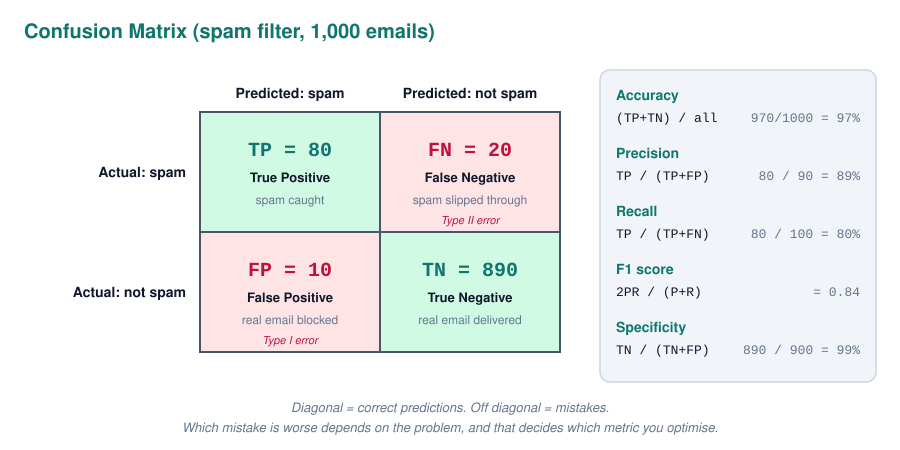

The naming is easy once you see the pattern: the second word is what the model **predicted** (positive or negative), the first word says whether that prediction was **true** or **false**. A **false negative** is "predicted negative, and that was wrong".

### Accuracy, Precision, Recall and F1

Each metric answers a different question, and choosing the right one depends on **which mistake is more expensive**.

| Metric | Formula | Question it answers | Prioritise when |
| --- | --- | --- | --- |
| **Accuracy** | (TP + TN) / total | How often is the model right overall? | Classes are balanced and both errors cost the same |
| **Precision** | TP / (TP + FP) | When it says "positive", how often is it right? | False positives are costly: blocking real emails, false fraud alerts that annoy customers |
| **Recall** (sensitivity, TPR) | TP / (TP + FN) | Of all real positives, how many did it find? | False negatives are costly: missed cancer, missed fraud, a damaged product passing inspection |
| **F1 score** | 2 x P x R / (P + R) | A single balance of precision and recall | Imbalanced data, when both errors matter |
| **Specificity** (TNR) | TN / (TN + FP) | Of all real negatives, how many were correctly left alone? | Medical tests, alongside recall |

For the spam filter: precision 89% means about 1 in 9 blocked emails was actually a real email. Recall 80% means 1 in 5 spam emails still reaches the inbox. Whether that is acceptable is a business question, not a maths question.

**F1** uses the **harmonic mean**, which punishes imbalance. A model with precision 1.0 and recall 0.1 has a normal average of 0.55 but an F1 of only 0.18. You cannot hide one terrible number behind a great one.

### The Accuracy Paradox

On imbalanced data, accuracy is misleading. Imagine fraud is 1% of transactions:

```text
model: "nothing is ever fraud"
accuracy  = 99%
recall    = 0%   (catches zero fraud)
precision = undefined (never predicts fraud)
```

99% accuracy, completely useless. This is the **accuracy paradox**, and it is why the answer to "98% accuracy, is it good?" must ask about the class balance and the baseline first.

### Thresholds and the Precision Recall Trade Off

Most classifiers do not output a class, they output a **probability** (`predict_proba`). The class comes from a **threshold**, 0.5 by default. Moving the threshold trades precision against recall:

- **Lower threshold** (e.g. 0.3): flag more things as positive. Recall goes up, precision goes down. Good for screening, where missing a case is worse
- **Higher threshold** (e.g. 0.8): only flag when very sure. Precision goes up, recall goes down. Good when false alarms are expensive

So "the model has 80% recall" is incomplete; it has 80% recall *at a certain threshold*. The threshold is a business decision, chosen on the validation set. A **precision recall curve** plots this trade off for every threshold.

### ROC Curve and AUC

The **ROC curve** shows the trade off between catching positives (**TPR**, recall) and raising false alarms (**FPR**, false positive rate) across **all thresholds** at once. The **AUC** (area under the curve) turns it into one number between 0 and 1.

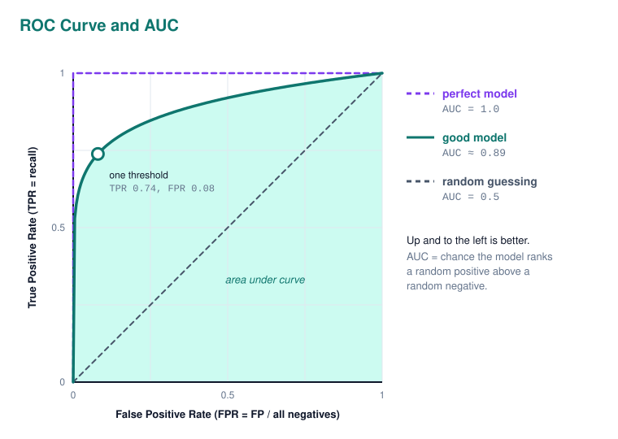

| AUC | Rough meaning |
| --- | --- |
| 0.5 | No better than random guessing (the diagonal) |
| 0.6 to 0.7 | Weak |
| 0.7 to 0.8 | Acceptable |
| 0.8 to 0.9 | Good |
| above 0.9 | Excellent, or check for leakage |
| below 0.5 | Worse than random: the predictions are probably inverted |

AUC has a nice intuitive meaning: it is the probability that the model gives a randomly chosen positive a higher score than a randomly chosen negative. It measures how well the model **ranks**, independent of any threshold.

One caveat: on heavily imbalanced data the ROC curve can look great because there are so many negatives that the FPR stays small. The **precision recall curve** and its area (**PR AUC** or average precision) are more honest there.

### Reading a Classification Report

scikit-learn's `classification_report` is the output you will see most often. Here it is for the same spam filter:

```text
              precision    recall  f1-score   support

    not spam       0.98      0.99      0.98       900
        spam       0.89      0.80      0.84       100

    accuracy                           0.97      1000
   macro avg       0.93      0.89      0.91      1000
weighted avg       0.97      0.97      0.97      1000
```

How to read it, line by line:

- **Each class gets its own row.** Precision and recall are calculated as if that class were the "positive" one. The `not spam` row looks excellent simply because it is the easy, common class
- **Support** is how many real examples of that class are in the test set. Only 100 spam emails means the spam metrics are less certain than the others
- **Accuracy** (0.97) sits on its own line because it is one number for the whole model
- **Macro avg** is the plain average over classes, so every class counts equally. It shows how the model does on the *rare* class too
- **Weighted avg** weights each class by its support, so it is dominated by the big class and ends up close to accuracy

The story this report tells: the model is very good at recognising real email, decent at spam, and its weak spot is spam recall (0.80). When macro avg is much lower than weighted avg, the model is struggling with a minority class.

For **multi class** problems (like home win, draw, away win) the same rows appear for every class, and the confusion matrix becomes 3 x 3. Look at the off diagonal cells to see *which* classes get confused with each other. A model that never predicts a class at all (recall 0 for draws, for example) is telling you that class is hard to separate with the current features.

### Regression Metrics

For regression the model predicts a number, so the metrics measure **how far off** the predictions are. Each one is built on the **residual**: actual minus predicted.

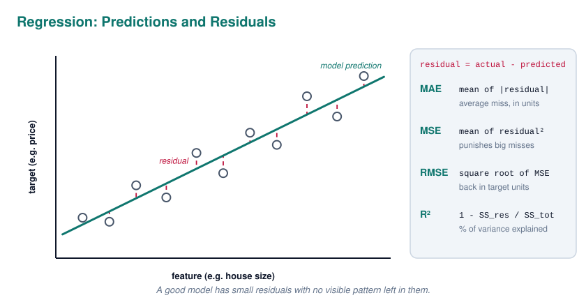

| Metric | Meaning | Units | Read it as |
| --- | --- | --- | --- |
| **MAE** (Mean Absolute Error) | Average size of the error | Same as the target | "On average we are off by €18,000" |
| **MSE** (Mean Squared Error) | Average of squared errors | Target squared | Mainly used as a training loss, hard to read |
| **RMSE** (Root MSE) | Square root of MSE | Same as the target | Like MAE, but big errors count much more |
| **MAPE** | Average error as a percentage | % | "Off by 8% on average". Breaks when actual values are near zero |
| **R²** (coefficient of determination) | Share of the target's variance the model explains | Unitless, max 1 | "Explains 82% of the variation compared to always predicting the mean" |

How to interpret them together, for a house price model:

```text
MAE  = 18,000
RMSE = 31,000
R²   = 0.82
```

- **MAE** says a typical prediction is about €18,000 off. Whether that is good depends on the prices: great for €500,000 villas, terrible for €60,000 garages. Always compare an error to the scale of the target
- **RMSE is clearly higher than MAE**, which means some predictions are very wrong. RMSE squares errors before averaging, so a few big misses inflate it. If RMSE ≈ MAE, errors are evenly sized
- **R² = 0.82** means the model explains 82% of the variation in prices. **R² = 0** means it is no better than always predicting the mean (the baseline), and **R² can be negative**, which means it is *worse* than the mean. A high R² on training but low on test is overfitting again

### Residual Plots

Plotting residuals against the predictions shows *how* a regression model is wrong, which a single number hides.

| Pattern in the residual plot | Meaning |
| --- | --- |
| Random cloud around 0 | Good, nothing systematic left to learn |
| A curve (U shape) | The relationship is non linear, the model misses it |
| A funnel (errors grow with the prediction) | **Heteroscedasticity**: the model is less reliable for large values. A log transform of the target often helps |
| All residuals shifted above or below 0 | Systematic bias: the model always over or under predicts (e.g. prices have inflated since training) |

### Loss Curves

For models trained over many iterations (neural networks, boosting), the **learning curves** of training and validation loss show whether training went well.

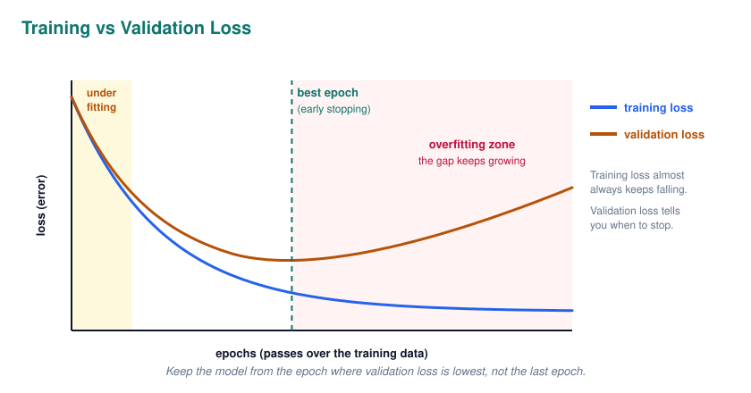

| What you see                               | Diagnosis                                                           | Action                                         |
| ------------------------------------------ | ------------------------------------------------------------------- | ---------------------------------------------- |
| Both losses high and flat                  | Underfitting                                                        | Bigger model, better features, train longer    |
| Both decrease and level off close together | Good fit                                                            | Done                                           |
| Training keeps falling, validation rises   | Overfitting                                                         | Early stopping, regularisation, more data      |
| Loss jumps around or explodes              | Learning rate too high                                              | Lower the learning rate                        |
| Loss barely moves                          | Learning rate too low, or a bug                                     | Raise the learning rate, check data and labels |
| Validation better than training            | Often dropout (only active in training) or an easier validation set | Check the split                                |

### Feature Importance and Explainability

After "how good is it?" the next question is "**why** does it predict that?". There are several ways to look inside a model:

- **Coefficients** (linear and logistic regression): the sign shows the direction and the size the strength of each feature's effect, but only comparable when features are on the same scale
- **Tree based importance**: how much each feature reduced error inside the trees. Quick, but biased towards features with many unique values
- **Permutation importance**: shuffle one feature and measure how much the score drops. Model agnostic and more reliable
- **SHAP values**: explain an individual prediction by how much each feature pushed it up or down

Two warnings. Importance is **not causation**: the model uses whatever helps it predict, including proxies. And importance is a great **leakage detector**: if one feature dominates everything, or a feature that should be irrelevant ranks high, investigate it. For example, a player similarity model that ranks a team level statistic as the top feature is probably recognising the club, not the player.

### Clustering Results

Unsupervised models have no labels, so there is no accuracy. Instead you check whether the groups are compact and well separated, and whether they make sense.

- **Inertia** (within cluster sum of squares) always drops as `k` grows. The **elbow method** looks for the `k` where adding more clusters stops helping much
- **Silhouette score** runs from -1 to 1: near 1 means points sit well inside their own cluster, near 0 means clusters overlap, negative means points are probably in the wrong cluster
- In the end, a cluster is only useful if you can **describe** it ("young, high spending, mobile users") and act on it

### A Checklist for Judging Any Result

Use this as a mental checklist whenever you present or review a model. It is also a great structure for answering any "is this model good?" question in an interview.

1. **What is the baseline**, and how much better is the model?
2. **Which metric matches the business cost** of each type of mistake?
3. Is the score from a **test set** the model never saw, with the **right split** (stratified, or time based)?
4. **Is the data imbalanced?** Then ignore accuracy and look at precision, recall, F1 and the confusion matrix
5. **How big is the gap** between training and test scores? A large gap is overfitting
6. **How stable** is it? Look at the std over cross validation folds
7. **Is it too good to be true?** Check for leakage
8. **Where does it fail?** Look at real examples of errors (**error analysis**), not only at averages
9. **Does it make sense?** Check feature importance against domain knowledge

---

## Deep Learning and Modern AI

**Deep learning** is machine learning with **neural networks** that have many layers. It took over around 2012, when big datasets and GPUs made training them practical, and it powers image recognition, speech, translation and large language models.

### Neural Networks

A **neuron** takes its inputs, multiplies each by a **weight**, adds a **bias** and passes the result through an **activation function**. Neurons are stacked into **layers**: an input layer, one or more **hidden layers** and an output layer. "Deep" just means many hidden layers.

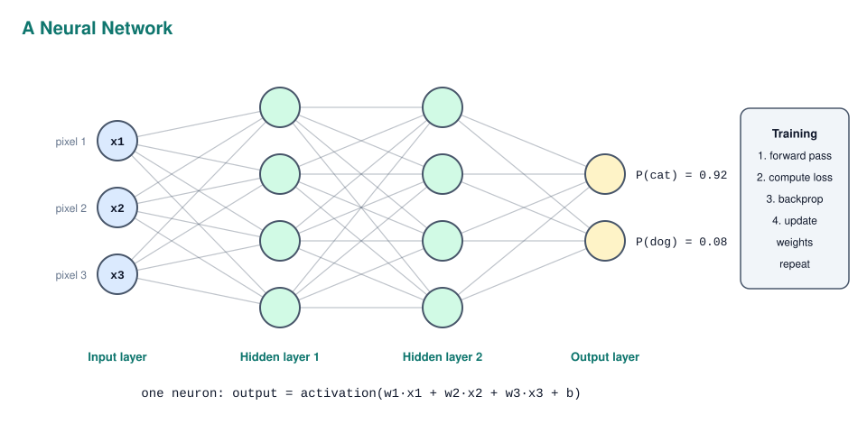

The activation function is what makes the network powerful. Without it, any number of layers would collapse into one big linear function, no better than linear regression. The non linear activation lets the network learn curves, edges, shapes and eventually concepts.

| Activation | Output | Used in |
| --- | --- | --- |
| **ReLU** | `max(0, x)` | Hidden layers, the default choice |
| **Sigmoid** | 0 to 1 | Output for binary classification (a probability) |
| **Softmax** | Probabilities that sum to 1 | Output for multi class classification |
| **Tanh** | -1 to 1 | Older networks, some recurrent layers |

### How Training Works

Training is a loop that slowly adjusts millions of weights to make the predictions less wrong.

1. **Forward pass**: push a batch of examples through the network to get predictions
2. **Loss**: measure how wrong they are with a **loss function**, MSE for regression, **cross entropy** for classification
3. **Backpropagation**: calculate, with the chain rule, how much each weight contributed to the error (the **gradient**)
4. **Gradient descent**: nudge every weight a small step in the direction that reduces the loss
5. Repeat for many **batches** and **epochs** (one epoch = one pass over all training data)

The usual analogy: you are on a mountain in thick fog and want to reach the valley. You cannot see the valley, but you can feel the slope under your feet, so you keep taking small steps downhill. The **learning rate** is your step size: too big and you jump over the valley, too small and you never get there. **Adam** is the most common optimiser; it adapts the step size per weight automatically.

Neural networks overfit easily, so they are trained with **dropout** (randomly switching off neurons during training), **early stopping**, **weight decay** (L2 regularisation) and **data augmentation** (flipped, rotated or recoloured copies of training images).

### Architectures

Different data has different structure, so different network designs are used.

| Architecture | Built for | Key idea | Examples |
| --- | --- | --- | --- |
| **MLP** (fully connected) | Tabular data, simple tasks | Every neuron connects to every neuron in the next layer | Small classifiers |
| **CNN** (convolutional) | Images, video | Small filters slide over the image to detect edges, then shapes, then objects | Image classification, YOLO object detection |
| **RNN / LSTM** | Sequences | Keeps a memory of previous steps | Older speech and text models, time series |
| **Transformer** | Text, now almost everything | **Attention**: every token looks at every other token to decide what is relevant | GPT, Claude, BERT, Vision Transformers |
| **Diffusion models** | Image generation | Learn to remove noise step by step | Stable Diffusion, image generators |

For computer vision, know the difference between the task types: **classification** (what is in the image?), **object detection** (what and where, with bounding boxes), **segmentation** (which exact pixels) and **OCR** (read the text). Detection is scored with **IoU** (Intersection over Union: how much the predicted box overlaps the real one) and **mAP** (mean average precision over all classes and IoU thresholds).

### Transfer Learning

Training a large network from scratch needs huge datasets and lots of compute. **Transfer learning** starts from a model already trained on a big general dataset (like ImageNet) and **fine tunes** it on your smaller, specific dataset. The early layers already know general features like edges and textures, so a few hundred labelled images can be enough. This is how most real world computer vision projects are built.

### Large Language Models

An **LLM** is a very large Transformer trained to **predict the next token** on an enormous amount of text. A **token** is a chunk of text, roughly three quarters of a word on average. By getting extremely good at next token prediction, the model ends up learning grammar, facts, reasoning patterns and coding.

| Concept | Meaning |
| --- | --- |
| **Pretraining** | Next token prediction on massive text data, the expensive part |
| **Instruction tuning / RLHF** | Further training with human examples and feedback, so it follows instructions and behaves helpfully |
| **Context window** | How many tokens it can see at once (prompt + documents + answer) |
| **Temperature** | Randomness of the output: low is focused and repeatable, high is more creative |
| **Hallucination** | Confidently generating something false, because it predicts plausible text, not verified facts |
| **Embedding** | A vector of numbers representing meaning. Similar texts get nearby vectors, compared with **cosine similarity** |

### RAG, Fine Tuning and Prompting

There are three main ways to adapt an LLM to a specific use case, from cheapest to most expensive:

| Approach | What it is | Use when |
| --- | --- | --- |
| **Prompt engineering** | Clear instructions, examples and context in the prompt | Always the first step |
| **RAG** (Retrieval Augmented Generation) | Search your own documents (often with embeddings in a **vector database**), paste the relevant parts into the prompt | The model needs private or up to date knowledge, and you want sources |
| **Fine tuning** | Train the model further on your own examples | You need a specific style, format or behaviour, not new facts |

RAG is the most common pattern in companies right now because it reduces hallucinations, keeps data current without retraining and can show where an answer came from. **Agents** go a step further: the LLM can call tools (search, APIs, code execution) in a loop to complete multi step tasks.

### Responsible AI

Interviewers increasingly ask about this, especially in Europe. The main points:

- **Bias**: a model learns the patterns in its data, including unfair ones. A hiring model trained on past hires can learn to discriminate. Check performance per group, not just overall
- **Explainability**: in high stakes decisions (loans, medicine) people have a right to understand why a decision was made
- **Privacy**: the **GDPR** governs personal data in the EU: collect only what you need, have a legal basis, allow deletion
- **The EU AI Act** regulates AI by risk level, with the strictest rules for high risk uses like hiring, credit scoring and critical infrastructure
- **Monitoring**: models degrade as the world changes (**data drift**), so production models need to be monitored and retrained

---

## The Interview Itself

Knowing the theory is half the job. The other half is showing it clearly under a bit of pressure, and showing you will be a good teammate.

### Talking About Your Projects

You will almost certainly be asked to walk through a project. Use the **STAR** structure so the story stays focused:

| Step | Content |
| --- | --- |
| **Situation** | The context: course, team, client, goal |
| **Task** | Your specific responsibility |
| **Action** | What *you* did and *why* you chose that approach |
| **Result** | The outcome, ideally measurable, plus what you learned |

The strongest project stories include a problem you hit and how you solved it, and an honest result. Saying "the model could not predict draws better than the bookmaker, and here is why" shows far more understanding than claiming everything worked perfectly. Be ready for follow ups on every technology you list on your CV.

### Classic Theory Questions

These come up again and again. Each one is answered somewhere in these notes:

1. Compiled vs interpreted languages, and where Java fits
2. The four pillars of OOP, and abstract class vs interface
3. Array vs linked list, and how a hash map works
4. What is Big O, and what is the complexity of your solution?
5. Process vs thread, and what is a race condition or deadlock?
6. What happens when you type a URL in the browser?
7. TCP vs UDP
8. REST, HTTP methods and status codes (401 vs 403)
9. SQL vs NoSQL, joins, indexes, ACID
10. Authentication vs authorization, sessions vs JWT
11. Hashing vs encryption, how to store passwords, SQL injection
12. Monolith vs microservices, how would you scale a web app?
13. Containers vs virtual machines
14. Agile and Scrum, Git workflow, types of tests
15. Overfitting and how to prevent it
16. Precision vs recall, and which matters more for a given problem
17. "Your model has 98% accuracy. Is it good?"
18. Correlation vs causation, and what a p-value means
19. Supervised vs unsupervised learning, and which algorithm you would choose
20. What is an LLM, and what is RAG?

When you do not know something, say so and reason out loud from what you *do* know. "I have not used Kafka, but I assume it is a message queue, so it probably helps with..." is a much better answer than guessing confidently.

### Questions to Ask Them

At the end you will be asked if you have questions. Always have two or three ready. It shows genuine interest and helps you judge whether the internship is a good fit.

- What would a typical week look like for an intern on this team?
- What project would I work on, and will it be used in production?
- Who would be my mentor, and how does feedback work?
- What tech stack and tools does the team use day to day?
- How do you measure whether an internship was a success?
- What do you enjoy most about working here?

---

## Self Check Questions

Try to answer each question out loud, in your own words, before opening the answers. If you cannot explain it simply, revisit that section.

1. Why does `0.1 + 0.2 == 0.3` return `False`?
2. Why is looping over an array faster than over a linked list, even though both are O(n)?
3. Why is Java considered portable, and what does the JIT do?
4. In Python, a function appends to a list parameter and then reassigns it. What does the caller see?
5. What is the difference between overriding and overloading?
6. Why is a hash map lookup O(1) on average but O(n) in the worst case?
7. What is the time complexity of binary search, and what does it require?
8. What is a race condition, and how do you prevent it?
9. Why does a video call use UDP while a web page uses TCP?
10. What is the difference between a `401` and a `403`?
11. Why is `PUT` idempotent and `POST` not, and why does that matter?
12. What does each letter of ACID mean?
13. When should you not add an index to a column?
14. Why must app servers be stateless to scale horizontally?
15. What is the difference between hashing and encryption, and which do you use for passwords?
16. Why is the median often better than the mean for salaries?
17. What does a p-value of 0.03 actually mean?
18. Why should time series data never be split randomly?
19. A model scores 99% on training data and 70% on test data. What is happening and what can you do?
20. Fraud is 1% of transactions and your model has 99% accuracy. Is it good?
21. When would you prioritise recall over precision? Give an example.
22. What does an AUC of 0.5 mean? And 0.3?
23. Your regression model has RMSE much higher than MAE. What does that tell you?
24. What does an R² of -0.2 mean?
25. Why do neural networks need non linear activation functions?
26. When would you choose RAG over fine tuning?

<details>
<summary>Answers</summary>

1. Decimal fractions like 0.1 cannot be represented exactly in binary floating point, so tiny rounding errors appear. Compare with a tolerance or use a decimal type.
2. Array elements sit next to each other in memory, so the CPU cache loads several at once. Linked list nodes are scattered, causing cache misses.
3. Java compiles to bytecode that runs on any JVM, so the same build runs on every OS. The JIT compiles frequently used code to machine code at runtime, making it fast.
4. The caller sees the appended item, but not the reassignment. The function received a copy of the reference: it can mutate the shared object, but rebinding the name only changes the local variable.
5. Overriding is a subclass replacing a parent method with the same signature (runtime polymorphism). Overloading is several methods with the same name but different parameters (compile time).
6. The hash function jumps straight to a bucket, so there is no searching. If many keys collide in one bucket, lookups degrade to scanning a list.
7. O(log n). The data must be sorted.
8. When the result depends on the timing of threads accessing shared data, like two threads both doing `count += 1`. Prevent it with locks (mutexes), atomic operations or by avoiding shared mutable state.
9. In a call, a lost packet is outdated by the time it could be resent, so speed matters more than completeness. A web page is broken if any data is missing, so TCP's guaranteed delivery is needed.
10. `401` means you are not authenticated (not logged in or invalid token). `403` means you are authenticated but not allowed to do this.
11. Sending the same `PUT` twice leaves the resource in the same state, while two `POST`s can create two resources. It matters for retries after timeouts.
12. Atomicity (all or nothing), Consistency (constraints always hold), Isolation (transactions do not see each other's partial work), Durability (committed data survives crashes).
13. When the table is written to much more than it is read, when the column is rarely used in filters or joins, or when it has very few distinct values. Every index slows down writes and uses space.
14. Because the load balancer can send any request to any server. If a session lived in one server's memory, the user would appear logged out on the others.
15. Hashing is one way, encryption can be reversed with a key. Passwords are hashed with a slow, salted algorithm like bcrypt or Argon2.
16. Salaries are right skewed. A few very high values pull the mean up, while the median shows what a typical person earns.
17. If there were truly no effect, there would be a 3% chance of seeing a result at least this extreme. It is not the probability that the null hypothesis is true, and it says nothing about the size of the effect.
18. A random split puts future data in the training set, so the model learns from information it would never have at prediction time. The score becomes unrealistically good.
19. Overfitting. Get more data, simplify the model, add regularisation or dropout, use early stopping, remove noisy features, and check with cross validation.
20. Not necessarily. Predicting "never fraud" also gets 99%. Check the baseline, the confusion matrix, recall and precision for the fraud class.
21. When missing a positive is worse than a false alarm, for example cancer screening, fraud detection or detecting damaged gas cylinders before they are refilled.
22. 0.5 means the model ranks no better than random. 0.3 means it is worse than random, so its predictions are probably inverted (flipping them would give 0.7).
23. Some predictions are very far off. RMSE squares errors, so a few large mistakes inflate it much more than MAE.
24. The model is worse than simply predicting the mean of the target every time.
25. Without them, stacking layers is still just one linear function, so the network could only learn straight line relationships.
26. When the model needs knowledge that is private, changes often or must be cited. Fine tuning is better for teaching a style, format or behaviour.

</details>

---

## Quick Recap

- **Everything grows from programming**: foundations, core CS, systems, engineering, and data and AI are branches of one tree
- **Computers** store everything in binary, the CPU runs fetch, decode, execute, and the memory hierarchy trades speed for size
- **Code reaches the CPU** by AOT compilation (fastest), bytecode on a VM with JIT (portable) or interpretation (fastest to develop)
- **Fundamentals**: types (static/dynamic, strong/weak), control flow, functions, recursion, stack vs heap, pass by sharing
- **OOP** rests on encapsulation, abstraction, inheritance and polymorphism. Prefer composition, follow SOLID
- **Data structures** decide speed: arrays for index access, hash maps for key lookup, trees for sorted data, graphs for relationships
- **Big O** describes how work grows. Know O(1), O(log n), O(n), O(n log n), O(n²) and how to spot them
- **Operating systems** manage processes (isolated) and threads (shared memory). Shared memory brings race conditions and deadlocks
- **Networks** are layered. TCP is reliable, UDP is fast, DNS turns names into IPs
- **The web** is stateless HTTP: methods, status codes, REST, auth with sessions or JWT, and never trust the client
- **Databases**: keys, normalization, joins, indexes, ACID transactions. Start with SQL unless you have a reason not to
- **Engineering**: Agile, Git with pull requests, the testing pyramid, CI/CD, clean code
- **Architecture**: layered and MVC inside, monolith before microservices, scale horizontally with stateless servers, cache and load balancers
- **Cloud**: IaaS, PaaS, SaaS. Containers share the host kernel and are lighter than VMs
- **Security**: CIA triad, hash passwords with salt, HTTPS, parameterised queries against SQL injection
- **Statistics**: mean vs median, spread, distributions, correlation is not causation, p-values do not measure effect size
- **Analytics** is a loop: question, collect, clean, explore, model, evaluate, deploy
- **Machine learning**: split data honestly, fight overfitting, scale on train only, watch out for leakage and imbalance
- **Reading results**: always compare to a baseline, choose the metric by the cost of each mistake, read the confusion matrix, and be suspicious of results that are too good
- **Deep learning**: neurons with non linear activations trained by gradient descent. Transformers power LLMs, and RAG grounds them in your own data
