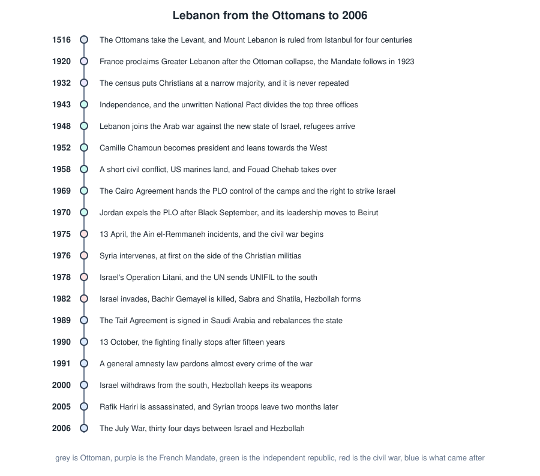
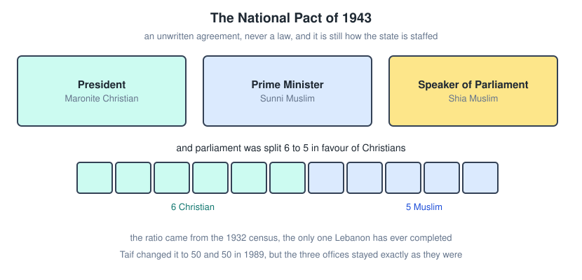
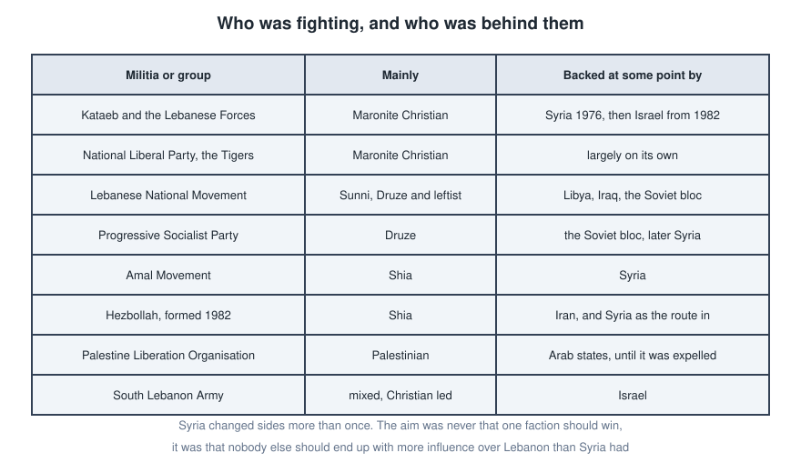
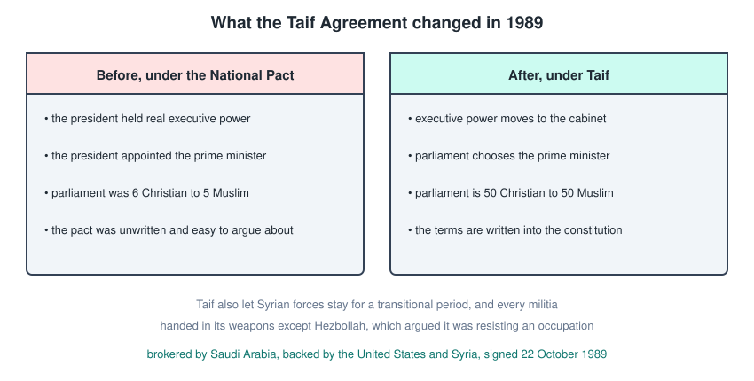
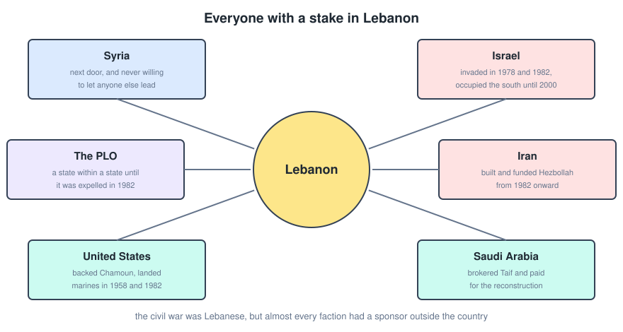

# Lebanese History

Lebanon is a small country that a lot of larger powers have used as a place to settle their own arguments. That single sentence explains most of what follows. This file runs from the Ottoman period to 2006, with the civil war in the middle, since almost everything about the modern state is either a cause or a consequence of that war.

---

## The Full Timeline

Worth reading once before the detail, because the dates are close together and easy to mix up.

---

## Ottoman Rule

The Ottomans took the Levant in **1516**, and Mount Lebanon was ruled from Istanbul for roughly four centuries after that.

They did not govern it directly for most of that time. Local emirs and then local families ran the mountain in exchange for taxes and loyalty, which left the religious communities largely intact and largely self managing. That habit of communities running their own affairs never went away, and it is the thing the modern political system was later built on top of.

The empire collapsed after it backed the losing side in the First World War, and its Arab provinces were carved up between Britain and France.

---

## The French Mandate

On **1 September 1920** France proclaimed the State of Greater Lebanon, and the League of Nations formally confirmed the French Mandate in 1923.

France did two things that mattered permanently.

- It drew the borders Lebanon still has, by attaching the coastal cities, the Bekaa and the south to the mostly Christian Mount Lebanon. That expanded the country and, at the same time, diluted the Christian share of its population.
- It built the institutions, the 1926 constitution and the parliamentary republic that the country still runs on.

The country did well economically under the Mandate, especially Beirut as a port and a banking centre.

---

## The 1932 Census

A census was carried out in **1932** and it concluded that Christians were a narrow majority, somewhere around 51 percent.

This is the single most important number in Lebanese politics, because the whole power sharing system was built on it. It is also the last census the country has ever completed. Every attempt since has been abandoned, precisely because everyone knows the result would force the arrangement to be renegotiated.

---

## Independence And The National Pact

France fell to Germany in **1940**, and Lebanon came under Vichy control. British and Free French forces took the country in 1941, and Free France declared Lebanese independence in principle that November.

The real break came in **1943**. Elections brought in Bechara El Khoury as president and Riad El Solh as prime minister, parliament stripped the mandate clauses out of the constitution in November, and the French responded by arresting the entire government. Public pressure forced their release on **22 November 1943**, which is still Independence Day. The last French troops only left at the end of 1946.

Around the same time the two men agreed the **National Pact**, an unwritten understanding rather than a law.

The terms.

- The president is a **Maronite Christian**.
- The prime minister is a **Sunni Muslim**.
- The speaker of parliament is a **Shia Muslim**.
- Parliament is split **6 to 5** in favour of Christians.
- Christians give up looking to France for protection, and Muslims give up the idea of merging into a larger Arab state.

It worked because it was a genuine compromise in 1943. It became a problem because the demographic assumption underneath it stopped being true and there was no mechanism to update it.

---

## 1948 And The Palestinian Question

Lebanon joined the other Arab states against the newly declared state of **Israel** in **1948**, and the Arab side was defeated.

Around 100,000 Palestinian refugees ended up in Lebanon, in camps that were meant to be temporary and are now three generations old. Lebanon never granted them citizenship, partly because absorbing a large and mostly Sunni population would have wrecked the balance the National Pact depended on.

That decision, understandable as it was in confessional terms, created a large permanently excluded population inside a small country. It is the fuse that burns for the next thirty years.

---

## Chamoun And The 1958 Crisis

**Camille Chamoun** became president in **1952** and aligned Lebanon firmly with the West, accepting the Eisenhower Doctrine at a time when Arab nationalism under Nasser was at its height. That put him at odds with Egypt and Syria, and with a large part of his own population.

In **1958** the country broke into a short civil conflict. The United States landed marines in July under Operation Blue Bat, and the crisis ended with Chamoun leaving office rather than seeking a second term.

**Fouad Chehab** took over in September 1958. He deliberately did not pick a side in the Cold War, invested in the state outside Beirut, and the balance held. The years that followed were Lebanon's best. Beirut was the financial capital of the region and got called the Paris of the Middle East, though the prosperity was very unevenly spread, which is part of why it did not last.

---

## The PLO Arrives

Palestinian armed groups in Lebanon, under **Yasser Arafat**, were launching attacks on Israel from Lebanese soil, and Israel was retaliating against Lebanon for them.

Two events turned that from a nuisance into a crisis.

- The **Cairo Agreement of 1969** formally handed the PLO control over the refugee camps and the right to operate against Israel from the south. The Lebanese state had, on paper, given away its authority over part of its own territory.
- **Black September in 1970**, when Jordan crushed the PLO and expelled it. The leadership moved to Beirut, bringing its fighters and its money with it.

By the early seventies the PLO was effectively a state within a state, with its own army, taxes and territory. Christian parties saw an armed foreign force changing the balance of the country. Muslim and leftist parties saw an ally against a system they already considered unfair. Both were right about the other.

---

## The Civil War Begins

On **13 April 1975** gunmen fired on a church in Ain el-Remmaneh where the Kataeb leader **Pierre Gemayel** was present, killing four people. Later the same day Kataeb fighters ambushed a bus carrying Palestinians through the same district and killed around 27 of them.

That is the conventional start date. Neither incident was large by the standards of what followed, which is rather the point. The country was already primed, and this is what set it off.

---

## Who Was Fighting

It is tempting to describe it as Christians against Muslims, and the notes usually do, but that only holds for the first year or so. After that the sides fragment and re-form repeatedly, and militias from the same community fight each other.

---

## Syria Intervenes

In **1976**, with the Palestinian and leftist alliance close to winning, **Syria** under **Hafez al-Assad** sent troops into Lebanon.

The counterintuitive part is that Syria intervened **against** the Palestinians and leftists, on the side of the Christian militias. The reasoning was cold rather than sectarian. A Palestinian victory in Lebanon would probably have triggered an Israeli invasion, and Syria did not want a war it had not chosen. The Arab League gave the intervention cover by renaming the force the Arab Deterrent Force.

Within two years Syria had switched to backing the other side. The pattern holds for the whole war. Syria was not trying to make anyone win, it was making sure nobody else ended up with more influence over Lebanon than Syria had.

---

## Israel Invades

Israel entered southern Lebanon in **1978** in Operation Litani, and the UN created **UNIFIL** to police the withdrawal that followed.

The larger invasion came in **June 1982**, reaching Beirut and besieging it. Israel backed the Christian militias, and the goal was to destroy the PLO and install a friendly government.

- **Bachir Gemayel**, the Lebanese Forces commander and Pierre's son, was elected president on 23 August 1982 with Israeli support.
- He was assassinated on **14 September 1982**, before taking office, by a member of the pro-Syrian SSNP.
- Between **16 and 18 September** Lebanese Forces militiamen entered the **Sabra and Shatila** refugee camps in Beirut, which Israeli forces had surrounded, and massacred the civilians inside. Estimates of the dead run from around 800 to about 3,500. Israel's own **Kahan Commission** in 1983 found Israel indirectly responsible and forced the resignation of the defence minister, Ariel Sharon.

The invasion did force the PLO out of Lebanon, and its leadership relocated to Tunis. It also created the thing it was least designed to create.

---

## Hezbollah

With the PLO gone, **Iran** saw an opening against Israel and sent Revolutionary Guard trainers into the Bekaa. **Hezbollah** formed in **1982** out of that effort and announced itself publicly with a manifesto in 1985.

It was different from the militias around it in two ways. It was funded and armed by a state outside the Arab world, and it framed itself as a resistance to occupation rather than as a party in a Lebanese civil war. That framing is what let it keep its weapons when everyone else gave theirs up.

---

## Stalemate

By the late 1980s nobody could win. The Christian militias, strongest at the start, had been ground down and had also spent years fighting each other. Beirut was divided. The state barely existed.

International attention grew, and Arab and Western governments started pushing seriously for a settlement.

---

## The Taif Agreement

The **National Reconciliation Accord**, always called the **Taif Agreement** after the Saudi city where it was negotiated, was signed on **22 October 1989**. Saudi Arabia brokered it, and the United States and Syria backed it.

What it did.

- Moved executive power from the president to the **Council of Ministers**, so the presidency became much weaker.
- Made parliament **50 to 50** between Christians and Muslims instead of 6 to 5.
- Left the three top offices exactly where the National Pact had put them.
- Wrote the arrangement into the constitution rather than leaving it as an understanding.
- Permitted **Syrian forces to remain** for a transitional period, with a withdrawal to the Bekaa within two years that never happened.
- Required all militias to disarm.

Every party surrendered its weapons except **Hezbollah**, which argued it was not a militia but a resistance movement against an occupation that had not ended.

The fighting formally stopped on **13 October 1990**. Estimates of the dead run to around 120,000, with roughly a million people displaced out of a population of about three million.

---

## The Amnesty Law

In **1991** parliament passed a general amnesty pardoning almost all political crimes committed during the war.

The practical effect was that militia leaders became ministers and members of parliament, often the same men who had commanded the fighting. There were no trials, no truth commission and no official account of what happened. Lebanon does not teach the civil war in its schools, because there is no agreed version of it to teach.

Whether that bought peace or only postponed the argument is still a live question inside the country.

---

## Everyone Else's War

Stepping back, the useful way to hold the whole thing in your head is to ask what each outside power wanted.

The war was fought by Lebanese, on Lebanese ground, over Lebanese grievances that were real. But almost every faction had a sponsor, and the sponsors had aims of their own that did not have much to do with Lebanon.

---

## After The War

**2000.** Israel withdrew from southern Lebanon in May, ending twenty two years of occupation. Hezbollah did not disarm, pointing to the disputed **Shebaa Farms** and framing its weapons as support for the Palestinian cause.

**2005.** Prime minister **Rafik Hariri** was assassinated by a bomb in Beirut on 14 February. Syria was widely blamed, and denied it. The mass protests that followed, the Cedar Revolution, combined with international pressure to force the withdrawal of Syrian troops by 26 April, after 29 years.

**2006.** Hezbollah captured two Israeli soldiers in a cross border raid on 12 July, and Israel responded with a full air and ground campaign. The **July War** lasted 34 days. Around 1,200 Lebanese and 160 Israelis were killed, most of the Lebanese dead being civilians, and much of the country's infrastructure was destroyed. It ended with UN Resolution 1701 and no clear winner, though both sides claimed one.

### Beyond the copybook

A short continuation, since the story does not stop in 2006.

- **2008**, fighting in Beirut, resolved by the Doha Agreement.
- **2011 onward**, the Syrian civil war sends over a million refugees into Lebanon and pulls Hezbollah into fighting inside Syria.
- **2019**, the currency collapses and mass protests break out against the whole political class.
- **4 August 2020**, the explosion of stored ammonium nitrate at the port of Beirut kills over 200 people and destroys a large part of the city. No senior official has been held responsible.

---

## Quick Recap

- Ottoman rule to 1918, French Mandate from 1920, independence in 1943.
- The 1932 census gave Christians a narrow majority, and the National Pact of 1943 built the state on that number.
- The three top offices are Maronite president, Sunni prime minister, Shia speaker, and that has never changed.
- 1948 brought Palestinian refugees, 1969 and 1970 brought the PLO as an armed force, and 1975 brought the war.
- Syria intervened in 1976 against the Palestinians and later switched, because the goal was influence rather than victory.
- Israel invaded in 1978 and 1982, and the 1982 invasion produced Hezbollah.
- Taif in 1989 rebalanced parliament to 50 to 50 and weakened the presidency, and the war ended in 1990.
- The 1991 amnesty meant no accountability, and the same figures kept governing.
- Syria left in 2005 after the Hariri assassination, and Israel and Hezbollah fought again in 2006.
