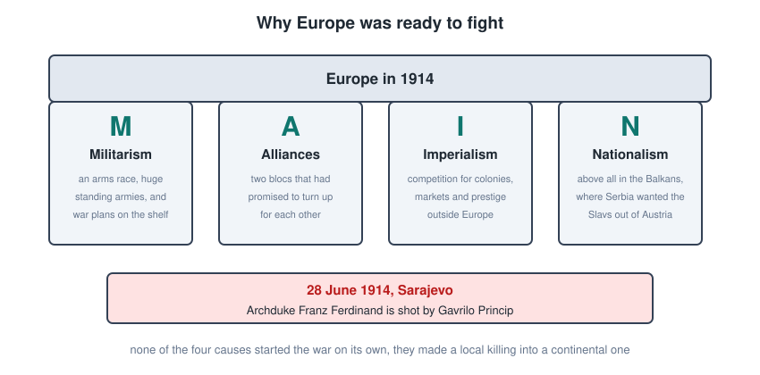
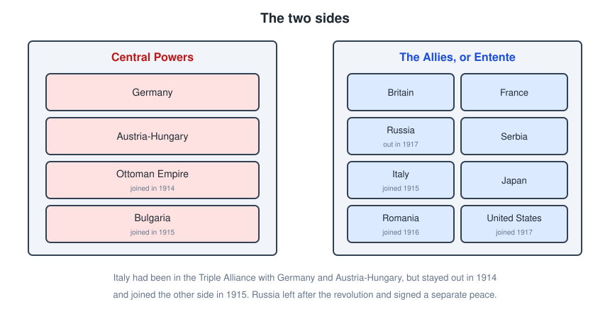
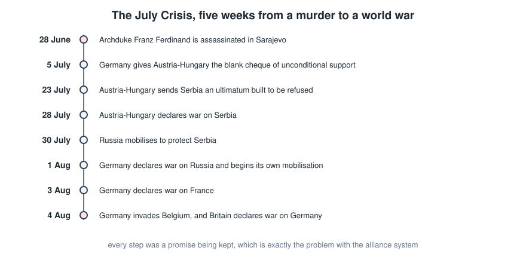
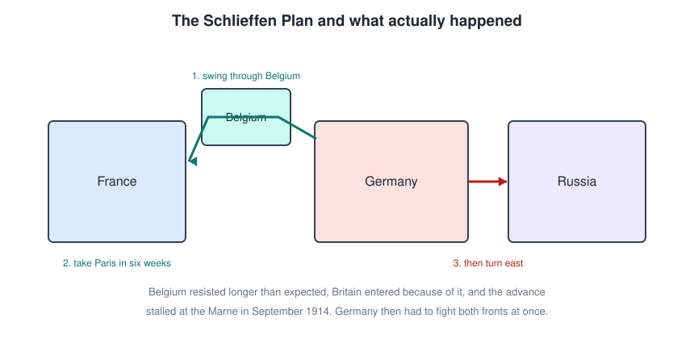
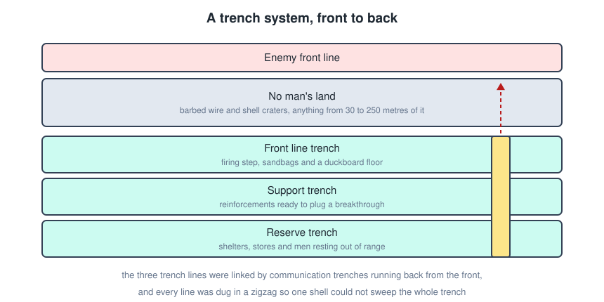
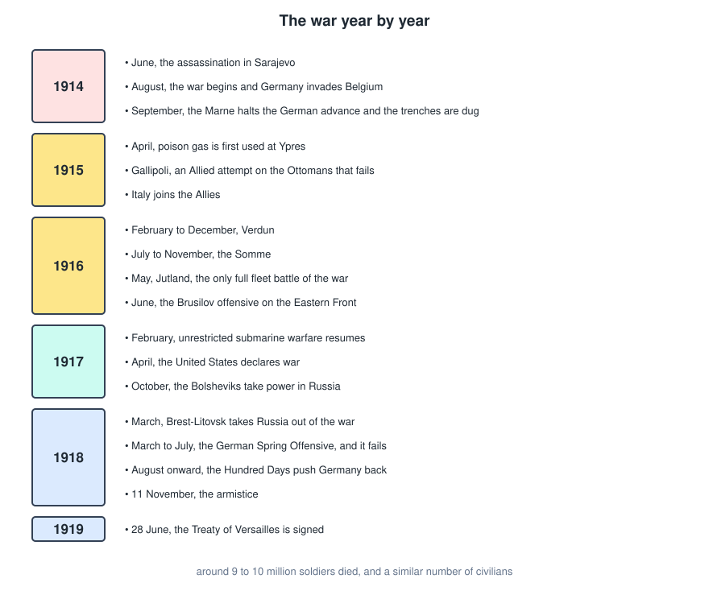
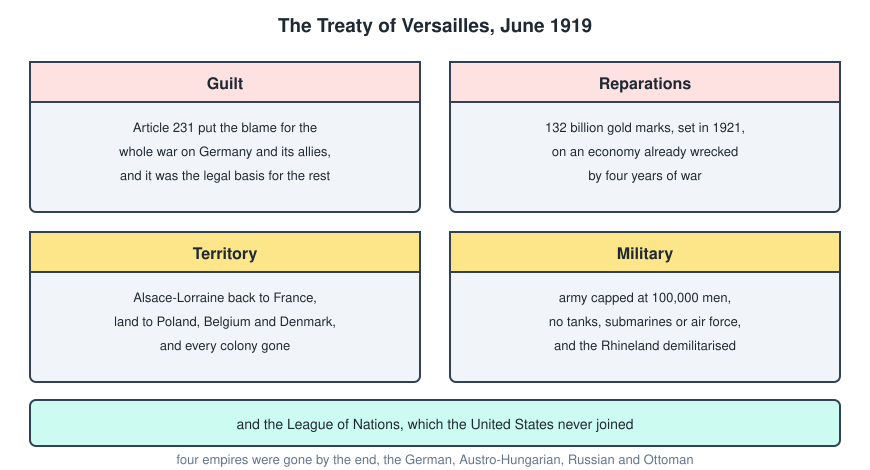

# World War 1

The First World War ran from 1914 to 1918, killed somewhere around 20 million people, destroyed four empires, and drew the map that the next war and most of the modern Middle East were fought over. It is also the war that is hardest to explain, because no single country set out to start it and every one of them helped.

---

## Why It Happened

A useful way to hold the causes together is the word **MAIN**.

- **Militarism.** An arms race, especially the naval one between Britain and Germany, huge conscript armies, and detailed war plans already sitting in drawers waiting to be used.
- **Alliances.** Two blocs that had promised to turn up for each other, which meant a local quarrel could not stay local.
- **Imperialism.** Competition for colonies, markets and prestige, which repeatedly brought the great powers into confrontation outside Europe.
- **Nationalism.** Above all in the Balkans, where Serbia wanted to gather the South Slavs and Austria-Hungary was a multi-ethnic empire that such an idea would destroy.

None of these caused the war on their own. Together they meant that when something did go wrong, there was no way to keep it small.

---

## The Two Sides

The alliance system was supposed to deter a war by making one too expensive. It did the opposite.

- The **Central Powers** were Germany and Austria-Hungary, joined by the Ottoman Empire in 1914 and Bulgaria in 1915.
- The **Allies**, also called the Entente, were France, Russia and Britain, with Serbia, then Italy from 1915, Romania from 1916, Japan, and the United States from 1917.

Two things worth remembering.

- **Italy** had been in the Triple Alliance with Germany and Austria-Hungary before the war. It argued that the alliance was defensive and Austria had attacked, stayed out in 1914, and was then bought by the Allies with promises of territory in 1915.
- **Russia** left in 1917 after the revolution and signed a separate peace, which is why the Eastern Front simply stops.

---

## The July Crisis

On **28 June 1914** Archduke **Franz Ferdinand**, heir to the Austro-Hungarian throne, was shot in Sarajevo by **Gavrilo Princip**, a Bosnian Serb linked to a Serbian nationalist group.

What follows is five weeks of everyone honouring commitments they had made in the abstract.

The mechanics are worth understanding, because they are the whole argument about who was responsible.

- Germany's **blank cheque** on 5 July told Austria-Hungary it would be supported whatever it decided to do, which removed any reason for Austria to be cautious.
- The **ultimatum** to Serbia on 23 July was written so that it could not be fully accepted. Serbia accepted almost all of it anyway, and Austria declared war regardless.
- **Mobilisation** was the point of no return. The war plans were railway timetables, and once a country started moving millions of men, stopping was harder than continuing. Russia mobilised to protect Serbia, and Germany treated that as an act of war.
- Britain had no alliance obliging it to fight for France, but it had guaranteed **Belgian neutrality** in 1839. When Germany invaded Belgium on 4 August, Britain came in.

---

## The Schlieffen Plan

Germany's problem was geography. France to the west, Russia to the east, and an alliance between them meant a war on two fronts.

The **Schlieffen Plan** was the answer. Knock France out quickly with a huge sweep through neutral Belgium, then move the whole army east by rail to deal with Russia, which was expected to take six weeks to mobilise.

It failed for reasons that are all fairly ordinary.

- Belgium resisted instead of standing aside, costing time.
- The Belgian invasion brought Britain in.
- Russia mobilised faster than expected, so troops were pulled east early.
- The advance was halted at the **First Battle of the Marne** in September 1914.

Both sides then tried to outflank each other northwards until they ran out of land at the sea. What was left was a continuous line of trenches from the Channel to Switzerland, and Germany fighting exactly the two front war the plan existed to avoid.

---

## Trench Warfare

The reason the Western Front barely moved for three years is that defensive technology was far ahead of offensive technology.

- The **machine gun** let a handful of men cover a wide front.
- **Quick firing artillery** could destroy an attack before it reached the enemy line, and eventually caused most of the deaths in the war.
- **Barbed wire** slowed attackers down exactly where the machine guns could reach them.
- There was no way to move faster than walking pace across the gap, and no reliable way to talk to your own artillery once you had.

Conditions in the trenches produced their own casualties. Trench foot, lice, rats, dysentery and shell shock were constant, and the winter mud in Flanders could drown a wounded man.

Attempts to break the deadlock mostly failed.

- **Poison gas**, first used on a large scale at Ypres in 1915, terrified everyone and changed nothing, because gas masks arrived quickly and the wind is not a reliable ally.
- **Tanks**, first used on the Somme in 1916, were slow and broke down constantly, but they were the idea that eventually worked, twenty years later.

---

## The War Year By Year

A few of these deserve a note.

### Verdun and the Somme, 1916

**Verdun** ran from February to December 1916. The German plan was explicitly to bleed the French army rather than to take ground. Around 700,000 casualties on both sides combined, for a front line that ended up roughly where it started.

The **Somme** was the British answer, partly intended to relieve Verdun. On the first day, 1 July 1916, the British army took nearly 60,000 casualties, about 20,000 of them dead. It is still the worst day in British military history. The offensive ran to November and advanced about ten kilometres.

### The war at sea

Britain's blockade of Germany was slow, unglamorous and probably decisive, since it starved the German economy and eventually the German population.

**Jutland** in May 1916 was the only full fleet engagement of the war. Germany sank more ships, but the German fleet withdrew and never seriously challenged the blockade again, so tactically it went one way and strategically the other.

Germany's answer was **unrestricted submarine warfare**, sinking any ship approaching Britain. It nearly worked, and it also brought in the United States.

### Why the United States entered, 1917

Two things.

- The resumption of unrestricted submarine warfare in February 1917, on top of earlier sinkings such as the **Lusitania** in 1915.
- The **Zimmermann Telegram**, a German offer to Mexico of American territory in exchange for an alliance, intercepted and published by Britain.

American troops arrived slowly, but the knowledge that they were coming shaped 1918 for both sides.

### 1918

Russia's exit at **Brest-Litovsk** in March 1918 freed up German divisions, and Germany gambled on a **Spring Offensive** to win before the Americans arrived in force. It made the largest advances since 1914 and then ran out of supplies, men and momentum.

The Allied **Hundred Days** offensive from August pushed the German army back continuously. Germany's allies collapsed one after another, the German navy mutinied, the Kaiser abdicated, and the **armistice** took effect at 11am on **11 November 1918**.

---

## The Treaty Of Versailles

Signed on **28 June 1919**, five years to the day after Sarajevo.

The terms in four parts.

- **Guilt.** Article 231 assigned responsibility for the war to Germany and its allies. It was included as the legal basis for demanding reparations, but in Germany it was read as a moral verdict and hated accordingly.
- **Reparations.** Fixed in 1921 at 132 billion gold marks, on an economy already destroyed by four years of war and a blockade.
- **Territory.** Alsace-Lorraine returned to France, substantial land to the new Polish state, smaller transfers to Belgium and Denmark, and every German colony taken away.
- **Military.** The army capped at 100,000 men, no tanks, submarines or air force, and the Rhineland demilitarised.

It also created the **League of Nations**, which the United States never joined, having rejected the treaty in the Senate.

The usual verdict is that the treaty was too harsh to be forgiven and too soft to prevent recovery. Germany was left resentful, humiliated and still the largest economy in central Europe, which is a bad combination.

The other treaties dealt with the rest.

| Treaty | With | Result |
| --- | --- | --- |
| Saint-Germain, 1919 | Austria | the empire broken up, union with Germany forbidden |
| Neuilly, 1919 | Bulgaria | territory lost to Greece and Yugoslavia |
| Trianon, 1920 | Hungary | roughly two thirds of its territory lost |
| Sevres, 1920, replaced by Lausanne, 1923 | Ottoman Empire | the empire partitioned, and modern Turkey emerges |

---

## What The War Left

Four empires ended: the **German**, **Austro-Hungarian**, **Russian** and **Ottoman**. New states appeared across central and eastern Europe, mostly along nationalist lines and mostly with unhappy minorities inside them.

The Ottoman collapse is where this connects to the Lebanese History file. Britain and France had already agreed how to divide the Arab provinces in the secret **Sykes-Picot Agreement of 1916**, and the League of Nations turned that into the mandate system. France got Syria and Lebanon, Britain got Iraq, Transjordan and Palestine.

Around 9 to 10 million soldiers died, and a comparable number of civilians through fighting, famine and disease. The **1918 influenza pandemic**, spread and worsened by the movement of troops, killed tens of millions more on top of that.

And a settlement that satisfied nobody, in a Europe that had learned that industrial war was possible, twenty years before the next one.

---

## Quick Recap

- MAIN, so militarism, alliances, imperialism and nationalism, plus the spark at Sarajevo.
- Central Powers were Germany, Austria-Hungary, the Ottomans and Bulgaria, against the Entente.
- The blank cheque, the ultimatum and the mobilisations turned a murder into a world war in five weeks.
- The Schlieffen Plan failed at the Marne, and the trenches followed from there.
- Machine guns, artillery and wire beat infantry, which is why the front barely moved.
- 1917 brought the United States in and took Russia out.
- The armistice was 11 November 1918, and Versailles was 28 June 1919.
- Four empires fell, and the Ottoman collapse is what created the modern Middle East.
