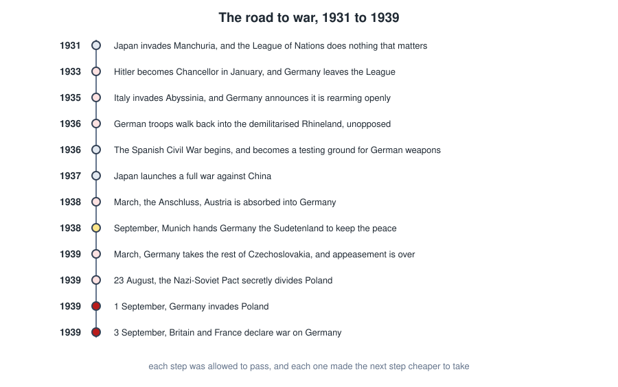
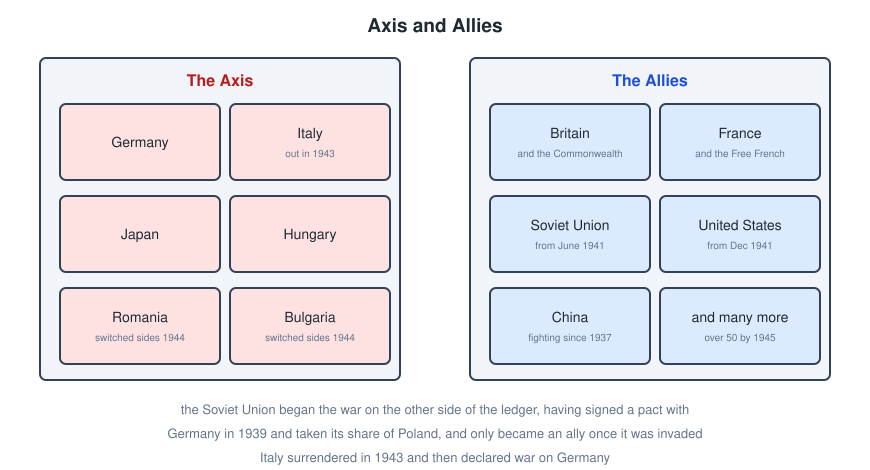
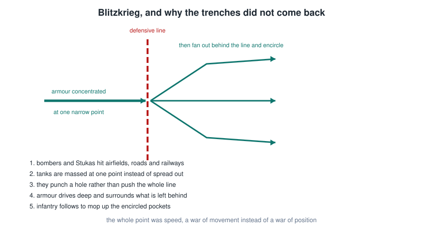
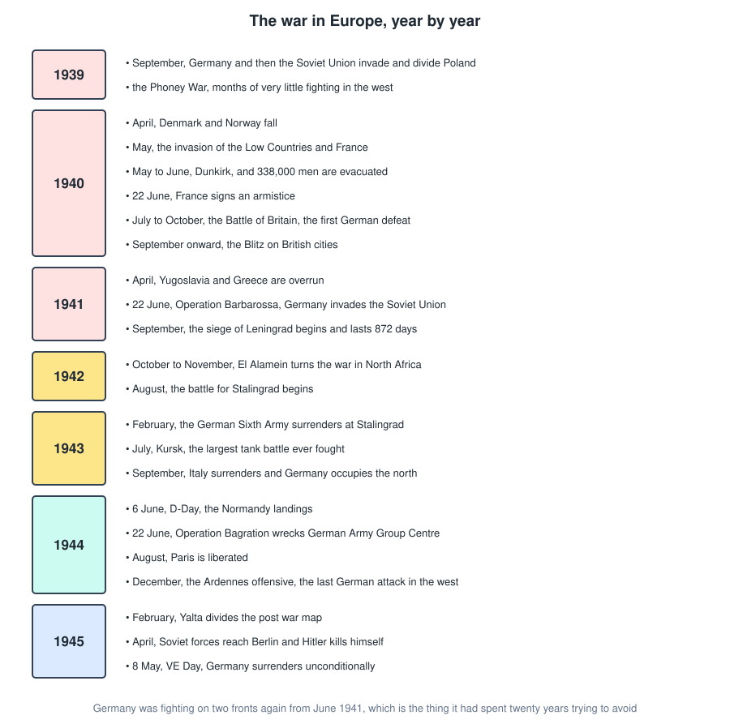
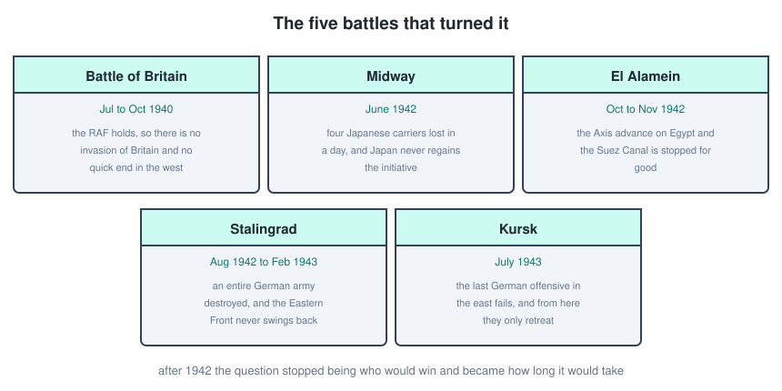
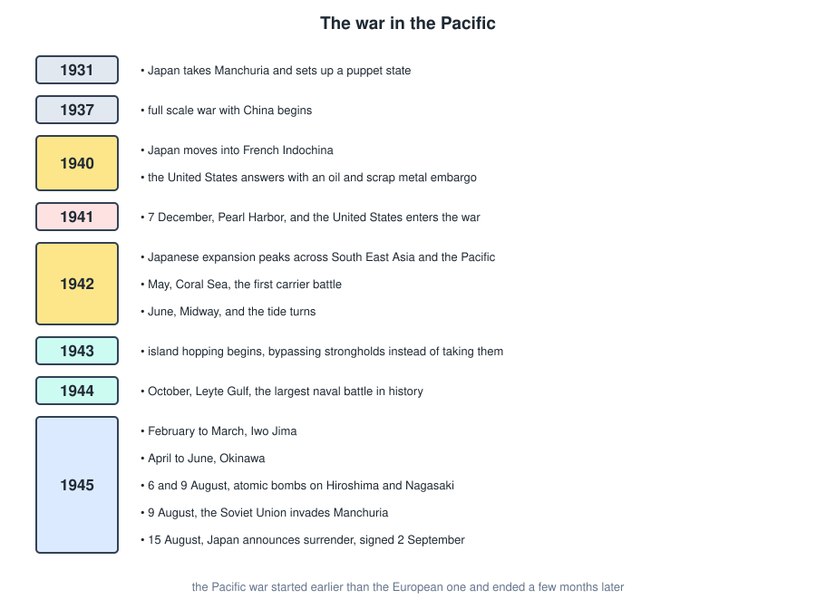
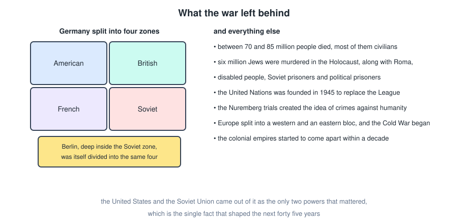
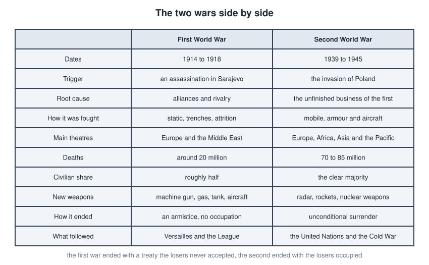

# World War 2

The Second World War ran from 1939 to 1945 in Europe and from 1937 to 1945 in Asia, and it killed somewhere between 70 and 85 million people, most of them civilians. It is best read straight after the First World War file, because a large part of it is the first war's unfinished business.

---

## Why It Happened

Five things stack up, and none of them is sufficient on its own.

- **Versailles.** Germany was left with a treaty it considered a humiliation, reparations it could not pay, and territory it wanted back. Overturning the treaty was the one policy every German party agreed on.
- **The Great Depression.** From 1929 onward, mass unemployment destroyed faith in liberal democracy across Europe and made radical parties electable. The Nazi vote went from under 3 percent in 1928 to the largest share in the country by 1932.
- **The failure of the League of Nations.** No army, no United States, and no willingness to act. Japan in Manchuria and Italy in Abyssinia both showed that aggression carried no cost.
- **Appeasement.** Britain and France, both traumatised by the last war and unprepared for another, gave ground repeatedly in the hope that each concession would be the final one.
- **Expansionist ideology.** Nazi Germany was committed to territorial expansion and racial hierarchy as a matter of doctrine, not just of grievance, and Japan was pursuing an empire in Asia on similar grounds.

---

## The Road To War

The decade before 1939 is a series of tests that nobody failed and nobody stopped.

Three of these are worth pausing on.

### The Rhineland, 1936

German troops reoccupied the demilitarised Rhineland in direct breach of Versailles. The German army had orders to retreat immediately if France resisted. France did not, and the lesson taken in Berlin was that the treaty was no longer enforced by anybody.

### Munich, 1938

Britain and France agreed to hand Germany the Sudetenland, the German-speaking border region of Czechoslovakia, without Czechoslovakia in the room. Chamberlain returned saying it meant peace for our time.

It bought roughly a year of rearmament for Britain, which mattered in 1940. It also handed Germany Czechoslovakia's border defences and, six months later, the rest of the country.

### The Nazi-Soviet Pact, August 1939

The two states that were supposedly each other's ideological opposites signed a non-aggression pact, with a secret protocol dividing Poland and the Baltic states between them.

For Hitler it removed the two front problem. For Stalin it bought time and territory. Germany invaded Poland on **1 September 1939**, the Soviet Union invaded from the east on 17 September, and Britain and France declared war on 3 September.

---

## The Two Sides

The line-up shifted more than in the first war.

- The **Soviet Union** started on the German side of the ledger, having signed the pact and taken its share of Poland, and only became an Ally when it was invaded in June 1941.
- **Italy** surrendered in September 1943 and then declared war on Germany, which occupied the north of the country and fought on there for another eighteen months.
- **Romania** and **Bulgaria** both switched sides in 1944 as Soviet forces arrived.
- **France** fell in 1940 and then existed in two versions, the collaborationist Vichy government and the Free French under de Gaulle.

---

## Blitzkrieg

The reason 1940 looked nothing like 1914 is a change in method rather than a change in weapons. Everyone had tanks, aircraft and radios. Germany used them differently.

The French army in 1940 was not smaller than the German one and its tanks were not worse. It was spread evenly along a defensive line, on the assumption that the next war would look like the last one, and it was cut in half in six weeks.

---

## The War In Europe

Some of that needs more than a line.

### The fall of France, 1940

Germany attacked through the Ardennes, which the French had considered too wooded for armour and had therefore left lightly defended. The breakthrough reached the Channel in ten days and cut the Allied armies in two.

**Dunkirk**, between 26 May and 4 June, evacuated around 338,000 British and French troops off the beaches using warships and hundreds of civilian boats. The army was saved and all of its heavy equipment was lost. France signed an armistice on 22 June.

### The Battle of Britain, 1940

Germany needed air superiority before it could attempt an invasion. From July to October the Luftwaffe and the RAF fought over southern England, and the RAF held.

Two things mattered more than aircraft quality. Britain had **radar**, so its fighters could be sent where the bombers actually were instead of patrolling blindly. And Germany switched from attacking airfields to bombing cities in September, which relieved the pressure on Fighter Command at the moment it was closest to breaking.

The invasion was postponed indefinitely. The **Blitz** on British cities continued into May 1941 and killed around 40,000 civilians.

### Operation Barbarossa, 1941

On **22 June 1941** Germany invaded the Soviet Union with roughly three million men, the largest invasion in history. The first months were catastrophic for the Soviets, with entire armies encircled and captured.

It stalled outside Moscow in December, for the usual reasons. The distances were larger than the supply system could handle, the autumn mud stopped everything that had wheels, the winter arrived with German troops in summer uniforms, and Soviet industry had been physically moved east beyond the range of German bombers and kept producing.

The Eastern Front was where the war in Europe was decided. Around three quarters of German military casualties happened there.

---

## The Turning Points

The cluster is what matters. Between June 1942 and July 1943, in three different theatres, the Axis lost the initiative everywhere at once and never got it back. After that the question was no longer who would win but how long it would take and how many people would die in the meantime.

**Stalingrad** is the one usually singled out. The German Sixth Army was encircled in November 1942 and surrendered in February 1943, with around 91,000 prisoners taken, of whom about 6,000 eventually came home.

---

## The End In Europe

**D-Day**, 6 June 1944, landed around 156,000 men in Normandy in the largest amphibious operation ever attempted. It gets most of the attention in the west, and it deserves it, but it happened alongside **Operation Bagration** on the Eastern Front two weeks later, which destroyed a larger German force than the whole Normandy campaign.

Paris was liberated in August. The German counterattack in the Ardennes in December, the **Battle of the Bulge**, was the last offensive in the west and it failed within a month.

Soviet forces reached Berlin in April 1945. **Hitler killed himself on 30 April**, and Germany surrendered unconditionally on **8 May 1945**, which is **VE Day**.

---

## The War In The Pacific

This war started earlier and finished later than the European one, and it is a separate story that happens to share a name.

### Pearl Harbor

On **7 December 1941** Japan attacked the US Pacific Fleet at Pearl Harbor without a declaration of war, sinking or damaging most of the battleships present and killing around 2,400 people.

The aircraft carriers were at sea and survived, and the fuel storage and repair facilities were left intact. Both turned out to matter more than the battleships, because the Pacific war was fought by carriers.

The attack was intended to buy Japan time to secure its conquests before America could respond. Instead it ended American neutrality overnight and committed the largest industrial economy in the world against Japan.

### Midway and island hopping

**Midway**, in June 1942, cost Japan four fleet carriers in a single engagement, losses it could not replace. From that point the Allies advanced by **island hopping**, taking islands that could be used as airbases and bypassing the heavily defended ones, leaving them cut off.

The fighting on those islands was among the worst of the war. Iwo Jima and Okinawa in 1945 produced enormous casualties on both sides, and Okinawa also killed a large share of the civilian population.

### The atomic bombs

The United States dropped an atomic bomb on **Hiroshima on 6 August 1945** and on **Nagasaki on 9 August**. Estimates of the immediate and near-term deaths run to around 200,000 in total, overwhelmingly civilians, with more dying of radiation-related illness for years afterwards. The **Soviet Union invaded Manchuria on 9 August**.

Japan announced its surrender on **15 August 1945** and signed on 2 September.

Historians still argue about the decision. The case made at the time was that the bombs avoided an invasion of the Japanese home islands that would have been enormously costly on both sides. Against that, others point to the Soviet declaration of war on 9 August as the more decisive shock to the Japanese leadership, to the fact that Japan was already seeking terms through intermediaries, and to the question of whether a demonstration or a warning would have served. It is worth knowing the arguments rather than only one of them.

---

## The Holocaust

The Nazi regime murdered around **six million Jews**, roughly two thirds of the Jewish population of Europe, in a deliberate and industrialised programme of extermination.

It escalated in stages. Legal exclusion from German life from 1933, the Nuremberg Laws of 1935, organised violence at **Kristallnacht** in 1938, then ghettos in occupied Poland, mass shootings by the Einsatzgruppen behind the Eastern Front from 1941, and finally the extermination camps. The **Wannsee Conference** in January 1942 coordinated the machinery across the ministries of the state.

The Nazi regime also systematically murdered Roma and Sinti, disabled people, Soviet prisoners of war, Poles and other Slavs, political prisoners, Jehovah's Witnesses and gay men. Estimates for these groups together run to several million more.

The point that matters historically is that this was not a byproduct of the fighting. It was a policy, carried out by a modern state using its bureaucracy, its railways and its industry, and it required the participation of very large numbers of ordinary people.

---

## What It Left Behind

- Between **70 and 85 million dead**, the majority civilians. The Soviet Union alone lost around 27 million, China somewhere between 15 and 20 million.
- The **United Nations**, founded in 1945, built deliberately to fix the League's weaknesses, with a Security Council of the major powers holding vetoes.
- The **Nuremberg trials**, which established that following orders is not a defence and created the legal category of crimes against humanity.
- **Germany divided** into four occupation zones, with Berlin divided the same way despite sitting deep inside the Soviet zone. That division became West and East Germany in 1949.
- The **Cold War**, as the only two powers left standing found they had nothing in common once Germany was defeated.
- **Decolonisation**, since the European empires were financially ruined and had spent the war asking colonial subjects to fight for freedoms they were not given themselves.
- **Nuclear weapons**, which changed what a war between great powers could mean.

---

## The Two Wars Compared

The most useful contrast is the ending. The First World War stopped with an armistice, no foreign troops on German soil, and a treaty the losing side never accepted as legitimate, which left the argument open. The Second ended with unconditional surrender, occupation, and a deliberate effort to rebuild the defeated states rather than to bill them.

That difference is why 1945 held and 1919 did not.

---

## Quick Recap

- The causes were Versailles, the Depression, a useless League, appeasement, and expansionist regimes in Germany and Japan.
- Manchuria, Abyssinia, the Rhineland, Austria and Munich were all tests that were allowed to pass.
- The Nazi-Soviet Pact removed the two front problem, and Poland was invaded on 1 September 1939.
- Blitzkrieg beat the French defensive line in six weeks, and radar plus the RAF stopped the invasion of Britain.
- Barbarossa opened the Eastern Front in June 1941, where the war in Europe was actually decided.
- Midway, El Alamein, Stalingrad and Kursk between 1942 and 1943 are where the initiative changed hands.
- D-Day was June 1944, VE Day was 8 May 1945, and Japan surrendered in August 1945.
- Six million Jews were murdered in the Holocaust, along with millions of others, as state policy.
- The result was the UN, a divided Germany, the Cold War, decolonisation and nuclear weapons.
