# Data Analytics And Machine Learning

This is where the Python stops being the point and the data becomes the point. Most of it is about knowing what your data looks like before you throw an algorithm at it, and then knowing which algorithm to throw.

---

## Common Terms

These four get used interchangeably in conversation, which they should not be.
- **Data Analysis (DA)** is the systematic computational analysis of data sets.
- **Artificial Intelligence (AI)** is computer systems that can perform tasks typically requiring human intelligence.
- **Machine Learning (ML)** is algorithms that allow systems to learn from data and improve their performance over time, without being explicitly programmed.
- **Deep Learning (DL)** is algorithms that use multilayered neural networks, simulating complex decision making the way a human brain does.

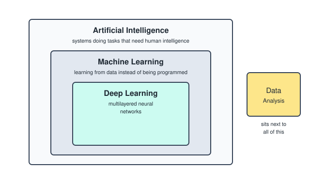

---

## Types Of Data

Data splits in two, and each half splits in two again.

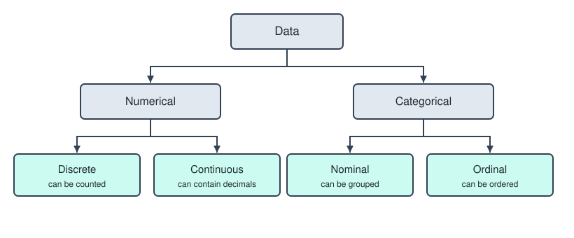

Numerical values.
- **Discrete data** is data that can be counted.
- **Continuous data** is data that is measured and can contain decimals.

Categorical values.
- **Nominal data** is data that can be grouped but has no order to it.
- **Ordinal data** is data that can be ordered.

---

## Data Metrics

The three ways to describe the center of a dataset, plus the thing that ruins them.
- **Average or mean** is the sum of all elements over the number of elements. Sensitive to outliers.
- **Median** is the middle value when the data is ordered. Not sensitive to outliers, which usually makes it the safest metric.
- **Mode** is the most frequent value in the dataset. Not sensitive to outliers either.
- **Outliers** are data points that are very different from the rest of the values.

---

## Specifying Types In Python

Once data types matter this much, it is worth writing them down in the code too. Python does not enforce it, but everyone reading the function knows what goes in and what comes out.

Without type hints.
```python
def add(a, b):
    return a + b
```

With type hints.
```python
def add(a: int, b: int) -> int:
    return a + b
```

---

## Numeric Vs Categorical Data In A Table

An easy way to picture the difference when you are looking at a table.
- Numeric data represents the values in the rows of the table.
- Categorical data represents the titles of the columns of the table.

---

## Population Vs Sample

The population is the entire group that you want to draw conclusions about, like all the students in a school. A sample is a subset of that population that is actually studied, like 100 students randomly chosen from the school.

The sample should reasonably represent the population, otherwise you have a biased sample and everything built on top of it is wrong.

---

## Measures Of Spread

Spread measures how dispersed the values in a dataset are. It tells you how consistent the data is, which is what you actually need when making decisions about risk or reliability.
- **Mean absolute deviation (MAD)** is the average of the absolute distances from the mean. Easier to compute and interpret, but it does not emphasize outliers as much.
- **Variance** is the average of the squared distances from the mean. More sensitive to outliers, but the units are squared which makes it harder to interpret.
- **Standard deviation** is the square root of the variance. Most commonly used, because it gives a good sense of the spread while staying in the original units.

---

## Skewness

Skewness measures the degree of asymmetry in a dataset.

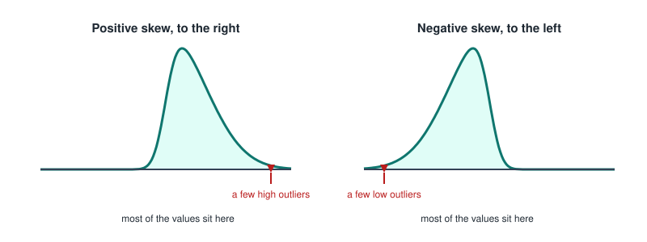

- **Positive skew**, also called right skew, is when most values are concentrated on the left but there are a few high outliers.
- **Negative skew**, also called left skew, is when most values are concentrated on the right but there are a few low outliers.

The name always refers to the side the tail is on, not the side the bulk is on.

---

## Kurtosis

Kurtosis measures the sharpness of the peak of the curve, so it is really about the extremes.

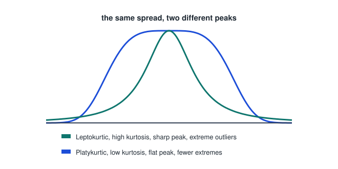

- **Leptokurtic**, so high kurtosis, means the variance is driven by extreme outliers and the peak is sharp.
- **Platykurtic**, so low kurtosis, means extreme outliers are less common and the peak is flat.

---

## Correlation

Correlation measures the linear relationship between two variables, and it is expressed by the correlation coefficient `r`.

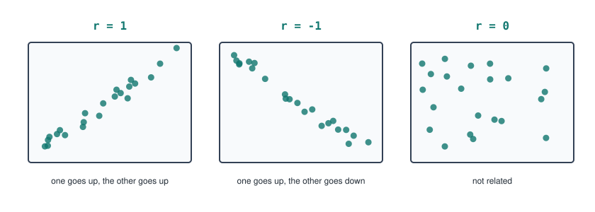

- `r = 1` means one goes up and the other goes up.
- `r = -1` means one goes up and the other goes down.
- `r = 0` means they are not related.

Two warnings that matter more than the number itself. Correlation does not mean causation. And spurious correlation happens when two variables appear to be related but the relationship is purely coincidental.

---

## Missing Values

Not all missing data is missing for the same reason, and the reason decides whether you can safely drop it.
- **Missing Completely At Random (MCAR)**, like a participant accidentally skipping a question.
- **Missing At Random (MAR)**, like younger people not responding to certain questions.
- **Missing Not At Random (MNAR)**, like people with a high income not wanting to disclose their income.

MNAR is the dangerous one, because the values are missing exactly because of what they would have said.

---

## Machine Learning Paradigms

Three approaches, split by what you feed the model.

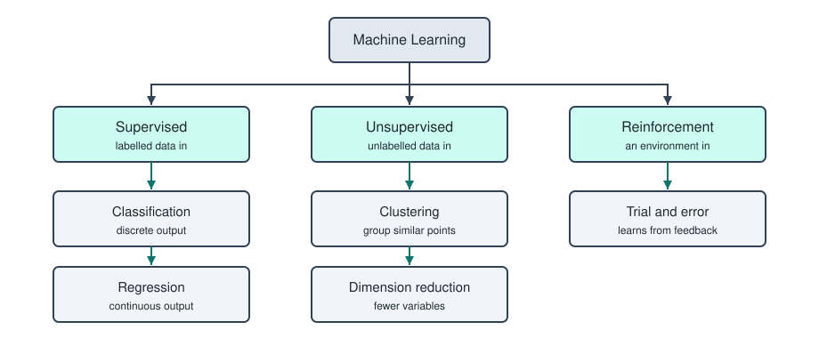

- **Supervised learning** takes labelled data in, and leads to classification for discrete output or regression for continuous output.
- **Unsupervised learning** takes unlabelled data in, and leads to dimension reduction or clustering.
- **Reinforcement learning** takes an environment as input and learns from the feedback it gets.

---

## Supervised Learning

Supervised learning is an approach in which an algorithm is trained on a dataset that contains input and output pairs.
- The input is the features, also called the independent variables.
- The output is the target, also called the dependent variable.

The goal is for the machine to learn the outputs of the inputs it has seen, so it can predict the outputs of inputs it has never seen.

The two families of algorithm.
- **Classification** outputs a category or label, so each input is assigned to a fixed category. An email is either spam or it is not.
- **Regression** predicts a continuous numeric value, so the machine learns to estimate the relationship between the variables. House features go in, a price of 250 000 euro comes out.

---

## Classification Techniques

**K Nearest Neighbors** is a lazy technique used to classify a new data point based on the majority label of its neighbors in the training data. It is basically saying, show me a specific number `k` of your neighbors and I will tell you who you are.

**Decision Trees** classify data points by learning simple decision rules from the data features, drawing a tree like structure as it goes.

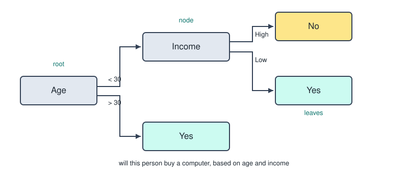

The tree is built by splitting the data, and there are three metrics for deciding where to split.
- **Entropy** measures the impurity or disorder of a dataset.
- **Information gain** measures how much uncertainty, so entropy, is reduced by splitting the data.
- **Gini impurity** measures the purity of a dataset.

**Random Forest** combines multiple decision trees to make more accurate and stable predictions. It predicts the class of an input by taking a majority vote from many decision trees.

**Logistic Regression** predicts the probability that an instance belongs to a certain class. The machine outputs a probability between 0 and 1 and then checks whether the number is closer to 0 or to 1, so the output is one of two classes. The weighted sum of the inputs is calculated and then squeezed into that range using the sigmoid logistic function.

The name is misleading on purpose, it says regression but it is a classification technique.

---

## Regression Techniques

**Linear regression** predicts a continuous numeric value by finding a linear relationship between the input variable and the output variable. You have one predictor variable with which you try to predict the output, so the dependent variable.

---

## Types Of Statistics

- **Descriptive statistics** is when you describe or summarize data.
- **Inferential statistics** is when you use a group of data to infer or predict something about a bigger group of data.

---

## Data Metrics In Python

```python
np.mean(df['col'])
np.median(df['col'])
statistics.mode(df['col'])
df.agg(['mean', 'median'])   # both at once
```

---

## Spread In Python

```python
np.var(df, ddof=1)
np.std(df, ddof=1)
```

The `ddof=1` is there because you are almost always working with a sample and not the whole population.

---

## Quartiles

Quartiles are values that divide a dataset into 4 equal parts of 25 percent each. They are commonly used to describe the distribution.

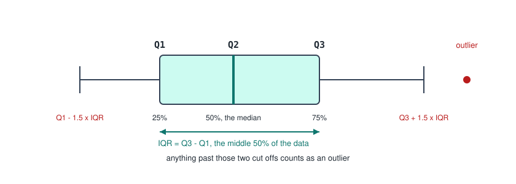

- **First quartile (Q1)** is the 25th percentile.
- **Second quartile (Q2)** is the 50th percentile, so the median.
- **Third quartile (Q3)** is the 75th percentile.
- **Interquartile range (IQR)** is `Q3 - Q1`. It measures the spread of the middle 50 percent of the data and helps detect outliers.

---

## Calculating Outliers

```
Lower cut off = Q1 - 1.5 x IQR
Upper cut off = Q3 + 1.5 x IQR
```

Any data points below the lower cut off or above the upper cut off are considered outliers.

---

## Quartiles In Python

```python
np.quantile(dataframe, quantile)
```

The second argument is what decides how many parts you cut the data into.
```python
np.quantile(df, [0.25, 0.50, 0.75])       # quartiles, 4 parts
np.quantile(df, [0.2, 0.4, 0.6, 0.8])     # quintiles, 5 parts
```

---

## Measuring Chance

The probability of an event.
```
	    number of ways the event can occur
P = ---------------------------------------
	    total number of possible outcomes
```

Picking randomly from a dataframe, where the number in the parentheses is how many rows you want.
```python
dataframe.sample()
```

---

## Correlation In Python

You can calculate the correlation between two columns of a dataframe.
```python
df['col1'].corr(df['col2'])
```

This only works for linear relationships, and it outputs the correlation coefficient `r`.

---

## Probability Distribution

A distribution shows how data points are spread across different values. They split into two groups.

Continuous distributions.
- Normal distribution
- Student t distribution
- Exponential distribution

Discrete distributions.
- Uniform distribution
- Poisson distribution
- Bernoulli distribution
- Binomial distribution

---

## Normal Distribution

A normal distribution is bell shaped and symmetrical around the mean, with the data spread out from the mean by the standard deviation.

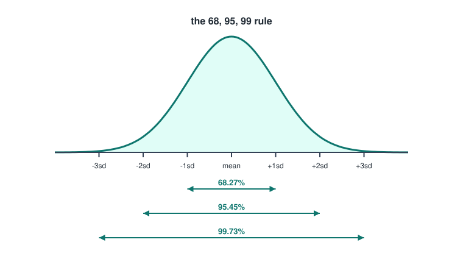

The 68, 95, 99 rule.
- 68.27 percent of all values lie within one standard deviation of the mean.
- 95.45 percent of all values lie within two standard deviations.
- 99.73 percent of all values lie within three standard deviations.

---

## Student T Distribution

Similar to the normal distribution but with wider tails. This variation is used when the sample size is small or when the standard deviation is unknown.

Its shape is defined by the degrees of freedom (df).
- Lower df means wider tails, so more variability.
- Higher df means the distribution gets closer and closer to a normal one.

---

## Exponential Distribution

Models the time between independent events that happen at a constant rate. High probability for short times, low probability for long ones, so the curve drops off steeply from the start.

---

## Uniform Distribution

Models all outcomes when they are equally likely to happen, so every outcome has the same probability. Displayed with a histogram.

---

## Poisson Distribution

Models the number of events occurring in a fixed time or space interval. Used when events are independent. Displayed with a histogram.

---

## Bernoulli Distribution

Models a single binary event, either success (1) or failure (0). Used when we have one event and two outcomes. Displayed with a histogram.

---

## Binomial Distribution

Models the number of successes in multiple Bernoulli trials. Used when the trials are independent. Displayed with a histogram.

So Bernoulli is one coin flip, and binomial is how many heads you get out of ten.

---

## Statistical Significance

A measure of whether the difference or relationship observed in a dataset is strong enough that it is not just random chance. This is what the p value tells you.
- A **low p value** means the result is less likely to be chance, so strong evidence, so the result is statistically significant.
- A **high p value** means the result is more likely to be chance, so weak evidence, so the result is not significant.

---

## Practical Significance

A measure of whether the result is meaningful or important in real world terms. A result can be statistically significant and still be useless, which is exactly why both measures exist.

---

## Limitations Of Statistical Testing

- In large samples even tiny effects can become statistically significant.
- Manipulating the data or the analysis until something turns significant, which is called p hacking.
- Running many tests increases the chances of false positives.

---

## Unsupervised Learning

Unsupervised learning is the second approach, where the model is given data without any labels or correct answers and asked to find patterns or structure on its own.

Two things you can do with it.
- **Clustering** is grouping similar data points together.
- **Association rules** is finding relationships between variables.

---

## Clustering Types

- **Hard clustering** means each item is in only one cluster.
- **Soft clustering** means each item has a probability of being in each cluster.
- **Disjunctive or overlapping** means an item can be in more than one cluster.

---

## Clustering Approaches

- **Hierarchical** creates a hierarchical decomposition of the set of objects.
- **Partitioning** constructs various partitions and then evaluates them by rules.

---

## Hierarchical Clustering

It can be built from the bottom up or from the top down.

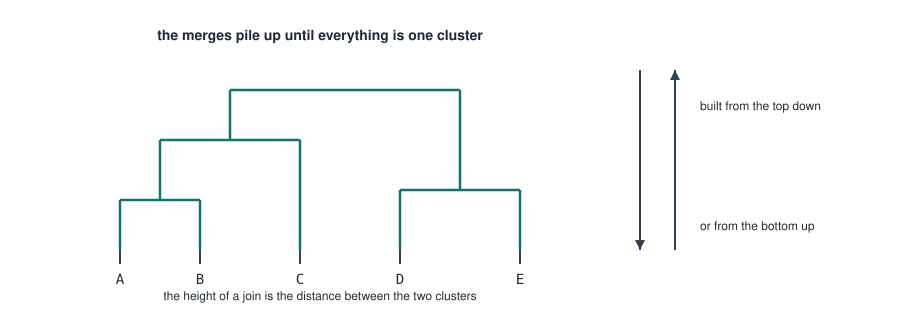

The distance between two clusters can be calculated in several ways, and the choice changes the shape of the result.
- **Single link** is the distance between the two most similar instances, so the closest ones.
- **Complete link** is the distance between the two least similar instances, so the furthest ones.
- **Average link** is the average distance between all instances.
- **Centroid link** is the distance between the center point of each cluster.

---

## Partitioning Clustering Algorithms

**K Means clustering** represents each cluster by the center of that cluster.

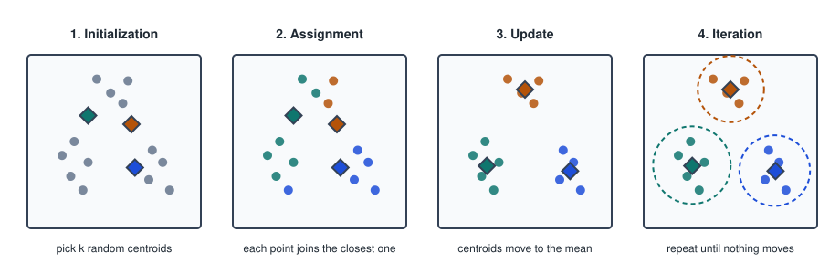

1. **Initialization**, randomly select k initial centroids.
2. **Assignment**, assign each data point to the nearest centroid based on the euclidean distance.
3. **Update**, recalculate the centroids by taking the mean of all the points in each cluster.
4. **Iteration**, repeat the steps until the centroids stop moving.

**K Medoids** represents each cluster by one of the actual objects in the cluster, the one closest to the center. This method is also called Partitioning Around Medoids, which gets abbreviated to PAM.

The difference is that a centroid is a calculated average point that might not exist in your data, while a medoid is always a real data point.

---

## Association Rules

Association rules answer the question, if A happens, how often does B happen. Each of those observations is called a transaction.

Three measures describe a rule.
- **Support** is how often an item appears in the dataset, so across all transactions. This measures frequency.
- **Confidence** is how often B appears when A appears. This measures the reliability of the rule.
- **Interest** indicates the influence A has on B. It is calculated as the confidence of B and A minus the support of B. If the result is 0 then A has no influence on B.

---

## Association Rules Algorithms

**The Apriori algorithm** is a step by step approach to find all the frequent itemsets in a list of transactions. It works on one rule that saves an enormous amount of computation, if an itemset like A and B is infrequent, then all of its supersets are infrequent too, so there is no point checking them.

---

## Recommender Systems

Recommender systems suggest items to users based on data such as preferences and similarity. They often use both unsupervised and supervised learning to discover patterns in user data, with or without labeled outputs.

Two types.
- **Content based filtering** recommends items similar to what the user liked before, using item features like keywords. The downside is that it can lead to over specializing, where the user only ever sees more of the same.
- **Collaborative filtering** recommends items that similar users liked. It uses user behavior patterns instead of item content, and uses matrix factorization for the best outcomes.

---
