# Data Engineering

The analytics and machine learning file assumes the data is already sitting there, clean and in one place. This is the file about how it got there. Most of data engineering is plumbing, and the plumbing is what decides whether anything downstream is trustworthy.

---

## Definition

Data engineering is the practice of designing, building, and maintaining systems that enable the efficient collection, storage, and processing of data.

---

## Importance

Everything an analyst or a model does sits on top of this layer, which is why it matters.
- It ensures data is clean, reliable, and accessible for analysis.
- It supports business intelligence and AI by providing structured data.
- It enables real time and batch processing, so each use case gets the timing it needs.
- It forms the foundation of data driven decision making.

---

## Data Engineering And Data Science

The analogy that sticks: data engineers build the highways, data scientists drive the cars.

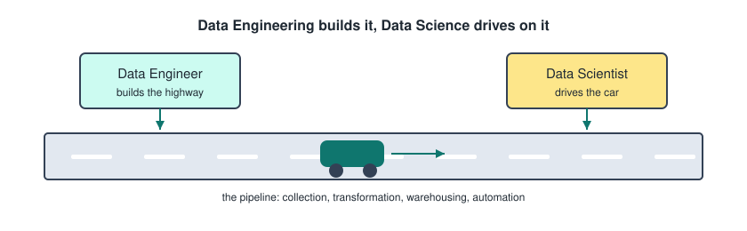

The key responsibilities of a data engineer.
- **Data collection**, getting the data out of wherever it lives.
- **Data transformation**, turning it into something usable.
- **Data warehousing**, putting it somewhere queryable.
- **Pipeline automation**, so none of it is run by hand.
- **Performance optimization**, so it finishes in reasonable time.
- **Security**, so the wrong people cannot read it.

---

## Data Warehouse

A data warehouse is a structured storage system optimized for analytics and SQL queries.
- It contains high quality, cleansed data.
- The schema is decided before the data goes in, which is what makes it fast to query.
- It is used for business intelligence and reporting.

---

## Data Lake

A data lake stores raw data in its original format, including both structured and unstructured data.
- Because nothing is shaped on the way in, it is not optimized for SQL and queries over it are slower.
- The schema is applied when you read it rather than when you write it.
- It is used for big data and machine learning, where you want the raw thing rather than a cleaned summary.

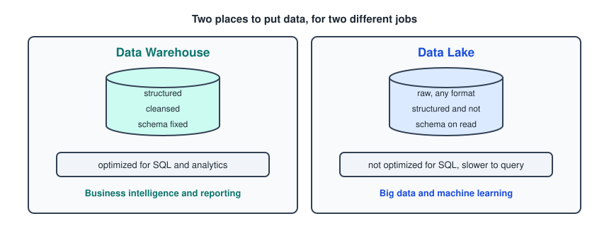

The short version to remember.
- A warehouse is clean, structured, and fast to query.
- A lake is raw, flexible, and slow to query.

---

## Batch And Real Time Data Processing

The difference is when the work happens, not what the work is.

**Batch processing** handles large volumes of data at scheduled intervals, hourly, daily, or weekly. It typically works with historical data.

**Real time processing** processes data right after it is generated, within seconds or milliseconds. It typically works with live streaming data.

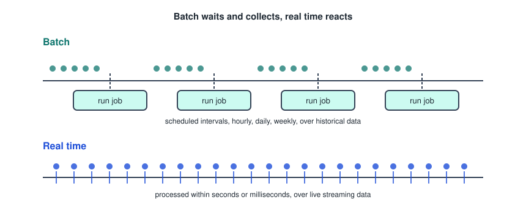

---

## Data Pipeline Architecture

A pipeline is usually described in layers, and this is the shape that comes up most often.

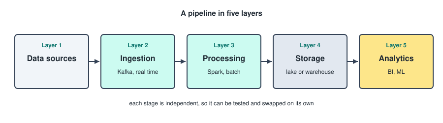

- **Layer 1** is the data sources.
- **Layer 2** is the ingestion layer, Kafka for real time.
- **Layer 3** is the processing layer, Spark for batch.
- **Layer 4** is the storage layer.
- **Layer 5** is the analytics layer.

The Kafka and Spark labels are the typical pairing, not a rule. Spark does streaming too, and Kafka is often in front of a batch job. What is fixed is the order of the layers, not the tool in each one.

---

## Data Pipelines

A data pipeline is a system that moves data from one place to another and transforms it along the way, so it can be used for analysis or machine learning. In one sentence, it automates data processing.

**Apache Airflow** is the tool used to schedule, manage, and monitor data pipelines. Work is defined as a DAG, a graph of tasks with the dependencies written down, and Airflow handles the ordering and the retries.

```python
with DAG("daily_sales", schedule="0 6 * * *") as dag:
    extract = PythonOperator(task_id="extract", python_callable=pull_orders)
    transform = PythonOperator(task_id="transform", python_callable=clean_orders)
    load = PythonOperator(task_id="load", python_callable=write_warehouse)

    extract >> transform >> load
```

The arrows are the whole point. They say transform does not start until extract succeeded.

---

## Data Lineage And Governance

Two things that sound like paperwork and are not.

- **Data lineage** tracks the origin, movement, and transformation of data. It is what lets you answer "where did this number come from", which is what ensures transparency and trust.
- **Data governance** enforces access control, privacy, and compliance, GDPR being the obvious one.

---

## Data Sources

Data comes in three shapes, and the shape decides where you can put it.

- **Structured data** comes from databases, APIs, and CSVs. It is limited in what it can express, and it lives happily in SQL.
- **Semi structured data** is JSON, XML, and logs. It is flexible, and it fits a NoSQL store like MongoDB.
- **Unstructured data** is images, videos, text, and social media posts. It carries the richest information and the least structure.

---

## Data Collection Techniques

- **Web scraping** is the automated extraction of data from websites.
- **APIs** give data access from web services. An Application Programming Interface allows applications to communicate with each other by exposing specific data.
- **Database queries** retrieve data from databases.
- **Data streaming** captures data from live sources.
- **Sensor based collection** gathers data from physical sensors connected to devices and sends it to systems for monitoring and analysis, through IoT, which stands for Internet of Things.

---

## Data Ingestion Fundamentals

Data ingestion is the process of importing, transferring, and preparing raw data for analysis or storage in a target system.

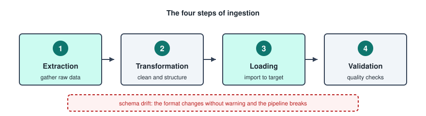

1. **Extraction** gathers the raw data.
2. **Transformation** cleans and structures it.
3. **Loading** imports it into the target system.
4. **Validation** runs the data quality checks.

A common problem is an unexpected change in the data format. This is called **schema drift** and it is a common cause of broken pipelines. A column gets renamed upstream, nobody tells you, and the job fails at 3am.

> Data collection is about gathering data, while data ingestion is about moving and preparing that data for use.

---

## ETL And ELT

Two types of ingestion, and the only real difference is where the T sits.

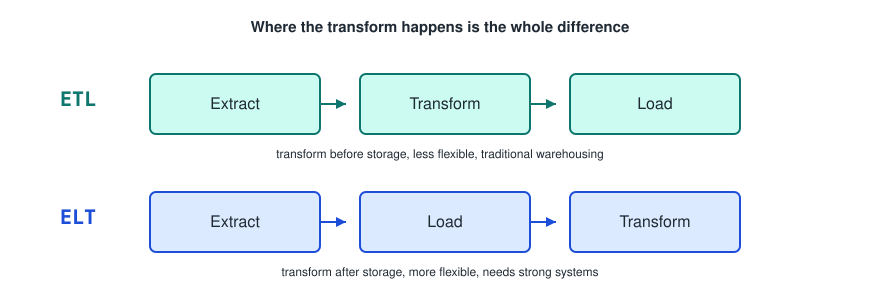

- **ETL**, Extract Transform Load. The transformation happens before storage, so it has less flexibility. Used for traditional data warehousing.
- **ELT**, Extract Load Transform. The transformation happens after storage, so it has more flexibility, but it also requires strong and reliable systems. Used for big data analytics and cloud data platforms.

ELT only became normal once storage got cheap. If you can afford to keep the raw data, you can decide what to do with it later, and that is the flexibility being described.

---

## Types Of Transformations

Four categories, and it is worth knowing which one you are doing.

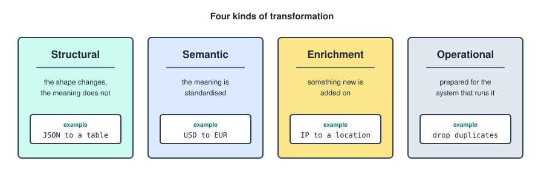

---

## Structural Transformation

Changes the format or structure of the data without changing its meaning.

- Converting JSON to a table.
- Splitting a column.
- Changing a date format, `23-3` to `3-23`.
- Reshaping tables.

---

## Semantic Transformation

Changes or standardizes the meaning or interpretation of data so it becomes consistent.

- Changing currencies, USD to EUR.
- Converting values, `Male` to `M`.

---

## Enrichment Transformation

Adds additional information to existing data to make it more useful.

- Joining external APIs or internal datasets.
- Adding location data based on IP addresses.

---

## Operational Transformation

Prepares data for operational use, performance, or system requirements.

- Filtering unnecessary records.
- Removing duplicates.
- Hashing IDs.
- Generating keys.

---

## Stateless And Stateful Processing

- **Stateless** means each record can be processed independently, without remembering previous records.
- **Stateful** means the output depends on previous events.

Stateless is the easy case, because any worker can pick up any record. Stateful is where the hard parts of streaming live, since something has to hold the running total.

---

## Data Layers Overview

The three layer convention, often called the medallion architecture.

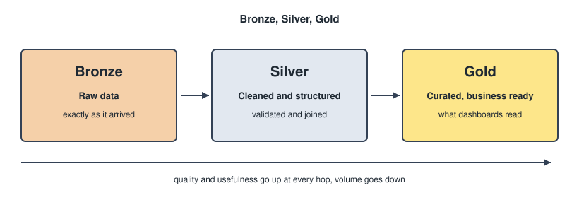

- **Bronze** is raw data.
- **Silver** is cleaned and structured.
- **Gold** is curated and business ready.

---

## Data Modelling

Data modelling is the process of structuring data for efficient storage, retrieval, and analysis. It helps in understanding data requirements and ensuring data integrity.

---

## Types Of Data Models

The same data, described at three levels of detail.

- **Conceptual data model**, the entities and how they relate, no technical detail. Customers place orders.
- **Logical data model**, the attributes, the keys, and the relationships, still independent of any database.
- **Physical data model**, the actual tables, column types, and indexes in the database you are using.

---

## Dimensional Modelling

A data modelling technique used in data warehouses to organize data so it is easy to query and analyze.

- It structures data into **facts** and **dimensions**.
- Facts are measurable events.
- Dimensions are the descriptive context about those events.

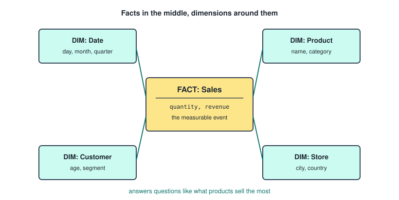

It helps answer business questions like what products sell the most.

```sql
SELECT p.category, SUM(f.revenue) AS total
FROM fact_sales f
JOIN dim_product p ON f.product_id = p.product_id
GROUP BY p.category
ORDER BY total DESC;
```

One fact table in the middle, dimensions hanging off it, and every question becomes a join plus a group by.

---

## Data Normalization

The process of organizing tables to reduce duplicate data and prevent errors.

- **Rule 1, 1NF**: no duplicate columns, and columns contain one value per cell.
- **Rule 2, 2NF**: no partial dependencies, every non key column must depend on the entire primary key, not just part of it.
- **Rule 3, 3NF**: no transitive dependencies, a non key column should depend only on the primary key, not on another non key column.
- **Rule 4, BCNF**: a stronger version of rule 3, every dependency must come from a super key, which is a key that uniquely identifies rows.

Rule 2 only ever bites when the primary key is made of more than one column, since a single column key cannot be partially depended on.

Worth knowing the tension here. Normalization is what you want in the systems that write data, because duplication is what causes errors. Dimensional modelling deliberately denormalizes, because in a warehouse you are reading far more than writing and joins cost you.

---

## Data Organization

The method of arranging data in a structured format to facilitate efficient access and analysis.

- **Hierarchical organization**, a tree like structure with parent child relationships, XML.
- **Relational organization**, tables with rows, columns, and relationships, MySQL.
- **Network organization**, complex relations between data nodes, network databases.
- **Object oriented organization**, grouping data into objects.

---

## Data Quality

The condition of data based on factors such as accuracy, completeness, reliability, and relevance.

---

## Dimensions Of Data Quality

- **Accuracy**: data correctly represents the real world values.
- **Completeness**: all required data is present.
- **Consistency**: data is consistent across different datasets.
- **Reliability**: data is valid and trustworthy.
- **Timeliness**: data is up to date and available when needed.
- **Uniqueness**: data should be distinct.

---

## Data Profiling

The analysis of a dataset to understand its structure, content, and quality before using it.

---

## Data Monitoring

The continuous tracking of data pipelines and datasets after they are running.

Profiling happens once, before you trust the data. Monitoring never stops, because the data keeps arriving and the thing that was true last month may not be true today.

---

## Types Of Data Validation

- **Syntax and format validation**, does it look like an email address.
- **Presence validation**, are the required fields there.
- **Range validation**, is the age between 0 and 120.
- **Uniqueness validation**, has this ID already been seen.
- **Data type validation**, is this actually a number.
- **Semantic and consistency validation**, is the end date after the start date.
- **Referential integrity**, does this foreign key point at a row that exists.

---

## Validation Pipeline Architecture

A clean way to split the work is one class per job.

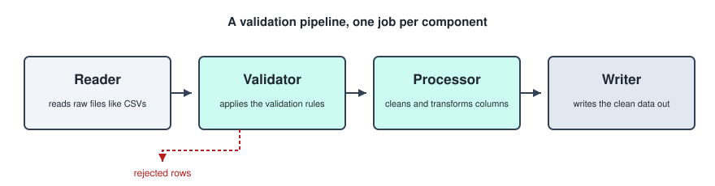

- **Reader** reads raw files like CSVs.
- **Validator** applies the validation rules.
- **Processor** cleans data and transforms columns.
- **Writer** writes the clean data.

```python
rows = Reader("orders.csv").read()
good, bad = Validator(rules).split(rows)
clean = Processor().run(good)
Writer("orders_clean.parquet").write(clean)
```

The rows that fail do not disappear, they go somewhere you can look at them. A pipeline that silently drops bad rows is worse than one that crashes.

---

## Principles Of Scalable Pipelines

- **Modularity**: breaking a pipeline into separate, independent stages, which typically consist of ingestion, transformation, and storage.
- **Parallelization**: processing multiple pieces of data simultaneously to increase speed and scalability, useful for big datasets.
- **Fault tolerance**: the pipeline continues working even when something fails.
- **Reusability**: creating standard components that can be reused across multiple pipelines.
- **Documentation**: pipelines should be tracked using version control systems like git.

---

## Parallel Processing Techniques

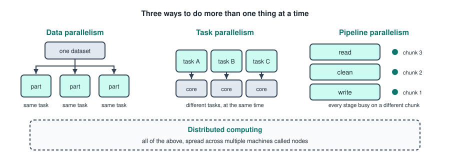

- **Data parallelism**: splitting a dataset into smaller partitions and processing each partition simultaneously.
- **Task parallelism**: running different tasks at the same time, often on different processors or threads.
- **Pipeline parallelism**: dividing a process into multiple stages, where each stage works at the same time on different pieces of data.
- **Distributed computing**: spreading tasks across multiple machines, called nodes.

---

## Schedule Intervals

When writing pipelines, cron notation is needed for time scheduling. Five fields, in this order.

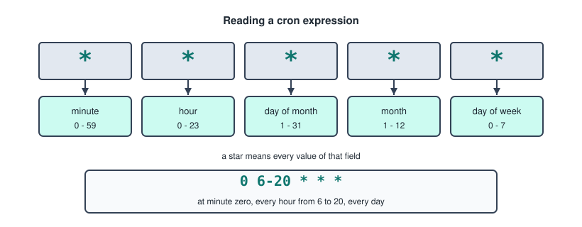

```
*     *     *     *     *
|     |     |     |     |
|     |     |     |     +--- day of week    0 - 7
|     |     |     +--------- month          1 - 12
|     |     +--------------- day of month   1 - 31
|     +--------------------- hour           0 - 23
+--------------------------- minute         0 - 59
```

For day of week, both `0` and `7` mean Sunday.

Some common ones.
```
0 0 1 */3 *      quarterly, midnight on the first day of every third month
0 */4 * * *      every 4 hours, on the hour
0 6-20 * * *     every hour from 6 to 20
30 2 * * 1       every Monday at 02:30
```

The field that catches people out is the first one. Leaving the minute as `*` does not mean "once", it means every minute of the window you just described, so `* */4 * * *` runs 60 times every fourth hour rather than once. Pin the minute to `0` unless you actually want that.

---

## Big Data And Cloud Data

- **Big data** is extremely large datasets that cannot use traditional data processing tools.
- **Cloud data engineering** is designing, building, and managing data pipelines in the cloud. It is cost efficient, because it reduces infrastructure costs.

---

## The Big Data 5 Vs

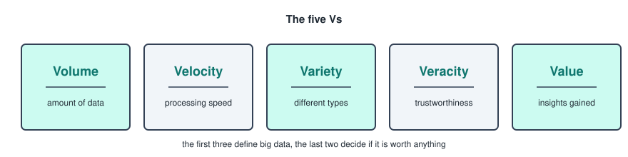

- **Volume**: amount of data.
- **Velocity**: processing speed.
- **Variety**: different types of data.
- **Veracity**: trustworthiness of data.
- **Value**: potential insights gained.

---

## Big Data Processing Frameworks

- **Hadoop**: old, open source, the foundational framework that modern frameworks were built on top of. Storage through HDFS, processing through MapReduce, which wrote to disk between every step.
- **Apache Spark**: in memory distributed processing, which is exactly why it replaced MapReduce for most work. Batch, streaming, and ML.
- **Apache Flink**: real time, low latency processing. Real time, IoT, fraud detection.
- **Apache Kafka**: distributed event streaming platform. Ingestion and real time pipelines.

Kafka is not really in the same category as the other three. It moves the events, the others process them, which is why it usually sits in front of Spark or Flink rather than instead of them.

---

## Data Lifecycle

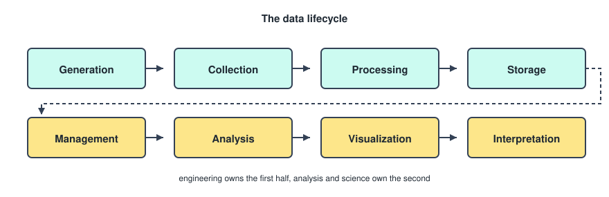

- Generation
- Collection
- Processing
- Storage
- Management
- Analysis
- Visualization
- Interpretation

---

## Cloud Providers

- **AWS**: efficient data management and analytics in the cloud.
- **Azure**: blob storage, integration with Microsoft products.
- **Google Cloud**: scalable, good for ML and data analytics.

---
