# Neural Networks

Notes from the **AI Applications** workshop "Neural Networks in action" (UCLL, 2026-2027). It starts from the very basics (what a single neuron does) and builds up to training, evaluating and tuning a real network in **Keras** on the **MNIST** handwritten digit dataset.

The workshop is really one long experiment: build a network, see it **overfit**, then try one fix after another. So these notes follow the same path, but explain the theory behind every step first.

---

## From Rules to Learning

Classic programming means writing the rules yourself: "if the image has a vertical line and a horizontal line at the top, it is a 7". That breaks immediately, because everybody writes a 7 differently. **Machine learning** flips it around: you give the computer thousands of examples with the right answer (**labels**), and it figures out the rules itself.

A **neural network** is one family of machine learning models, loosely inspired by neurons in the brain. It is especially strong for data where the useful patterns are hard to describe by hand: images, sound and text.

### Where Neural Networks Fit

Neural networks are **supervised learning** models here: every training image comes with its label. Recognising a digit is a **classification** problem with 10 classes (0 to 9).

| Approach | You provide | The computer produces |
| --- | --- | --- |
| **Classic programming** | Rules + data | Answers |
| **Machine learning** | Data + answers | Rules (a trained model) |

For tabular data (spreadsheets) simpler models like random forests or gradient boosting often win. For images, audio and text, neural networks are the default choice. These days you would usually start from a **pretrained** network instead of training from scratch, but you can only use those well if you understand the fundamentals in this note.

---

## The Building Blocks

A neural network looks complicated, but it is made of one tiny unit repeated thousands of times: the **neuron**. Understand one neuron and you understand the whole network.

### The Neuron

A neuron takes a list of inputs, multiplies each one by a **weight**, adds everything up, adds a **bias**, and passes the result through an **activation function**.

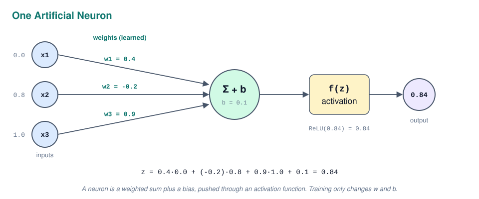

Written as a formula, with `z` as the weighted sum:

```text
z      = w1·x1 + w2·x2 + w3·x3 + b
output = f(z)
```

The **weights** say how important each input is (a negative weight means "this input argues against"). The **bias** shifts the result up or down, like the intercept in linear regression. That comparison is not an accident: without the activation function, a neuron *is* a linear regression. Weights and bias together are the **parameters** of the network, and they are the only things that change during training.

### Activation Functions

The activation function decides what the neuron passes on. It has to be **non linear**, and that is the most important "why" in this whole note: stacking linear functions just gives another linear function, so a network of 100 linear layers could still only draw straight lines. The non linearity is what lets a network learn curves, then shapes, then whole digits.

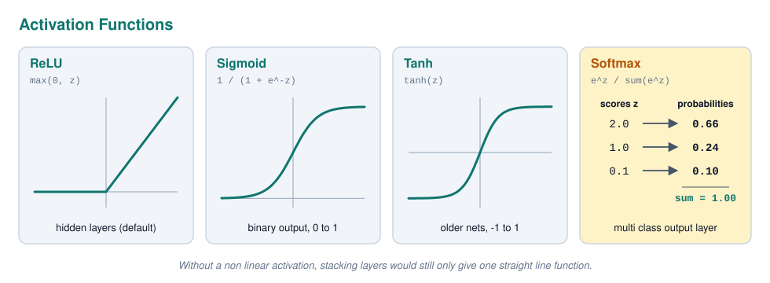

| Activation | Output range | Where it is used | Why |
| --- | --- | --- | --- |
| **ReLU** | 0 to infinity | Hidden layers | Simple, fast, and gradients do not shrink for positive values |
| **Sigmoid** | 0 to 1 | Output for **binary** classification | Turns a score into one probability |
| **Tanh** | -1 to 1 | Older networks, some recurrent layers | Like sigmoid but centred on 0 |
| **Softmax** | 0 to 1, all outputs sum to 1 | Output for **multi class** classification | Turns 10 scores into 10 probabilities |

The workshop rule of thumb: `relu` in the hidden layers, `softmax` in the last layer of a classifier.

### Layers

Neurons are organised in **layers**. The **input layer** is just the data. The **hidden layers** do the learning. The **output layer** gives the answer, with one neuron per class for classification.

The workshop uses **Dense** layers (also called **fully connected** layers): every neuron is connected to every value of the layer before it. A network of only Dense layers is called an **MLP** (Multi Layer Perceptron).

Dense layers expect a flat list of numbers, but an MNIST image is a 28 x 28 grid. The **Flatten** layer unrolls it into 784 values in a row. It has no weights; it only reshapes.

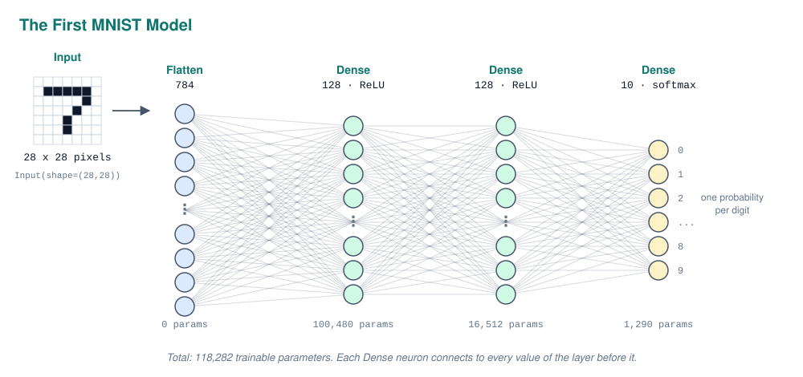

### Counting Parameters

Being able to count parameters by hand proves you understand what a Dense layer does. Each neuron has one weight per input plus one bias:

```text
parameters = inputs × neurons + neurons
```

For the first workshop model:

| Layer | Calculation | Parameters |
| --- | --- | --- |
| `Flatten` | only reshapes | 0 |
| `Dense(128)` | 784 × 128 + 128 | 100,480 |
| `Dense(128)` | 128 × 128 + 128 | 16,512 |
| `Dense(10)` | 128 × 10 + 10 | 1,290 |
| **Total** | | **118,282** |

Notice that the first layer holds 85% of all parameters. Every pixel connects to every neuron, which is exactly why Dense networks get huge on bigger images and why **convolutional networks** (CNNs) exist for computer vision.

---

## How a Network Learns

At the start, all weights are random, so the network guesses. **Training** is the process of nudging those 118,282 numbers, a tiny bit at a time, until the guesses become good. It needs three ingredients: a way to measure how wrong the network is (**loss**), a way to know which direction to change each weight (**gradients**), and a rule for how big a step to take (**optimizer** and **learning rate**).

### The Loss Function

The **loss** is one number that says how wrong the predictions are. Training means making it as small as possible. For classification the standard loss is **cross entropy**: it looks at the probability the network gave to the *correct* class and punishes low values hard.

```text
loss = -ln(probability of the correct class)

correct digit 7, network says P(7) = 0.89   ->  loss = 0.12
correct digit 7, network says P(7) = 0.10   ->  loss = 2.30
```

A nice sanity check: an untrained network that spreads its guess evenly over 10 classes gives each one 0.1, so the first loss you see should be around `ln(10) ≈ 2.3`.

Keras has two versions, and the only difference is the label format:

| Loss | Labels look like | Example label for "3" |
| --- | --- | --- |
| `sparse_categorical_crossentropy` | plain integers | `3` |
| `categorical_crossentropy` | **one hot encoded** vectors | `[0,0,0,1,0,0,0,0,0,0]` |

MNIST gives integer labels, so the workshop uses the **sparse** version. For regression you would use `mse` instead.

### Gradient Descent

Imagine standing on a mountain in thick fog, trying to reach the valley. You cannot see the valley, but you can feel the slope under your feet, so you take a small step downhill, feel again, and repeat. That is **gradient descent**. The mountain is the loss, your position is the current weights, and the slope is the **gradient**.

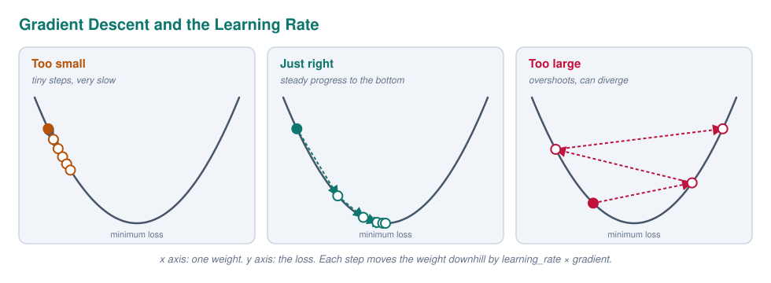

Each update moves every weight a little against its gradient:

```text
new_weight = old_weight - learning_rate × gradient
```

The **learning rate** is the step size, and it is the most important hyperparameter to get right. Too small and training takes forever. Too large and you jump over the valley, and the loss bounces around or even explodes.

### Backpropagation

The network has thousands of weights, so how does it know the gradient of each one? **Backpropagation** works it out by going backwards through the network with the chain rule from calculus: the output layer's error is split up over the weights that caused it, then passed back to the layer before, and so on. You never write this yourself; Keras does it automatically. What matters is the cycle:

1. **Forward pass**: push a batch of images through the network and get predictions
2. **Loss**: compare the predictions with the labels
3. **Backward pass**: backpropagation computes the gradient of every weight
4. **Update**: the optimizer nudges every weight

### Batches, Steps and Epochs

Computing the gradient on all 48,000 training images before every single step would be slow. Updating after every single image would be fast but very noisy. The middle road is the **mini batch**: compute the gradient on a small group of images, then update.

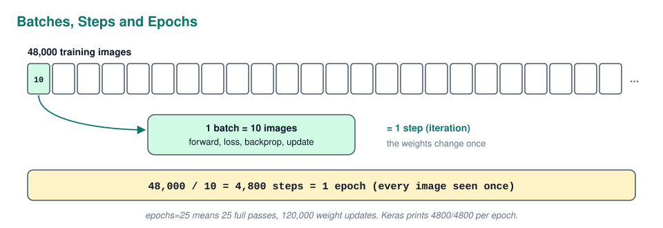

| Term | Meaning | In the workshop |
| --- | --- | --- |
| **Batch size** | Images used for one gradient calculation | `batch_size=10` |
| **Step / iteration** | One weight update | 48,000 / 10 = 4,800 per epoch |
| **Epoch** | One full pass over the training data | `epochs=25` |

The workshop notes the trade off: a **larger** batch is faster per epoch and uses more memory, with gradients that are smoother but a higher tendency to overfit. A **smaller** batch is slower and noisier, but that noise actually helps the network avoid memorising. A batch size of 1 is the original **stochastic gradient descent** (SGD).

### Optimizers

The **optimizer** is the rule that applies the update. Plain **SGD** uses the formula above with one fixed learning rate. **Adam** is an improved version that keeps a running average of past gradients (**momentum**, so it keeps rolling in a consistent direction) and adapts the step size per weight. It works well out of the box, which is why it is the default choice.

The workshop uses `Adam` with `learning_rate=3e-4` (0.0003). That exact value is a well known safe starting point, not a magic number. Tune it later if the loss curve looks too slow or too jumpy.

---

## Tensors, TensorFlow and Keras

Before writing code, it helps to know what the libraries are and what kind of data they push around.

### What Is a Tensor

A **tensor** is just an array with any number of dimensions. The number of dimensions is its **rank**, and the size along each dimension is its **shape**.

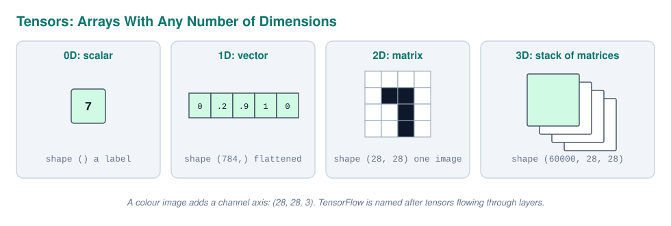

| Rank | Name | MNIST example | Shape |
| --- | --- | --- | --- |
| 0 | Scalar | one label | `()` |
| 1 | Vector | one flattened image | `(784,)` |
| 2 | Matrix | one image | `(28, 28)` |
| 3 | 3D tensor | the whole training set | `(60000, 28, 28)` |
| 4 | 4D tensor | a batch of colour images | `(32, 28, 28, 3)` |

MNIST images are **grayscale**, so there is one value per pixel (0 is black, 255 is white). A colour image has three values per pixel (red, green, blue), which adds a **channel** dimension.

### TensorFlow, Keras and PyTorch

**TensorFlow** is Google's library for running tensor maths fast, on CPU or GPU, including the automatic gradient calculation that backpropagation needs. **Keras** is the high level API on top of it: you describe layers and Keras handles the maths. Since Keras 3 it can also run on top of **PyTorch** or **JAX**.

| Library | Made by | Style | Common in |
| --- | --- | --- | --- |
| **Keras** | Google | High level, few lines per model | Learning, quick prototypes, this course |
| **TensorFlow** | Google | Lower level engine under Keras | Production, mobile (TF Lite) |
| **PyTorch** | Meta | Pythonic, write your own training loop | Research, most new models and papers |

The concepts in this note are identical in every framework; only the syntax changes.

### The Imports

The workshop needs Keras for the network, NumPy for arrays, scikit-learn for splitting and metrics, and Matplotlib and Seaborn for plots.

```python
import keras
import numpy as np
import matplotlib.pyplot as plt
import seaborn as sns
from sklearn.model_selection import train_test_split
from sklearn.metrics import confusion_matrix, f1_score, accuracy_score
```

---

## Preparing the MNIST Data

**MNIST** is a dataset of 70,000 handwritten digits, 28 x 28 pixels each. It is the "hello world" of deep learning: small, clean and already labelled. Real data is never this clean, so in a real project you would spend a lot of time looking through *all* the data and cleaning it before training anything.

### Loading the Data

Keras can download MNIST directly, already split into a training set of 60,000 images and a test set of 10,000.

```python
mnist = keras.datasets.mnist
(x_train, y_train), (x_test, y_test) = mnist.load_data()

x_train[0].shape
```

This returns `(28, 28)`: one image is a 2D grid. `x_train` as a whole has shape `(60000, 28, 28)` and `y_train` holds the digits as integers.

### Looking at the Data

Always look at examples before training. A grid of the first 25 images with their labels is a quick check that images and labels match.

```python
fig, axes = plt.subplots(nrows=5, ncols=5, figsize=(10, 10))
for i, ax in enumerate(axes.flat):
    ax.imshow(x_train[i], cmap="gray")
    ax.set_title(f"Digit: {y_train[i]}")
    ax.set_xticks([])
    ax.set_yticks([])
plt.show()
```

Without `cmap="gray"`, `imshow` uses its default **viridis** colour map, which is why grayscale images show up in purple and yellow. The data is the same, only the colouring differs.

### Train, Validation and Test

The model needs three separate sets, each with its own job. The **training set** is used to learn the weights. The **validation set** is checked after every epoch to see how the model does on data it did not learn from, and to compare different models. The **test set** is the final exam, used once at the end.

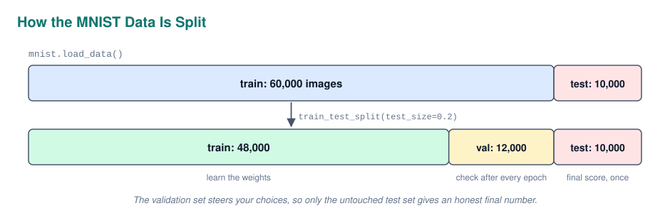

Keras already gives a test set, so the workshop splits 20% off the training set for validation:

```python
x_train, x_val, y_train, y_val = train_test_split(
    x_train, y_train, test_size=0.2, random_state=42
)
```

That leaves **48,000** training, **12,000** validation and **10,000** test images. Why not just use the test set for validation? Because every time you pick a model or a setting based on a score, that data starts to influence your choices. If you tune on the test set, the final score is no longer an honest measure of how the model does on truly new data.

### Normalising the Inputs

Pixel values run from 0 to 255. Neural networks train much better when inputs are small and on a similar scale: large inputs lead to large weighted sums, unstable gradients and slow learning. Dividing by 255 squeezes every pixel into the range 0 to 1.

```python
x_train, x_val, x_test = x_train / 255.0, x_val / 255.0, x_test / 255.0
```

The image still looks exactly the same when plotted, because only the scale changed, not the relative brightness. The same scaling must be applied to **every** set, and later to every new image you want to predict.

### Seeding for Reproducibility

Many things in training are random: the initial weights, the order of batches, dropout. To get the same result when you rerun the notebook, you **seed** the random generators before building a model.

```python
np.random.seed(42)
keras.utils.set_random_seed(42)
```

`keras.utils.set_random_seed` seeds Python, NumPy and the backend at once. It has to run *before* the model is created, because that is the moment the weights are initialised.

---

## Building a Model With the Sequential API

Keras offers three ways to define a model. The **Sequential API** is the simplest: you give it a list of layers and data flows through them in order, top to bottom.

### Defining the Layers

This is the first workshop model, the one from the diagram above:

```python
firstModel = keras.models.Sequential([
    keras.layers.Input(shape=(28, 28)),
    keras.layers.Flatten(),
    keras.layers.Dense(units=128, activation="relu"),
    keras.layers.Dense(units=128, activation="relu"),
    keras.layers.Dense(units=10, activation="softmax"),
])
```

`Input` declares the shape of **one** sample, without the batch size. `units` is the number of neurons. The last layer has exactly 10 neurons because there are 10 classes, and `softmax` makes their outputs probabilities.

The same model can also be built step by step with `.add()`, which is handy when you build layers in a loop:

```python
model = keras.models.Sequential()
model.add(keras.layers.Input(shape=(28, 28)))
model.add(keras.layers.Flatten())
model.add(keras.layers.Dense(128, activation="relu"))
model.add(keras.layers.Dense(10, activation="softmax"))
```

### Inspecting the Model

`model.summary()` prints the layers, their output shapes and their parameter counts. This is the first thing to check after building a model.

```python
firstModel.summary()
```

The output (simplified) matches the hand calculation from earlier:

```text
Layer (type)          Output Shape     Param #
flatten (Flatten)     (None, 784)      0
dense (Dense)         (None, 128)      100,480
dense_1 (Dense)       (None, 128)      16,512
dense_2 (Dense)       (None, 10)       1,290
Total params: 118,282
```

The `None` in every output shape is the **batch dimension**. It is left open because the model can process any number of images at once.

For a picture instead of text, `plot_model` draws the architecture. It needs the extra packages `pydot` and `graphviz`.

```python
from keras.utils import plot_model
plot_model(firstModel, show_shapes=True, show_layer_names=True)
```

### Compiling

Before training, the model needs to know *how* to learn. `compile()` sets the three ingredients from the theory section: the optimizer, the loss and the metrics.

```python
firstModel.compile(
    optimizer=keras.optimizers.Adam(learning_rate=3e-4),
    loss="sparse_categorical_crossentropy",
    metrics=["accuracy"],
)
```

The **loss** is what the network actually minimises. The **metrics** are only reported for you, humans, to read. Accuracy is easy to understand, but the network never optimises it directly because it is not smooth enough to compute gradients on.

---

## Training and Reading the History

Training happens with `fit()`, just like in scikit-learn. The difference is that a neural network trains over many epochs, and you can watch it learn (or fail to learn) epoch by epoch.

### Fitting the Model

The workshop first trains on only the first 1,000 images on purpose, to make overfitting easy to see:

```python
history = firstModel.fit(
    x_train[:1000], y_train[:1000],
    epochs=25,
    batch_size=10,
    validation_data=(x_val[:200], y_val[:200]),
)
```

After every epoch Keras prints the training loss and accuracy, plus `val_loss` and `val_accuracy` on the validation data. The model never learns from the validation data; it is only evaluated on it.

Instead of making the validation set yourself, Keras can split it off automatically with `validation_split`. The workshop prefers its own split to control exactly which images are used.

```python
history = firstModel.fit(x_train[:1000], y_train[:1000], epochs=25, batch_size=10, validation_split=0.2)
```

A useful tip: you can interrupt a training cell at any time. The model keeps the weights from the last completed step, so you can still use it in the next cells.

### The History Object

`fit()` returns a `History` object. Its `.history` attribute is a dictionary with one list per metric, one value per epoch:

```python
history.history.keys()
```

This gives `loss`, `accuracy`, `val_loss` and `val_accuracy`. Plotting these is the single most useful thing you can do after training, so the workshop wraps it in a function:

```python
def plotTrainingHistory(history):
    fig, (ax1, ax2) = plt.subplots(1, 2, figsize=(16, 6))
    ax1.plot(history.history["loss"], label="train")
    ax1.plot(history.history["val_loss"], label="val")
    ax1.set_title("Model Loss")
    ax1.legend()
    ax2.plot(history.history["accuracy"], label="train")
    ax2.plot(history.history["val_accuracy"], label="val")
    ax2.set_title("Model Accuracy")
    ax2.legend()
    plt.tight_layout()
    plt.show()

plotTrainingHistory(history)
```

### Reading the Curves

With only 1,000 training images and 118,282 parameters, the network has far more capacity than it needs. It can simply memorise every training image. That shows up as a typical pattern:

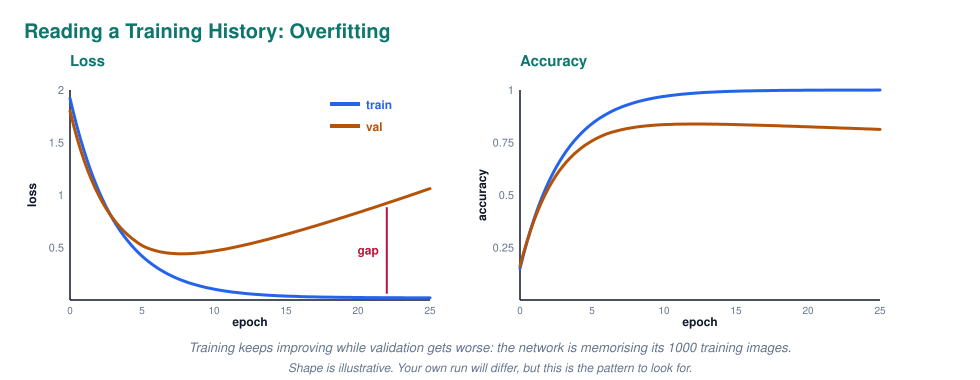

| What you see | Diagnosis |
| --- | --- |
| Training loss keeps falling towards 0 | The network is fitting the training data better and better |
| Validation loss falls, then rises again | From that point it is memorising instead of learning general patterns |
| Training accuracy near 100%, validation clearly lower | The **gap** between them is the clearest sign of **overfitting** |
| Both losses high and flat | **Underfitting**: the model is too simple or trains too briefly |
| Both fall and stay close together | A good fit |

Overfitting is like a student who memorises the answers of the practice exam word for word. Perfect on the practice exam, lost on the real one.

---

## Evaluating the Model

The loss curves tell you how training went. To know how good the model really is, you make predictions and compare them to the true labels with proper metrics.

### From Probabilities to Classes

`model.predict()` returns 10 probabilities per image. The predicted digit is the position of the highest one, which `np.argmax` finds. `axis=1` means "look across the 10 columns of each row".

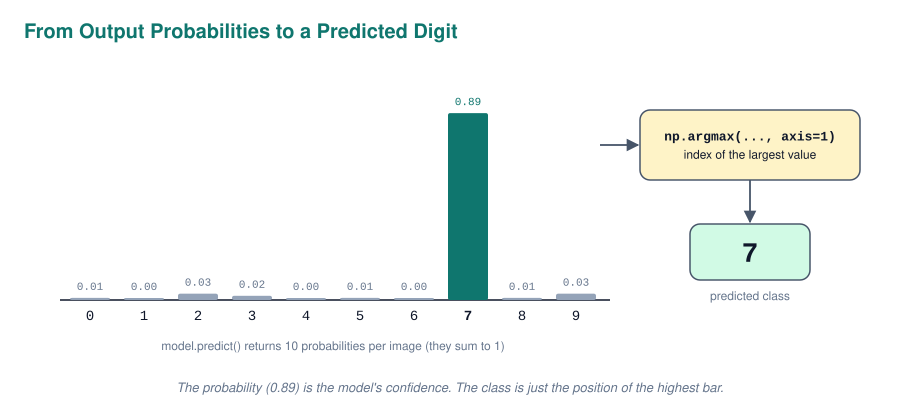

In code, that is one line for a whole set of images:

```python
y_val_pred = np.argmax(firstModel.predict(x_val), axis=1)
```

### Accuracy, F1 and the Confusion Matrix

The workshop wraps the evaluation in a reusable function that draws a **confusion matrix** and prints **accuracy** and **macro F1**:

```python
def displayPerformanceFigures(real, pred, title, includeCF=True):
    if includeCF:
        cm = confusion_matrix(real, pred)
        sns.heatmap(cm, annot=True, fmt="d", cmap="Blues")
        plt.xlabel("Predicted labels")
        plt.ylabel("True labels")
        plt.title("Confusion Matrix for " + title)
        plt.show()
    acc = accuracy_score(real, pred)
    f1 = f1_score(real, pred, average="macro")
    print({"acc": round(acc, 3), "f1": round(f1, 3)})

displayPerformanceFigures(y_val, y_val_pred, "validation samples")
```

How to read the outputs:

- **Confusion matrix**: a 10 x 10 grid with true digits as rows and predicted digits as columns. The **diagonal** holds the correct predictions. Any large number off the diagonal shows which digits get confused, typically 4 and 9, 3 and 5, or 7 and 1
- **Accuracy**: the share of images classified correctly
- **Macro F1**: the F1 score (balance of precision and recall) calculated per digit and then averaged, so every digit counts equally. MNIST is roughly balanced, so it ends up close to accuracy here, but on imbalanced data the two can differ a lot

### Training, Validation and Test Scores

The workshop evaluates the same model on three sets, and the comparison is the lesson:

| Evaluated on | What it tells you |
| --- | --- |
| **Training data** | How well it memorised. Almost always near perfect. Do this once to see it, then never again |
| **Validation data** | How it generalises. Used to compare models and settings |
| **Test data** | The honest final score on data never used for any decision |

A big drop from training to validation or test is overfitting in numbers. Training scores should never be reported as the model's performance.

### Using evaluate()

`model.evaluate()` does the prediction and calculates the loss and compiled metrics in one call. It is quicker, but only gives the metrics you compiled with, so no F1 or confusion matrix.

```python
test_loss, test_acc = firstModel.evaluate(x_test, y_test)
```

---

## Fighting Overfitting

The rest of the workshop tries one fix after another, always changing **one thing at a time** so you can see what each change does. All of them attack overfitting from a different angle: give the network less room to memorise, or make memorising harder.

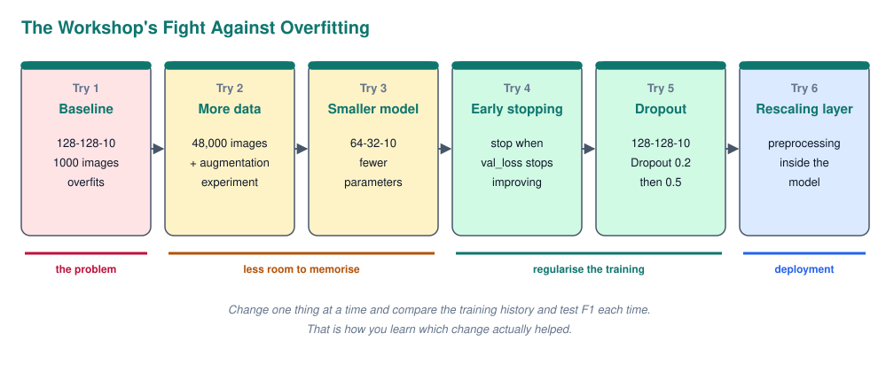

### More Data

The most effective fix is the simplest: more examples make memorising harder and force the network to learn general patterns. The workshop rebuilds the same architecture and trains it on all 48,000 images.

```python
firstModel = keras.models.Sequential([
    keras.layers.Input(shape=(28, 28)),
    keras.layers.Flatten(),
    keras.layers.Dense(128, activation="relu"),
    keras.layers.Dense(128, activation="relu"),
    keras.layers.Dense(10, activation="softmax"),
])
firstModel.compile(optimizer=keras.optimizers.Adam(learning_rate=3e-4),
                   loss="sparse_categorical_crossentropy", metrics=["accuracy"])

history = firstModel.fit(x_train, y_train, epochs=15, batch_size=10,
                         validation_data=(x_val, y_val))
```

The model is **redefined**, not just recompiled. Recompiling keeps the trained weights, so you would continue from the previous model and the comparison would be unfair. Only creating new layers resets the weights.

With 48 times more data the gap between training and validation shrinks a lot. A simple Dense network like this typically ends up around 97 to 98% test accuracy on MNIST.

### Data Augmentation

When you cannot get more data, you can create more: **data augmentation** makes slightly changed copies of the training images (rotated, shifted, zoomed, flipped) that keep the same label. Keras does this with special layers at the start of the model. They are only active during `fit()`, and do nothing at prediction time.

```python
firstModelwithDA = keras.models.Sequential([
    keras.layers.Input(shape=(28, 28)),
    keras.layers.RandomFlip("horizontal"),
    keras.layers.RandomRotation(0.05),
    keras.layers.Flatten(),
    keras.layers.Dense(128, activation="relu"),
    keras.layers.Dense(128, activation="relu"),
    keras.layers.Dense(10, activation="softmax"),
])
```

The workshop asks whether this works for digits, and the answer is "not this combination":

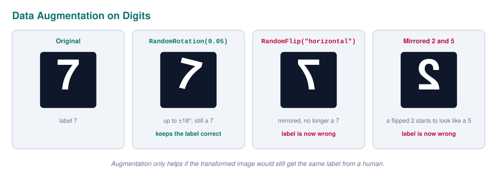

`RandomRotation(0.05)` rotates by up to 5% of a full turn (±18°). A slightly tilted 7 is still a 7, so this is realistic. `RandomFlip("horizontal")` mirrors the image, and a mirrored 7 is not a 7 anymore; a mirrored 2 even starts to look like a 5. The label becomes wrong, so the network is trained on contradicting examples, and performance drops. Flipping is great for photos of cats, not for digits or text.

The rule: **only use augmentations that a human would still label the same way.**

### K Fold Cross Validation

With little data, one validation split can be lucky or unlucky. **K fold cross validation** trains `k` models, each time holding out a different part of the data for validation, and averages the scores. It gives a more reliable estimate of performance, and the `k` models can vote together for a better final prediction. It is rarely used for big neural networks because training `k` networks takes `k` times as long.

### A Smaller Model

Fewer parameters means less room to memorise. The workshop shrinks the hidden layers to 64 and 32 neurons. Powers of 2 (32, 64, 128) are a common convention for layer sizes.

```python
secondModel = keras.models.Sequential([
    keras.layers.Input(shape=(28, 28)),
    keras.layers.Flatten(),
    keras.layers.Dense(64, activation="relu"),
    keras.layers.Dense(32, activation="relu"),
    keras.layers.Dense(10, activation="softmax"),
])
```

This model has **52,650** parameters (784 × 64 + 64, then 64 × 32 + 32, then 32 × 10 + 10), less than half of the first one. Too small, though, and it **underfits**: it cannot even capture the real patterns. Training it for 25 epochs also shows another problem: many of those epochs bring no improvement on validation loss, or even make it worse. That wasted time leads to the next fix.

### Early Stopping

**Early stopping** watches the validation loss during training and stops as soon as it stops improving, then goes back to the best weights it saw.

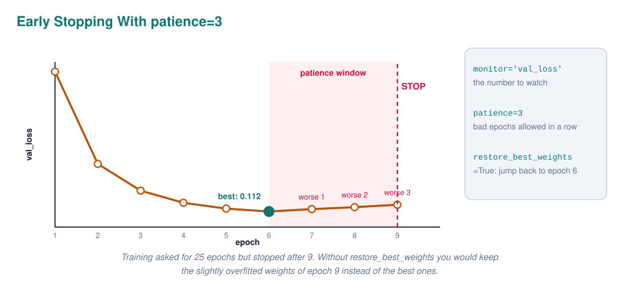

The workshop puts compiling and training in one function with an `EarlyStopping` **callback**. A callback is code Keras runs at certain moments during training, here at the end of every epoch.

```python
def compile_and_train_model(mod, nbepochs=25, pat=3):
    mod.compile(optimizer=keras.optimizers.Adam(learning_rate=3e-4),
                loss="sparse_categorical_crossentropy",
                metrics=["accuracy"])
    callback = keras.callbacks.EarlyStopping(
        monitor="val_loss", patience=pat, restore_best_weights=True
    )
    history = mod.fit(x_train, y_train, epochs=nbepochs, batch_size=10,
                      validation_data=(x_val, y_val), callbacks=[callback])
    return history

history = compile_and_train_model(secondModel)
```

| Argument | Meaning |
| --- | --- |
| `monitor="val_loss"` | The number to watch |
| `patience=3` | How many epochs in a row without improvement are allowed before stopping |
| `restore_best_weights=True` | At the end, load the weights from the best epoch instead of the last one |

`epochs` now becomes a **maximum** instead of a fixed number, so training finishes faster and you get the best model automatically.

The danger of early stopping is stopping **too early**. Validation loss can wobble or flatten for a few epochs and then improve again. A patience that is too small cuts training off during such a temporary plateau, giving an undertrained model. That is why the workshop raises the patience to 6 later when training longer.

### Dropout

**Regularisation** means anything that discourages the model from becoming too complex, like the `C` parameter in support vector machines. For neural networks the easiest one is **Dropout**: during each training step, it randomly switches off a percentage of the neurons in a layer.

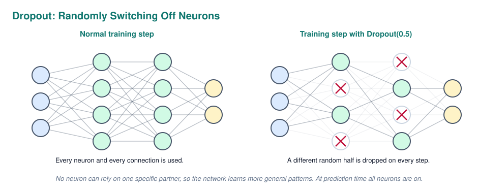

Why does that help? No neuron can rely on one specific partner being there, so each one has to learn something useful on its own, and the network becomes more robust. You can see it as training many slightly different smaller networks at once and averaging them. At prediction time all neurons are on.

The workshop puts a `Dropout` layer after each hidden Dense layer, going back to the bigger 128 and 128 network:

```python
sixthModel = keras.models.Sequential([
    keras.layers.Input(shape=(28, 28)),
    keras.layers.Flatten(),
    keras.layers.Dense(128, activation="relu"),
    keras.layers.Dropout(0.2),
    keras.layers.Dense(128, activation="relu"),
    keras.layers.Dropout(0.2),
    keras.layers.Dense(10, activation="softmax"),
])
history = compile_and_train_model(sixthModel)
```

`Dropout(0.2)` switches off 20% of the neurons of the layer before it. It has no parameters, so the model still has 118,282. A few effects to recognise in the history plot:

- The **training loss is higher** than without dropout, because the network trains with a handicap
- Validation loss can even be **lower than training loss**, because validation runs with all neurons on
- The gap between them is smaller, so the model overfits less and can be bigger without memorising

If it still overfits, raise the rate. The workshop goes to 0.5 with more patience and more epochs:

```python
seventhModel = keras.models.Sequential([
    keras.layers.Input(shape=(28, 28)),
    keras.layers.Flatten(),
    keras.layers.Dense(128, activation="relu"),
    keras.layers.Dropout(0.5),
    keras.layers.Dense(128, activation="relu"),
    keras.layers.Dropout(0.5),
    keras.layers.Dense(10, activation="softmax"),
])
history = compile_and_train_model(seventhModel, nbepochs=40, pat=6)
```

A higher dropout rate learns more slowly, which is exactly why it needs more epochs and more patience.

### L2 Regularisation

The second common way to regularise is **L2 regularisation** (also called **weight decay**). It adds a penalty to the loss for large weights, so the network prefers many small weights over a few huge ones, which gives a smoother, more general function. In Keras it is set per layer:

```python
keras.layers.Dense(
    128, activation="relu",
    kernel_regularizer=keras.regularizers.L2(1e-4),
)
```

The number is the strength of the penalty. Too high and the model underfits.

### Comparing the Techniques

Each technique fixes overfitting in its own way, and in practice they are often combined.

| Technique | Idea | Cost |
| --- | --- | --- |
| **More data** | Harder to memorise more examples | Collecting and labelling data |
| **Data augmentation** | Create realistic variations of existing data | Only valid for label preserving changes |
| **Smaller model** | Less capacity to memorise | Risk of underfitting |
| **Early stopping** | Stop before memorising starts | Risk of stopping too early |
| **Dropout** | Randomly remove neurons during training | Slower training, needs more epochs |
| **L2 regularisation** | Penalise large weights | One more hyperparameter to tune |

A tip from the workshop that works well in practice: start with a network that is big enough to overfit, then add dropout or shrink it step by step until it stops overfitting. That way you know the model has enough capacity for the real pattern.

---

## Preprocessing Inside the Model

So far the images were divided by 255 *before* going into the model. That works, but it means every program that uses the model later must remember to do exactly the same preprocessing. Forget it once and the model silently gives garbage.

### The Rescaling Layer

The solution is to put the preprocessing **inside** the model as a layer. Then the model accepts raw 0 to 255 pixels, and the preprocessing travels with it when you save it.

```python
eightModel = keras.models.Sequential([
    keras.layers.Input(shape=(28, 28)),
    keras.layers.Flatten(),
    keras.layers.Rescaling(scale=1.0 / 127.5, offset=-1),
    keras.layers.Dense(128, activation="relu"),
    keras.layers.Dropout(0.2),
    keras.layers.Dense(128, activation="relu"),
    keras.layers.Dropout(0.2),
    keras.layers.Dense(10, activation="softmax"),
])
```

`Rescaling` computes `pixel × scale + offset`. With `1/127.5` and `-1`, a pixel of 0 becomes -1 and 255 becomes +1, so the inputs are centred around 0. Both 0 to 1 and -1 to 1 work fine; centring on 0 often helps training a little.

### Reloading the Data

Because the model now scales by itself, the workshop reloads MNIST to get the raw pixels back. One catch: reloading only resets `x_train` and `x_test`. The `x_val` from before is still the old, already divided by 255 version, while `x_train` is raw again. Training on 0 to 255 while validating on 0 to 1 gives meaningless validation scores, so split again after reloading:

```python
(x_train, y_train), (x_test, y_test) = keras.datasets.mnist.load_data()
x_train, x_val, y_train, y_val = train_test_split(
    x_train, y_train, test_size=0.2, random_state=42
)
history = compile_and_train_model(eightModel)
```

From this point on, every model in the notebook receives raw pixels. Models without a `Rescaling` layer (like the subclassing example later) will still train, but on unscaled inputs, which is less stable.

---

## The Functional API

The Sequential API can only express a straight line of layers: one input, one output, every layer feeding the next. Real architectures often need more: several inputs (an image plus some numbers), several outputs, or connections that skip layers. That is what the **Functional API** is for.

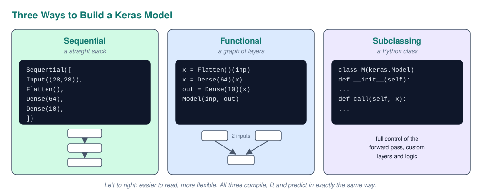

### Calling Layers Like Functions

In the Functional API you create a layer and immediately **call** it on the output of the previous one. Each call returns a new symbolic tensor, and at the end you tell `keras.Model` where the graph starts and ends.

```python
inputs = keras.Input(shape=(28, 28))
x = keras.layers.Flatten()(inputs)
x = keras.layers.Dense(64, activation=keras.activations.relu)(x)
x = keras.layers.Dense(32, activation="relu")(x)
outputs = keras.layers.Dense(10, activation="softmax")(x)

functionalModel = keras.Model(inputs=inputs, outputs=outputs, name="mnist_model")
functionalModel.summary()
```

This is exactly the same network as `secondModel`, with the same 52,650 parameters. The differences are only in how it is written: the input is an explicit `Input` object, every layer is wired by hand, and the model gets an optional name. Activations can be given as a string (`"relu"`) or as the function itself (`keras.activations.relu`).

### A Network With a Bypass

To show what Sequential cannot do, the workshop builds a model where the raw image takes two paths: through a few hidden layers, and directly around them. Both paths are joined with `Concatenate` before the output.

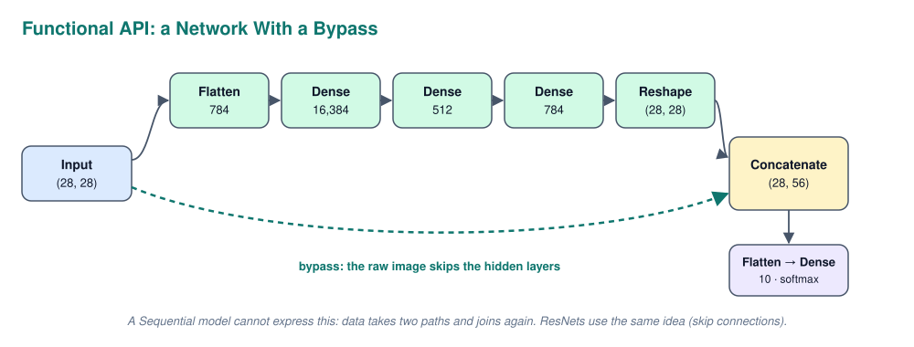

The code wires the two paths by passing `input_` to both `Flatten` and `Concatenate`:

```python
input_ = keras.layers.Input(shape=[28, 28])
flatten = keras.layers.Flatten()(input_)
hidden1 = keras.layers.Dense(2**14, activation="relu")(flatten)
hidden2 = keras.layers.Dense(512, activation="relu")(hidden1)
hidden3 = keras.layers.Dense(28 * 28, activation="relu")(hidden2)
reshap = keras.layers.Reshape((28, 28))(hidden3)
concat_ = keras.layers.Concatenate()([input_, reshap])
flatten2 = keras.layers.Flatten()(concat_)
output = keras.layers.Dense(10, activation="softmax")(flatten2)

functionalModelwithBypass = keras.Model(inputs=[input_], outputs=[output])
```

Two things worth noticing. `Reshape` turns the 784 values back into a 28 x 28 grid so it matches the input, and `Concatenate` glues the two grids side by side on the last axis, giving `(28, 56)`. And this model is enormous: the `Dense(16384)` layer alone has over 12.8 million parameters, about **21.7 million** in total. It is a demonstration of the API, not a good MNIST model.

The idea of letting data skip layers is very real, though: **ResNets** use these **skip connections** to train networks with hundreds of layers.

---

## Model Subclassing

The third option is **subclassing**: you write your own Python class that inherits from `keras.Model`. It gives full control over the forward pass, including loops, conditions and custom layers. Researchers use it to build new layer types; for normal models the other two APIs are easier.

### Writing a Model Class

Layers are created in `__init__`, and the forward pass is written in `call`. The order in `__init__` does not matter; only `call` decides the order in which data flows.

```python
class MNISTmodel(keras.Model):
    def __init__(self):
        super().__init__()
        self.flatten = keras.layers.Flatten()
        self.d1 = keras.layers.Dense(64, activation="relu")
        self.d2 = keras.layers.Dense(32, activation="relu")
        self.d3 = keras.layers.Dense(10, activation="softmax")

    def call(self, x):
        x = self.flatten(x)
        x = self.d1(x)
        x = self.d2(x)
        return self.d3(x)

subclassModel = MNISTmodel()
history = compile_and_train_model(subclassModel, nbepochs=15)
plotTrainingHistory(history)
```

The model has no fixed input shape until it sees its first batch, so `summary()` only works after training (or after calling it once). Compiling, fitting and predicting work exactly the same as with the other two APIs.

### Choosing an API

All three produce models that train and predict the same way, so pick the simplest one that can express your architecture.

| API | Use when | Downside |
| --- | --- | --- |
| **Sequential** | A straight stack of layers | No branches, multiple inputs or outputs |
| **Functional** | Branches, skip connections, multiple inputs or outputs | A bit more code |
| **Subclassing** | Custom layers, loops or logic in the forward pass | Harder to inspect, save and debug |

---

## Hyperparameter Tuning With Optuna

Every choice made so far (number of layers, neurons, dropout rate, learning rate, batch size) was a guess. These choices are **hyperparameters**, and finding good ones is mostly trial and error.

### Parameters vs Hyperparameters

The difference is who sets them.

| | Parameters | Hyperparameters |
| --- | --- | --- |
| **Set by** | Training (gradient descent) | You, before training |
| **Examples** | Weights, biases | Number of layers, neurons per layer, activation, dropout rate, optimizer, learning rate, loss, batch size, epochs |
| **How many** | Thousands to billions | A handful |

The number of possible combinations is huge, and every combination means training a whole network. A full **grid search** with cross validation is usually far too slow for neural networks.

### Manual Tuning Tips

The workshop gives some practical rules for tuning by hand:

- **Change one hyperparameter at a time.** If you add dropout *and* make the network bigger in one go, you cannot tell which change caused the effect
- **Prefer smaller models.** If two models perform almost the same, take the smaller one: it trains faster, predicts faster and is cheaper to run
- **Start big, then shrink.** Begin with a network that overfits, then reduce it or add dropout until it stops overfitting
- **Try simple things first.** Neural networks cost a lot of compute time and engineer time. Use them where they are needed

### How Optuna Works

**Optuna** is a library that organises the search for you. You write an **objective** function that builds, trains and scores a model with suggested hyperparameters. Optuna calls it many times, and each call is a **trial**. The whole search is a **study**.

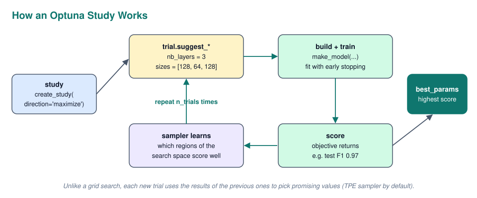

Optuna is smarter than random guessing: its default sampler (**TPE**) looks at the results of earlier trials and suggests values from the regions that scored well. You define the search space inside the objective with the `trial.suggest_*` methods:

| Method | Suggests | Example |
| --- | --- | --- |
| `suggest_categorical(name, choices)` | One value from a list | layer size from `[32, 64, 128]` |
| `suggest_int(name, low, high)` | An integer in a range | number of layers from 1 to 4 |
| `suggest_float(name, low, high, log=True)` | A float, optionally on a log scale | learning rate from `1e-5` to `1e-2` |

### The Workshop Objective

First a helper that builds a model from a list of layer sizes, so the number of layers can vary:

```python
def make_model(layer_sizes):
    inputs = keras.Input(shape=(28, 28))
    x = keras.layers.Flatten()(inputs)
    x = keras.layers.Rescaling(scale=1.0 / 127.5, offset=-1)(x)
    for size in layer_sizes:
        x = keras.layers.Dense(size, activation="relu")(x)
    outputs = keras.layers.Dense(10, activation="softmax")(x)
    return keras.Model(inputs, outputs)
```

The objective then asks Optuna for a number of layers (2 or 3), a size for each layer (32, 64 or 128) and a seed. It trains with early stopping and returns the macro F1 score, which Optuna will try to maximise.

```python
def objective(trial):
    nb_layers = trial.suggest_categorical("nb_layers", [2, 3])
    layer_sizes = [trial.suggest_categorical(f"lay{i}", [32, 64, 128]) for i in range(nb_layers)]
    seed = trial.suggest_int("seed", 1, 46)

    keras.utils.set_random_seed(seed)
    model = make_model(layer_sizes)
    model.compile(optimizer=keras.optimizers.Adam(1e-4),
                  loss="sparse_categorical_crossentropy", metrics=["accuracy"])
    callback = keras.callbacks.EarlyStopping(monitor="val_loss", patience=3)
    model.fit(x_train, y_train, epochs=20, batch_size=10,
              validation_data=(x_val, y_val), callbacks=[callback])

    y_pred = np.argmax(model.predict(x_val), axis=1)
    return f1_score(y_val, y_pred, average="macro")
```

Two things differ from the original notebook on purpose, because the original has two small mistakes worth knowing about:

- The notebook calls `np.random.seed(seed)` **after** building the model. The weights are created when the model is built, and Keras does not take its weight initialisation from NumPy's global seed anyway, so that "seed" hyperparameter does not control the initial weights. Here `keras.utils.set_random_seed` runs **before** `make_model`
- The notebook scores each trial on the **test** set. Picking the best hyperparameters based on test scores means the test set is used for decisions, and the final test score becomes optimistic. Tuning belongs on the **validation** set; the test set is evaluated once with the winning settings

### Running the Study

A study is created with the direction to optimise, then run for a number of trials. Keep `epochs` and `n_trials` small (around 5) while you are just testing that the code works, because each trial trains a full network.

```python
import optuna

study = optuna.create_study(direction="maximize")
study.optimize(objective, n_trials=10)
study.best_params
```

`best_params` returns the winning combination, for example `{"nb_layers": 3, "lay0": 128, "lay1": 64, "lay2": 128, "seed": 17}`. Retrain that configuration and evaluate it once on the test set.

### Reading the Optuna Plots

Optuna comes with interactive Plotly visualisations of the study. In a notebook outside Jupyter Lab you may need `plotly.io.renderers.default = "browser"` to open them in a browser tab.

```python
from optuna.visualization import plot_optimization_history, plot_parallel_coordinate, plot_param_importances

plot_optimization_history(study)
plot_parallel_coordinate(study)
plot_param_importances(study)
```

| Plot | Shows | How to read it |
| --- | --- | --- |
| **Optimization history** | Score of every trial, plus the best so far | If the best line is still climbing at the end, run more trials |
| **Parallel coordinate** | Every trial as a line across all hyperparameters, coloured by score | Follow the best coloured lines to see which values the good trials share |
| **Parameter importances** | How much each hyperparameter influenced the score | Spend future tuning effort on the important ones, fix the rest |

The workshop asks which parameter seems the least important. Usually that is the **seed**: it changes the starting weights, which slightly changes the result, but it does not change what the network is able to learn. If the seed shows up as important, it means the results are noisy and differences between trials are partly luck. Keep in mind that with only 10 trials, importances are a rough estimate.

---

## Where to Go Next: Transfer Learning

Designing and training your own network from scratch, like in this workshop, is the best way to understand how it all works. In practice it is often not the most efficient way.

### Pretrained Models

Today there are many large networks already trained on millions of images. **Transfer learning** takes such a pretrained model, keeps the layers that already recognise general features like edges, textures and shapes, and **fine tunes** only the last layers on your own, much smaller dataset. A few hundred labelled images can then be enough. This is the topic of the next lesson (computer vision), and it is how most real world image projects are built.

---

## Self Check Questions

Try to answer each question in your own words before opening the answers. If you cannot explain it simply, go back to that section.

1. What happens inside one neuron?
2. Why does a neural network need non linear activation functions?
3. Why does the output layer of a digit classifier have 10 neurons with `softmax`?
4. How many parameters does `Dense(64)` have when it follows a `Flatten` of a 28 x 28 image?
5. Why is the loss of an untrained 10 class classifier around 2.3?
6. When do you use `sparse_categorical_crossentropy` instead of `categorical_crossentropy`?
7. What happens if the learning rate is too high? And too low?
8. With 48,000 training images and `batch_size=10`, how many weight updates happen in one epoch?
9. Why divide the pixel values by 255?
10. What does `None` mean in the output shape `(None, 128)`?
11. What do the loss curves look like when a model overfits?
12. Why should you never report the score on the training data?
13. Why must the model be redefined, not only recompiled, before a fair comparison?
14. Why does `RandomFlip("horizontal")` hurt on MNIST while `RandomRotation(0.05)` is fine?
15. What do `patience` and `restore_best_weights` do in `EarlyStopping`?
16. What is the danger of early stopping?
17. Why can validation loss be lower than training loss when using dropout?
18. What is the advantage of a `Rescaling` layer over dividing by 255 yourself?
19. What can the Functional API do that the Sequential API cannot?
20. What is the difference between a parameter and a hyperparameter?
21. Why should an Optuna objective be scored on the validation set and not on the test set?

<details>
<summary>Answers</summary>

1. It multiplies each input by a weight, sums them, adds a bias, and passes the result through an activation function.
2. Without them, any number of layers collapses into one linear function, so the network could only learn straight line relationships.
3. One neuron per digit. Softmax turns the 10 scores into probabilities that sum to 1, and the highest one is the prediction.
4. 784 × 64 + 64 = 50,240.
5. An untrained network spreads its guess evenly, giving each class a probability of 0.1, and the cross entropy loss is `-ln(0.1) ≈ 2.3`.
6. When the labels are plain integers (like MNIST). The non sparse version expects one hot encoded vectors.
7. Too high: the steps jump over the minimum, the loss bounces around or explodes. Too low: training is very slow and may not get anywhere useful in the given epochs.
8. 48,000 / 10 = 4,800.
9. Small inputs on a similar scale keep the weighted sums and gradients stable, so the network trains faster and better.
10. The batch dimension. It is left open so the model can process any number of samples at once.
11. Training loss keeps falling while validation loss falls, then rises again. The gap between them grows.
12. The model has seen those images and may have memorised them, so the score says nothing about how it does on new data.
13. Recompiling keeps the trained weights. Only creating the layers again gives fresh random weights, so both models start from the same point.
14. A mirrored digit is often a different or invalid digit, so the label becomes wrong. A small rotation still looks like the same digit.
15. `patience` is how many epochs in a row without improvement are allowed before stopping. `restore_best_weights` loads the weights from the best epoch instead of keeping the last ones.
16. Stopping too early during a temporary plateau, which leaves the model undertrained. A larger patience reduces that risk.
17. Dropout is only active during training, so the training loss is measured with a handicap, while validation runs with all neurons on.
18. The preprocessing becomes part of the saved model, so nobody can forget it or do it differently when using the model later.
19. Multiple inputs or outputs, branches and skip connections, like the bypass that joins the raw image with the processed one.
20. Parameters (weights and biases) are learned during training. Hyperparameters (layers, neurons, learning rate, dropout rate, batch size) are chosen by you before training.
21. Choosing settings based on test scores turns the test set into a tuning set, so the final test score is no longer an honest estimate on unseen data.

</details>

---

## Quick Recap

- **Machine learning** learns the rules from labelled examples instead of you writing them by hand
- A **neuron** computes a weighted sum plus a bias and passes it through an **activation function**. `relu` in hidden layers, `softmax` for a multi class output
- **Non linear** activations are what let stacked layers learn more than a straight line
- A **Dense** layer connects every input to every neuron: `inputs × neurons + neurons` parameters. The first MNIST model has 118,282
- Training is a loop: **forward pass**, **loss**, **backpropagation**, **update**, over many **batches** and **epochs**
- **Cross entropy** is the loss for classification. Use the **sparse** version for integer labels
- **Gradient descent** steps downhill on the loss. The **learning rate** is the step size, and **Adam** with `3e-4` is a safe start
- A **tensor** is an array with any number of dimensions. **Keras** is the high level API on top of TensorFlow
- Split into **train** (learn), **validation** (compare and tune) and **test** (final score once), and **normalise** the inputs
- Build with `Sequential`, check with `summary()`, then `compile()`, `fit()` and `predict()` plus `np.argmax`
- Read the **history plot**: a growing gap between training and validation means **overfitting**
- Evaluate with a **confusion matrix**, **accuracy** and **macro F1**, on validation and test data, never on training data
- Fight overfitting one change at a time: **more data**, label preserving **augmentation**, a **smaller model**, **early stopping**, **dropout** and **L2 regularisation**
- Put preprocessing **inside the model** with a `Rescaling` layer so it can never be forgotten
- **Sequential** for straight stacks, **Functional** for branches and skip connections, **Subclassing** for full control
- **Hyperparameters** are chosen by you. **Optuna** searches them with trials, a study and a smart sampler. Tune on validation, test once
- In practice, **transfer learning** from a pretrained network is often the fastest route to a good model
