# R Shiny

The R data analysis notes end with a plot or a table sitting in your console. Shiny is what you reach for when someone else needs to play with that analysis without opening R: they move a slider, pick a column, upload a file, and the plot redraws itself. This file goes from the smallest possible app all the way to modules, caching and deployment, and the one idea that ties all of it together is **reactivity**.

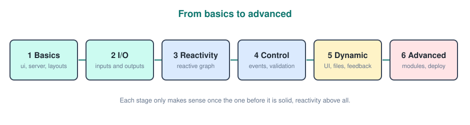

---

## What Shiny Is

**Shiny** is an R package for building interactive web apps using only R. You never write HTML, CSS or JavaScript yourself (though you can if you want to). Shiny generates the web page from R functions, and runs your R code on a server whenever the user changes something.

Why it matters for data science.
- An analysis turns into a **tool**: the manager picks a region from a dropdown instead of asking you to re run the script.
- You reuse everything you already know: `dplyr` for wrangling, `ggplot2` for plots, `read.csv()` for data.
- It is the standard way to build **dashboards** and **model demos** in the R world.

The analogy: a normal R script is a printed report, written once and frozen. A Shiny app is a spreadsheet. Change one cell and everything that depends on it updates by itself.

---

## Installing And Running Your First App

Getting a first app on screen takes four lines, so it is worth doing before any theory.

### Installing

Shiny is a normal CRAN package. `bslib` (modern theming) and `DT` (interactive tables) are worth installing at the same time because later sections use them.

```r
install.packages(c("shiny", "bslib", "DT", "dplyr", "ggplot2"))
```

### The Smallest Possible App

Every Shiny app is made of exactly two things, a **UI** and a **server**, glued together by `shinyApp()`. This one shows a greeting and does nothing else.

```r
library(shiny)

ui <- fluidPage(
  "Hello, Shiny!"
)

server <- function(input, output, session) {
}

shinyApp(ui, server)
```

### Running It

Save the code as `app.R` in its own folder. In RStudio a **Run App** button appears above the editor (shortcut `Ctrl+Shift+Enter`). From the console you can also point `runApp()` at the folder.

```r
shiny::runApp("my-first-app")
```

While the app runs, the R console is busy: you will see `Listening on http://127.0.0.1:XXXX` and cannot type other commands. Press `Esc` (or the stop sign) to stop the app and get the console back.

Shiny also ships with built in examples, which are a fast way to see what is possible.

```r
shiny::runExample("01_hello")
```

### Project Structure

A single `app.R` is the modern default. Older tutorials split the app into `ui.R` and `server.R`, with shared setup in `global.R`. Both work; Shiny detects which style the folder uses.

```text
my-app/
├── app.R          # ui + server + shinyApp()
├── R/             # helper functions and modules, sourced automatically
├── data/          # csv, rds files the app reads
└── www/           # static files: images, custom CSS, JS
```

- Files in `R/` are loaded automatically before the app starts, so you do not need `source()` for them.
- Files in `www/` are served at the root of the site, so `www/logo.png` is referenced as just `"logo.png"`.

---

## How A Shiny App Works

Before writing bigger apps it helps to know what physically happens, because it explains a lot of behavior later on.

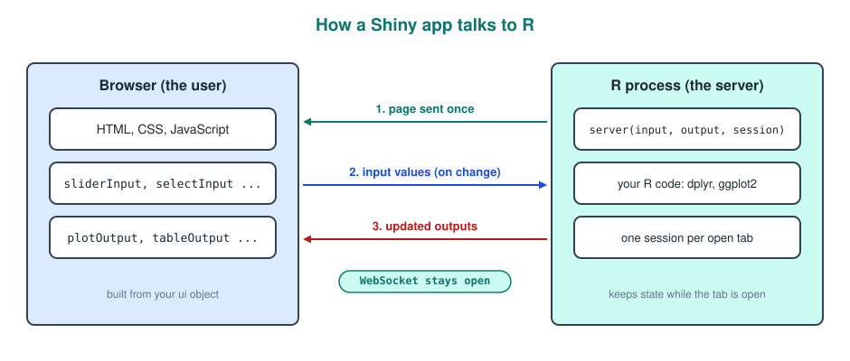

1. When the user opens the URL, Shiny turns your `ui` object into an HTML page and sends it **once**.
2. Every time the user changes an input, the browser sends the new value to R over a **WebSocket** (a connection that stays open, unlike normal web requests).
3. R re runs only the code that depends on that input and sends back the updated outputs. The page itself never reloads.

Two consequences worth remembering.
- Each browser tab gets its own **session**, with its own copy of the server function. Two users moving the same slider do not affect each other.
- R is single threaded. One R process serves many sessions, so a 10 second computation for one user makes everyone on that process wait. The performance section comes back to this.

---

## Anatomy Of An App

Here is a minimal app that actually does something: a slider controls how many rows of `mtcars` are shown.

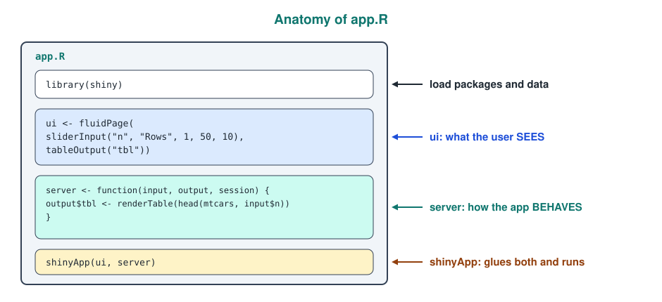

The full code with each part explained.

```r
library(shiny)

ui <- fluidPage(
  sliderInput("n", "Rows", min = 1, max = 50, value = 10),
  tableOutput("tbl")
)

server <- function(input, output, session) {
  output$tbl <- renderTable({
    head(mtcars, input$n)
  })
}

shinyApp(ui, server)
```

- `sliderInput("n", ...)` creates a widget whose value is available in the server as **`input$n`**.
- `tableOutput("tbl")` reserves an empty spot on the page called `tbl`.
- `output$tbl <- renderTable({...})` tells Shiny how to fill that spot.
- Because the render code reads `input$n`, Shiny knows the table **depends on** the slider and redraws it every time the slider moves. You never wrote "when the slider changes, redraw the table". Shiny worked it out.

The three arguments of the server function.
- **`input`**: read only list of the current input values. You can read `input$n`, you cannot assign to it.
- **`output`**: where you assign render functions, `output$name <- render...()`.
- **`session`**: information and controls for this one user's session, needed for `update*()` functions and modules.

---

## Where Code Runs

Where you put a line of code decides how often it runs, and getting this wrong is the most common cause of slow apps.

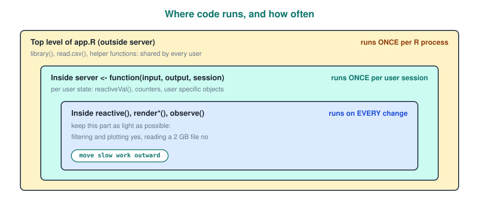

The rule in code form.

```r
library(shiny)
cars <- read.csv("data/cars.csv")        # once, when the app starts

server <- function(input, output, session) {
  clicks <- reactiveVal(0)               # once per user who opens the app

  output$plot <- renderPlot({
    hist(cars[[input$col]])              # every time input$col changes
  })
}
```

- Load data and define helper functions **outside** `server` so it happens once, not once per visitor.
- Put per user state **inside** `server`, otherwise all users share (and overwrite) the same variable.
- Keep render functions light, since they run over and over.

---

## Building The UI

The UI is just nested R function calls, each one producing a piece of HTML. Reading it from the outside in is the easiest way to understand a layout.

### Page Functions

The outermost call decides the overall page.
- **`fluidPage()`**: a page that stretches to the window width. The classic default.
- **`navbarPage()`**: a page with a top navigation bar, one tab per section.
- **`page_sidebar()`**, **`page_navbar()`**, **`page_fillable()`**: the modern equivalents from `bslib`, covered in the theming section.

### sidebarLayout

The most common layout for analysis apps puts controls on the left and results on the right. `titlePanel()` adds a heading.

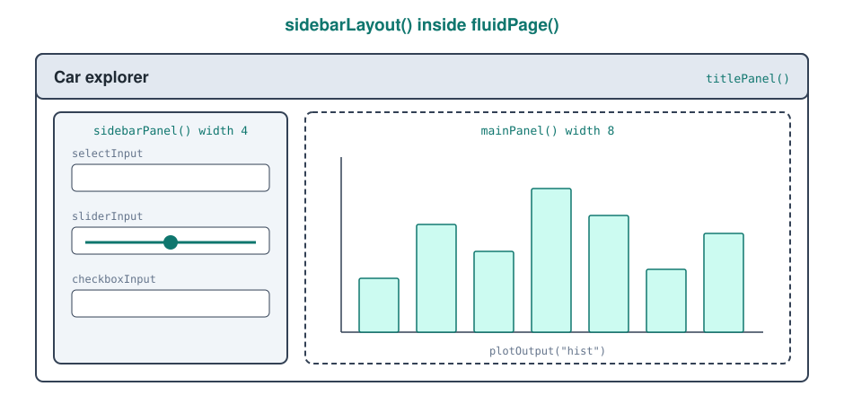

The code that produces that layout.

```r
ui <- fluidPage(
  titlePanel("Car explorer"),
  sidebarLayout(
    sidebarPanel(
      selectInput("var", "Variable", choices = names(mtcars)),
      sliderInput("bins", "Bins", min = 5, max = 50, value = 20),
      checkboxInput("density", "Show density", value = FALSE)
    ),
    mainPanel(
      plotOutput("hist")
    )
  )
)
```

### The Grid

For anything more custom, Shiny uses the **Bootstrap 12 column grid**. A `fluidRow()` is a row, and each `column(width, ...)` takes some of its 12 units.

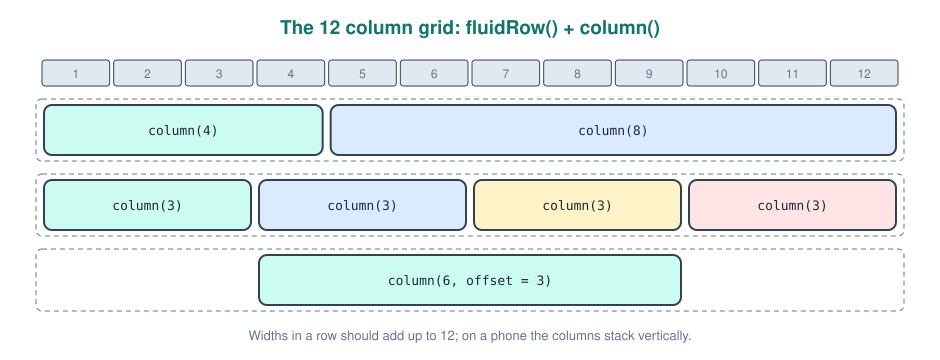

A dashboard style row of three equal boxes above one wide plot.

```r
ui <- fluidPage(
  fluidRow(
    column(4, textOutput("n_cars")),
    column(4, textOutput("avg_mpg")),
    column(4, textOutput("avg_hp"))
  ),
  fluidRow(
    column(12, plotOutput("scatter"))
  )
)
```

`column(6, offset = 3, ...)` skips 3 units first, which is a quick way to centre something.

### Tabs And Navigation

When one page gets crowded, split it into tabs. `tabsetPanel()` puts tabs inside a page, `navbarPage()` makes the tabs the main navigation.

```r
ui <- navbarPage(
  "Car explorer",
  tabPanel("Plot", plotOutput("scatter")),
  tabPanel("Data", tableOutput("tbl")),
  navbarMenu("More",
    tabPanel("About", p("Built with Shiny"))
  )
)
```

Outputs on hidden tabs are not calculated until the tab is opened, so tabs also save work.

### Raw HTML With tags

Every HTML element has an R function in `tags`. The common ones (`h1()` to `h6()`, `p()`, `strong()`, `em()`, `br()`, `hr()`, `a()`, `img()`, `div()`, `span()`) are also available directly.

```r
ui <- fluidPage(
  h2("Fuel economy"),
  p("Data from the", strong("mtcars"), "dataset."),
  tags$img(src = "logo.png", height = "40px"),   # file lives in www/
  tags$link(rel = "stylesheet", href = "style.css"),
  div(class = "note", "Values are in miles per gallon.")
)
```

Named arguments become HTML attributes (`class`, `id`, `style`, `href`), unnamed arguments become the content.

---

## Input Widgets

Every input function follows the same pattern: the **first argument is the `inputId`**, the second is the **label** shown to the user, and the rest configure the widget. The id is how the server reads the value, so it must be unique in the app.

| Function | Value in `input$id` | Typical use |
|---|---|---|
| `textInput()` | character string | names, search terms |
| `textAreaInput()` | character string | longer free text |
| `passwordInput()` | character string | hidden text |
| `numericInput()` | number (or `NA` if empty) | a precise number |
| `sliderInput()` | number, or two numbers for a range | a value in a range |
| `selectInput()` | character, or character vector if `multiple = TRUE` | pick from a list |
| `radioButtons()` | character | pick one of a few |
| `checkboxInput()` | `TRUE` / `FALSE` | an on/off switch |
| `checkboxGroupInput()` | character vector | pick several |
| `dateInput()` | `Date` | a single date |
| `dateRangeInput()` | two `Date` values | a period |
| `fileInput()` | data frame with `name`, `size`, `type`, `datapath` | uploads |
| `actionButton()` | integer counting the clicks | trigger an action |

A sample of the most used ones with their important arguments.

```r
textInput("name", "Your name", value = "", placeholder = "Angelo")

numericInput("age", "Age", value = 20, min = 0, max = 120, step = 1)

sliderInput("range", "MPG range", min = 10, max = 35, value = c(15, 30))

selectInput("xvar", "X axis",
            choices = c("Miles per gallon" = "mpg",
                        "Horsepower" = "hp",
                        "Weight" = "wt"),
            selected = "hp")

checkboxGroupInput("cyl", "Cylinders", choices = c(4, 6, 8), selected = c(4, 6, 8))

dateRangeInput("period", "Period", start = "2026-01-01", end = Sys.Date())

actionButton("go", "Run analysis", class = "btn-primary")
```

Things that catch people out.
- In a **named choices vector** the user sees the name (`"Horsepower"`) but the server receives the value (`"hp"`). Use this to show friendly labels for column names.
- `checkboxGroupInput()` and `selectInput()` always return **character**, even if the choices were numbers. `input$cyl` is `c("4", "6", "8")`, not `c(4, 6, 8)`. `%in%` copes with this, `==` against a number also works through coercion, but arithmetic on it does not.
- An `actionButton()` value is just a **counter** (0, 1, 2 ...). Its actual number is rarely useful; what matters is that it changes. The events section shows how to use it.
- `numericInput()` returns `NA` when the user clears the box, which will break calculations unless you check for it (see `req()` later).

---

## Outputs

Outputs come in pairs. In the UI you place an empty **`*Output()`** placeholder, in the server you fill it with the matching **`render*()`** function.

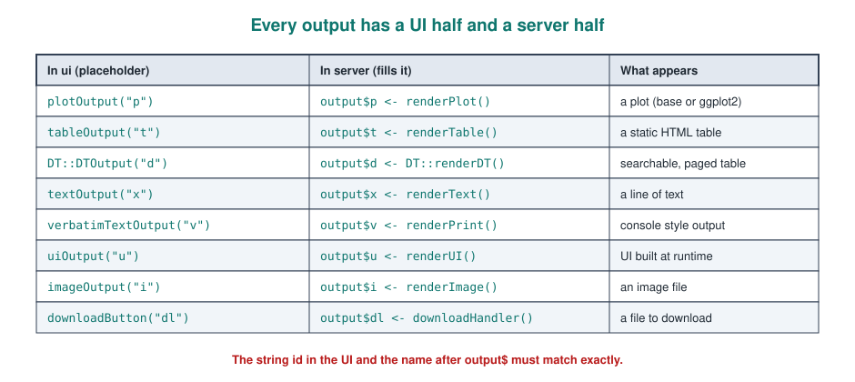

A server filling four different outputs.

```r
server <- function(input, output, session) {
  output$hist <- renderPlot({
    hist(mtcars$mpg, breaks = input$bins)
  })

  output$tbl <- renderTable({
    head(mtcars)
  })

  output$msg <- renderText({
    paste("You selected", input$bins, "bins")
  })

  output$model <- renderPrint({
    summary(lm(mpg ~ wt, data = mtcars))
  })
}
```

- `renderText()` pastes the result into a sentence; `renderPrint()` captures whatever would be **printed in the console**, which is why `summary()` of a model belongs there.
- `renderPlot()` accepts base plots and **ggplot objects**. A ggplot is printed automatically, no `print()` needed.
- The code inside a render function is wrapped in `{}` because it is a block that can be several lines long, and the **last value** is what gets displayed, exactly like a function body.
- Never write `output$x <- 5` or `output$x <- mtcars`. Outputs must always be assigned a `render*()` call.

---

## Your First Real App

Time to combine the R data analysis skills with what is above. This app lets the user choose two variables of `mtcars`, filter by cylinders, and see a `ggplot2` scatter plot plus a count.

```r
library(shiny)
library(dplyr)
library(ggplot2)

vars <- c("Miles per gallon" = "mpg", "Horsepower" = "hp",
          "Weight (1000 lbs)" = "wt", "Quarter mile time" = "qsec")

ui <- fluidPage(
  titlePanel("Car explorer"),
  sidebarLayout(
    sidebarPanel(
      selectInput("xvar", "X axis", choices = vars, selected = "wt"),
      selectInput("yvar", "Y axis", choices = vars, selected = "mpg"),
      checkboxGroupInput("cyl", "Cylinders", choices = c(4, 6, 8),
                         selected = c(4, 6, 8), inline = TRUE)
    ),
    mainPanel(
      plotOutput("scatter"),
      textOutput("count")
    )
  )
)

server <- function(input, output, session) {
  output$scatter <- renderPlot({
    mtcars |>
      filter(cyl %in% input$cyl) |>
      ggplot(aes(x = .data[[input$xvar]], y = .data[[input$yvar]],
                 colour = factor(cyl))) +
      geom_point(size = 3) +
      labs(colour = "Cylinders")
  })

  output$count <- renderText({
    n <- mtcars |> filter(cyl %in% input$cyl) |> nrow()
    paste(n, "cars shown")
  })
}

shinyApp(ui, server)
```

The one new piece of R here is **`.data[[input$xvar]]`**. `input$xvar` is a string like `"wt"`, but `aes(x = input$xvar)` would plot the literal text `"wt"` as a constant, not the column. `.data[[...]]` tells `ggplot2` and `dplyr` "look up the column whose name is in this string". Every Shiny app that lets the user choose a column needs this.

This app works, but it has a flaw: the `filter()` is written and run **twice**, once per output. Fixing that is exactly what reactivity is for.

---

## Reactivity: The Core Idea

Everything in Shiny past this point is a variation on one idea, so it is worth slowing down here.

### Declarative, Not Imperative

Normal R code is **imperative**: you say do this, then this, then this, and it runs top to bottom once. Shiny server code is **declarative**: you describe *what each output is made of*, and Shiny decides *when* to run it.

The spreadsheet analogy again. In Excel you type `=A1*2` into B1. You never write "whenever A1 changes, recalculate B1"; Excel tracks that dependency for you. `output$tbl <- renderTable(head(mtcars, input$n))` is the Shiny version of `=A1*2`.

### The Reactive Graph

Shiny keeps a map of who depends on whom, called the **reactive graph**. It has three kinds of nodes.

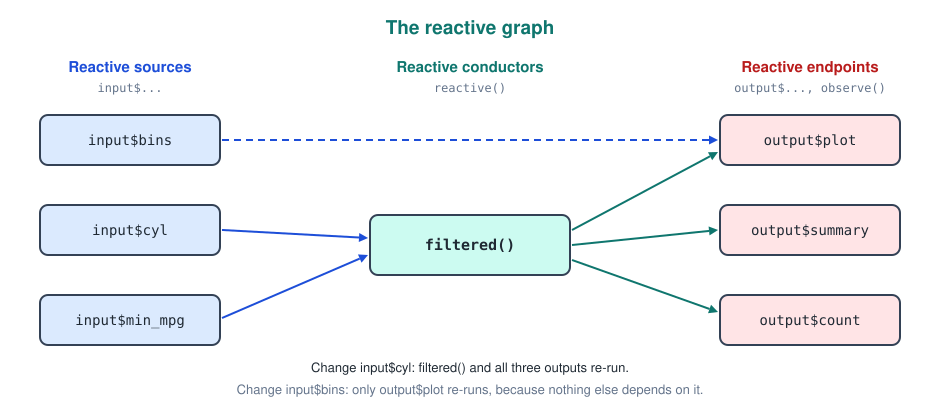

- **Reactive sources**: the things that change from outside. Mostly `input$...`, plus `reactiveVal()` and `reactiveValues()`.
- **Reactive conductors**: intermediate results computed from sources, made with `reactive()`.
- **Reactive endpoints**: the things that finally *do* something, `output$...` and observers.

When a source changes, Shiny marks everything downstream of it as **invalidated** (out of date) and re runs only those parts. Anything not connected to the changed input is left alone.

### Dependencies Are Found Automatically

Shiny builds the graph by watching which reactive values your code **actually reads** while it runs. There is no list of dependencies to maintain.

```r
output$txt <- renderText({
  if (input$show_name) {
    paste("Hello", input$name)
  } else {
    "Hello stranger"
  }
})
```

When `input$show_name` is `FALSE`, `input$name` is never read, so typing a name does not re run this output. The moment the checkbox is ticked, `input$name` is read and becomes a dependency. The graph is rebuilt on every run.

### Laziness

Reactive expressions and outputs are **lazy**: they only compute when something needs their value. An output on a tab nobody opened, or a `reactive()` no output uses, never runs. That is a feature, it means you can define things freely without paying for them.

---

## Reactive Expressions

A **reactive expression**, created with `reactive()`, is a value that is computed from inputs, remembered, and reused. It is the fix for the duplicated `filter()` from the first real app.

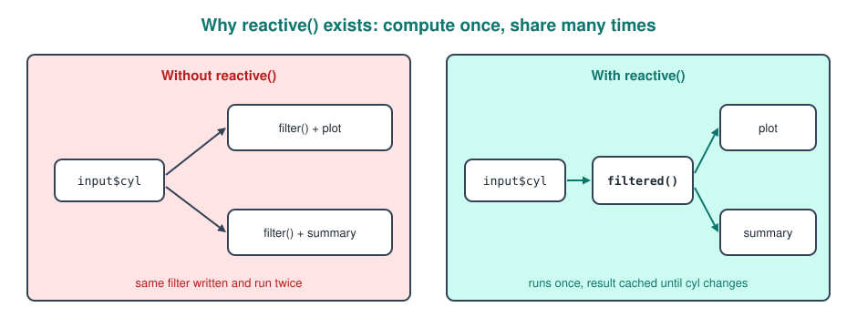

The same car app rewritten with one reactive expression.

```r
server <- function(input, output, session) {
  filtered <- reactive({
    mtcars |> filter(cyl %in% input$cyl)
  })

  output$scatter <- renderPlot({
    ggplot(filtered(), aes(x = .data[[input$xvar]], y = .data[[input$yvar]],
                           colour = factor(cyl))) +
      geom_point(size = 3)
  })

  output$count <- renderText({
    paste(nrow(filtered()), "cars shown")
  })
}
```

The important details.
- You **call** a reactive expression like a function: `filtered()`, with brackets. Writing `filtered` without brackets gives you the reactive object itself, not the data, and is a very common bug.
- The result is **cached**. Both outputs call `filtered()`, but the filter runs once. It only runs again when `input$cyl` changes.
- Changing `input$xvar` re runs the plot but **not** `filtered()`, because the filter does not read `xvar`.
- A reactive can only be called inside another reactive context (a `render*()`, another `reactive()`, an observer). Calling `filtered()` at the top level of the server gives the error *"Operation not allowed without an active reactive context"*.

Reactive expressions can depend on other reactive expressions, which is how you build a pipeline step by step.

```r
filtered <- reactive(mtcars |> filter(cyl %in% input$cyl))
model    <- reactive(lm(mpg ~ wt, data = filtered()))

output$coef <- renderPrint(coef(model()))
output$r2   <- renderText(round(summary(model())$r.squared, 3))
```

The model is fitted once per change of `input$cyl`, no matter how many outputs use it.

---

## Observers

Reactive expressions **return a value**. Sometimes you do not want a value, you want something to **happen**: save a file, show a notification, update another input, write to a database. Those are **side effects**, and they belong in **observers**.

### observe()

`observe()` runs its code whenever any reactive value it reads changes. It returns nothing useful and it is **eager**: it runs even if nobody "needs" it.

```r
observe({
  message("The user picked ", input$xvar)   # printed in the R console
})
```

### observeEvent()

Most of the time you want an observer that reacts to **one specific thing**, usually a button. `observeEvent()` takes the trigger as the first argument and the code to run as the second.

```r
observeEvent(input$save, {
  write.csv(filtered(), "export.csv", row.names = FALSE)
  showNotification("Saved export.csv")
})
```

Only clicks on `input$save` trigger this. Changing `input$cyl` does not, even though `filtered()` (which depends on `input$cyl`) is read inside. That is the main difference from `observe()`.

A few useful arguments.
- `ignoreInit = TRUE`: do not run once when the app starts.
- `ignoreNULL = TRUE` (the default): do not run when the trigger is `NULL`, for example an empty `selectInput()`.
- `once = TRUE`: run only the first time, then destroy the observer.

---

## Picking The Right Reactive Tool

There are four tools that look similar and the difference is only two questions: *do I need a value back?* and *should it react to everything or only to one event?*

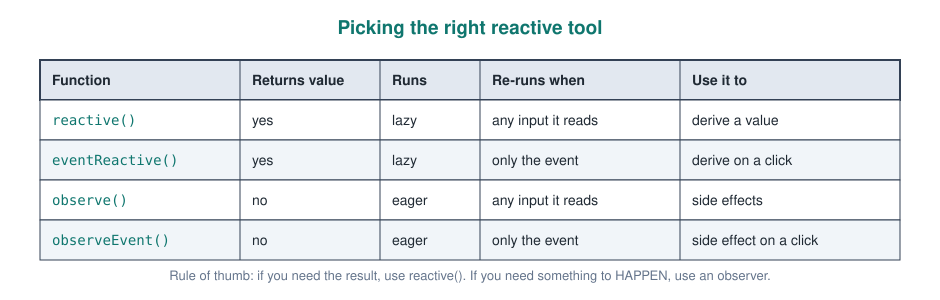

A useful self check: if you find yourself writing `observe({ my_global <<- ... })` to store a computed result, you wanted a `reactive()`. Observers that copy values into variables fight against the reactive graph instead of using it.

---

## Controlling When Things Run

By default Shiny reacts instantly to every change. For expensive work (fitting a model, querying a database) that is too eager: you want the user to set up all the inputs and then press a button.

### eventReactive()

`eventReactive()` is a `reactive()` that only recalculates when an **event** fires. Inputs read inside it can change freely in between without causing any work.

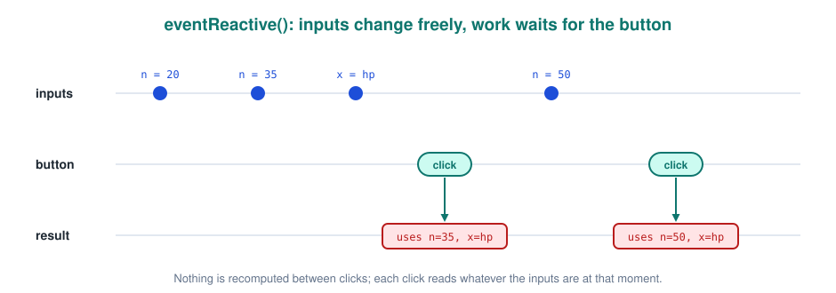

A model that is only refitted when the user clicks **Fit**.

```r
ui <- fluidPage(
  selectInput("pred", "Predictor", choices = c("wt", "hp", "qsec")),
  sliderInput("n", "Use first n rows", 10, 32, 32),
  actionButton("fit", "Fit model"),
  verbatimTextOutput("summary")
)

server <- function(input, output, session) {
  model <- eventReactive(input$fit, {
    data <- head(mtcars, input$n)
    lm(reformulate(input$pred, "mpg"), data = data)
  })

  output$summary <- renderPrint(summary(model()))
}
```

Until the button is clicked for the first time, `model()` has no value, and the output stays empty instead of showing an error. `reformulate(input$pred, "mpg")` builds the formula `mpg ~ wt` from strings, the formula version of the `.data[[...]]` trick.

### isolate()

`isolate()` reads a reactive value **without** creating a dependency on it. Use it when an output should *use* a value but not *react* to it.

```r
output$greeting <- renderText({
  input$go                                  # dependency: re run on click
  paste("Hello", isolate(input$name))       # read, but no dependency
})
```

Typing in the name box changes nothing; clicking `go` re runs the output with whatever name is there at that moment. `eventReactive()` and `observeEvent()` are essentially this pattern packaged up for you.

### bindEvent()

Newer Shiny versions (1.6 and up) offer `bindEvent()`, which attaches an event to any reactive or render function with a pipe. It reads well and is the modern style.

```r
model <- reactive({
  lm(reformulate(input$pred, "mpg"), data = head(mtcars, input$n))
}) |>
  bindEvent(input$fit)

output$plot <- renderPlot({
  plot(model(), which = 1)
}) |>
  bindEvent(input$fit)
```

---

## Storing State: reactiveVal And reactiveValues

Inputs are values the **user** controls. Sometimes the **app** needs its own values that change over time: a click counter, a history of choices, a dataset the user has edited. Plain R variables do not work for this, because Shiny cannot see when they change. You need **reactive values**.

### reactiveVal()

`reactiveVal()` holds a single value. You **read** it by calling it with no arguments and **write** it by calling it with the new value.

```r
server <- function(input, output, session) {
  count <- reactiveVal(0)

  observeEvent(input$plus,  count(count() + 1))
  observeEvent(input$reset, count(0))

  output$n <- renderText(paste("Count:", count()))
}
```

### reactiveValues()

`reactiveValues()` holds several named values, used like a list with `$`. Each element is tracked separately.

```r
server <- function(input, output, session) {
  rv <- reactiveValues(history = character(), last = NULL)

  observeEvent(input$add, {
    rv$history <- c(rv$history, input$name)
    rv$last    <- input$name
  })

  output$log <- renderPrint(rv$history)
}
```

Which to pick.
- One value → `reactiveVal()`. Its explicit `count(...)` write syntax makes it obvious where state changes.
- A small group of related values → `reactiveValues()`.
- Both must be created **inside** `server` if they belong to one user. Created outside, they are shared by every session, which is occasionally what you want (a global chat log) but usually a bug.

---

## Validating Inputs

Outputs often run before the user has given them what they need: no file uploaded yet, no checkbox ticked, a number box left empty. Without protection you get ugly red R errors on the page.

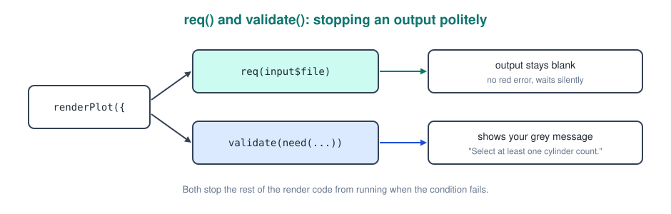

### req()

`req()` means "this output requires these values". If any of them is missing (`NULL`, `""`, `FALSE`, `NA`, an empty vector, or a button that has never been clicked) the code stops quietly and the output stays blank.

```r
output$preview <- renderTable({
  req(input$upload)                     # wait until a file is uploaded
  head(read.csv(input$upload$datapath))
})
```

### validate() And need()

When you want to tell the user **why** nothing is shown, use `validate()` with one or more `need()` checks. The message appears in grey where the output would be.

```r
output$scatter <- renderPlot({
  validate(
    need(length(input$cyl) > 0, "Select at least one cylinder count."),
    need(input$xvar != input$yvar, "Pick two different variables.")
  )
  ggplot(filtered(), aes(.data[[input$xvar]], .data[[input$yvar]])) +
    geom_point()
})
```

Putting `req()` or `validate()` inside a **reactive expression** protects every output that uses it in one go, since the stop propagates downstream.

---

## Updating And Generating UI

So far the UI was fixed when the page loaded. Real apps often need the UI to change: the column dropdown should list the columns of whatever file was uploaded, or a slider should only appear when a certain plot type is chosen. There are three tools, from lightest to heaviest.

### update Functions

Every input has an `update*()` partner (`updateSelectInput()`, `updateSliderInput()`, `updateTextInput()`, `updateNumericInput()` ...) that changes an existing widget from the server. They are side effects, so they live in observers.

```r
observeEvent(input$dataset, {
  data <- get(input$dataset)                       # e.g. "mtcars" or "iris"
  updateSelectInput(session, "column", choices = names(data))
})

observeEvent(input$reset, {
  updateSliderInput(session, "bins", value = 20)
})
```

Prefer `update*()` when the widget always exists and only its options or value change. It keeps whatever else the user set and does not rebuild the HTML.

When an update triggers other outputs too early (they briefly run with the old value), `freezeReactiveValue(input, "column")` placed before the update tells Shiny to hold those outputs until the new value has arrived from the browser.

### renderUI

`renderUI()` with a `uiOutput()` placeholder builds **any** piece of UI in the server. It is the most flexible tool, and also the slowest, because the widget is destroyed and recreated each time.

```r
ui <- fluidPage(
  numericInput("n_sliders", "How many sliders?", value = 2, min = 1, max = 5),
  uiOutput("sliders")
)

server <- function(input, output, session) {
  output$sliders <- renderUI({
    req(input$n_sliders)
    lapply(seq_len(input$n_sliders), function(i) {
      sliderInput(paste0("s", i), paste("Slider", i), 0, 100, 50)
    })
  })
}
```

The generated sliders are read like any other input: `input$s1`, `input$s2` and so on.

### conditionalPanel

`conditionalPanel()` shows or hides part of the UI based on a condition evaluated **in the browser**, so it is instant and costs R nothing. The condition is written in **JavaScript**, with `input.id` instead of `input$id`.

```r
ui <- fluidPage(
  radioButtons("type", "Plot type", c("Histogram" = "hist", "Boxplot" = "box")),
  conditionalPanel(
    condition = "input.type == 'hist'",
    sliderInput("bins", "Bins", 5, 50, 20)
  ),
  plotOutput("plot")
)
```

Choosing between the three.
- Widget exists, only its choices or value change → `update*()`.
- Widget exists, should only be visible sometimes → `conditionalPanel()`.
- The number or kind of widgets depends on data → `renderUI()`.

---

## Files In And Out

Letting users bring their own data and take results away turns a demo into a tool.

### Uploading With fileInput

`fileInput()` gives a data frame describing the upload. The column you want is **`datapath`**, the temporary path where Shiny saved the file. `name` is only the original filename, it does not point to a file on the server.

```r
ui <- fluidPage(
  fileInput("upload", "Upload a CSV", accept = ".csv"),
  tableOutput("head")
)

server <- function(input, output, session) {
  data <- reactive({
    req(input$upload)
    ext <- tools::file_ext(input$upload$name)
    validate(need(ext == "csv", "Please upload a .csv file."))
    read.csv(input$upload$datapath)
  })

  output$head <- renderTable(head(data()))
}
```

The default upload limit is **5 MB**. Raise it at the top of `app.R` if needed.

```r
options(shiny.maxRequestSize = 30 * 1024^2)   # 30 MB
```

### Downloading With downloadHandler

Downloads pair `downloadButton()` in the UI with `downloadHandler()` in the server. Both of its arguments are **functions**: `filename` returns the name, `content` receives a temporary path and must write the file there.

```r
ui <- fluidPage(
  downloadButton("dl", "Download filtered data")
)

server <- function(input, output, session) {
  output$dl <- downloadHandler(
    filename = function() {
      paste0("cars-", Sys.Date(), ".csv")
    },
    content = function(file) {
      write.csv(filtered(), file, row.names = FALSE)
    }
  )
}
```

The same pattern exports plots (`ggsave(file, plot = my_plot())`) or reports (`rmarkdown::render()` / Quarto, writing to `file`).

---

## Feedback To The User

When an app does something slow or important without telling the user, they click again, and again. Shiny has built in helpers for keeping them informed.

### Notifications

`showNotification()` shows a small message in the bottom right corner that disappears by itself. `type` can be `"default"`, `"message"`, `"warning"` or `"error"`.

```r
observeEvent(input$save, {
  write.csv(filtered(), "export.csv", row.names = FALSE)
  showNotification("Export saved", type = "message", duration = 3)
})
```

### Modal Dialogs

A **modal** blocks the page until the user responds, which suits confirmations.

```r
observeEvent(input$delete, {
  showModal(modalDialog(
    title = "Delete all rows?",
    "This cannot be undone.",
    footer = tagList(
      modalButton("Cancel"),
      actionButton("confirm_delete", "Delete", class = "btn-danger")
    )
  ))
})

observeEvent(input$confirm_delete, {
  rv$data <- rv$data[0, ]
  removeModal()
})
```

### Progress Bars

For loops that take a while, `withProgress()` shows a bar and `incProgress()` moves it.

```r
model <- eventReactive(input$fit, {
  withProgress(message = "Fitting models", value = 0, {
    fits <- list()
    for (i in 1:10) {
      fits[[i]] <- lm(mpg ~ ., data = mtcars[sample(nrow(mtcars), replace = TRUE), ])
      incProgress(1 / 10, detail = paste("bootstrap", i))
    }
    fits
  })
})
```

---

## Modules

Once an app grows past a few hundred lines, the server becomes one huge function where every id has to be unique. **Modules** fix this the same way functions fix long scripts: you package a piece of UI and its server logic together, and reuse it.

### The Namespace Problem

You cannot just put UI in a function and call it twice, because both copies would create an input called `"btn"` and Shiny would not know which is which. Modules solve this with a **namespace**: every id inside a module is automatically prefixed with the module's id.

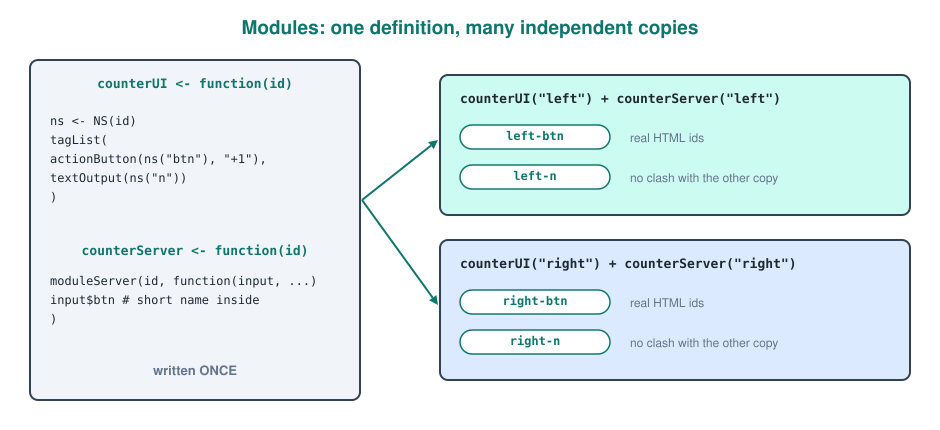

### Writing A Module

A module is two functions that share an `id`. In the UI function, every id goes through **`ns()`**. In the server function, **`moduleServer()`** makes `input$btn` automatically mean "the `btn` belonging to this copy".

```r
counterUI <- function(id) {
  ns <- NS(id)
  tagList(
    actionButton(ns("btn"), "+1"),
    textOutput(ns("n"))
  )
}

counterServer <- function(id) {
  moduleServer(id, function(input, output, session) {
    count <- reactiveVal(0)
    observeEvent(input$btn, count(count() + 1))
    output$n <- renderText(count())
  })
}
```

Using it twice in an app, each copy with its own count.

```r
ui <- fluidPage(
  counterUI("left"),
  counterUI("right")
)

server <- function(input, output, session) {
  counterServer("left")
  counterServer("right")
}
```

The id passed to the UI and the server **must be the same string**, otherwise the two halves never find each other. Put modules in files inside the `R/` folder and they load automatically.

### Passing Data In And Out

Modules talk to the rest of the app through **arguments** (in) and **return values** (out). The key rule: pass **reactives**, not their values. If you pass `filtered()` the module receives a frozen data frame and never updates; pass `filtered` and call it inside.

```r
filterUI <- function(id) {
  ns <- NS(id)
  checkboxGroupInput(ns("cyl"), "Cylinders", c(4, 6, 8), c(4, 6, 8), inline = TRUE)
}

filterServer <- function(id, data) {          # data is a reactive
  moduleServer(id, function(input, output, session) {
    reactive({
      data() |> dplyr::filter(cyl %in% input$cyl)
    })                                         # returned to the caller
  })
}

plotServer <- function(id, data) {
  moduleServer(id, function(input, output, session) {
    output$plot <- renderPlot(plot(data()$wt, data()$mpg))
  })
}

server <- function(input, output, session) {
  cars     <- reactive(mtcars)
  filtered <- filterServer("filter", cars)    # out of one module ...
  plotServer("plot", filtered)                # ... into another
}
```

If a module generates UI with `renderUI()`, use `session$ns("id")` inside the server function to namespace the new ids.

---

## Theming With bslib

The default Shiny look is plain Bootstrap 3. The **`bslib`** package brings Bootstrap 5, modern page layouts, cards, and themes you control from R.

### A Theme

`bs_theme()` sets colours and fonts for the whole app. `bootswatch` picks a ready made theme, the other arguments override parts of it.

```r
library(bslib)

ui <- fluidPage(
  theme = bs_theme(
    version = 5,
    bootswatch = "flatly",
    primary = "#0f766e",
    base_font = font_google("Inter")
  ),
  h2("Themed app")
)
```

Adding `bs_themer()` as the first line of the server opens a live theme editor in the app while you develop, and prints the matching `bs_theme()` code in the console.

### Modern Layouts

`bslib` also has its own page functions built around **cards**, which look like a real dashboard with very little code.

```r
ui <- page_sidebar(
  title = "Car explorer",
  theme = bs_theme(bootswatch = "flatly", primary = "#0f766e"),
  sidebar = sidebar(
    selectInput("xvar", "X axis", vars, selected = "wt"),
    selectInput("yvar", "Y axis", vars, selected = "mpg")
  ),
  layout_columns(
    value_box(title = "Cars shown", value = textOutput("count")),
    value_box(title = "Average MPG", value = textOutput("avg"))
  ),
  card(
    card_header("Scatter plot"),
    plotOutput("scatter")
  )
)
```

`page_navbar()` with `nav_panel()` is the `bslib` replacement for `navbarPage()` with `tabPanel()`.

---

## Performance

Remember that one R process serves many users and runs one thing at a time. Slow code does not just slow down one person, it queues everyone. In order of how often they help:

### Do Less Work Per Change

The cheapest optimisation is the execution scope from earlier: read data once at the top of `app.R`, precompute summaries, and keep render functions light. Using `reactive()` for shared steps and `eventReactive()` for expensive ones covers most apps.

### bindCache()

`bindCache()` remembers results by their inputs. If any user ever asked for the same combination before, the stored result is returned instantly instead of recomputing. Unlike `reactive()`, the cache is shared **across sessions**.

```r
output$scatter <- renderPlot({
  ggplot(filtered(), aes(.data[[input$xvar]], .data[[input$yvar]])) +
    geom_point()
}) |>
  bindCache(input$cyl, input$xvar, input$yvar)
```

The cache key must contain **everything** the result depends on. Forget one input and users get stale plots.

### debounce() And throttle()

A text box fires a change on every keystroke. **`debounce()`** waits until the value has stopped changing for a given time; **`throttle()`** lets at most one change through per time window.

```r
search  <- reactive(input$search)
search_d <- debounce(search, 500)        # wait for 500 ms of quiet

results <- reactive({
  big_data |> filter(grepl(search_d(), name, ignore.case = TRUE))
})
```

### Timed And Polling Updates

For live dashboards, `invalidateLater()` re runs a reactive every so many milliseconds, and `reactivePoll()` only re reads data when a cheap check says it changed.

```r
output$clock <- renderText({
  invalidateLater(1000)                   # re run every second
  format(Sys.time(), "%H:%M:%S")
})

live_data <- reactivePoll(
  5000, session,
  checkFunc = function() file.info("data/live.csv")$mtime,   # cheap check
  valueFunc = function() read.csv("data/live.csv")           # expensive read
)
```

`reactiveFileReader()` is a shortcut for exactly that file case.

### Long Running Jobs

When one task genuinely takes minutes, run it in the background so it does not block other users. Recent Shiny versions provide `ExtendedTask` for this, used together with the `promises` package and a background engine such as `future` or `mirai`. It is the most advanced topic in this file and only needed once the simpler steps above are exhausted.

---

## Debugging

Shiny code is harder to debug than a script because it does not run top to bottom. A few techniques cover nearly everything.

### Printing

`message()` or `print()` inside a reactive writes to the R console every time it runs. It is the quickest way to see *whether* and *how often* something runs.

```r
filtered <- reactive({
  message("filtered() running, cyl = ", paste(input$cyl, collapse = ","))
  mtcars |> filter(cyl %in% input$cyl)
})
```

### browser()

Putting `browser()` inside a render function or reactive pauses the app there, and the console becomes an interactive debugger with access to `input` and every local variable. Type `c` to continue, `Q` to quit.

```r
output$scatter <- renderPlot({
  browser()
  ggplot(filtered(), aes(.data[[input$xvar]], .data[[input$yvar]])) + geom_point()
})
```

### reactlog

The **reactlog** package records the reactive graph while the app runs and lets you replay it step by step, showing exactly what invalidated what. Enable it before starting the app, then press `Ctrl+F3` (`Cmd+F3` on Mac) in the browser.

```r
install.packages("reactlog")
reactlog::reactlog_enable()
shiny::runApp("my-app")
```

During development, `options(shiny.autoreload = TRUE)` reloads the app every time you save a file, so you do not have to stop and restart it.

---

## Testing With testServer

`testServer()` runs the server function without a browser. You set inputs with `session$setInputs()` and then check reactives and outputs with `testthat` expectations. This is how you make sure a change to one part did not break another.

```r
library(testthat)

server <- function(input, output, session) {
  doubled <- reactive(input$x * 2)
  output$txt <- renderText(paste("Double is", doubled()))
}

testServer(server, {
  session$setInputs(x = 4)
  expect_equal(doubled(), 8)
  expect_equal(output$txt, "Double is 8")

  session$setInputs(x = 10)
  expect_equal(doubled(), 20)
})
```

Inside the test block, everything defined in the server (like `doubled`) is directly available. Modules are tested the same way with `testServer(counterServer, { ... })`. For testing what the user actually sees in a browser, the `shinytest2` package records and replays real clicks.

---

## Deployment

An app on your laptop only works while your laptop runs it. To share it, the folder has to live on a server that has R installed.

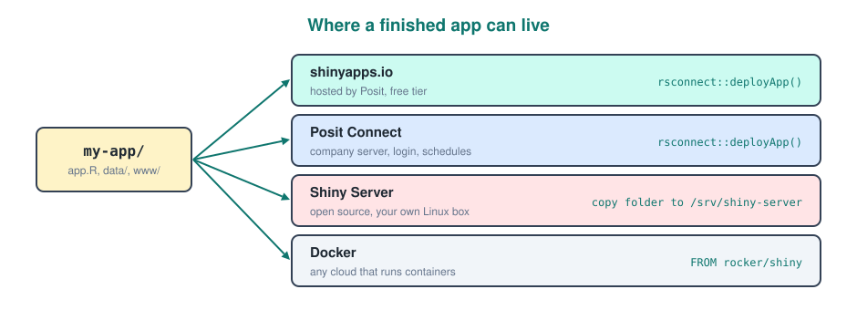

### shinyapps.io

The easiest option is **shinyapps.io**, hosted by Posit with a free tier. You link your account once with the token from their dashboard, then deploy the folder.

```r
install.packages("rsconnect")

rsconnect::setAccountInfo(name = "your-account", token = "TOKEN", secret = "SECRET")
rsconnect::deployApp("my-app")
```

`deployApp()` detects which packages the app uses and installs them on the server, so every package must be loaded with `library()` in the app code. Paths must be **relative** to the app folder (`"data/cars.csv"`, never `"C:/Users/..."`).

### The Other Options

The rest of the diagram in short.
- **Posit Connect**: the paid company version, adds logins, scheduling and hosting for Quarto reports and APIs. Same `rsconnect::deployApp()`.
- **Shiny Server**: free and open source, installed on your own Linux machine. Copy the app folder into `/srv/shiny-server/` and it is served on port `3838`.
- **Docker**: package the app and its exact R and package versions into an image, then run it on any cloud.

A minimal Dockerfile using the `rocker/shiny` image, which already contains Shiny Server.

```dockerfile
FROM rocker/shiny:4.4.1
RUN R -e "install.packages(c('dplyr', 'ggplot2', 'bslib'))"
COPY my-app /srv/shiny-server/my-app
EXPOSE 3838
```

---

## The Ecosystem

Many widgets you would otherwise have to build yourself already exist as packages. They follow the same `*Output()` / `render*()` pattern.

| Package | Gives you | Pair |
|---|---|---|
| `DT` | searchable, sortable tables | `DTOutput()` / `renderDT()` |
| `plotly` | interactive zoomable plots, `ggplotly()` converts a ggplot | `plotlyOutput()` / `renderPlotly()` |
| `leaflet` | interactive maps | `leafletOutput()` / `renderLeaflet()` |
| `shinyWidgets` | nicer pickers, switches, sliders | same `input$` usage |
| `shinyjs` | show, hide, disable elements from R | `useShinyjs()` in the UI |
| `golem`, `rhino` | frameworks for structuring large production apps | project templates |

---

## Common Mistakes

Most Shiny bugs fall into a handful of patterns. Recognising them saves a lot of time.

- **Forgetting brackets on a reactive.** `nrow(filtered)` fails; it must be `nrow(filtered())`.
- **Mismatched ids.** `plotOutput("scatter")` with `output$scater` shows nothing and gives no error.
- **Duplicate ids.** Two inputs called `"n"` behave unpredictably. Modules prevent this.
- **Using a string as a column.** `aes(x = input$xvar)` plots a constant. Use `.data[[input$xvar]]`.
- **Reading reactives outside a reactive context.** Calling `input$x` or `filtered()` at the top level of `server` gives the "active reactive context" error.
- **Heavy work in the wrong scope.** `read.csv()` inside a render function rereads the file on every change.
- **Storing results with observe and `<<-`.** Use `reactive()` instead; observers are for side effects.
- **Observers that update what they read.** An `observe()` that reads `input$x` and calls `updateNumericInput(session, "x", ...)` can trigger itself forever.
- **Absolute file paths.** Works on your laptop, breaks on the server.

---

## Putting It All Together

A complete app combining most of this file: `bslib` layout, a shared `reactive()`, validation, a model fitted only on click, cached plotting, and a download. Every piece has been explained above, so this is the reference to copy from.

```r
library(shiny)
library(bslib)
library(dplyr)
library(ggplot2)

vars <- c("Miles per gallon" = "mpg", "Horsepower" = "hp",
          "Weight (1000 lbs)" = "wt", "Quarter mile time" = "qsec")

ui <- page_sidebar(
  title = "Car explorer",
  theme = bs_theme(version = 5, bootswatch = "flatly", primary = "#0f766e"),
  sidebar = sidebar(
    checkboxGroupInput("cyl", "Cylinders", c(4, 6, 8), c(4, 6, 8), inline = TRUE),
    selectInput("xvar", "X axis", vars, selected = "wt"),
    selectInput("yvar", "Y axis", vars, selected = "mpg"),
    actionButton("fit", "Fit linear model", class = "btn-primary"),
    downloadButton("dl", "Download data")
  ),
  layout_columns(
    value_box(title = "Cars shown", value = textOutput("count")),
    value_box(title = "Average Y", value = textOutput("avg"))
  ),
  card(card_header("Scatter plot"), plotOutput("scatter")),
  card(card_header("Model"), verbatimTextOutput("model"))
)

server <- function(input, output, session) {
  filtered <- reactive({
    validate(need(length(input$cyl) > 0, "Select at least one cylinder count."))
    mtcars |> filter(cyl %in% input$cyl)
  })

  output$count <- renderText(nrow(filtered()))
  output$avg   <- renderText(round(mean(filtered()[[input$yvar]]), 1))

  output$scatter <- renderPlot({
    validate(need(input$xvar != input$yvar, "Pick two different variables."))
    ggplot(filtered(), aes(.data[[input$xvar]], .data[[input$yvar]],
                           colour = factor(cyl))) +
      geom_point(size = 3) +
      geom_smooth(method = "lm", se = FALSE, colour = "grey40") +
      labs(colour = "Cylinders") +
      theme_minimal(base_size = 14)
  }) |>
    bindCache(input$cyl, input$xvar, input$yvar)

  model <- eventReactive(input$fit, {
    lm(reformulate(input$xvar, input$yvar), data = filtered())
  })
  output$model <- renderPrint(summary(model()))

  output$dl <- downloadHandler(
    filename = function() paste0("cars-", Sys.Date(), ".csv"),
    content  = function(file) write.csv(filtered(), file, row.names = FALSE)
  )
}

shinyApp(ui, server)
```

---

## Quick Recap

- A Shiny app is a **`ui`** (what the user sees) plus a **`server`** (how it behaves), joined by **`shinyApp(ui, server)`** and started with `runApp()` or the Run App button.
- The browser and R stay connected over a **WebSocket**; each tab is its own **session** with its own copy of `server`.
- **Scope decides frequency**: top level runs once per process, `server` once per session, reactives and renders on every change.
- Layouts: `fluidPage()`, `sidebarLayout()`, the **12 column grid** with `fluidRow()` / `column()`, tabs with `tabsetPanel()` or `navbarPage()`, or `bslib`'s `page_sidebar()` and `card()`.
- Inputs: first argument is the **id**, read as `input$id`. Select and checkbox group values are always **character**.
- Outputs come in pairs, `*Output("id")` in the UI and `output$id <- render*()` in the server.
- Use **`.data[[input$col]]`** to turn a column name string into a column in `dplyr` and `ggplot2`.
- **Reactivity** is declarative: Shiny tracks what each piece reads and re runs only what is out of date. Sources → conductors → endpoints.
- **`reactive()`** computes and caches a value, called with brackets `x()`. **Observers** (`observe()`, `observeEvent()`) perform side effects.
- **`eventReactive()`**, **`isolate()`** and **`bindEvent()`** make expensive work wait for a button.
- **`reactiveVal()`** and **`reactiveValues()`** hold state the app itself changes.
- **`req()`** stops an output silently, **`validate(need())`** stops it with a message.
- Change UI with **`update*()`**, **`conditionalPanel()`** or **`renderUI()`**, lightest to heaviest.
- Upload with `fileInput()` and `input$x$datapath`, download with **`downloadHandler()`**.
- Keep users informed with `showNotification()`, `modalDialog()` and `withProgress()`.
- **Modules** (`NS()` + `moduleServer()`) package UI and logic for reuse; pass reactives in, return reactives out.
- Speed: light renders, `bindCache()`, `debounce()`, `reactivePoll()`, and background tasks for long jobs.
- Debug with `message()`, `browser()` and **reactlog**; test with **`testServer()`**.
- Deploy to **shinyapps.io** with `rsconnect::deployApp()`, or to Posit Connect, Shiny Server or Docker.
