# Data Storage And SQL Advanced

The Data Storage And SQL file covered designing a database and querying it. This one picks up where that stopped: what the server is doing underneath, how to make queries fast, and the parts of SQL that go beyond `SELECT ... JOIN ... GROUP BY`.

Everything here is PostgreSQL. Most of it is standard SQL, but where PostgreSQL behaves differently from the textbook definition I say so explicitly, because those gaps are exactly the places that cause confusion.

---

## Schemas

The word schema means two different things, and it is worth separating them before anything else.

- **Schema as design** is the overall structure of your database, meaning which tables exist, their columns, types, keys and relationships. That is what people mean by the logical schema in ER modelling.
- **Schema as a database object** is a named container, a namespace, sitting between the database and its tables.

This section is about the second one.

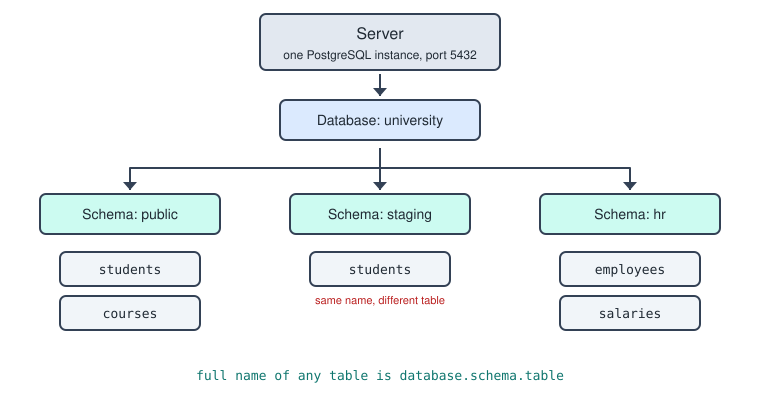

When you write `SELECT * FROM students`, PostgreSQL is quietly resolving that to `public.students`.

---

## Why More Than One Schema

Four reasons, and the last one is the real argument.

- **Avoiding name collisions.** Two teams, two applications, or two data sources can each have a `users` or `orders` table without fighting over the name. `sales.customers` and `support.customers` coexist happily.
- **Access control.** You can grant permission on an entire schema at once, so analysts get read access to `analytics` while `hr` stays locked down.
- **Logical organisation.** A database with 300 tables is unusable as a flat list. Grouping them into `raw`, `staging` and `mart` makes the structure legible.
- **Environment separation without duplication.** `dev`, `test` and `prod` schemas in one database let you test migrations against real structures cheaply.

Extensions also install their own schemas so their objects do not clutter yours.

```sql
GRANT USAGE ON SCHEMA hr TO payroll_team;
REVOKE ALL ON SCHEMA hr FROM interns;
```

### Why Not Separate Databases

This is the key insight. **You cannot join across databases in PostgreSQL.** A connection is to one database only, and crossing over needs an extension like `dblink` or `postgres_fdw`. But you can join freely across schemas.

```sql
SELECT s.name, e.department
FROM public.students s
JOIN hr.employees e ON s.email = e.email;
```

→ separate schemas when the data is related and you might want to query it together, separate databases when it genuinely belongs to different applications.

---

## The search_path

Every new database comes with a schema called `public`, which is why you can ignore schemas entirely at first. Everything lands there by default.

PostgreSQL decides which schema an unqualified name refers to using the **search_path**, an ordered list it walks through.

```sql
SHOW search_path;              -- typically  "$user", public
SET search_path TO hr, public; -- unqualified names now hit hr first
```

If a table exists in both `hr` and `public`, the one earlier in the search_path wins, which is a classic source of confusion about why a query returns the wrong data. You can always bypass it by fully qualifying the name.

Managing them is simple.

```sql
CREATE SCHEMA staging;
CREATE SCHEMA staging AUTHORIZATION some_user;  -- owned by that user
DROP SCHEMA staging CASCADE;                     -- deletes the contents too
```

One thing to keep in mind if you move between systems: **MySQL uses schema as a synonym for database**, with no intermediate layer, so the three level hierarchy does not apply there.

---

## Dates And Timestamps

Dates are written as string literals in single quotes, and PostgreSQL converts them when comparing against a date or timestamp column.

```sql
SELECT * FROM bookings
WHERE starttime > '2012-09-21';
```

Single quotes only. Double quotes mean an identifier, so `"2012-09-21"` throws an error about a nonexistent column.

Use **ISO 8601**, meaning `'YYYY-MM-DD'`, always. It is unambiguous, it sorts correctly, and every database understands it.

```sql
'2012-09-21'              -- date
'2012-09-21 14:00:00'     -- timestamp
'2012-09-21T14:00:00'     -- also valid
```

Avoid `'21/09/2012'`, because PostgreSQL interprets it according to the `DateStyle` setting, so it may read as 21 September or fail outright depending on configuration. You can be explicit if you want, though it is rarely necessary.

```sql
WHERE starttime > DATE '2012-09-21'
WHERE starttime > '2012-09-21'::timestamp
```

---

## The Timestamp Trap

If `starttime` is a `TIMESTAMP` and you write `'2012-09-21'`, PostgreSQL pads it to `2012-09-21 00:00:00`, meaning midnight at the **start** of that day.

So this does not give you everything on the 21st.

```sql
WHERE starttime > '2012-09-21'    -- excludes a booking at exactly midnight,
                                  -- and includes the 22nd, 23rd, and so on forever
```

And this is worse, because it looks right.

```sql
WHERE starttime BETWEEN '2012-09-21' AND '2012-09-22'
-- covers only midnight of the 22nd, missing everything after it that day
```

Equality fails for the same reason. `starttime = '2012-09-21'` asks for one exact instant, so a booking at 08:00 does not match. You get zero rows and no error, which is the worst kind of wrong.

A timestamp is a point on a continuous line, not a label for a day. The 21st is not a point, it is an interval 86,400 seconds long, and equality cannot express an interval.

The reliable pattern is a **half open range**, inclusive at the bottom and exclusive at the top.

```sql
WHERE starttime >= '2012-09-21'
  AND starttime <  '2012-09-22';        -- all of the 21st, cleanly
```

`>=` catches midnight itself, `<` stops just before the next midnight, and every instant in between is covered exactly once. Chain days together and the boundaries line up with no gaps and no overlaps.

Casting the column also works and reads nicely, at the cost of the index, which the indexes section explains.

```sql
WHERE starttime::date = '2012-09-21'
```

If the column were declared `DATE` rather than `TIMESTAMP` there would be no time component and plain equality would be correct. Checking the column type is the first thing to do.

```sql
SELECT column_name, data_type
FROM information_schema.columns
WHERE table_name = 'bookings';
```

### Relative Dates And Parts

```sql
CURRENT_DATE                          -- today, no time
CURRENT_TIMESTAMP                     -- today with time, also NOW()
WHERE hire_date > CURRENT_DATE - INTERVAL '30 days'
WHERE start_date >= CURRENT_DATE - 7  -- integer subtraction works on DATE
WHERE expiry < NOW() + INTERVAL '1 year'
```

Intervals accept `'1 day'`, `'3 months'`, `'2 years 6 months'`, `'90 minutes'` and so on.

```sql
EXTRACT(YEAR FROM starttime)          -- 2012
EXTRACT(MONTH FROM starttime)         -- 9
EXTRACT(DOW FROM starttime)           -- day of week, 0 is Sunday

DATE_TRUNC('month', starttime)        -- 2012-09-01 00:00:00
DATE_TRUNC('day', starttime)          -- strips the time
```

`DATE_TRUNC` is what you want for grouping, since monthly totals and daily counts both come out of it.

```sql
SELECT DATE_TRUNC('month', starttime) AS month, COUNT(*)
FROM bookings
GROUP BY month
ORDER BY month;
```

For display there is `TO_CHAR(starttime, 'DD/MM/YYYY')`, but never use it for filtering, because comparing formatted strings sorts alphabetically and breaks badly.

One last note: subtracting two dates gives an integer number of days, while subtracting two timestamps gives an `INTERVAL`. So `end_date - start_date > 30` works on dates, and on timestamps you want `> INTERVAL '30 days'`.

---

## Transactions And Isolation

The `I` in ACID says a transaction should behave as if it were running alone. The strictest reading is that the result must match some serial ordering of the transactions, as if you had queued them up and run them one after another.

The trouble is that true serial execution is slow. Databases interleave transactions, which creates opportunities for one to observe another mid flight. **Isolation levels are the dial** that trades correctness guarantees against concurrency.

So the levels are not four different algorithms to memorise. They are four points on one spectrum, each defined by which anomalies it permits.

---

## The Four Anomalies

- **Dirty read**: you read data another transaction has written but not yet committed. If that transaction rolls back, you acted on a value that never existed.
- **Non repeatable read**: you read a specific row twice in one transaction and get two different values, because another transaction committed an `UPDATE` in between.
- **Phantom read**: you run a range query twice and different rows now satisfy it, because another transaction committed an `INSERT` or `DELETE`. The distinction from a non repeatable read is that it is not a row changing, it is the set membership changing.
- **Write skew**: two transactions each read overlapping data, each write to different rows based on what they read, and the combined outcome corresponds to no serial ordering. Neither touched the other's rows, so no conflict is detected, yet a rule spanning both is broken.

That progression, from uncommitted data to one row changing to the row set changing to invariants breaking, is exactly the ladder the four levels climb.

---

## MVCC And Snapshots

PostgreSQL does not implement isolation with read locks. It uses **Multi Version Concurrency Control**, where every `UPDATE` creates a new version of the row rather than overwriting it, tagged with the transaction that created it. Old versions stick around until vacuumed.

A **snapshot** is a record of which transactions had committed at a given moment. When your query touches a row it walks the version chain and picks the newest version visible under your snapshot.

Two consequences make everything else fall into place.

- **Readers never block writers and writers never block readers.** A `SELECT` reads an older version instead of waiting.
- **The only difference between Read Committed and Repeatable Read is when the snapshot is taken.** Genuinely, that is it. Everything else follows.

Writers do block writers, because there can only be one live version of a row. That is where locking and serialization errors come in.

---

## The Four Levels

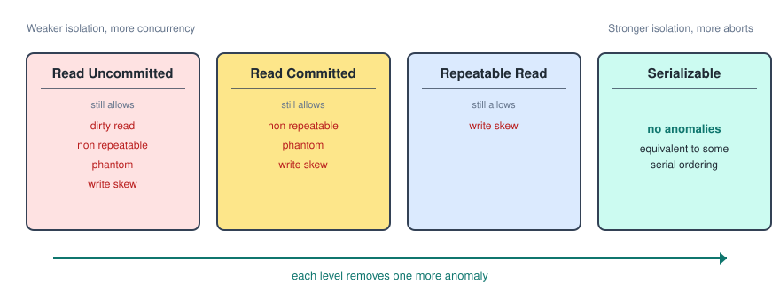

### Read Uncommitted

In the ANSI standard this level permits dirty reads, and it exists because in old lock based systems it meant acquiring no read locks at all, maximising throughput for approximate work.

**In PostgreSQL it does not exist.** You can write `BEGIN ISOLATION LEVEL READ UNCOMMITTED;` and the server accepts it without complaint, but it silently gives you Read Committed. Dirty reads are impossible under MVCC, because there is no code path that shows you an uncommitted version.

This is the first of two places where the textbook table and the real server disagree, so it is worth knowing both answers.

### Read Committed

This is **PostgreSQL's default**. A plain `BEGIN;` with no level specified gives you this.

It guarantees you only ever see committed data, and that is the whole promise. It allows non repeatable reads and phantoms.

The mechanism is that a **new snapshot is taken at the start of every statement**, so each query sees a consistent picture but successive queries in the same transaction can see different pictures.

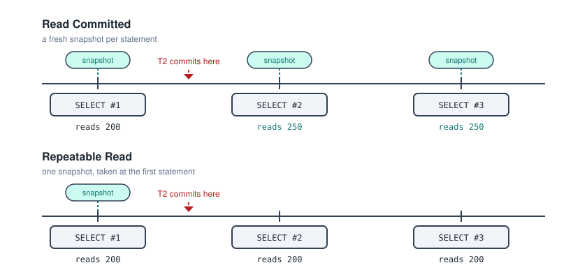

The write behaviour is the subtle part. If your `UPDATE` targets a row another transaction has locked, you **block and wait**. When the other transaction commits you do not fail. Instead you re read the newest committed version, re check whether it still satisfies your `WHERE` clause, and re evaluate your expression against the new value.

```sql
-- T1
UPDATE accounts SET balance = balance * 2 WHERE id = 3;   -- 300 becomes 600
-- T2 runs this and blocks
UPDATE accounts SET balance = balance + 100 WHERE id = 3;
-- T1 commits, T2 unblocks, re reads 600 rather than its original 300, computes 700
```

That re evaluation prevents lost updates on single statements, but it also means your statement effectively operated on a newer snapshot than the one it started with.

### Repeatable Read

Every statement in the transaction sees the same data. Read a row twice, get the same answer.

The snapshot is taken **once, at the first statement**, and held until the end. A common trap: it is the first statement, not `BEGIN` itself. You can sit at a `BEGIN` for an hour and still get a fresh snapshot when you finally run a `SELECT`.

```sql
BEGIN ISOLATION LEVEL REPEATABLE READ;
SELECT SUM(balance) FROM accounts;   -- 600, and the snapshot freezes here
-- another transaction inserts and updates and commits
SELECT SUM(balance) FROM accounts;   -- still 600
SELECT COUNT(*) FROM accounts;       -- still the original count
```

In the ANSI standard this level permits phantoms. **In PostgreSQL it does not**, because a frozen snapshot naturally excludes rows inserted afterwards. PostgreSQL's Repeatable Read is really snapshot isolation, which is strictly stronger than ANSI requires. That is the second divergence.

The cost is that **writes can now fail**. Since your reads are frozen, you cannot be allowed to write based on stale data. Updating a row that another transaction committed a change to after your snapshot gives you this.

```
ERROR: could not serialize access due to concurrent update
```

Read Committed would have silently re read and proceeded. Repeatable Read refuses, because proceeding would mean computing from a value you can no longer see. Any application using this level has to catch that error and retry the whole transaction. There is no partial recovery: once a transaction errors it is aborted, every subsequent statement returns that the transaction is aborted, and `COMMIT` acts as `ROLLBACK`.

It suits reports and multi query analyses that must be internally consistent. If you compute assets, liabilities and their difference in three separate queries, you need all three from the same instant or the arithmetic will not add up.

What it still permits is write skew, which is the gap the last level closes.

### Serializable

The outcome is equivalent to some serial execution of the transactions, with all four anomalies eliminated.

The mechanism is everything Repeatable Read does, plus **Serializable Snapshot Isolation**. PostgreSQL tracks not just which rows you wrote but which rows and predicates you **read**, using lightweight markers called SIREAD locks that block nothing. It then watches for dangerous patterns of read write dependency between concurrent transactions, and when it detects a cycle that could not arise in any serial ordering, it aborts one of them.

```
ERROR: could not serialize access due to read/write dependencies among transactions
```

---

## Write Skew, The Case For The Fourth Level

The rule is that at least one doctor must stay on duty. Alice and Bob are both on, and both want to go off.

```
T1: SELECT COUNT(*) WHERE on_duty;  -- 2, so "fine, I can go off"
T2: SELECT COUNT(*) WHERE on_duty;  -- 2, so "fine, I can go off"
T1: UPDATE ... Alice  -> off duty
T2: UPDATE ... Bob    -> off duty
```

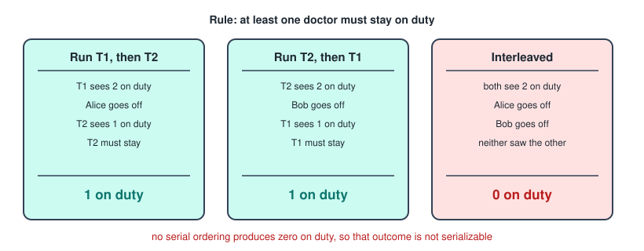

Different rows, so no write conflict. At Repeatable Read **both commit** and nobody is on duty. Serializable spots that T1 wrote something T2 had read and vice versa, which implies both that T1 came before T2 and that T2 came before T1. Both cannot be true, so there is a cycle, so no valid serial order exists, so one transaction is killed.

The mental shorthand for the three levels that matter in PostgreSQL.

- Read Committed asks: is this data committed?
- Repeatable Read asks: has the row I am writing changed since my snapshot?
- Serializable asks: has anything I **read** been changed by someone running alongside me?

Each level widens what counts as a conflict, from committed or not, to the rows I write, to the rows I read.

Four practical facts.

- **The error usually appears at `COMMIT`**, not at the offending statement, because PostgreSQL often cannot tell there is a cycle until it sees how things resolve.
- **The victim is arbitrary and innocent.** Whichever commits second usually loses, even though it did nothing wrong on its own. Serializability is a property of the set of transactions, not of any one of them.
- **Retry is mandatory.** On retry the transaction sees the new state and either succeeds or correctly declines. Without retry logic, Serializable just means random failures.
- **It is not implemented with locks.** No table locking, no reader blocking. It is still MVCC with extra bookkeeping about reads.

---

## Comparing The Levels

Reading across, the things actually worth memorising.

- **Snapshot taken**: per statement for Read Committed, per transaction for Repeatable Read and Serializable.
- **Dirty read**: ANSI allows it at Read Uncommitted, PostgreSQL never does.
- **Non repeatable read**: allowed at Read Uncommitted and Read Committed only.
- **Phantom**: ANSI allows it up to and including Repeatable Read, PostgreSQL stops it from Repeatable Read onward.
- **Write skew**: allowed everywhere except Serializable.
- **A conflicting write**: Read Committed blocks and then re reads, the higher two block and then error.
- **Retry logic needed**: no for the lower two, yes for the higher two.

→ almost every "what does this statement return" question reduces to when the snapshot was taken and whether a conflicting write blocks or errors.

---

## Savepoints

A savepoint is a named marker inside a transaction that you can roll back to, undoing everything after it while keeping everything before it and leaving the transaction open.

Without savepoints, `ROLLBACK` is all or nothing. Savepoints give you partial undo.

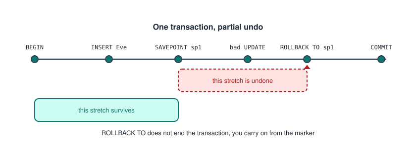

```sql
BEGIN;
    INSERT INTO accounts VALUES (5, 'Eve', 500);

    SAVEPOINT before_transfer;

    UPDATE accounts SET balance = balance - 100 WHERE id = 5;
    UPDATE accounts SET balance = balance + 100 WHERE id = 99;   -- id 99 does not exist

    ROLLBACK TO SAVEPOINT before_transfer;   -- undo just the transfer

    UPDATE accounts SET balance = balance - 100 WHERE id = 5;
    UPDATE accounts SET balance = balance + 100 WHERE id = 1;    -- the correct target
COMMIT;
```

Eve's insert survives, the failed transfer is erased, one transaction and one commit.

The three commands.

```sql
SAVEPOINT name;              -- create a marker
ROLLBACK TO SAVEPOINT name;  -- undo back to it, the transaction stays open
RELEASE SAVEPOINT name;      -- discard the marker, keep the work
```

`ROLLBACK TO` does **not** end the transaction, which is the entire point. `RELEASE` says you no longer need to return there, undoes nothing, and is purely housekeeping.

### Why They Matter In PostgreSQL

Any error aborts the whole transaction. After one, every subsequent statement returns that the transaction is aborted and commands are ignored, and `COMMIT` silently behaves as `ROLLBACK`.

Savepoints are the escape hatch, because `ROLLBACK TO SAVEPOINT` clears the aborted state and returns the transaction to working condition.

```sql
BEGIN;
    SAVEPOINT sp1;
    INSERT INTO accounts VALUES (1, 'Duplicate', 0);   -- ERROR
    ROLLBACK TO SAVEPOINT sp1;                          -- the transaction revives
    INSERT INTO accounts VALUES (9, 'Fine', 100);       -- works
COMMIT;                                                 -- row 9 is saved
```

This is how "try this, and if it fails do something else" is implemented in SQL. It is also how most database drivers implement nested transactions, since PostgreSQL has no true nesting, only savepoints wearing a costume.

Savepoints stack, and rolling back to an earlier one destroys all later ones. You can reuse a name, in which case the new one shadows the old, which is confusing enough to avoid.

Things that catch people out.

- **A savepoint is not a commit.** Nothing is durable, nothing is visible to other transactions, and no locks are released.
- **Locks acquired after a savepoint are not released by rolling back to it.** The data changes are undone but the row locks are held until the transaction ends.
- **They do not change isolation behaviour.** Your snapshot is not reset, and a serialization failure is not recoverable this way. You must retry the whole transaction.
- **Some errors are unrecoverable** even with savepoints, such as running out of disk, losing the connection, or deadlock detection.
- **They cost something.** Each consumes a subtransaction ID, so thousands of them in one transaction degrades performance noticeably.

---

## Indexes

A table in PostgreSQL is stored as a **heap**, an unordered pile of rows. To answer `WHERE email = 'ana@example.com'` with no index, the database reads every row and tests each one. That is a sequential scan, and its cost grows linearly with table size.

An index is a **separate data structure** storing the indexed values in sorted order, each paired with a pointer to the row's physical location. Because it is sorted, the database can search it rather than scan it.

The book analogy is exact. To find every mention of normalization you either flip through all 400 pages, or you turn to the index at the back and jump straight to pages 88 and 214. The index is redundant, since the information already exists in the book, but it converts a linear search into a near instant lookup.

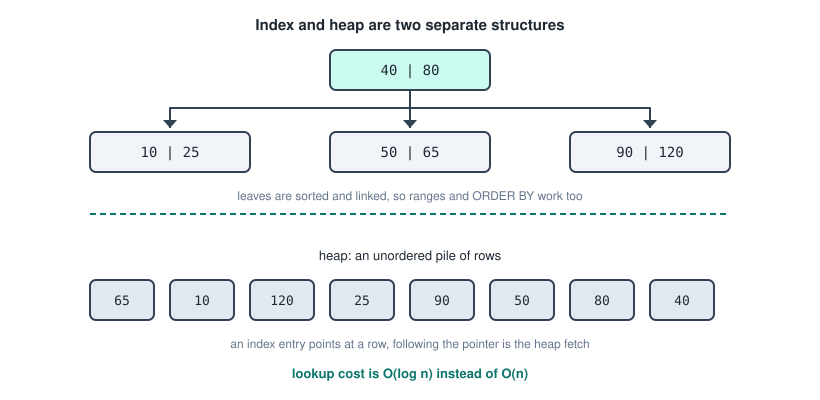

The default structure is a **B-tree**, and three of its properties matter.

- Lookup cost is **O(log n)**, not O(n). A million rows is roughly 20 comparisons deep and a billion is about 30, which is why indexes matter more as data grows.
- The tree is kept **balanced** automatically, so performance does not degrade with insertion order.
- Leaves are stored **sorted and linked**, so a B-tree serves equality, ranges, `ORDER BY`, and prefix matching, not just `=`.

Two things follow from this that are easy to get wrong.

**An index changes nothing about your results.** It is a pure performance structure, and the same query returns identical rows with or without it. You never reference an index in a query, the planner decides whether to use it.

**The planner may decide not to.** If a query will return 60% of the table, ignoring the index and scanning sequentially is correct, because jumping between index and heap for that many rows is slower than one clean pass.

---

## Types Of Index

Most indexes you create will be a plain B-tree on one column, but the variants exist because different query shapes need different structures, and knowing them is what lets you index a low cardinality column usefully or make a cast sargable.

### Clustered Vs Non Clustered

A **clustered index** stores the table's rows physically in the index's order, so the index and the data are the same structure and the leaf nodes are the rows. You can only have one per table, range queries are extremely fast because matching rows are physically adjacent, and no second lookup is needed. Inserts in the middle are expensive.

A **non clustered index** is a separate structure holding sorted keys plus pointers. You can have many per table, and every lookup is two steps: search the index, then follow the pointer to fetch the row from the heap. That second step is the **heap fetch**, and it is why the planner abandons indexes for non selective queries.

**PostgreSQL has no clustered indexes at all.** Every index is non clustered and separate from the heap, even the primary key. What it has instead is a `CLUSTER` command.

```sql
CLUSTER accounts USING accounts_pkey;
```

That is a one off physical reorder to match an index. It is not maintained, so new inserts land wherever there is space and the ordering degrades until you run it again. It is a maintenance operation, not an index type.

SQL Server and MySQL with InnoDB do have true clustered indexes, and in InnoDB the primary key always is one, so the concept is standard even though PostgreSQL lacks it.

### Unique Index

Enforces that no two rows share a value, being a constraint and an index at the same time.

```sql
CREATE UNIQUE INDEX idx_email ON users(email);
```

You mostly get these for free, since declaring `PRIMARY KEY` or `UNIQUE` creates one behind the scenes. That is how the database enforces uniqueness, by checking the index before every insert.

One quirk: **NULLs are not equal to each other**, so a plain unique index permits multiple NULLs. PostgreSQL 15 and later let you override that with `UNIQUE NULLS NOT DISTINCT`.

### Composite Index

Indexes several columns together, sorted by the first, then by the second within ties.

```sql
CREATE INDEX idx_name ON employees(last_name, first_name);
```

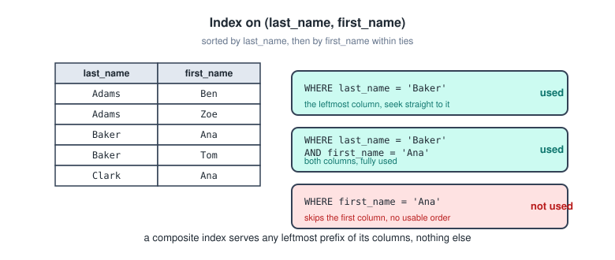

**Column order is everything.** A composite index can be used for any **leftmost prefix** of its columns and nothing else. The phone book analogy is exact: a directory sorted by surname then forename finds all the Smiths or John Smith instantly, but is useless for everyone named John.

The rule of thumb for ordering is **equality columns first, range columns last**. For `WHERE dept = 'Sales' AND hire_date > '2020-01-01'`, index `(dept, hire_date)`. The reverse works far worse, because once you have traversed a range the remaining columns are no longer in usable order.

### Partial Index

Indexes only the rows matching a condition.

```sql
CREATE INDEX idx_active_orders ON orders(created_at)
WHERE status = 'active';
```

Smaller index, faster to search, cheaper to maintain, because you only pay for the rows you care about. It suits queries that consistently filter on a condition matching a small slice of the table, such as active records among millions of archived ones.

The catch is that the planner only uses it if it can prove your `WHERE` clause implies the index's condition, so a query without `status = 'active'` will not touch it.

A partial unique index also expresses constraints that plain `UNIQUE` cannot.

```sql
CREATE UNIQUE INDEX ON employees(dept_id) WHERE is_manager;
-- at most one manager per department
```

### Expression And Covering Indexes

An **expression index** indexes a computed value.

```sql
CREATE INDEX idx_lower_email ON users(LOWER(email));
CREATE INDEX idx_booking_date ON bookings((starttime::date));
```

That second one directly solves the timestamp problem from earlier. `WHERE starttime::date = '2012-09-21'` normally cannot use an index on `starttime`, but with this expression index it can, because the index stores exactly the value being compared.

A **covering index** includes extra columns so the query never touches the heap.

```sql
CREATE INDEX idx_cover ON orders(customer_id) INCLUDE (total);
```

If the query only needs `customer_id` and `total`, everything is in the index and the heap fetch is skipped, which the planner calls an index only scan.

---

## When To Create An Index

Look at your actual queries, and index columns appearing in these places.

- **`WHERE` clauses**, the primary case, especially in queries that run often.
- **`JOIN` conditions**, on both sides. Primary keys are indexed automatically but **foreign keys are not** in PostgreSQL, so `orders.customer_id` has a constraint and no index, and every join scans the whole orders table. This is one of the most common real performance bugs.
- **`ORDER BY` and `GROUP BY`**, since a sorted index lets the planner skip the sort entirely.
- **Columns used in `MIN` or `MAX`**, where the answer is the first or last index entry.

### Selectivity Decides

Selectivity is distinct values divided by total rows, and it is the deciding factor.

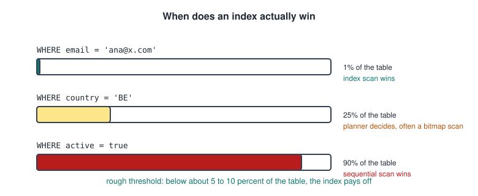

- `email`, all unique, selectivity near 1.0, and an index is excellent.
- `country`, 200 values across a million rows, marginal.
- `gender`, three values, no, and the planner will ignore an index anyway.
- `is_deleted`, two values with 99% false, only worth it as a **partial** index on the rare value.

The principle is that an index pays off when it eliminates most of the table. If `WHERE status = 'active'` matches 90% of rows you will do 900,000 random heap fetches instead of one sequential scan, so the index is slower. The rough threshold is below about 5 to 10 percent of the table.

That is also why low cardinality columns are the classic case for a partial index. `WHERE is_deleted = false` is useless, but an index restricted to `WHERE is_deleted = true` is small and highly selective.

### What A Primary Key Gives You

Declaring a primary key automatically creates a **unique B-tree index**, whether you want it or not, because the database has to enforce uniqueness somehow.

- `PRIMARY KEY` creates a unique index.
- `UNIQUE` creates a unique index.
- `FOREIGN KEY` creates **nothing**.
- `CHECK` and `NOT NULL` need no index.

That third line is the one that matters. A foreign key is referenced by the parent's index, but the child column itself gets nothing, so you index it yourself.

```sql
CREATE INDEX idx_enrolments_student ON enrolments(student_id);
```

It matters for deletes too, since without it, deleting a student forces a full scan of enrolments to check for orphans.

Two details. A **composite primary key gives you one composite index**, not several, so the leftmost prefix rule applies. And you cannot drop the index independently, since it belongs to the constraint, so you drop the constraint instead.

---

## The Cost Of Indexes

Everything above is the benefit column. Here is the other one.

- **Write penalty.** Every `INSERT`, `UPDATE` and `DELETE` must update every affected index as well as the table. Five indexes means an insert does six write operations, each potentially splitting B-tree pages.
- **Storage.** An index typically runs 10 to 30 percent of the table's size and can exceed it. That is disk, but also **memory**, since indexes compete for the same buffer cache as your data, so useless indexes actively evict useful pages.
- **Maintenance.** B-trees fragment as rows are updated and deleted, gradually bloating into pages that are mostly dead space. They need periodic `REINDEX`, and `VACUUM` has to clean dead entries.
- **Planner overhead.** Each candidate index is another path to evaluate. Marginal, but it adds up on tables with dozens.
- **Unused indexes are pure cost**, imposing every write penalty and consuming every byte while returning nothing.

```sql
SELECT indexrelname, idx_scan
FROM pg_stat_user_indexes
WHERE idx_scan = 0;
```

Redundant indexes are a hidden cost too. Given `(last_name, first_name)`, a separate index on `(last_name)` is almost always redundant, since the composite already serves that prefix.

→ an index trades write speed and storage for read speed, and pays off when it lets a frequently run query skip most of the table.

---

## Sargability

An index on a column is only usable if the query leaves that **column bare** on one side of the comparison. Wrapping it in a function or a cast defeats it.

```sql
WHERE LOWER(email) = 'ana@x.com'          -- no, unless an expression index exists
WHERE starttime::text LIKE '2012-09-21%'  -- no
WHERE price / 50 > 10                     -- no
WHERE email = 'ana@x.com'                 -- yes
WHERE starttime >= '2012-09-21'
  AND starttime <  '2012-09-22'           -- yes
WHERE price > 500                         -- yes
WHERE name LIKE 'Tennis%'                 -- yes, a prefix match works
WHERE name LIKE '%Court'                  -- no, a leading wildcard cannot
```

That last pair is worth understanding rather than memorising. A B-tree is sorted left to right, so it can seek to a known prefix but has no way to find entries by their ending.

The same logic explains why `WHERE starttime::text LIKE '2012-09-21%'` is a bad habit even though it returns the right rows. It kills index usage, it depends on the `DateStyle` session setting so the same value might render as `21/09/2012` and match nothing, and it is string matching pretending to be date logic, which falls apart the moment you want a range.

---

## EXPLAIN, ANALYZE, And EXPLAIN ANALYZE

The terminology is confusing because **`ANALYZE` means two different things**.

- **`EXPLAIN query`** shows the plan the planner would use, with estimated costs and row counts. The query is **not executed**. Instant and risk free.
- **`ANALYZE table`** is a separate maintenance command with nothing directly to do with plans. It samples the table and updates the statistics the planner relies on.
- **`EXPLAIN ANALYZE query`** actually **executes** the query, then shows the plan annotated with both estimates and real measurements. Here `ANALYZE` is a keyword modifier, not the maintenance command.

```sql
ANALYZE bookings;              -- refresh the stats for one table
ANALYZE;                       -- the whole database
VACUUM ANALYZE bookings;       -- clean dead rows and refresh stats
```

Useful options.

```sql
EXPLAIN (ANALYZE, BUFFERS) SELECT ...;   -- adds disk and cache page reads
EXPLAIN (ANALYZE, VERBOSE) SELECT ...;   -- adds column lists
EXPLAIN (COSTS OFF) SELECT ...;          -- structure only
```

Only `EXPLAIN ANALYZE` gives you actual figures, which is why detecting a bad estimate requires it. `EXPLAIN` alone has nothing to compare against.

---

## Reading A Plan

```
Hash Join  (cost=13.50..312.75 rows=430 width=36) (actual time=0.412..4.881 rows=428 loops=1)
  Hash Cond: (b.facid = f.facid)
  ->  Seq Scan on bookings b  (cost=0.00..245.00 rows=4044 width=20) (actual time=0.008..1.902 rows=4044 loops=1)
  ->  Hash  (cost=11.00..11.00 rows=200 width=24) (actual time=0.381..0.382 rows=9 loops=1)
        ->  Seq Scan on facilities f  (cost=0.00..11.00 rows=200 width=24) (actual time=0.011..0.015 rows=9 loops=1)
Planning Time: 0.234 ms
Execution Time: 5.102 ms
```

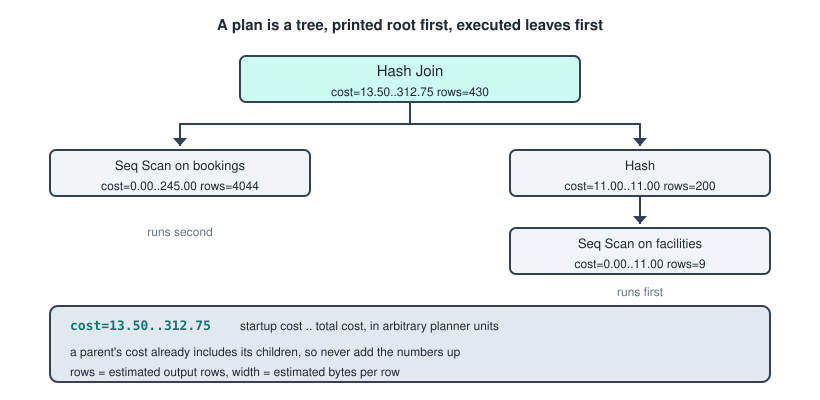

It is a tree printed with the root at the top, and you **read it inside out and bottom up**. The most indented nodes run first, feed rows to their parent, and so on up.

The cost pair `cost=13.50..312.75` is **startup cost** then **total cost**, meaning the work before the first row can be emitted and the work to return all rows. The units are arbitrary planner units, not milliseconds, where 1.0 is roughly the cost of reading one page sequentially. They are only meaningful relative to each other, which is exactly what you need when comparing two plans.

Startup cost matters more than people expect. A sort or a hash build must consume all its input before emitting anything, so with a `LIMIT 10` a plan with startup 0 and total 5000 beats one with startup 4000 and total 4500, because you bail out early.

**A parent's cost already includes its children's**, so the top node's total is the whole query and you never add the numbers up.

The actual section, present only with `ANALYZE`, gives real milliseconds as `actual time=0.412..4.881`, the rows actually produced, and `loops`, the number of times the node ran.

**The loops trap** is the most commonly missed thing in plan reading. When `loops > 1`, the reported time and rows are **per loop averages**. A node showing `actual time=0.05..0.08 rows=1 loops=50000` looks trivial but really consumed 50000 times 0.08, which is 4 seconds. That is the classic sign of a bad nested loop.

`Planning Time` is how long it took to choose the plan and `Execution Time` how long running it took. For a trivial query, planning can dominate.

---

## Node Types

The scan nodes, in order of how selective the query has to be to justify them.

- **`Seq Scan`** reads every page of the table. Right for small tables or when returning a large fraction.
- **`Index Scan`** walks the index and fetches each row from the heap. Right for high selectivity.
- **`Index Only Scan`** answers entirely from the index with no heap fetch. The best case.
- **`Bitmap Heap Scan`** collects matching row locations, sorts them, then reads the heap in physical order. The middle ground.

A `Seq Scan` is **not automatically bad**. On a nine row facilities table it is the correct choice and the planner knows it, so treating "Seq Scan equals inefficient" as a rule is a trap.

The join nodes.

- **`Nested Loop`** scans the inner side once for each outer row. Right when one side is tiny or the inner has an index. Over two large tables it is the classic disaster, being O(n times m), and you will see it with a huge `loops` count.
- **`Hash Join`** builds a hash of the smaller side and probes with the larger. Right for large unsorted inputs on an equality join.
- **`Merge Join`** walks two already sorted inputs in step.

Other nodes worth recognising are `Sort`, where `Sort Method: external merge Disk: 24MB` means the sort spilled to disk and is a red flag, plus `Aggregate`, `HashAggregate`, `Materialize`, `Gather` for parallel workers, and `Limit`.

---

## Why Statistics Matter

The planner does not look at your data when planning. It estimates using statistics collected by `ANALYZE`, stored in `pg_statistic` and readable through `pg_stats`.

```sql
SELECT attname, n_distinct, most_common_vals, null_frac
FROM pg_stats WHERE tablename = 'bookings';
```

The key pieces are `n_distinct`, the number of distinct values driving selectivity estimates, the `most_common_vals` list handling skewed data, a histogram for range estimates, `null_frac`, and `correlation`, which measures how well physical order matches sorted order and determines whether an index scan is cheap.

By default this comes from a sample of about 30,000 rows rather than the whole table.

The causal chain is the thing to remember.

→ stale or missing statistics, so a wrong row estimate, so a wrong cost estimate, so a wrong plan choice, so a slow query.

An example: the planner thinks `WHERE status = 'pending'` matches 5 rows and picks a nested loop. Actually 500,000 rows match, and the nested loop runs half a million times. The plan was not unreasonable given what the planner believed, the belief was wrong.

Statistics go stale after bulk inserts, big updates, or when autovacuum has not caught up, and the fix is often just `ANALYZE tablename;`.

Two other statistics failures worth naming. **Correlated columns**, because PostgreSQL assumes independence, so `WHERE city = 'Leuven' AND country = 'Belgium'` multiplies two selectivities and badly underestimates when the conditions overlap almost entirely, fixable with `CREATE STATISTICS`. And **expressions**, since `WHERE LOWER(email) = ...` has no statistics at all unless you have an expression index.

---

## Detecting Misestimates

Compare the estimated `rows=` against the actual `rows=` at every node.

```
->  Index Scan on orders  (cost=... rows=12 ...) (actual ... rows=48213 loops=1)
```

An estimate of 12 against an actual of 48,213 is a 4000 times misestimate, and that node's plan choice was made on fiction.

- Within about 2 to 3 times is fine and can be ignored.
- 10 times off is suspicious.
- 100 times or more and the plan is likely wrong.

Two rules for reading it. **Find the deepest node where the error starts**, because misestimates propagate upward and fixing the root fixes the rest. And **multiply by loops before judging**, since `rows=1 loops=50000` means 50,000 rows.

The typical causes and fixes are stale statistics fixed by `ANALYZE`, a skewed distribution fixed by raising `default_statistics_target` and re analysing, correlated columns fixed by `CREATE STATISTICS`, and a non sargable expression fixed by an expression index.

---

## Comparing Two Plans

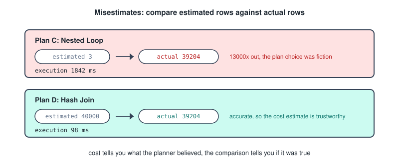

Work through these in order.

1. **Compare the top node's total cost.** This is the planner's own verdict, and usually the intended answer, but only if the estimates are trustworthy.
2. **Check estimated against actual rows at every node.** If plan A has a lower cost but a 1000 times misestimate while plan B's estimates track reality, plan B is likely genuinely faster despite the higher predicted cost.
3. **If actuals are given, compare `Execution Time`.** Real measurement beats estimate, and this is decisive.
4. **Look at scan types in context.** Index Only Scan beats Index Scan beats Bitmap Heap Scan beats Seq Scan, but only when selectivity is high.
5. **Look at join types and loop counts.** A nested loop with a large `loops` value on the inner side is the classic red flag.
6. **Scan for specific warning signs**, being a sort spilling to disk, a huge `width` meaning you selected columns you do not need, `Rows Removed by Filter: 950000` meaning a missing index, or a deeply nested `Materialize` under a nested loop.
7. **Mind startup cost when there is a `LIMIT`**, since low startup wins for small limits even with a higher total.

A worked pair. Same query, two plans.

```
-- Plan A
Seq Scan on bookings  (cost=0.00..245.00 rows=4 width=20)
                      (actual time=0.021..2.140 rows=4 loops=1)
  Filter: (memid = 84)
  Rows Removed by Filter: 4040
Execution Time: 2.165 ms

-- Plan B
Index Scan using idx_memid on bookings  (cost=0.29..8.31 rows=4 width=20)
                                        (actual time=0.018..0.024 rows=4 loops=1)
  Index Cond: (memid = 84)
Execution Time: 0.041 ms
```

B wins. Cost 8.31 against 245.00 and execution 0.041 ms against 2.165 ms. Both estimate 4 rows and both return 4, so the statistics are accurate and the cost estimates are trustworthy. The giveaway in A is `Rows Removed by Filter: 4040`, meaning it read 4,044 rows to keep 4.

Now the trickier variant.

```
-- Plan C
Nested Loop  (cost=0.29..45.20 rows=3 width=40)
             (actual time=0.03..1842.55 rows=39204 loops=1)
  ->  Index Scan on a  (cost=0.29..8.30 rows=3 ...) (actual ... rows=39204 loops=1)
  ->  Index Scan on b  (cost=0.00..12.30 rows=1 ...) (actual time=0.04..0.04 rows=1 loops=39204)

-- Plan D
Hash Join  (cost=280.00..1150.00 rows=40000 width=40)
           (actual time=12.1..98.4 rows=39204 loops=1)
```

D wins despite a 25 times higher estimated cost. Plan C estimated 3 rows against an actual 39,204, a misestimate of roughly 13,000 times, and on that false premise the planner chose a nested loop whose inner side then ran 39,204 times. Actual execution was 1,842 ms against 98 ms. C's low cost number is a symptom of the error, not evidence of efficiency.

→ cost tells you what the planner believed, the estimated against actual comparison tells you whether the belief was true.

---

## Using EXPLAIN Safely

`EXPLAIN` is always safe, since nothing runs.

`EXPLAIN ANALYZE` genuinely executes the query, and for DML that means **the data actually changes**.

```sql
EXPLAIN ANALYZE DELETE FROM accounts WHERE balance < 100;
-- the rows are really deleted
```

The safe pattern wraps it in a transaction and rolls back.

```sql
BEGIN;
EXPLAIN ANALYZE UPDATE accounts SET balance = balance * 1.05;
ROLLBACK;
```

You get real timings and the changes are discarded, though it still takes locks and does the work while running.

The decision rule is to use plain `EXPLAIN` when the query might run for a long time, for any `INSERT`, `UPDATE` or `DELETE` you are not wrapping in a rollback, and on a production system with an unknown query. Use `EXPLAIN ANALYZE` when you need real timings or misestimate detection.

Two caveats. `EXPLAIN ANALYZE` adds measurement overhead by instrumenting every node, so reported times can exceed the query's normal runtime, and that hits plans with many loops hardest. And results are affected by caching, so a cold first run looks far worse than a warm second run. Run twice before drawing conclusions.

---

## Views

A view is a **stored query that behaves like a table**.

```sql
CREATE VIEW active_students AS
SELECT id, name, year
FROM students
WHERE status = 'active';
```

From then on you can write `SELECT * FROM active_students WHERE year = 2`.

The crucial point is that **a view stores no data**. It stores the text of the query, and when you select from it PostgreSQL substitutes that query and runs the combination against the real tables. That is why it is sometimes called a virtual table.

Two consequences follow immediately.

- **A view is always current**, because it reads the base tables live. There is no staleness because there is nothing cached.
- **A view costs what its query costs.** Selecting from a view is not faster than writing the query out, and if the underlying query is slow, the view is slow.

---

## What Views Are For

Three purposes, and they map onto the three reasons anyone creates one.

**Simplification.** A complex join gets written once and reused.

```sql
CREATE VIEW enrolment_details AS
SELECT s.id        AS student_id,
       s.name      AS student_name,
       c.title     AS course_title,
       c.credits,
       e.grade
FROM students s
JOIN enrolments e ON s.id = e.student_id
JOIN courses    c ON e.course_id = c.id;
```

A five table join becomes `SELECT * FROM enrolment_details`, which helps non technical users, reporting tools, and your own future queries.

**Consistency and integrity.** If the definition of an active student lives in one view, every report uses the same definition. Without it one analyst writes `WHERE status = 'active'`, another writes `WHERE status <> 'archived'`, and the numbers silently disagree.

Views also insulate against schema change. Split `students` into two tables and you can redefine the view to join them, and every query using the view keeps working. That is **logical data independence**.

**Security.** Grant access to the view rather than the table, which gets its own section below.

---

## Managing Views

```sql
CREATE VIEW v AS SELECT ...;
CREATE OR REPLACE VIEW v AS SELECT ...;   -- redefine
DROP VIEW v;
DROP VIEW IF EXISTS v CASCADE;            -- also drops views built on it
ALTER VIEW v RENAME TO w;
```

One restriction worth knowing: `CREATE OR REPLACE VIEW` can add columns at the end, but it **cannot remove columns, rename them, or change their types**. For that you must drop and recreate, which also drops any privileges granted on it and any views depending on it.

```sql
SELECT viewname, definition FROM pg_views WHERE schemaname = 'public';
```

In pgAdmin views sit under Schemas, then public, then Views, and the SQL tab shows the stored definition, usually reformatted, because PostgreSQL rewrites your query text into a canonical form.

---

## Updatable Views

You can sometimes write through a view. A view is **automatically updatable** when it is simple enough for PostgreSQL to map rows back unambiguously, which means all of these hold.

- Exactly one table or updatable view in `FROM`.
- No `DISTINCT`, `GROUP BY`, `HAVING`, `LIMIT` or `OFFSET`.
- No set operations.
- No window functions or aggregates in the select list.

```sql
CREATE VIEW second_years AS
SELECT id, name, year FROM students WHERE year = 2;

UPDATE second_years SET name = 'Ana B.' WHERE id = 3;   -- works
```

If the view aggregates or joins there is no sensible way to translate the write, and PostgreSQL refuses. You can still make such a view writable with an **`INSTEAD OF` trigger**, which is the trigger type that only works on views.

---

## WITH CHECK OPTION

Consider this insert through the view above.

```sql
INSERT INTO second_years VALUES (99, 'Zoe', 4);
```

It **succeeds**, but the row has `year = 4`, so it immediately vanishes from the view. You have inserted a row the view cannot see, and by default PostgreSQL permits that.

```sql
CREATE VIEW second_years AS
SELECT id, name, year FROM students WHERE year = 2
WITH CHECK OPTION;

INSERT INTO second_years VALUES (99, 'Zoe', 4);
-- ERROR: new row violates check option for view "second_years"
```

Now every row written through the view must satisfy the view's `WHERE` clause. There are two variants: `WITH LOCAL CHECK OPTION` checks only this view's condition, and `WITH CASCADED CHECK OPTION` also checks the conditions of underlying views, which is the **default** when you write it plainly.

This matters enormously for security views, because without it a user restricted to their own department's rows could insert rows into other departments.

---

## Database Security

Three terms first.

- **Authentication** is proving who you are, handled outside SQL in the `pg_hba.conf` file.
- **Authorization** is what you are allowed to do once identified, which is `GRANT` and `REVOKE`.
- **The principle of least privilege** is giving each account the minimum rights it needs, and it is the organising idea behind everything else.

### Users And Roles Are The Same Thing

In PostgreSQL there is one underlying concept, a **role**, and a user is simply a role with the `LOGIN` attribute.

```sql
CREATE USER ana WITH PASSWORD 'secret';
-- is exactly equivalent to
CREATE ROLE ana WITH LOGIN PASSWORD 'secret';
```

So a role with `LOGIN` is a user account, and a role without it is a group you grant privileges to and then assign users into. Roles are **cluster wide**, not per database, so one `ana` exists across the whole server.

```sql
CREATE USER temp_worker WITH PASSWORD 'x' VALID UNTIL '2026-12-31';
CREATE ROLE analyst;                        -- a group, no login

ALTER USER ana WITH PASSWORD 'newsecret';
ALTER USER ana WITH NOLOGIN;                -- disable the account
ALTER ROLE ana WITH CREATEDB;

DROP USER ana;
```

The attributes you can set are `LOGIN` and `NOLOGIN`, `SUPERUSER` which bypasses all permission checks and should almost never be used, `CREATEDB`, `CREATEROLE`, `PASSWORD`, `VALID UNTIL`, and `CONNECTION LIMIT n`.

A `DROP USER` trap: you cannot drop a role that still owns objects or holds privileges, so you reassign or drop them first.

```sql
REASSIGN OWNED BY ana TO postgres;
DROP OWNED BY ana;
DROP USER ana;
```

---

## GRANT And REVOKE

The general shape is always the same.

```sql
GRANT  <privileges> ON <object> TO   <role>;
REVOKE <privileges> ON <object> FROM <role>;
```

Table privileges are `SELECT`, `INSERT`, `UPDATE`, `DELETE`, `TRUNCATE`, `REFERENCES`, `TRIGGER`, or `ALL PRIVILEGES`.

```sql
GRANT SELECT ON students TO ana;
GRANT SELECT, INSERT, UPDATE ON students TO ana;
GRANT SELECT ON ALL TABLES IN SCHEMA public TO analyst;
```

Column level privileges are genuinely useful and are an alternative to a security view.

```sql
GRANT SELECT (id, name) ON students TO ana;       -- cannot see the other columns
GRANT UPDATE (name) ON students TO ana;
```

Schema privileges matter because a user needs `USAGE` on the schema before any table privilege inside it does anything.

```sql
GRANT USAGE ON SCHEMA public TO ana;              -- required first
GRANT CREATE ON SCHEMA staging TO ana;            -- allows creating objects
GRANT CONNECT ON DATABASE university TO ana;
```

`WITH GRANT OPTION` lets the recipient pass a privilege on to others, and revoking a privilege that was passed on needs `CASCADE` to strip the downstream grants.

```sql
GRANT SELECT ON students TO ana WITH GRANT OPTION;
REVOKE GRANT OPTION FOR SELECT ON students FROM ana;
```

`PUBLIC` is a pseudo role meaning everyone, including future users. Two defaults are worth knowing: everyone has `CONNECT` on new databases and `EXECUTE` on new functions by default, so hardening usually starts by revoking those.

```sql
GRANT SELECT ON course_catalog TO PUBLIC;
REVOKE ALL ON students FROM PUBLIC;
```

---

## Roles As Groups

This is the scalable pattern and the reason roles exist as a separate concept.

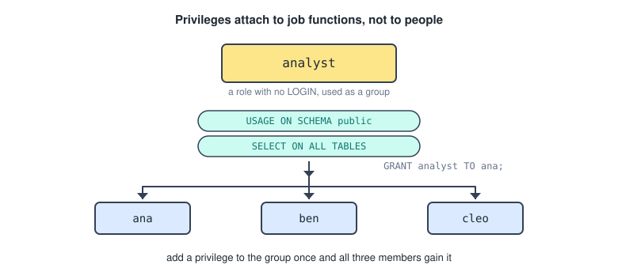

```sql
CREATE ROLE analyst;                                    -- the group

GRANT USAGE ON SCHEMA public TO analyst;                -- privileges, granted once
GRANT SELECT ON ALL TABLES IN SCHEMA public TO analyst;

CREATE USER ana WITH PASSWORD 'x';
CREATE USER ben WITH PASSWORD 'y';

GRANT analyst TO ana;                                   -- membership
GRANT analyst TO ben;
```

Ana and Ben inherit everything `analyst` has, and adding a privilege to the group gives it to both instantly. Removing someone is `REVOKE analyst FROM ana;`.

The reason this is right is that privileges attach to **job functions**, not individuals, so when someone changes role you move their group membership rather than auditing dozens of individual grants. Roles nest too.

By default a member automatically uses the group's privileges. With `NOINHERIT` the member has to run `SET ROLE analyst;` to activate them, which is a deliberate action safeguard for powerful roles.

One subtlety: `GRANT SELECT ON ALL TABLES` affects only tables that exist right now, so tables created tomorrow are not covered.

```sql
ALTER DEFAULT PRIVILEGES IN SCHEMA public
GRANT SELECT ON TABLES TO analyst;
```

---

## Views As A Security Mechanism

Here the two topics meet, and the technique is simple.

→ revoke access to the base table, and grant access to a view exposing only part of it.

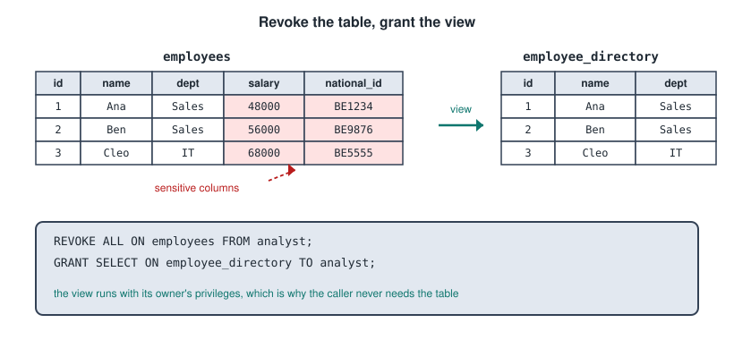

### Column Level, Vertical

```sql
CREATE VIEW employee_directory AS
SELECT emp_id, name, department, email, phone
FROM employees;

REVOKE ALL ON employees FROM analyst;
GRANT SELECT ON employee_directory TO analyst;
```

An analyst sees five columns and cannot query `employees` at all, so the sensitive columns are genuinely inaccessible rather than merely hidden in a UI.

### Row Level, Horizontal

```sql
CREATE VIEW my_department_employees AS
SELECT emp_id, name, department, email
FROM employees
WHERE department = CURRENT_USER;

GRANT SELECT ON my_department_employees TO PUBLIC;
```

`CURRENT_USER` returns the connected role's name, so **the same view returns different rows to different people**. That is the trick that lets one view serve everyone. More realistically you would join to a mapping table.

```sql
CREATE VIEW my_department_employees AS
SELECT e.emp_id, e.name, e.department, e.email
FROM employees e
JOIN user_departments ud ON e.department = ud.department
WHERE ud.username = CURRENT_USER;
```

Combining both, with writes allowed, is where `WITH CHECK OPTION` earns its keep.

```sql
CREATE VIEW my_team AS
SELECT emp_id, name, email, phone
FROM employees
WHERE manager = CURRENT_USER
WITH CHECK OPTION;

GRANT SELECT, UPDATE ON my_team TO managers;
```

Without the check option, a manager could reassign an employee to a different manager and push the row out of their own scope.

### Why It Works At All

If the user has no rights on `employees`, how does the view read it? Because by default a view executes with the **privileges of the view's owner**, not the caller. The owner has access, so the query succeeds, while the caller never touches the base table.

Since PostgreSQL 15 you can flip that.

```sql
CREATE VIEW v WITH (security_invoker = true) AS SELECT ...;
```

Now the view runs with the caller's privileges, so the caller needs rights on the base table. That is the opposite of what a security view wants, but it is right when the view is purely for convenience.

There is also `security_barrier`. Without it, a clever user can supply a `WHERE` clause containing a function the planner might evaluate before the view's own filter, leaking rows it should not. Setting it forces the view's conditions to be applied first.

### The Honest Limitations

- They only help if base table access is **actually revoked**. Grant both and you have achieved nothing.
- Users can still query `information_schema` and see that the hidden columns exist.
- Complex views are not updatable without `INSTEAD OF` triggers.
- Without `security_barrier`, side channel leakage is possible.
- A superuser bypasses everything.

The modern alternative is native **Row Level Security**, which filters on the table itself so no view is needed and there is no way around it.

```sql
ALTER TABLE employees ENABLE ROW LEVEL SECURITY;

CREATE POLICY dept_policy ON employees
FOR SELECT
USING (department = CURRENT_USER);
```

---

## Materialized Views

The difference in one sentence: a regular view stores a **query**, a materialized view stores the **result of the query**.

```sql
CREATE MATERIALIZED VIEW sales_summary AS
SELECT region, product, SUM(amount) AS total, COUNT(*) AS orders
FROM sales
GROUP BY region, product;
```

This executes the query immediately and saves the output to disk as a real physical table. Selecting from it reads those stored rows and does not re run the aggregation.

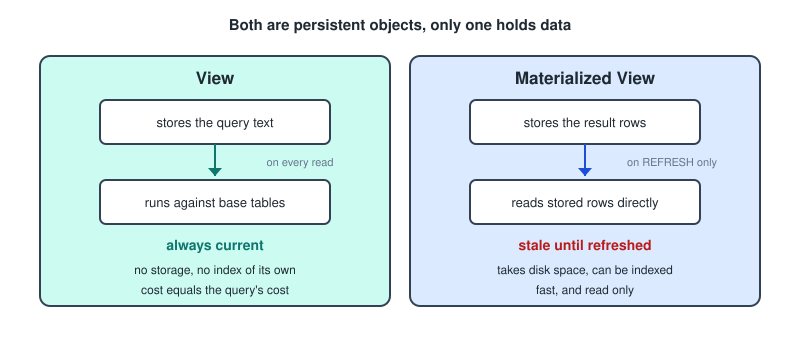

Speed is bought with freshness, and that is the whole decision. One row of that comparison is easy to overlook: because the result is a real table, **you can build indexes on it**, which you cannot do on a regular view.

### Refreshing

```sql
REFRESH MATERIALIZED VIEW sales_summary;
```

This re runs the whole query and replaces the stored contents. It takes an `ACCESS EXCLUSIVE` lock, so the matview is **unreadable while refreshing**, which is unacceptable if people are querying it.

```sql
REFRESH MATERIALIZED VIEW CONCURRENTLY sales_summary;
```

Readers can keep querying throughout, on two conditions. The matview must have a **unique index** on it, and it is slower overall than a plain refresh because it computes and applies a delta.

```sql
CREATE UNIQUE INDEX ON sales_summary (region, product);   -- the prerequisite
```

**Nothing refreshes automatically.** PostgreSQL has no auto refresh, so you schedule it with `pg_cron`, an external cron job, or a trigger on the base table which is usually too expensive.

→ how does a materialized view stay up to date? It does not, until you refresh it.

You can also create one empty with `WITH NO DATA`, in which case querying it raises an error until the first refresh.

### Choosing Between Them

Use a **regular view** when the data must be current, the query is cheap, you need write through, or the definition exists for convenience or security.

Use a **materialized view** when the query is expensive, it is queried far more often than the data changes, and slightly stale data is acceptable. The classic profile is expensive to compute, read constantly, tolerates being an hour old.

One security note: `CURRENT_USER` in a matview's defining query is evaluated **at refresh time**, not at query time, so a row filtering security matview would freeze one user's view of the data and show it to everyone. Use ordinary views for security.

---

## ON Vs WHERE

The rule is short. **`ON` decides what counts as a match, `WHERE` filters the result after the join is assembled.**

For an `INNER JOIN` the distinction is invisible, since the two are interchangeable. For **outer joins** it changes the answer completely.

An outer join runs in two conceptual phases. First it matches using `ON`, and left rows finding no match get a row of NULLs on the right side. Then it filters using `WHERE`, applied to the assembled result including those NULL padded rows.

So a `WHERE` condition on a right table column rejects the NULL padded rows, because `NULL = anything` is NULL rather than true. The unmatched left rows silently vanish and your `LEFT JOIN` degrades into an inner join.

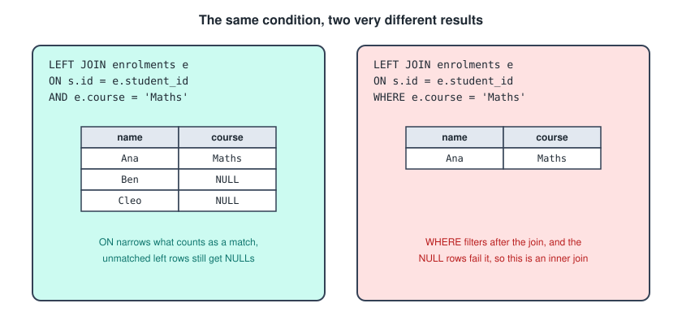

With students Ana, Ben and Cleo, where Ana takes Maths and Physics and Ben takes Chemistry, the two versions give different answers.

```sql
SELECT s.name, e.course
FROM students s
LEFT JOIN enrolments e
       ON s.student_id = e.student_id
      AND e.course = 'Maths';
```

All three students appear, because the extra condition narrowed what qualifies as a match, so Ben's Chemistry enrolment simply did not match and he still gets his NULL padded row.

```sql
SELECT s.name, e.course
FROM students s
LEFT JOIN enrolments e ON s.student_id = e.student_id
WHERE e.course = 'Maths';
```

Only Ana appears. Ben and Cleo were joined, produced NULL for `e.course`, and then `WHERE NULL = 'Maths'` evaluated to NULL and discarded them.

The guidance that follows.

- A condition on the **preserved** left table goes in `WHERE`, since restricting which left rows you want is a genuine filter.
- A condition on the **optional** right table goes in `ON`, unless you deliberately want an inner join.

The one intentional exception is the **anti join**, where the `WHERE` on the right table is the entire point.

```sql
SELECT s.name
FROM students s
LEFT JOIN enrolments e ON s.student_id = e.student_id
WHERE e.student_id IS NULL;      -- students with no enrolments
```

`IS NULL` is the only right table `WHERE` condition that survives NULL padding, because it selects exactly those rows.

→ a `LEFT JOIN` with a right table condition in `WHERE` and no `IS NULL` is really an inner join.

---

## JOIN USING

Shorthand for when the join columns share a name on both sides.

```sql
SELECT * FROM students JOIN enrolments USING (student_id);
-- the same match as
SELECT * FROM students JOIN enrolments ON students.student_id = enrolments.student_id;
```

Three differences from `ON`, and the second is the useful one.

- **It requires identical column names**, so no renaming is possible.
- **It merges the join columns into one.** `ON` outputs `student_id` twice, `USING` outputs it once, so it needs no qualification.
- **Multiple columns** are comma separated as `USING (student_id, term)`, and all are ANDed.

```sql
SELECT student_id, name, course        -- student_id is unambiguous here
FROM students JOIN enrolments USING (student_id);
```

With `ON` that would error as ambiguous. With `USING` you also cannot write `students.student_id` in the select list, since the merged column belongs to neither table.

There is a subtlety in outer joins: in a `LEFT JOIN ... USING`, the merged column is `COALESCE(left.col, right.col)`. For a `FULL OUTER JOIN` that is a real benefit, since with `ON` you would get two columns each half NULL and have to coalesce them yourself.

→ `USING` when the names match and you want cleaner output, `ON` when the names differ, the condition is not plain equality, or you need both columns separately.

---

## NATURAL JOIN

Joins on **every column sharing a name** between the two tables, automatically, with no condition written at all.

```sql
SELECT * FROM students NATURAL JOIN enrolments;
```

If the only shared column is `student_id` this equals `USING (student_id)`, and duplicate columns are merged the same way.

It is fine for quick interactive exploration on a schema you know well, and it appears in textbooks because the natural join is a fundamental relational algebra operator. In anything that has to keep working, it is a trap, for four reasons.

- **It is implicit.** Reading the query tells you nothing about what it joins on, so you have to know both schemas by heart.
- **It breaks silently when the schema changes.** If both tables gain a `created_at` audit column, a completely unrelated change, the join now matches on `student_id AND created_at` and almost certainly returns nothing. Nobody edited the query, it just stopped working.
- **It joins on accidental name collisions.** Generic names like `id`, `name`, `status` and `type` appear everywhere, and two tables whose `name` columns mean entirely different things will be joined on them.
- **Zero shared columns gives a Cartesian product**, with no error.

→ prefer `USING`, which gives the same column merging while naming exactly what you are joining on.

---

## Equi Joins And Theta Joins

An **equi join** uses equality only, which covers the large majority of real joins. `USING` and `NATURAL JOIN` can only ever produce equi joins.

```sql
ON a.dept_id = b.id
ON a.x = b.x AND a.y = b.y     -- still an equi join
```

A **theta join** is the general case, where the condition uses any comparison operator. Theta stands for an arbitrary predicate, so `<`, `>`, `<=`, `>=`, `<>`, `BETWEEN`, or any boolean expression qualifies.

```sql
-- salary bands
SELECT e.name, g.grade
FROM employees e
JOIN salary_grades g
  ON e.salary BETWEEN g.min_salary AND g.max_salary;

-- every pair, without duplicates
SELECT a.name, b.name
FROM players a
JOIN players b ON a.id < b.id;

-- events overlapping in time
SELECT a.title, b.title
FROM events a
JOIN events b
  ON a.start_time < b.end_time
 AND b.start_time < a.end_time
 AND a.id <> b.id;
```

Strictly an equi join is a special case of a theta join where the predicate happens to be `=`, though some textbooks reserve the term theta join for the non equality cases.

The performance consequence is worth knowing. **Hash joins and merge joins only work on equality**, so a theta join with `<` or `BETWEEN` forces a nested loop, which is O(n times m). That is why range joins on large tables are slow and why the planner's options collapse.

Two related terms fall out of this. A **natural join** is an equi join on same named columns with duplicates removed, and a **cross join** is a theta join where the predicate is always true.

---

## LATERAL Joins

A subquery in `FROM` normally cannot see columns from tables listed before it, because the items in `FROM` are conceptually evaluated independently and then combined.

```sql
SELECT s.name, recent.course
FROM students s
JOIN (
    SELECT course FROM enrolments
    WHERE student_id = s.student_id      -- ERROR, s does not exist here
    ORDER BY enrolled_at DESC LIMIT 1
) recent ON true;
```

`LATERAL` lifts that restriction, letting a subquery in `FROM` reference columns from tables appearing before it.

```sql
SELECT s.name, recent.course
FROM students s
CROSS JOIN LATERAL (
    SELECT course FROM enrolments e
    WHERE e.student_id = s.student_id     -- now legal
    ORDER BY e.enrolled_at DESC LIMIT 1
) recent;
```

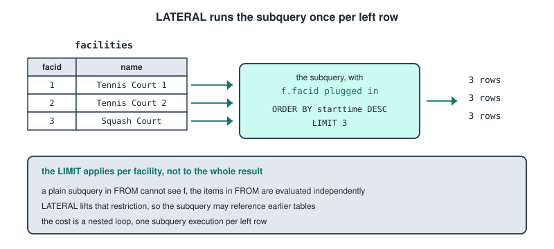

The mental model is a loop over the left table. For each row of `students`, run the subquery with that row's values plugged in, and join the results back to that row.

It is the SQL equivalent of a correlated subquery, except that a correlated subquery in `SELECT` can only return one column and one row, while a LATERAL subquery can return **many columns and many rows**. That is the capability it adds.

### Syntax

```sql
FROM t CROSS JOIN LATERAL (subquery) alias           -- inner join behaviour
FROM t LEFT JOIN LATERAL (subquery) alias ON true    -- keeps rows with no match
FROM t, LATERAL (subquery) alias                     -- shorthand for CROSS JOIN LATERAL
```

`ON true` looks odd but is standard, because the correlation is the join condition and there is nothing left to put in `ON`. Use `LEFT JOIN LATERAL ... ON true` when the subquery might return nothing and you still want the left row.

### Top N Per Group

The canonical use, and the thing you cannot express any other way with a plain join.

```sql
SELECT f.name, b.starttime, b.memid
FROM cd.facilities f
CROSS JOIN LATERAL (
    SELECT starttime, memid
    FROM cd.bookings
    WHERE facid = f.facid
    ORDER BY starttime DESC
    LIMIT 3
) b;
```

The `LIMIT` applies **per facility**, not to the whole result.

Two other patterns. Computing an intermediate value you want to reuse in the same query, since you cannot reference a `SELECT` alias elsewhere in the same select list.

```sql
SELECT p.name, calc.margin, calc.margin * 0.2 AS bonus
FROM products p,
LATERAL (SELECT p.price - p.cost AS margin) calc;
```

And expanding a set returning function per row, where the keyword can be omitted because such functions in `FROM` are implicitly lateral.

```sql
SELECT o.id, item
FROM orders o,
LATERAL unnest(o.item_ids) AS item;
```

The performance caveat is that LATERAL forces a nested loop, running the subquery once per left row. Fine when the left side is small or the subquery is index backed, potentially very slow when the left side has millions of rows.

---

## Set Operators

Set operators combine the results of two complete queries. Where a join combines tables **horizontally** by adding columns side by side, a set operator combines results **vertically** by stacking rows.

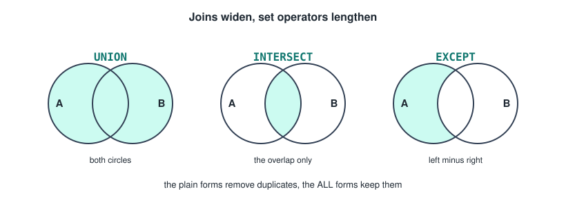

Both queries must be **union compatible**, which means three things.

- **The same number of columns.** A mismatch is an error.
- **Compatible data types**, column by column, in order. `INTEGER` and `NUMERIC` are fine, `INTEGER` and `DATE` are not.
- **Column names are irrelevant**, because matching is purely **positional**, and the result takes its names from the first query.

That third rule is the one that bites, because a query pairing columns in the wrong order may still run and produce nonsense.

`ORDER BY` goes once, at the very end, and applies to the combined result, referring either to positions or to the first query's column names. `WHERE`, `GROUP BY` and `HAVING` belong to their own branch.

```sql
SELECT name FROM students WHERE year = 1
UNION
SELECT name FROM students WHERE year = 2
ORDER BY name
LIMIT 10;
```

---

## The Duplicate Rules

Take query A returning Ana once, Ben twice and Cleo once, and query B returning Ben twice, Cleo once and Dan once.

**`UNION`** returns all rows from both with duplicates removed, giving Ana, Ben, Cleo and Dan, so four rows. **`UNION ALL`** keeps every duplicate, so four rows plus four rows is eight.

`UNION ALL` is significantly faster, because removing duplicates means sorting or hashing the entire combined result while `UNION ALL` just streams rows through. Default to `UNION ALL` unless you actually need deduplication, and note that when the branches are known to be disjoint, deduplication is pure wasted work.

One subtlety: `UNION` also removes duplicates that existed **within** a single branch, so A's two Bens collapse to one before B is even considered.

**`INTERSECT`** returns rows appearing in both, deduplicated, giving Ben and Cleo. **`INTERSECT ALL`** uses the **minimum** count rule, so a row appearing m times in A and n times in B appears min(m, n) times. Ben gives min(2, 2) which is 2, and Cleo gives 1, so three rows.

**`EXCEPT`** returns rows in A that are not in B, deduplicated, giving just Ana. Oracle calls this `MINUS`. **`EXCEPT ALL`** uses the **subtraction** rule, max(0, m minus n), so Ana gives 1, Ben gives max(0, 2 minus 2) which is 0, and Cleo gives 0.

The table to hold onto.

- `UNION` gives distinct rows only, `UNION ALL` gives m plus n.
- `INTERSECT` gives distinct rows in both, `INTERSECT ALL` gives **min(m, n)**.
- `EXCEPT` gives distinct rows in A only, `EXCEPT ALL` gives **max(0, m minus n)**.

**`EXCEPT` is not commutative**, since `A EXCEPT B` gives Ana while `B EXCEPT A` gives Dan. `UNION` and `INTERSECT` are commutative, ignoring row order.

On NULLs, set operators use `IS NOT DISTINCT FROM` semantics rather than `=`, so **two NULLs are treated as equal** for deduplication and matching. `SELECT NULL INTERSECT SELECT NULL` returns one row containing NULL, which differs from `WHERE a = b` where NULLs never match.

On precedence, **`INTERSECT` binds tighter** than `UNION` and `EXCEPT`, which have equal precedence and evaluate left to right. So `A UNION B INTERSECT C` means `A UNION (B INTERSECT C)`. Use parentheses whenever there is more than one operator.

---

## Applying Set Operators

Combining data from similar tables, where the literal tag column is a common idiom for tracking provenance.

```sql
SELECT id, name, 'current' AS src FROM employees
UNION ALL
SELECT id, name, 'former'  AS src FROM former_employees;
```

`EXCEPT` as an anti join and `INTERSECT` as a semi join.

```sql
SELECT student_id FROM students
EXCEPT
SELECT student_id FROM enrolments;      -- students with no enrolments

SELECT student_id FROM enrolments WHERE course = 'Maths'
INTERSECT
SELECT student_id FROM enrolments WHERE course = 'Physics';  -- took both
```

Comparing two tables for differences, which is how you verify a migration. An empty result means they are identical.

```sql
(SELECT * FROM table_a EXCEPT SELECT * FROM table_b)
UNION ALL
(SELECT * FROM table_b EXCEPT SELECT * FROM table_a);
```

### Against Joins

They sit on different axes, since joins add columns and set operators add rows. If you need data from two tables side by side in one row, that is a join, always.

Where they genuinely overlap is the semi join and anti join cases, which can be written three ways.

```sql
SELECT student_id FROM students
EXCEPT
SELECT student_id FROM enrolments;

SELECT s.student_id FROM students s
LEFT JOIN enrolments e ON s.student_id = e.student_id
WHERE e.student_id IS NULL;

SELECT student_id FROM students
WHERE student_id NOT IN (SELECT student_id FROM enrolments);
```

Two warnings about that third form. **`NOT IN` breaks with NULLs**: if the subquery returns even one NULL it returns no rows at all, because `x NOT IN (1, NULL)` evaluates to NULL rather than true. `EXCEPT` and `NOT EXISTS` do not have this problem.

And **set operators discard the join's extra columns**, so if you need `students.name` alongside the result, `EXCEPT` on `student_id` alone will not give it to you and you would have to join back anyway.

On performance, `EXCEPT` and `INTERSECT` require sorting or hashing both inputs to deduplicate, so on large sets a `LEFT JOIN ... IS NULL` or `NOT EXISTS` is often faster.

---

## Subqueries

A subquery is a query nested inside another query, and the difference between the two types is one thing only.

→ does the inner query reference a column from the outer query?

- **Non correlated** means no. The inner query is self contained and could be run on its own by copying it into a new window.
- **Correlated** means yes. The inner query mentions an outer column, so it cannot run alone and has no meaning without a row from outside to fill in.

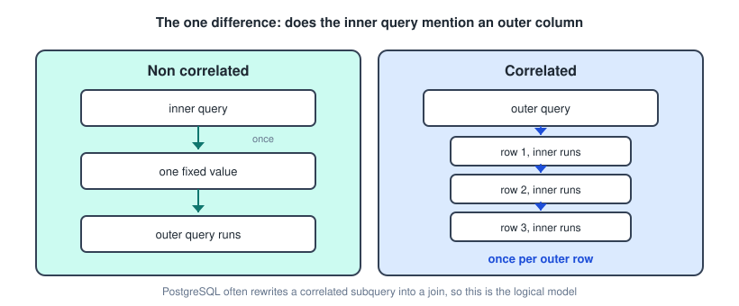

That single difference drives how the database processes them.

---

## Non Correlated Subqueries

A non correlated subquery is evaluated **once**, before the outer query runs. Its result is computed, substituted in, and then the outer query executes against that fixed value.

```sql
SELECT name, balance
FROM accounts
WHERE balance > (SELECT AVG(balance) FROM accounts);
```

The average is computed once, say 275, the query becomes `WHERE balance > 275`, and accounts is scanned. The subquery runs exactly once no matter how many rows the outer query has.

### In WHERE

A **scalar** subquery returns a single value and is used with `=`, `>` or `<`.

```sql
SELECT name FROM students
WHERE year = (SELECT MAX(year) FROM students);
```

If it returns more than one row you get an error about more than one row being returned by a subquery used as an expression. If it returns nothing it evaluates to NULL, and the comparison is then NULL, so no rows match.

A **multi row** subquery is used with `IN`, `NOT IN`, `ANY` or `ALL`.

```sql
SELECT name FROM students
WHERE student_id IN (SELECT student_id FROM enrolments WHERE course = 'Maths');
```

### In FROM

The subquery produces a virtual table, called a derived table, and **an alias is mandatory** in PostgreSQL.

```sql
SELECT dept, avg_sal
FROM (
    SELECT department AS dept, AVG(salary) AS avg_sal
    FROM employees
    GROUP BY department
) AS dept_avgs                      -- the alias is required
WHERE avg_sal > 50000;
```

This is the standard way to filter on an aggregate you cannot put in `WHERE`, though `HAVING` often does the same job more simply. It becomes genuinely necessary when you need to aggregate an aggregate.

```sql
SELECT AVG(cnt) FROM (
    SELECT COUNT(*) AS cnt FROM enrolments GROUP BY student_id
) t;                                -- average enrolments per student
```

### In SELECT

Must return exactly one row and one column. Since it is non correlated it is computed once and the same value appears on every row.

```sql
SELECT name,
       balance,
       (SELECT AVG(balance) FROM accounts) AS overall_avg,
       balance - (SELECT AVG(balance) FROM accounts) AS diff
FROM accounts;
```

### Against A Join

```sql
-- subquery
SELECT name FROM students
WHERE student_id IN (SELECT student_id FROM enrolments WHERE course = 'Maths');

-- join
SELECT DISTINCT s.name FROM students s
JOIN enrolments e ON s.student_id = e.student_id
WHERE e.course = 'Maths';
```

Both work. The subquery is often more readable and **cannot produce duplicate rows**, which is why the join needs `DISTINCT`, since a student enrolled twice would appear twice. Use a join when you need columns from the other table.

---

## Correlated Subqueries

A correlated subquery references a column from the outer query, so it must be re evaluated **once for every row** the outer query processes.

```sql
SELECT e.name, e.salary, e.department
FROM employees e
WHERE e.salary > (
    SELECT AVG(salary) FROM employees
    WHERE department = e.department       -- references the outer e
);
```

That `e.department` in the inner query is the correlation, and you cannot run the inner query on its own because `e` does not exist.

Conceptually it is a nested loop. Take the first row of `employees`, plug its department into the subquery, compute that department's average, compare, then move to the second row. A thousand rows means a thousand subquery executions.

An important caveat: that is the **logical** model. PostgreSQL's planner frequently rewrites correlated subqueries into joins or hash semi joins, so the physical execution may look nothing like a nested loop.

The signature case is **comparing each row against a group it belongs to**, as above, which cannot be done with a plain `WHERE` and a simple aggregate because the comparison value differs per row.

Other natural cases are per row lookups in `SELECT`, correlated updates, and existence checks.

```sql
SELECT s.name,
       (SELECT COUNT(*) FROM enrolments e WHERE e.student_id = s.student_id) AS num_courses
FROM students s;

UPDATE courses c
SET enrolled = (SELECT COUNT(*) FROM enrolments e WHERE e.course_id = c.id);
```

---

## EXISTS And NOT EXISTS

`EXISTS` returns true if the subquery produces at least one row, and it is almost always correlated.

```sql
SELECT s.name FROM students s
WHERE EXISTS (
    SELECT 1 FROM enrolments e WHERE e.student_id = s.student_id
);
```

Three properties matter.

- **The select list is irrelevant.** `SELECT 1`, `SELECT *` and `SELECT NULL` are identical, since only row existence matters. `SELECT 1` is the convention.
- **It short circuits.** As soon as one row is found it stops, which makes it efficient even against huge subquery results.
- **It is NULL safe.** Unlike `NOT IN`, `NOT EXISTS` behaves correctly with NULLs, which is why it is the recommended anti join.

→ for anti joins, `NOT EXISTS` first, then `LEFT JOIN ... IS NULL`, and `NOT IN` only when you are certain there are no NULLs.

### The For All Pattern

SQL has no universal quantifier, so "for all" is expressed by double negation. Students enrolled in every course:

```sql
SELECT s.name FROM students s
WHERE NOT EXISTS (
    SELECT 1 FROM courses c
    WHERE NOT EXISTS (
        SELECT 1 FROM enrolments e
        WHERE e.student_id = s.student_id AND e.course_id = c.id
    )
);
```

Read it as: there is no course for which this student has no enrolment. This is called **relational division**, and the shape is worth memorising because you will not derive it under pressure.

---

## ANY, ALL, UNIQUE And OVERLAPS

**`ANY`**, whose synonym is `SOME`, compares a value to every value the subquery returns and is true if the comparison holds for **at least one**.

```sql
SELECT name FROM employees
WHERE salary > ANY (SELECT salary FROM employees WHERE department = 'Sales');
```

That means earning more than at least one Sales employee, so more than the minimum. The equivalences to know:

- `= ANY (...)` is identical to `IN (...)`.
- `> ANY (...)` is equivalent to `> MIN(...)`, and `< ANY (...)` to `< MAX(...)`.
- `<> ANY (...)` is **not** `NOT IN`. It is true if the value differs from at least one entry, which is almost always true.

**`ALL`** is true if the comparison holds for **every** row of the subquery.

```sql
SELECT name FROM employees
WHERE salary > ALL (SELECT salary FROM employees WHERE department = 'Sales');
```

- `> ALL (...)` is equivalent to `> MAX(...)`, and `< ALL (...)` to `< MIN(...)`.
- `<> ALL (...)` is equivalent to `NOT IN (...)`, and inherits the same NULL problem.

The **empty set rule** is the trick question here. Against a subquery returning no rows, `x > ANY (empty)` is **false** while `x > ALL (empty)` is **true**. `ALL` over an empty set is vacuously true because there is no counterexample, whereas `ANY` needs at least one witness and there is none.

On NULLs, if the subquery contains them, `ALL` can return NULL rather than true and silently drop rows. `NOT EXISTS` avoids this.

**`UNIQUE (subquery)`** in standard SQL returns true if the subquery has no duplicate rows. **PostgreSQL does not implement it**, so the equivalent is written out.

```sql
WHERE NOT EXISTS (
    SELECT student_id FROM enrolments e WHERE e.course_id = c.id
    GROUP BY student_id HAVING COUNT(*) > 1
)
```

The standard also says duplicate rows containing NULLs do not count as duplicates.

**`OVERLAPS`** tests whether two time periods intersect.

```sql
SELECT (DATE '2012-09-01', DATE '2012-09-30')
       OVERLAPS
       (DATE '2012-09-15', DATE '2012-10-15');     -- true
```

Each period is written as a start and an end, or a start and an interval. Two details: it uses **half open intervals**, so periods sharing only an endpoint do not overlap, which is the same logic as the date range pattern earlier, and if you give the endpoints backwards it silently swaps them.

Finding double booked facilities is a nice application.

```sql
SELECT a.facid FROM bookings a
JOIN bookings b ON a.facid = b.facid AND a.bookid < b.bookid
WHERE (a.starttime, a.endtime) OVERLAPS (b.starttime, b.endtime);
```

---

## Common Table Expressions

A CTE is a named temporary result set that exists for the duration of a single statement.

```sql
WITH dept_avgs AS (
    SELECT department, AVG(salary) AS avg_sal
    FROM employees
    GROUP BY department
)
SELECT * FROM dept_avgs WHERE avg_sal > 50000;
```

The syntax essentials.

- It begins with `WITH`, then `name AS ( query )`.
- **The main query follows immediately**, since a CTE cannot stand alone.
- Multiple CTEs are comma separated and `WITH` appears only once.
- **Later CTEs can reference earlier ones**, but not the other way round, and that ordering is what makes stepwise building work.
- You can name the output columns explicitly, as in `WITH t(a, b) AS (...)`.
- CTEs work with `INSERT`, `UPDATE` and `DELETE`, not just `SELECT`.

It is sometimes called a temporary view, but it exists only for that one statement, unlike a real view which is a persistent database object.

---

## Refactoring With CTEs

A nested subquery version reads inside out, since the innermost query runs first but is written last.

```sql
SELECT dept, avg_sal, headcount
FROM (
    SELECT department AS dept, AVG(salary) AS avg_sal, COUNT(*) AS headcount
    FROM (
        SELECT * FROM employees
        WHERE hire_date > '2020-01-01' AND status = 'active'
    ) recent
    GROUP BY department
) summary
WHERE headcount > 5
ORDER BY avg_sal DESC;
```

The CTE version reads top to bottom in execution order, with each step named.

```sql
WITH recent_hires AS (
    SELECT * FROM employees
    WHERE hire_date > '2020-01-01' AND status = 'active'
),
dept_summary AS (
    SELECT department, AVG(salary) AS avg_sal, COUNT(*) AS headcount
    FROM recent_hires
    GROUP BY department
)
SELECT department, avg_sal, headcount
FROM dept_summary
WHERE headcount > 5
ORDER BY avg_sal DESC;
```

Same result, but the names document the intent in a way that `summary` and anonymous nesting do not. You can also test incrementally by commenting out the final query and selecting from `recent_hires` alone.

---

## CTEs Against Subqueries

On readability, CTEs win clearly when there is nesting or repetition. A CTE referenced three times is written once, whereas a subquery would be copy pasted three times and all three copies have to stay in sync. For a single trivial subquery a CTE is overkill.

On performance, the answer changed recently and it is worth knowing both halves.

**Before PostgreSQL 12**, CTEs were an **optimization fence**. Each was materialized, meaning fully computed into a temporary result, before the outer query ran, and the planner could not push predicates into it.

```sql
WITH all_orders AS (SELECT * FROM orders)     -- 10 million rows
SELECT * FROM all_orders WHERE id = 42;
```

Before 12, that materialized all 10 million rows and then filtered to one, while the equivalent subquery would have pushed `id = 42` down and used the index.

**From PostgreSQL 12 onward**, CTEs are **inlined by default** when they are referenced only once, are not recursive, and have no side effects. The planner treats them like subqueries and optimises across the boundary, so the performance gap largely disappeared.

```sql
WITH t AS MATERIALIZED     (SELECT ...)   -- force the fence
WITH t AS NOT MATERIALIZED (SELECT ...)   -- force inlining
```

`MATERIALIZED` is genuinely useful when a CTE is expensive and referenced several times, since computing it once beats recomputing it per reference. **Multiply referenced CTEs are still materialized by default**, which is usually what you want.

A third option is a temporary table, which persists across statements in the session and **can be indexed**. Use one when you need the intermediate result in several separate statements, or when it is large enough that an index would pay off.

---

## Recursive CTEs

This is the capability nothing else in SQL provides: traversing hierarchies and graphs of unknown depth.

```sql
WITH RECURSIVE cte_name AS (
    -- anchor, the starting point, runs once
    SELECT ...

    UNION ALL

    -- recursive member, references cte_name, runs repeatedly
    SELECT ... FROM some_table JOIN cte_name ON ...
)
SELECT * FROM cte_name;
```

Three mandatory parts: the **anchor member**, a non recursive query producing the starting rows, then `UNION ALL` joining the halves, then the **recursive member** referencing the CTE's own name. `RECURSIVE` goes right after `WITH`, once, even with several CTEs.

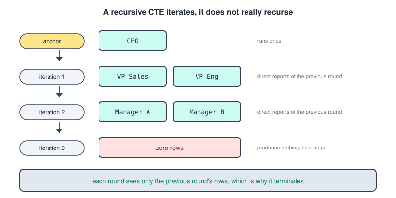

The name is misleading, because it is iteration. The algorithm runs the anchor and puts its rows in both the result and a **working table**, then runs the recursive member using the working table as the CTE's content, puts the new rows in the result where they become the new working table, and repeats until a round produces **zero rows**.

The crucial detail is that each iteration only sees rows produced by the **previous** iteration, not the whole accumulated set. That is why it terminates.

```sql
WITH RECURSIVE numbers AS (
    SELECT 1 AS n                                  -- anchor
    UNION ALL
    SELECT n + 1 FROM numbers WHERE n < 10         -- recursive, with a stop condition
)
SELECT n FROM numbers;
```

**Without a terminating condition this loops forever**, which is the single most common recursive CTE bug.

### The Org Chart

```sql
WITH RECURSIVE org_chart AS (
    SELECT emp_id, name, manager_id, 1 AS level
    FROM employees
    WHERE emp_id = 1                        -- anchor, the CEO

    UNION ALL

    SELECT e.emp_id, e.name, e.manager_id, oc.level + 1
    FROM employees e
    JOIN org_chart oc ON e.manager_id = oc.emp_id     -- recursive
)
SELECT level, name FROM org_chart ORDER BY level, name;
```

Each iteration finds the direct reports of everyone found in the previous one, and `level` tracks depth, incremented in the recursive member. Going upward instead, to get the management chain above an employee, just flips the join to `ON e.emp_id = oc.manager_id`.

Building a path string is a common variation.

```sql
WITH RECURSIVE org_chart AS (
    SELECT emp_id, name, name::TEXT AS path
    FROM employees WHERE manager_id IS NULL
    UNION ALL
    SELECT e.emp_id, e.name, oc.path || ' > ' || e.name
    FROM employees e JOIN org_chart oc ON e.manager_id = oc.emp_id
)
SELECT path FROM org_chart;
```

### Bill Of Materials

The same shape in a different domain, a product made of components made of sub components.

```sql
WITH RECURSIVE parts_list AS (
    SELECT component_id, quantity, 1 AS depth
    FROM bom WHERE parent_id = 'BICYCLE'

    UNION ALL

    SELECT b.component_id, b.quantity * pl.quantity, pl.depth + 1
    FROM bom b JOIN parts_list pl ON b.parent_id = pl.component_id
)
SELECT component_id, SUM(quantity) AS total_needed
FROM parts_list GROUP BY component_id;
```

Note `b.quantity * pl.quantity`, because quantities multiply down the tree. Two wheels times 32 spokes is 64 spokes.

### Cycle Protection

Graphs, unlike trees, can contain cycles, and a cycle means infinite iteration. You can track the path and exclude visited nodes.

```sql
WITH RECURSIVE traverse AS (
    SELECT node_id, ARRAY[node_id] AS path, false AS cycle
    FROM edges WHERE node_id = 1
    UNION ALL
    SELECT e.target_id, t.path || e.target_id, e.target_id = ANY(t.path)
    FROM edges e JOIN traverse t ON e.source_id = t.node_id
    WHERE NOT t.cycle
)
SELECT * FROM traverse;
```

PostgreSQL 14 and later have a built in clause for it.

```sql
WITH RECURSIVE traverse AS ( ... )
CYCLE node_id SET is_cycle USING path
SELECT * FROM traverse;
```

Using `UNION` instead of `UNION ALL` deduplicates each iteration and prevents some cycles, at the cost of a deduplication step every round. A depth limit such as `WHERE level < 100` in the recursive member is a cheap safety net.

---

## CTEs In Practice

Stepwise analytics is the everyday use, with three clear stages each independently comprehensible.

```sql
WITH monthly AS (
    SELECT DATE_TRUNC('month', order_date) AS month, SUM(amount) AS revenue
    FROM orders GROUP BY 1
),
with_growth AS (
    SELECT month, revenue,
           LAG(revenue) OVER (ORDER BY month) AS prev_revenue
    FROM monthly
)
SELECT month, revenue,
       ROUND(100.0 * (revenue - prev_revenue) / prev_revenue, 1) AS pct_change
FROM with_growth
ORDER BY month;
```

Data modifying CTEs move rows between tables in one atomic statement.

```sql
WITH deleted AS (
    DELETE FROM orders WHERE status = 'cancelled'
    RETURNING *
)
INSERT INTO orders_archive SELECT * FROM deleted;
```

Two things to know there: all branches see the **same snapshot** of the data, and the execution order of multiple modifying CTEs is not guaranteed, so do not have one depend on another's effects.

---

## Window Functions

A window function performs a calculation across a set of rows related to the current row, **without collapsing those rows into one**. That last clause is the entire difference from an aggregate.

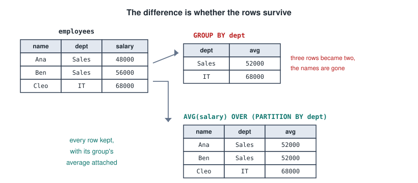

A regular aggregate with `GROUP BY` turns ten employees into two rows and the individual rows are gone. A window function keeps every row and adds the calculation alongside.

```sql
SELECT name, department, salary,
       AVG(salary) OVER (PARTITION BY department) AS dept_avg
FROM employees;
```

The practical consequence is that comparing a row to its group becomes trivial. Recall the correlated subquery from earlier.

```sql
-- correlated subquery, conceptually runs once per row
WHERE e.salary > (SELECT AVG(salary) FROM employees WHERE department = e.department)

-- window function, one pass
SELECT * FROM (
    SELECT *, AVG(salary) OVER (PARTITION BY department) AS dept_avg
    FROM employees
) t WHERE salary > dept_avg;
```

One syntax rule to internalise: **you cannot use a window function in `WHERE`, `GROUP BY` or `HAVING`**. Window functions are evaluated after those clauses, so the logical order is `FROM`, `WHERE`, `GROUP BY`, `HAVING`, **window functions**, `SELECT`, `ORDER BY`. To filter on one, wrap it in a subquery or CTE as above.

---

## The OVER Clause

`OVER()` is what makes a function a window function, and it defines the set of rows the function sees for the current row.

```sql
function() OVER (
    PARTITION BY column     -- split rows into groups
    ORDER BY column         -- order within each group
    frame_clause            -- which rows within the group
)
```

All three parts are optional. An empty `OVER ()` makes the window the entire result set, which is how you compute a percentage of the whole.

```sql
SELECT name, salary,
       SUM(salary) OVER () AS company_total,
       salary * 100.0 / SUM(salary) OVER () AS pct_of_total
FROM employees;
```

**`PARTITION BY`** divides rows into independent groups and the function restarts for each. It is like `GROUP BY` except the rows are not collapsed, and you can partition by several columns.

**`ORDER BY`** has two effects, and this is where people get caught. For ranking and value access functions it defines the sequence. For aggregate functions, **adding `ORDER BY` silently changes the meaning to a running total**.

```sql
SUM(salary) OVER (PARTITION BY department)                     -- the department total
SUM(salary) OVER (PARTITION BY department ORDER BY hire_date)  -- a running total
```

The reason is that `ORDER BY` without an explicit frame implies the default frame `RANGE BETWEEN UNBOUNDED PRECEDING AND CURRENT ROW`, meaning every row from the start of the partition up to this one. Without `ORDER BY`, the frame is the whole partition.

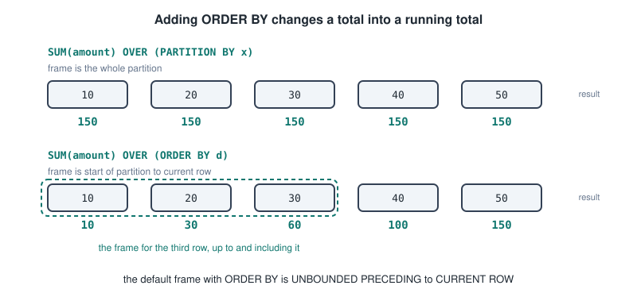

Note also that the `ORDER BY` inside `OVER()` is separate from the query's final `ORDER BY`, and the two can differ.

---

## Ranking Functions

Given salaries of 100, 90, 90 and 80, the three ranking functions differ only in how they handle the tie.

```sql
SELECT name, salary,
       ROW_NUMBER() OVER (ORDER BY salary DESC) AS row_num,
       RANK()       OVER (ORDER BY salary DESC) AS rank,
       DENSE_RANK() OVER (ORDER BY salary DESC) AS dense_rank
FROM employees;
```

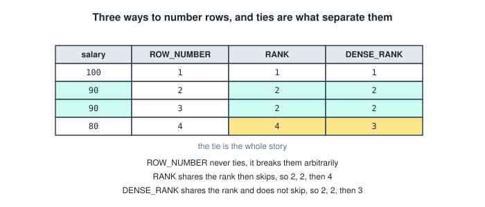

- **`ROW_NUMBER()`** gives 1, 2, 3, 4 and **never ties**, breaking equal values arbitrarily. Add tiebreaker columns to `ORDER BY` if you need determinism.
- **`RANK()`** shares a rank for ties and then **skips**, so two rows at rank 2 means the next is 4. Like Olympic medals, two silvers and no bronze.
- **`DENSE_RANK()`** shares a rank for ties and **does not skip**, so the next is 3.

`ORDER BY` is effectively mandatory for these, since without it the result is meaningless.

Others in the family are `NTILE(n)`, which divides rows into n roughly equal buckets so `NTILE(4)` gives quartiles, plus `PERCENT_RANK()` and `CUME_DIST()`.

### Top N Per Group

The headline application, combining `PARTITION BY` with `ROW_NUMBER()`.

```sql
SELECT * FROM (
    SELECT name, department, salary,
           ROW_NUMBER() OVER (PARTITION BY department ORDER BY salary DESC) AS rn
    FROM employees
) t
WHERE rn <= 3;                -- the top three earners per department
```

The numbering restarts at 1 for each department, and the subquery wrapper is there because you cannot filter on `rn` directly. Use `RANK()` instead if you want to include ties, which may return more than N rows.

Compared to the LATERAL version from earlier, LATERAL is often faster because it can stop after N rows per group using an index, whereas the window function has to rank every row and then discard most of them. The window function handles more general cases though.

Deduplication uses the same pattern.

```sql
DELETE FROM t WHERE id IN (
    SELECT id FROM (
        SELECT id, ROW_NUMBER() OVER (PARTITION BY email ORDER BY id) AS rn FROM t
    ) x WHERE rn > 1
);
```

---

## Value Access Functions

These reach out to other rows within the window, which ordinary SQL cannot do at all.

```sql
LAG(column, offset, default)  OVER (ORDER BY ...)   -- a previous row
LEAD(column, offset, default) OVER (ORDER BY ...)   -- a following row
```

`offset` defaults to 1, and `default` is what to return when there is no such row, which is otherwise NULL.

```sql
SELECT month, revenue,
       LAG(revenue) OVER (ORDER BY month) AS prev_month,
       revenue - LAG(revenue) OVER (ORDER BY month) AS change
FROM monthly_revenue;
```

Period over period comparison is the canonical use. Without window functions this needs an awkward self join on `month = month - 1`, which breaks whenever a period is missing. `LAG(revenue, 12)` gives the same month last year, and `LAG(x, 1, 0)` returns 0 instead of NULL for the first row.

`FIRST_VALUE`, `LAST_VALUE` and `NTH_VALUE` pull a specific row out of the frame.

```sql
SELECT name, department, salary,
       FIRST_VALUE(name) OVER (PARTITION BY department ORDER BY salary DESC) AS top_earner
FROM employees;
```

**The `LAST_VALUE` trap** catches everybody. Written plainly it returns the **current row**, because the default frame with `ORDER BY` runs from the start of the partition to the current row, so the last row of the frame is always the current one. The fix is an explicit frame.

```sql
LAST_VALUE(name) OVER (
    PARTITION BY dept ORDER BY salary DESC
    ROWS BETWEEN UNBOUNDED PRECEDING AND UNBOUNDED FOLLOWING
)
```

`FIRST_VALUE` works correctly by accident, because the frame's first row genuinely is the partition's first row.

---

## Aggregates With OVER

Any aggregate can take an `OVER` clause.

```sql
SELECT name, department, salary,
       SUM(salary)   OVER (PARTITION BY department) AS dept_total,
       COUNT(*)      OVER (PARTITION BY department) AS dept_size,
       salary - AVG(salary) OVER (PARTITION BY department) AS diff_from_avg
FROM employees;
```

Adding `ORDER BY` gives running totals, and an explicit frame gives moving averages.

```sql
SELECT order_date, amount,
       SUM(amount) OVER (ORDER BY order_date) AS running_total,
       AVG(amount) OVER (ORDER BY order_date
                         ROWS BETWEEN 6 PRECEDING AND CURRENT ROW) AS moving_avg_7
FROM orders;
```

### The Frame Clause

```
{ROWS | RANGE} BETWEEN <start> AND <end>
```

The boundaries are `UNBOUNDED PRECEDING`, `n PRECEDING`, `CURRENT ROW`, `n FOLLOWING` and `UNBOUNDED FOLLOWING`.

The defaults explain both traps above. With `PARTITION BY` and no `ORDER BY`, the frame is the entire partition. With `ORDER BY`, it is `RANGE UNBOUNDED PRECEDING TO CURRENT ROW`.

**`ROWS` counts physical rows** while **`RANGE` groups rows with equal ordering values** into the same frame position, so with duplicates in the `ORDER BY` column, `RANGE` includes all the ties and `ROWS` does not. Use `ROWS` unless you specifically want tie grouping.

When several functions share a definition, the `WINDOW` clause names it once. It sits after `HAVING` and before `ORDER BY`.

```sql
SELECT name, salary,
       RANK()      OVER w AS rank,
       AVG(salary) OVER w AS dept_avg,
       COUNT(*)    OVER w AS dept_size
FROM employees
WINDOW w AS (PARTITION BY department);
```

---

## ROLLUP, CUBE And GROUPING SETS

An ordinary `GROUP BY` gives one level of aggregation, but a report usually also wants subtotals and a grand total. Without these features you would write several queries stitched together with `UNION ALL`, scanning the table three times. These produce the same output in **one pass**.

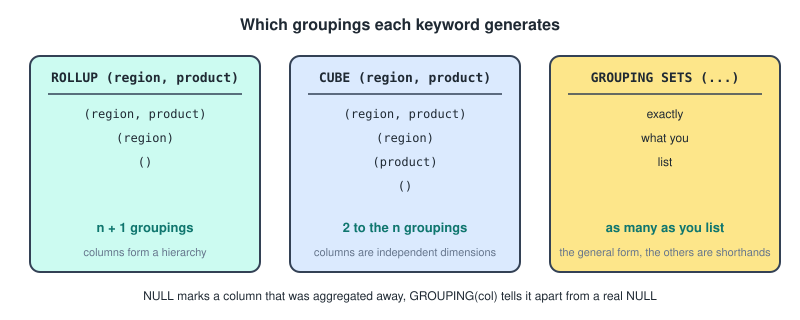

**`GROUPING SETS`** is the general form, where you list exactly which groupings you want. Each parenthesised list is one grouping, and `()` means group by nothing, aggregating everything into one row.

```sql
SELECT region, product, SUM(amount)
FROM sales
GROUP BY GROUPING SETS (
    (region, product),   -- detail
    (region),            -- subtotal by region
    ()                   -- grand total
);
```

The result stacks all three levels, with **NULL marking columns not present** in that grouping.

**`ROLLUP(a, b, c)`** produces n plus 1 groupings, progressively dropping columns from the right, giving `(a,b,c)`, `(a,b)`, `(a)` and `()`. **Order matters**, because it is hierarchical: `ROLLUP(region, product)` gives subtotals per region but **not** per product. Use it when the columns form a natural hierarchy such as country, region, city.

**`CUBE(a, b)`** produces every possible subset, giving `(a,b)`, `(a)`, `(b)` and `()`, so 2 to the power n groupings. Three columns gives 8 and four gives 16, so it grows fast. Use it for multidimensional analysis where any dimension might be the one you want to slice by.

They can be combined and nested.

```sql
GROUP BY region, ROLLUP(year, quarter)     -- region always present, dates rolled up
GROUP BY GROUPING SETS ((a), ROLLUP(b, c))
```

### The GROUPING Function

Those NULLs are ambiguous. Is `region = NULL` a subtotal row, or a genuine row where the region really was NULL?

`GROUPING(column)` returns 1 if the column was aggregated away in that grouping and 0 if it is a real value.

```sql
SELECT
    CASE WHEN GROUPING(region) = 1 THEN 'ALL REGIONS' ELSE region END AS region,
    CASE WHEN GROUPING(product) = 1 THEN 'ALL PRODUCTS' ELSE product END AS product,
    SUM(amount)
FROM sales
GROUP BY ROLLUP (region, product);
```

Passing several columns returns a bitmask identifying which level a row belongs to, which is handy for ordering with `ORDER BY GROUPING(region), region, GROUPING(product), product`.

---

## The FILTER Clause

`FILTER (WHERE ...)` restricts which rows an **individual aggregate** sees.

```sql
SELECT department,
       COUNT(*) AS total,
       COUNT(*) FILTER (WHERE salary > 50000) AS high_earners,
       AVG(salary) FILTER (WHERE status = 'active') AS avg_active_salary,
       SUM(amount) FILTER (WHERE year = 2025) AS revenue_2025,
       SUM(amount) FILTER (WHERE year = 2026) AS revenue_2026
FROM employees
GROUP BY department;
```

Each aggregate gets its own condition. A `WHERE` clause would filter rows for the entire query, whereas `FILTER` applies per aggregate, so you can count several different subsets side by side in one pass.

The older equivalent is a `CASE` inside the aggregate, which works everywhere including MySQL and SQL Server but is clunkier.

```sql
COUNT(CASE WHEN salary > 50000 THEN 1 END)
SUM(CASE WHEN year = 2025 THEN amount ELSE 0 END)
```

That version relies on aggregates ignoring NULLs, since the omitted `ELSE` yields NULL which `COUNT` skips.

`FILTER` works with window functions too, and pivoting is its classic application.

```sql
SELECT product,
       SUM(amount) FILTER (WHERE region = 'North') AS north,
       SUM(amount) FILTER (WHERE region = 'South') AS south,
       SUM(amount) FILTER (WHERE region = 'East')  AS east
FROM sales GROUP BY product;
```

---

## JSON And JSONB

PostgreSQL has two JSON types, and the choice is almost always the same one.

- **`JSON`** stores the input as **text**, verbatim. Whitespace and key order are preserved, duplicate keys are all kept, writing is faster since it only validates, and reading is slower because it is reparsed on every access. It is barely indexable.
- **`JSONB`** stores a **binary**, decomposed form. Whitespace and key order are lost, only the last of duplicate keys survives, writing is slower because it parses and converts, and reading is much faster because it is already parsed. It supports the full operator set and **GIN indexes**.

→ use `JSONB` unless you have a specific reason not to. The rare exception is needing to reproduce the input byte for byte, such as an audit log of raw API payloads.

Both **validate on insert**, so malformed JSON is rejected with an error. The type itself is the validation.

```sql
CREATE TABLE products (
    id       SERIAL PRIMARY KEY,
    name     TEXT,
    metadata JSONB
);

INSERT INTO products (name, metadata) VALUES
('Laptop', '{"brand": "Dell", "specs": {"ram": 16, "cpu": "i7"}, "tags": ["electronics", "portable"]}');

INSERT INTO products (name, metadata) VALUES ('Bad', '{invalid}');
-- ERROR: invalid input syntax for type json
```

You can add a `CHECK` constraint for stronger validation, such as `CHECK (metadata ? 'brand')` or `CHECK (jsonb_typeof(metadata->'specs') = 'object')`.

---

## JSON Operators

The two you use constantly differ only in what they give back.

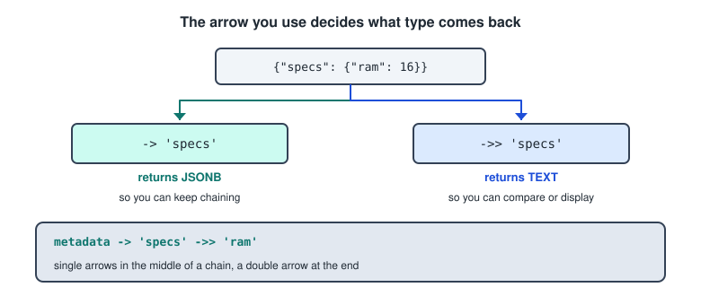

- **`->`** returns **JSON or JSONB**, so `metadata->'brand'` gives `"Dell"` with the quotes.
- **`->>`** returns **TEXT**, so `metadata->>'brand'` gives plain `Dell`.

Use `->` in the middle of a chain and `->>` at the end. Comparing with `->` fails or behaves oddly, because you would be comparing JSON values including their quotes.

```sql
SELECT metadata->'specs'->>'ram' FROM products;
SELECT metadata->'tags'->>0 FROM products;      -- array access, negative counts from the end
```

Path operators go deeper in one step, where the path is a text array so `'{a,b,c}'` means a then b then c.

```sql
SELECT metadata #>> '{specs, ram}' FROM products;      -- returns text
SELECT metadata #>  '{tags, 0}'    FROM products;      -- returns JSON
```

Existence and containment are JSONB only.

- **`?`** asks whether a **key** exists, with `?|` for any of these keys and `?&` for all of them.
- **`@>`** asks whether the left **contains** the right, and `<@` is the reverse.

```sql
WHERE metadata ? 'warranty'
WHERE metadata @> '{"brand": "Dell"}'                  -- containment
WHERE metadata @> '{"specs": {"ram": 16}}'             -- works at any depth
WHERE metadata->'tags' @> '["portable"]'               -- array membership
```

`@>` is the workhorse, being the most expressive and the best indexed operator.

### Functions

```sql
jsonb_array_elements(metadata->'tags')     -- expand an array into rows
jsonb_array_length(metadata->'tags')
jsonb_object_keys(metadata)                -- list the top level keys
jsonb_typeof(metadata->'specs')            -- object, array, string, number
jsonb_set(metadata, '{specs,ram}', '32')   -- update a nested value
metadata || '{"new": true}'                -- merge
metadata - 'brand'                         -- remove a key
jsonb_pretty(metadata)                     -- formatted output
```

Expanding an array into rows is a common pattern, and note the implicit LATERAL.

```sql
SELECT p.name, tag
FROM products p, jsonb_array_elements_text(p.metadata->'tags') AS tag;
```

Going the other way, `jsonb_build_object('name', name, 'id', id)` and `jsonb_agg(metadata)` build JSON out of relational data.

---

## Indexing JSONB

Without an index, every JSONB query scans the table and inspects each document. There are three approaches.

**Default `jsonb_ops`** indexes every key and every value, supporting `@>`, `?`, `?|` and `?&`, at the cost of a larger index.

```sql
CREATE INDEX idx_meta ON products USING GIN (metadata);
```

**`jsonb_path_ops`** indexes only hashed key value paths. It is smaller and faster but supports **only `@>`**, not the key existence operators.

```sql
CREATE INDEX idx_meta ON products USING GIN (metadata jsonb_path_ops);
```

**A B-tree expression index** on a single frequently queried field is often the best option when you always filter on the same key.

```sql
CREATE INDEX idx_brand ON products ((metadata->>'brand'));
-- so WHERE metadata->>'brand' = 'Dell' can use it
```

That is the expression index idea from the indexes section applied to JSON, and it only helps that exact expression, since `->` and `->>` are different as far as the index is concerned.

PostgreSQL 12 and later add **JSONPath**, whose `@@` and `@?` operators are also GIN indexable.

```sql
WHERE metadata @@ '$.specs.ram > 8'
WHERE jsonb_path_exists(metadata, '$.tags[*] ? (@ == "portable")')
```

---

## Relational Or JSON

The honest trade off, laid out.

Relational columns give you a fixed known schema, enforced constraints, foreign keys and types, fast joins and aggregation, efficient storage, and good planner statistics. They cost you a migration whenever you add a field.

JSONB gives you a schema that can vary per row or evolve rapidly, and adding a field is free. It costs you weak validation, awkward joins and slower aggregation, storage overhead because the keys are repeated in **every row**, and **poor planner estimates** that lead to bad plans.

→ anything you query or constrain frequently belongs in a real column.

The hybrid approach is the right default, with core stable attributes as columns and the variable extras as JSONB.

```sql
CREATE TABLE products (
    id       SERIAL PRIMARY KEY,        -- structured
    name     TEXT NOT NULL,             -- structured
    price    NUMERIC NOT NULL,          -- structured
    metadata JSONB                       -- the flexible tail
);
```

Promote a JSON field to a real column once you find yourself querying it constantly.

Good fits for JSONB are flexible metadata where attributes differ by category, API payloads whose shape you do not control, logs and events with heterogeneous structures, sparse per user settings, and prototyping before the schema stabilises. Poor fits are anything with referential integrity requirements, heavily joined data, high volume aggregation, or values needing type and range constraints.

---

## Foreign Data Wrappers

**SQL/MED**, meaning SQL Management of External Data, is part of the SQL:2003 standard. It defines how a database can query data living **outside** it, whether other databases, files or APIs, while making it look like a normal table.

**Foreign Data Wrappers** are PostgreSQL's implementation. An FDW is a driver that knows how to talk to one kind of external source and translate it into rows and columns. Recall from the schemas section that PostgreSQL cannot join across databases, and FDWs are how you get around that.

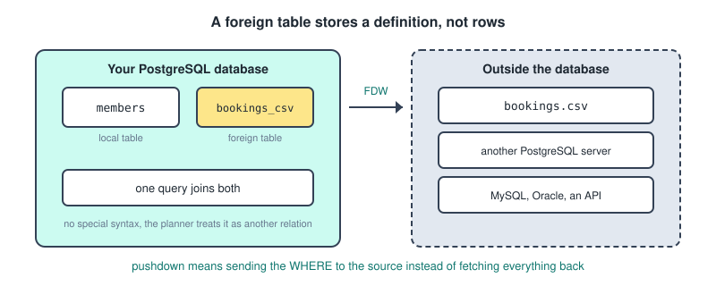

A foreign table is metadata plus a pointer, with nothing copied or cached. Against a local table it differs in every practical respect.

- The data lives elsewhere and PostgreSQL holds only a **definition**, meaning the column list and connection details.
- Reads are fetched from the source on every query, and writes work only for some wrappers.
- **No indexes**, and no constraints or triggers beyond the very limited.
- No real transaction or MVCC participation, since the remote source has its own.

### The Four Step Setup

Always the same shape.

```sql
-- 1, install the wrapper
CREATE EXTENSION postgres_fdw;   -- for a remote PostgreSQL
CREATE EXTENSION file_fdw;       -- for local files such as CSV

-- 2, define the server, meaning where the data lives
CREATE SERVER csv_server FOREIGN DATA WRAPPER file_fdw;

CREATE SERVER remote_db
  FOREIGN DATA WRAPPER postgres_fdw
  OPTIONS (host 'other.example.com', port '5432', dbname 'sales');

-- 3, map users, meaning credentials, not needed for file_fdw
CREATE USER MAPPING FOR current_user
  SERVER remote_db
  OPTIONS (user 'readonly', password 'secret');

-- 4, declare the table
CREATE FOREIGN TABLE bookings_csv (
    booking_id INTEGER,
    memid      INTEGER,
    facid      INTEGER,
    starttime  TIMESTAMP
)
SERVER csv_server
OPTIONS (filename '/data/bookings.csv', format 'csv', header 'true');
```

Then use it exactly like a table. For a remote PostgreSQL there is a shortcut that imports whole schemas rather than hand writing definitions.

```sql
IMPORT FOREIGN SCHEMA public
  LIMIT TO (customers, orders)
  FROM SERVER remote_db INTO staging;
```

Joining local and foreign is seamless, with no special syntax, because the planner treats the foreign table as another relation.

```sql
SELECT m.surname, b.starttime
FROM cd.members m                          -- local
JOIN bookings_csv b ON m.memid = b.memid   -- foreign
ORDER BY b.starttime;
```

### Pushdown

Pushdown means sending work **to the remote source** instead of dragging everything back and filtering locally.

```sql
SELECT * FROM remote_orders WHERE customer_id = 42;
```

With pushdown, PostgreSQL sends `WHERE customer_id = 42` to the remote server, which uses its own index and returns 3 rows. Without it, PostgreSQL fetches all 10 million rows across the network and then discards all but 3. Same result, wildly different cost.

`postgres_fdw` pushes down `WHERE` clauses, joins between two tables on the **same** foreign server, aggregates and `ORDER BY`. `file_fdw` pushes down **nothing**, since a CSV has no query engine, so the whole file is read and filtered locally every time.

Check with `EXPLAIN` and look for `Foreign Scan` plus a `Remote SQL:` line showing exactly what was sent.

### Use Cases And Limits

They are good for querying across databases without ETL, reading CSVs and logs as tables without importing, federating data from MySQL, Oracle, MongoDB or S3, staging data during a migration, and letting one reporting database reach several sources.

The limitations worth naming.

- **Network latency dominates**, since every query is a round trip.
- **No indexes and no local statistics**, so the planner's estimates on foreign tables are poor and it picks bad plans. `ANALYZE foreign_table` helps a little.
- **Joins between a local and a foreign table cannot be pushed down**, so the foreign side must be fetched first. Only foreign to foreign joins on the same server push down.
- **No cross source transactions**, since there is no two phase commit by default.
- **A hard dependency on the remote being available**, which is a new failure mode.
- **Wrapper quality varies.** `postgres_fdw` is excellent, others are read only or push nothing down.

→ FDWs are for occasional access and integration, not for the hot path. If you query remote data constantly, copy it locally, or materialize it, which is a common pattern.

---

## Finding Slow Queries

`EXPLAIN` diagnoses **one query you already suspect**. `pg_stat_statements` tells you **which queries to suspect** in the first place.

It is an extension tracking execution statistics for every query on the server, aggregated over time. Setup is two steps, and the first requires a restart, because it hooks into the executor at startup.

```
# in postgresql.conf
shared_preload_libraries = 'pg_stat_statements'
pg_stat_statements.max = 10000        # how many distinct queries to track
pg_stat_statements.track = top        # top, all, or none
```

```sql
CREATE EXTENSION pg_stat_statements;   -- then, in the database
```

`track = all` also counts statements inside functions while `top` counts only top level ones.

The key mechanism is **normalisation**. Constants are replaced with placeholders before counting, so these two both become `SELECT * FROM users WHERE id = $1` and aggregate into one row with `calls = 2`.

```sql
SELECT * FROM users WHERE id = 42;
SELECT * FROM users WHERE id = 99;
```

That is what makes the data useful, since you see query shapes rather than millions of individual executions.

The columns are `query`, `calls`, `total_exec_time`, `mean_exec_time`, `min_exec_time` and `max_exec_time`, `stddev_exec_time` where a high value means inconsistent, `rows`, and `shared_blks_hit` against `shared_blks_read` for cache hits against disk reads.

### The Two Questions

```sql
-- what is slowest per run
SELECT query, calls, mean_exec_time, total_exec_time
FROM pg_stat_statements
ORDER BY mean_exec_time DESC LIMIT 10;

-- what consumes the most total time
SELECT query, calls, mean_exec_time, total_exec_time
FROM pg_stat_statements
ORDER BY total_exec_time DESC LIMIT 10;
```

The second is usually the more valuable one, and it is the conceptual point of the whole topic. A query taking 5 seconds but running twice a day costs 10 seconds. A query taking 20 ms but running a million times costs five and a half hours. Only `total_exec_time` reveals the second, so optimising the slowest query is often optimising the wrong thing.

Statistics accumulate since the last reset or server start, so they are cumulative and not time bounded.

```sql
SELECT pg_stat_statements_reset();
```

To measure a specific window, such as before and after a deployment, reset, wait, then read. Without resetting you are looking at a blur of everything since startup, where a bad query from three months ago still dominates.

→ reset, let the workload run, find the top consumers, run `EXPLAIN ANALYZE` on the worst one, fix it, reset and compare.

---

## Benchmarking And pgbench

The purpose of benchmarking is to measure performance objectively, so you can establish a baseline, compare configurations or hardware, verify that a change actually helped, and find the capacity ceiling before production does. The principle is that intuitions about performance are unreliable, so you measure.

**pgbench** is PostgreSQL's built in benchmarking tool.

```bash
pgbench -i -s 50 mydb          # initialise, scale factor 50
pgbench -c 10 -j 2 -T 60 mydb  # 10 clients, 2 threads, 60 seconds
```

- `-i` initialises the test schema and `-s` is the scale factor, where scale 1 is about 100,000 rows in the main table.
- `-c` sets clients, `-j` worker threads, `-T` a duration in seconds, and `-t` a transaction count instead.
- `-f myscript.sql` runs your own SQL instead of the built in workload, and `-S` is select only mode.

The default workload is TPC-B like, being a mix of updates, an insert and a select simulating banking transactions. The headline output is **TPS**, transactions per second, plus latency figures.

Two caveats. The default workload probably resembles nothing about your application, so custom scripts are where the real value is. And always discard the first run, since cold caches make it unrepresentative, then run long enough for things to stabilise.

---

## Prepared Statements

A prepared statement is a SQL statement that is **parsed and planned once**, then executed many times with different parameter values.

Every ordinary query goes through four stages: **parse** to check syntax and build a parse tree, **analyse and rewrite** to resolve names and apply view definitions, **plan** where the optimiser chooses a plan, and **execute**.

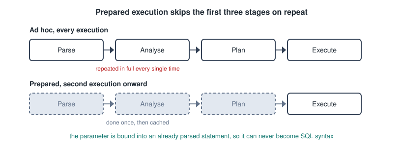

Ad hoc execution does all four every single time. Prepared execution does the first three once and repeats only the fourth.

```sql
PREPARE get_student (INTEGER) AS
    SELECT name, year FROM students WHERE student_id = $1;

EXECUTE get_student(42);
EXECUTE get_student(17);

DEALLOCATE get_student;
DEALLOCATE ALL;
```

The details. Parameters are `$1`, `$2` and so on, numbered rather than named. Types are declared in the parentheses after the name, though PostgreSQL can often infer them. **Prepared statements are session scoped**, so they vanish when the connection closes and are invisible to other sessions, which surprises people. You can inspect them with `SELECT * FROM pg_prepared_statements;` and see the plan with `EXPLAIN EXECUTE get_student(42);`.

### Generic Against Custom Plans

With parameters the planner faces a dilemma: plan now without knowing the values, giving a **generic plan**, or re plan each time using the actual values, giving a **custom plan**.

PostgreSQL's strategy is to build custom plans for the **first five executions** and record their costs. From the sixth, if the generic plan's estimated cost is not worse than the average custom plan cost, it switches to the generic plan and stops re planning.

This matters with skewed data, because a custom plan can be much better. `WHERE status = 'rare'` might warrant an index scan while `WHERE status = 'common'` warrants a sequential scan, and one generic plan cannot serve both.

```sql
SET plan_cache_mode = 'force_custom_plan';   -- or force_generic_plan, or auto
```

So the honest answer to whether prepared statements always improve performance is **no**. They save planning time, but a generic plan can be worse than a custom one.

### In Application Code

You almost never write `PREPARE` by hand. Drivers do it for you whenever you use parameterised queries.

```python
cur.execute("SELECT name FROM students WHERE student_id = %s", (42,))
```

```java
PreparedStatement ps = conn.prepareStatement(
    "SELECT name FROM students WHERE student_id = ?");
ps.setInt(1, 42);
```

```javascript
await client.query('SELECT name FROM students WHERE student_id = $1', [42]);
```

The essential thing is that **the parameter is passed separately from the SQL text**, never concatenated into it.

One deployment note: because prepared statements are session scoped, they interact badly with transaction mode connection poolers like PgBouncer, since each transaction may land on a different backend where the statement does not exist.

### The Three Advantages

**Performance**, because planning is skipped on repeated executions. For a simple query, planning can be a substantial fraction of total time, sometimes more than execution itself. In a loop running the same statement 10,000 times the saving is real, while for a complex query that runs once it is irrelevant.

**Security**, which is the biggest argument. The vulnerable pattern builds SQL by string concatenation.

```python
query = "SELECT * FROM users WHERE name = '" + user_input + "'"
```

If `user_input` is `' OR '1'='1` the statement becomes `SELECT * FROM users WHERE name = '' OR '1'='1'`, which returns every row. Worse inputs can destroy data.

Prepared statements prevent this because the SQL is parsed **before** the parameter is supplied. Once parsed, the statement's structure is fixed, and the parameter is bound as a **value** into a slot in that fixed structure. It is never re parsed, so it **cannot become SQL syntax**. Feeding `' OR '1'='1` as a parameter searches for a user literally named that, and finds none.

→ the phrase to remember is separation of code from data. Escaping is a mitigation that can be got wrong, parameterisation makes injection structurally impossible.

One limitation: parameters can only be **values**, never identifiers. `SELECT * FROM $1` is invalid, and `ORDER BY $1` will not do what you intend. Dynamic table or column names require validating against a whitelist, or `quote_ident()`, and that is the residual injection risk in real applications.

**Readability and maintainability**, since the SQL stays intact rather than being spliced with concatenation and quote escaping, parameter types are declared and checked, and values need no manual quoting, so dates, strings containing apostrophes, and NULLs are all handled by the driver.

---

## Database Models

Each model appeared because the previous one hit a wall, and that narrative is the useful way to hold them.

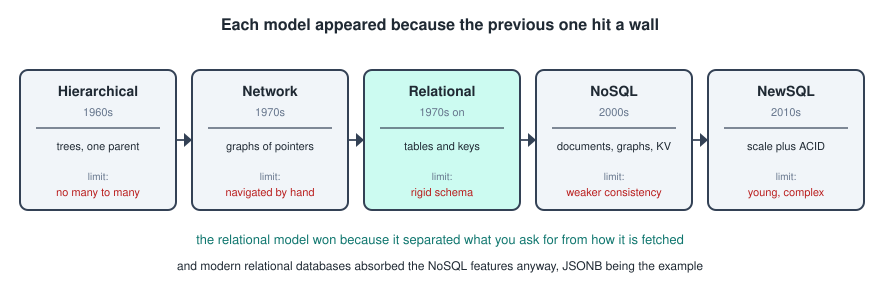

**Hierarchical**, in the 1960s, organised data as a **tree** where each record has exactly one parent, as in IBM's IMS built for the Apollo programme. It was fast for tree shaped data and simple to navigate, but it could not express many to many relationships without duplicating data, queries had to follow the tree from the root, and the access path was hard coded so changing the structure broke every program.

**Network**, in the 1970s, generalised trees into **graphs** so a record could have several parents, linked by explicit pointers. It handled many to many, but it was enormously complex, with programmers navigating pointer chains by hand, and the structure and access path were still entangled.

**Relational**, from 1970 onward, came from Edgar Codd's proposal to treat data as mathematical relations, meaning simple tables with relationships expressed by **values** rather than pointers. The breakthrough was **data independence**: you describe what you want and the system works out how. That is the declarative idea, and it is why programs stopped breaking when storage structures changed. Its limits are a rigid schema, an impedance mismatch with object oriented programming, expensive joins at very large scale, and scaling up more easily than out.

**Object oriented and object relational**, in the 1980s and 90s, responded to the impedance mismatch, since objects have inheritance, methods and nested structures that do not map cleanly onto flat tables. Pure object databases never gained traction, and the compromise that survived was object relational, meaning relational databases with object oriented features added. PostgreSQL is the flagship.

**NoSQL**, in the 2000s, came from web scale needs: horizontal scaling across commodity servers, semi structured data, and rapidly changing schemas. It has four families.

- **Key value**, a hash map, as in Redis and DynamoDB, good for caching and sessions.
- **Document**, JSON like documents, as in MongoDB and CouchDB, good for content and catalogues.
- **Column family**, sparse wide rows, as in Cassandra and HBase, good for write heavy time series.
- **Graph**, nodes and edges, as in Neo4j, good for social networks and fraud detection.

The advantages are horizontal scalability, schema flexibility and high availability. The limitations are weaker consistency, often BASE rather than ACID, limited ad hoc querying, no standard query language, usually no joins, and denormalisation shifting integrity work onto the application.

**The CAP theorem** belongs here: under a network **partition** you must choose between **consistency** and **availability**. Traditional relational systems chose CP and many NoSQL stores chose AP, and that trade off is what motivated the split.

**NewSQL and multi model**, from the 2010s, swung the pendulum back. NewSQL systems such as CockroachDB and Google Spanner aim for horizontal scale **with** ACID and SQL, while relational databases absorbed NoSQL features, PostgreSQL's JSONB being exactly this. The NoSQL against SQL framing has largely dissolved.

---

## OLTP And OLAP

The other axis worth knowing, because it explains why organisations run two databases.

- **OLTP**, transactional, handles many small reads and writes, with a typical query fetching one order. It touches a handful of rows, uses a normalised schema and **row oriented** storage, and prioritises consistency and low latency. PostgreSQL and MySQL live here.
- **OLAP**, analytical, handles few huge read only queries, with a typical query computing revenue by region by quarter. It touches millions of rows, uses a denormalised star or snowflake schema and **column oriented** storage, and prioritises throughput and scan speed. Redshift, Snowflake, BigQuery and ClickHouse live here.

The storage difference is most of the performance gap. `SELECT AVG(salary) FROM employees` needs one column. Row storage reads every column of every row, while column storage reads only the salary column and compresses it well, since adjacent values are similar.

Most organisations run both, with the pipelines from the data engineering notes feeding the warehouse from the transactional database.

---

## Models And Query Languages

The data model determines what the query language can express, and the language mirrors the model's primitives.

- **Relational gives SQL**, set based and declarative because relations are sets, with joins because relationships are values.
- **Hierarchical and network give navigational APIs**, procedural and record at a time, because you have to walk pointers.
- **Document gives JSON query APIs**, with no joins in the SQL sense because documents nest rather than reference.
- **Graph gives traversal languages** such as Cypher and Gremlin, where `MATCH (a)-[:KNOWS*1..3]->(b)` expresses variable depth traversal in one line, which needs a recursive CTE in SQL.
- **Key value gives get and put only**, with no query language at all because there is no structure to query.

SQL's dominance means non relational systems keep bolting SQL like layers on top, because users demand it.

---

## PostgreSQL As Object Relational

A pure relational database has only tables of scalar values. PostgreSQL adds user defined types, inheritance, composite values, function overloading and custom operators. It was designed this way from the start, since the POST-INGRES project set out explicitly to add extensibility to the relational model.

The practical significance is that you can model domain concepts as **first class types** rather than decomposing everything into scalars.

### Domains

The most useful feature here. A domain is a base type plus constraints, defined **once** and enforced everywhere it is used.

```sql
CREATE DOMAIN email AS TEXT
    CHECK (VALUE ~ '^[^@]+@[^@]+\.[^@]+$');

CREATE DOMAIN positive_int AS INTEGER
    CHECK (VALUE > 0);

CREATE TABLE users (
    id      positive_int PRIMARY KEY,
    address email NOT NULL
);
```

If the rule changes you change it in one place, which is genuinely stronger than repeating `CHECK` clauses on every table.

### Enums And Composite Types

```sql
CREATE TYPE order_status AS ENUM ('pending', 'shipped', 'delivered', 'cancelled');
```

An enum sorts in declaration order and rejects anything outside the list. Compared to a `CHECK` constraint it is harder to change, and compared to a lookup table it is less flexible and not joinable, but it is compact.

A composite type is a structured value with named fields, and the reuse is the point.

```sql
CREATE TYPE address AS (
    street   TEXT,
    city     TEXT,
    postcode TEXT,
    country  TEXT
);

CREATE TABLE customers (
    id       SERIAL PRIMARY KEY,
    name     TEXT,
    billing  address,
    shipping address        -- reused
);

INSERT INTO customers (name, billing)
VALUES ('Ana', ROW('Main St 1', 'Leuven', '3000', 'BE'));

SELECT name, (billing).city FROM customers;    -- the parentheses are required
```

The trade off is that you cannot index or constrain individual fields as easily as with separate columns.

**Range types** connect back to `OVERLAPS`, and they express a constraint pure relational SQL cannot.

```sql
CREATE TABLE bookings (
    facid  INTEGER,
    period TSRANGE,
    EXCLUDE USING GIST (facid WITH =, period WITH &&)   -- no double booking
);
```

### Table Inheritance

```sql
CREATE TABLE vehicles (
    id    SERIAL PRIMARY KEY,
    make  TEXT,
    model TEXT,
    year  INTEGER
);

CREATE TABLE cars (
    doors      INTEGER,
    body_style TEXT
) INHERITS (vehicles);
```

`cars` has all of `vehicles`' columns plus its own, and querying the parent implicitly includes the children.

```sql
SELECT * FROM vehicles;        -- includes rows from cars
SELECT * FROM ONLY vehicles;   -- only rows inserted directly into vehicles
```

The `ONLY` keyword is the detail to remember. The caveats are serious enough that table inheritance is widely considered a trap.

- **Primary keys and unique constraints are not inherited** across the hierarchy, so two children can hold the same `id`. Uniqueness is per table only.
- **Foreign keys pointing at the parent do not see children's rows**, so referential integrity breaks.
- Indexes are not shared either, and `ON CONFLICT` does not work across the hierarchy.

→ for most modelling, use a normal relational design instead, either a single table with a type column and nullable extras, or a parent table with child tables linked by foreign key. **Declarative partitioning**, from PostgreSQL 10, replaced the main legitimate use of inheritance, which used to be splitting a large table by range.

### Overloading And Polymorphism

Overloading means the same name with different parameter signatures, resolved by argument types.

```sql
CREATE FUNCTION area(radius NUMERIC) RETURNS NUMERIC
AS $$ SELECT pi() * radius^2 $$ LANGUAGE SQL;

CREATE FUNCTION area(width NUMERIC, height NUMERIC) RETURNS NUMERIC
AS $$ SELECT width * height $$ LANGUAGE SQL;

SELECT area(5);        -- the circle
SELECT area(4, 6);     -- the rectangle
```

Ambiguous overloads produce errors, and `DROP FUNCTION` needs the full signature.

Polymorphic types accept any type, with `ANYELEMENT`, `ANYARRAY` and `ANYCOMPATIBLE` resolved at call time, which is generic programming inside the database.

```sql
CREATE FUNCTION first_or_default(arr ANYARRAY, def ANYELEMENT)
RETURNS ANYELEMENT AS $$
    SELECT COALESCE(arr[1], def);
$$ LANGUAGE SQL;
```

You can also define custom operators, and functions taking a table row as their argument can be called with dot notation, which is what makes it feel object oriented.

```sql
CREATE FUNCTION full_name(c customers) RETURNS TEXT
AS $$ SELECT c.first_name || ' ' || c.last_name $$ LANGUAGE SQL;

SELECT c.full_name FROM customers c;   -- looks like a column, is a function call
```

`c.full_name` and `full_name(c)` are interchangeable.

### When To Use Them

Use them when a validation rule repeats across many tables, which calls for a **domain**, when a structure genuinely repeats and is always used as a unit, which calls for a **composite type**, when a fixed rarely changing value set calls for an **enum**, when domain specific operations belong with the data, or when you need a constraint relational SQL cannot express.

Prefer plain relational when you need indexes, constraints or queries on individual fields, when you need referential integrity so table inheritance is out, when portability matters since nearly all of this is PostgreSQL specific, or when the team is unfamiliar with it.

→ domains and composite types are safe useful wins, table inheritance is the one to be sceptical of, and these features work best as targeted enhancements to a sound relational design rather than a replacement for it.

---

## Cloud Managed Databases

**Self managed** means you install and run PostgreSQL yourself, doing OS patching, installation, configuration, backups, replication, monitoring, upgrades and security.

**Managed**, or DBaaS, means the provider runs the database as a service. You get a connection string, and the provider handles provisioning, patching, backups, failover and monitoring.

The middle case is worth stating explicitly: running PostgreSQL on an EC2 instance is **still self managed**, just on rented hardware. Cloud does not mean managed.

The major providers are AWS with RDS for PostgreSQL and Aurora PostgreSQL, Google Cloud with Cloud SQL, AlloyDB and Spanner, and Azure with Azure Database for PostgreSQL. Independents include Supabase, Neon, Heroku Postgres, DigitalOcean, Aiven and Crunchy Bridge. On the analytics side there are Snowflake, BigQuery and Redshift.

### The Shared Responsibility Model

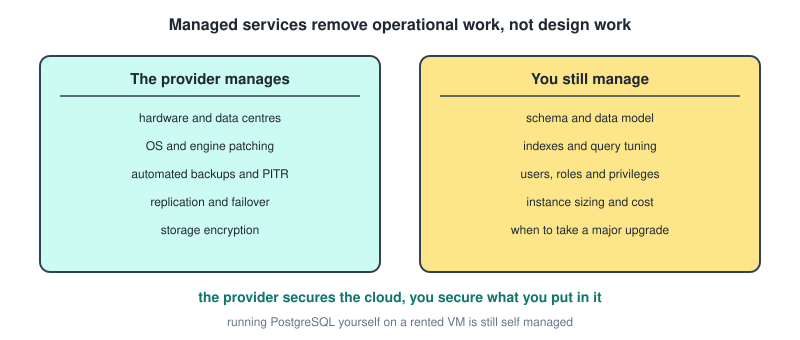

The provider manages physical hardware and data centres, networking and virtualisation, OS installation and patching, database engine installation and minor version patching, automated backups and point in time recovery, high availability with replication and automatic failover, and infrastructure monitoring with storage level encryption.

You still manage your **schema and data model**, since nobody designs your tables for you, **query performance** including indexes and optimisation, **users, roles and privileges**, application level security and connection management, **instance sizing and cost**, deciding when to apply major version upgrades, and **data correctness**, because the provider backs up your data including your mistakes.

→ the provider is responsible for the security **of** the cloud, you are responsible for security **in** the cloud.

A sharper way to put it: managed services eliminate **operational** work, not **design** work. Everything in this file about indexes, query plans, isolation levels and schema design remains entirely your job.

### Benefits And Challenges

The benefits are a reduced operational burden so a small team can run a production database, high availability out of the box as a checkbox rather than a project, automated backups with restore to any second in the retention window, scalability through vertical resizing in minutes and read replicas with a click, security defaults including encryption at rest and in transit plus compliance certifications you would otherwise have to earn, monitoring included, and speed, since you get a production grade database in minutes rather than days.

The challenges.

- **Cost.** Usually more expensive than raw compute at steady state, cheap to start and expensive at scale, and egress fees can surprise you.
- **Vendor lock in.** Proprietary extensions, IAM integration and provider specific tooling make migration hard. Standard PostgreSQL reduces this without eliminating it.
- **Limited tuning.** **No superuser access.** Many `postgresql.conf` parameters are locked, extensions are restricted to an approved list, and there is no filesystem access, so no `file_fdw` and no `COPY FROM` a local path.
- **Less control over timing**, since maintenance windows and forced upgrades happen on the provider's schedule.
- **Version lag**, as new PostgreSQL releases take months to appear.
- **Debugging opacity**, since you cannot inspect the host and depend on support tickets.
- **Data residency**, where your data physically lives may be constrained by law.

Choose managed when you have a small team or no dedicated DBA, need HA and backups without building them, run a standard OLTP workload, care about time to market, or need compliance certifications. That is the default for most organisations today.

Choose self hosted when you need superuser access, custom extensions or unusual configuration, when you are at a scale where the cost difference is large and you have the expertise, when regulation or air gapping requires on premises, when you have specialised needs requiring OS level tuning, or when avoiding lock in is a strategic priority.

→ you are buying expertise and time, and paying with money and control. For most workloads that is a good trade, and for very large or very unusual ones it stops being one.

---

## Quick Recap

**Schemas and dates**
- The hierarchy is server, database, schema, table, and the full name is `database.schema.table`.
- You cannot join across databases, but you can join freely across schemas, which is the main reason to use them.
- `search_path` resolves unqualified names, and the earliest matching schema wins.
- Dates are single quoted ISO strings. A timestamp column needs a **half open range**, `>= day AND < next day`, because equality asks for one instant.

**Transactions**
- Isolation levels differ mainly in **when the snapshot is taken**: per statement for Read Committed, per transaction for the higher two.
- PostgreSQL has no dirty reads at all, and its Repeatable Read prevents phantoms that ANSI permits.
- A conflicting write blocks and re reads at Read Committed, and blocks then errors at the higher two, so those need retry logic.
- Serializable adds tracking of what you **read**, which is what catches write skew.
- `ROLLBACK TO SAVEPOINT` undoes part of a transaction without ending it, and revives an aborted one.

**Indexes**
- A B-tree gives O(log n) lookups and also serves ranges, sorting and prefix matches.
- PostgreSQL has **no clustered indexes**, only a one off `CLUSTER` command.
- A composite index serves any **leftmost prefix** and nothing else, so put equality columns first.
- `PRIMARY KEY` and `UNIQUE` create indexes, `FOREIGN KEY` creates nothing, so index your foreign keys.
- Indexes pay off below roughly 5 to 10 percent selectivity, and cost you write speed, storage and maintenance.
- Keep the column bare on one side of the comparison, or the index cannot be used.

**Query plans**
- `EXPLAIN` estimates without running, `ANALYZE table` refreshes statistics, `EXPLAIN ANALYZE` runs the query and shows both.
- Read a plan bottom up, cost is startup then total in arbitrary units, and a parent already includes its children.
- With `loops > 1` the reported time and rows are **per loop**, so multiply.
- Compare estimated against actual rows to find misestimates, since a low cost built on a bad estimate means nothing.
- `EXPLAIN ANALYZE` on DML really changes data, so wrap it in `BEGIN ... ROLLBACK`.

**Views and security**
- A view stores the query and is always current, a materialized view stores the results, is fast and stale, and can be indexed.
- Nothing refreshes a matview automatically, and `CONCURRENTLY` needs a unique index.
- `WITH CHECK OPTION` stops you writing rows the view could not see, and `CASCADED` is the default.
- Users and roles are the same object, and `LOGIN` is what makes a role a user.
- `USAGE` on the schema is a prerequisite for any table privilege inside it.
- Security views work because the view runs with its **owner's** privileges, and only if the base table access is actually revoked.

**Joins and set operators**
- `ON` decides what matches, `WHERE` filters afterward, and a right table condition in `WHERE` turns a `LEFT JOIN` into an inner join.
- `USING` merges the shared column, `NATURAL JOIN` guesses and breaks silently on schema change.
- Equi joins allow hash and merge joins, theta joins force nested loops.
- `LATERAL` lets a subquery see earlier tables and runs once per left row, which is the best tool for top N per group.
- `INTERSECT ALL` gives **min(m, n)** and `EXCEPT ALL` gives **max(0, m minus n)**. `EXCEPT` is not commutative, and set operators treat NULLs as equal.

**Subqueries and CTEs**
- Non correlated runs once, correlated runs once per outer row, at least logically.
- `NOT IN` breaks when the subquery contains a NULL, so use `NOT EXISTS`.
- `ALL` over an empty set is true, `ANY` over an empty set is false.
- Double `NOT EXISTS` is how you express "for all", called relational division.
- From PostgreSQL 12, single reference CTEs are inlined, so they no longer act as an optimization fence.
- A recursive CTE is anchor plus `UNION ALL` plus a self reference, it **iterates** seeing only the previous round, and it needs a terminating condition.

**Window functions and grouping**
- They keep every row, unlike `GROUP BY`, and cannot appear in `WHERE`, `GROUP BY` or `HAVING`.
- `ROW_NUMBER` never ties, `RANK` skips after ties, `DENSE_RANK` does not.
- Adding `ORDER BY` to an aggregate window turns a total into a **running total**.
- `LAST_VALUE` needs an explicit full frame or it returns the current row.
- `ROLLUP` gives n plus 1 groupings, `CUBE` gives 2 to the n, `GROUPING SETS` gives exactly what you list, and `GROUPING(col)` tells a subtotal NULL from a real one.
- `FILTER (WHERE ...)` applies a condition to one aggregate, which is how you pivot.

**Everything else**
- `JSONB` over `JSON` nearly always. `->` returns JSON and chains, `->>` returns text and ends the chain, `@>` is the best indexed operator.
- An FDW makes external data look like a table, and **pushdown** decides whether it is usable at scale.
- `pg_stat_statements` finds which query to look at, and `total_exec_time` matters more than `mean_exec_time`.
- A prepared statement parses and plans once, and prevents injection by **separating code from data**, though parameters can only be values.
- The model determines the query language, OLTP uses row storage and OLAP uses column storage.
- Domains and composite types are the object relational features worth using, table inheritance is the one to avoid.
- Managed databases remove operational work, not design work.
