# Data Storage And SQL

The data engineering file from the data science section talked about pipelines moving data around. This one is about the thing at the end of the pipe: the database itself. First how you design one on paper, then how you talk to it.

**SQL stands for Structured Query Language** and is a programming language used to **manage and manipulate relational databases**. It is used to store data, retrieve data, update data, delete data, and manage database structure.

---

## Why A Database

You can keep data in files. A CSV, a folder of JSON, a spreadsheet. It works right up until it does not, and it stops working for reasons that are always the same.

- Two people edit at once and one of them loses their changes.
- The same customer is spelled three ways in three files and nothing can be counted.
- Half a change gets written, the laptop dies, and the file is left in a state that makes no sense.
- Finding one row means reading the whole file.
- Everyone who has the file can read every column in it, including the salaries.

A database is the software that has already solved all five. That is really the whole pitch.

---

## Data Vs Information

Worth separating these two before anything else.

- **Data** refers to specific facts that can take the form of digits, numbers, words, characters. For example `'23'`, `'1912'`, `'London'`, `'Alan'`, `'June'`.
- **Information** refers to the meaning that users attach to those facts, and the connections made between them. For example, on June 23 1912, Alan was born in London.

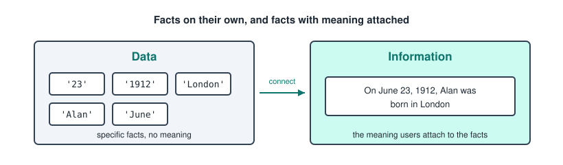

The database stores the data. The structure you give it, the tables and the links between them, is what turns it back into information.

---

## Persistent Data Storage

Persistent data is data that is stored over a long period of time, meaning it survives the program that created it being closed.

Persistent data is stored using relational databases and database management systems.

---

## Databases And DBMS

- A **database** is a collection of persistent data.
- A **DBMS**, database management system, is the technology used to build these databases, and to maintain, manage, secure, and query the data.

The distinction matters more than it looks. The database is your data. The DBMS is the program that guards it. PostgreSQL, MySQL, SQLite, Oracle, and SQL Server are all DBMSs.

What the DBMS is actually doing for you.
- **Storage and retrieval**, deciding how bytes sit on disk so lookups are fast.
- **Concurrency**, letting many users read and write at once without corrupting anything.
- **Integrity**, refusing writes that break the rules you declared.
- **Security**, controlling who can see and change what.
- **Recovery**, getting back to a sane state after a crash.

---

## The Relational Model

Relational databases store everything in tables, and connect the tables using keys. That is the entire idea, and every design step later is in service of it.

- A **table**, formally a relation, holds one kind of thing. One table for owners, one for dogs.
- A **row**, formally a tuple, is one of those things. One owner.
- A **column**, formally an attribute, is one property of it. The owner's email.
- The **domain** of a column is the set of values that column is allowed to hold.

Two properties trip people up at first. Rows have no order, so if you want them in an order you must ask for it. And a cell holds exactly one value, never a list.

---

## Keys

Keys are how rows are identified and how tables find each other.

- A **candidate key** is any column, or set of columns, that uniquely identifies a row.
- The **primary key** is the candidate key you picked to be the official one. It can never be NULL.
- A **composite key** is a primary key made of more than one column.
- A **foreign key** is a column that holds the primary key of another table. That is the link.
- A **surrogate key** is a meaningless generated id, usually an auto incrementing integer. A **natural key** is a real world value like an email or a passport number.

Surrogate keys are the usual choice, because natural keys have a habit of changing. People change their email address, and if that email was the key then every table pointing at it has to change too.

---

## Transactions And ACID

A transaction is a group of statements that must succeed or fail together. Moving money between two accounts is two updates, and one of them happening alone would be a disaster.

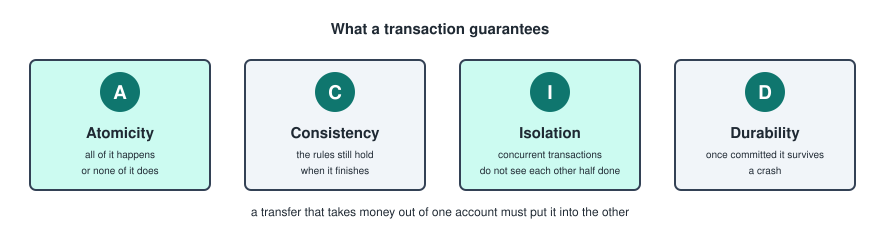

```sql
BEGIN;
UPDATE account SET balance = balance - 100 WHERE id = 1;
UPDATE account SET balance = balance + 100 WHERE id = 2;
COMMIT;
```

If anything goes wrong before the `COMMIT`, you send `ROLLBACK` and it is as though nothing happened.

---

## Indexes

An index is a separate structure that lets the DBMS find rows without reading the whole table, the same way the index at the back of a book beats flipping through every page.

```sql
CREATE INDEX idx_dog_owner ON dog(owner_id);
```

The trade off is real. Reads get faster, writes get slower, because every insert has to update the index too. Primary keys are indexed automatically. Foreign keys usually should be, since they are what joins run on.

---

## SQL And Its Sublanguages

SQL is the language for talking to a relational database. It is normally split into four groups, and it helps to know which one you are in.

- **DDL**, data definition, defines the structure. `CREATE`, `ALTER`, `DROP`.
- **DML**, data manipulation, works with the rows. `SELECT`, `INSERT`, `UPDATE`, `DELETE`.
- **DCL**, data control, handles permissions. `GRANT`, `REVOKE`.
- **TCL**, transaction control. `BEGIN`, `COMMIT`, `ROLLBACK`.

---

## Data Modelling

Data modelling produces a visual, schematic, and easy to read representation of the data we want to include in the database. It is written using a standardized notation.

It happens in three passes.

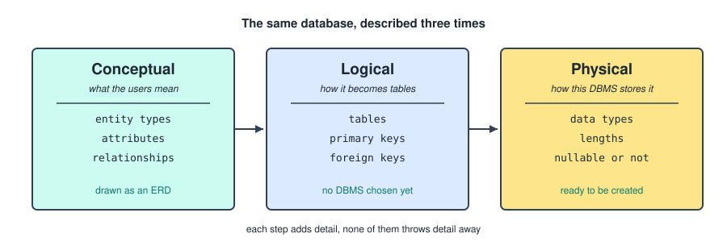

1. Conceptual data model.
2. Logical data model.
3. Physical data model.

---

## Conceptual Data Model

In this model we create a picture of the reality of the users, using the information they give us, without including technical details or technical limitations.

- It is drawn up during the analysis phase, through workshops and interviews, by analysts and architects.
- It is illustrated using an **entity relationship diagram**, an ERD.

The point of leaving technology out is that you are still allowed to be wrong cheaply. Redrawing a diagram costs nothing. Migrating a live table costs a weekend.

---

## The Three Building Blocks Of An ERD

- **Entity types** are the concepts that are described in the database.
- **Attributes** are the description of those concepts, the properties included in the database.
- **Relationships** are the links that exist between the concepts.

---

## Entity Types

After understanding the concept of the context, the question is which concepts should we describe in our database.

Mostly it will be a noun, and one word. Person, car, ticket, document.

A useful test: if you find yourself wanting to store more than one fact about something, it is probably an entity type rather than an attribute.

---

## Attributes

Two questions to ask.
- How do we want to describe these concepts?
- What properties do we want to include in the database?

Each attribute has a **domain**, the set of values it is allowed to take. Gender has the domain male, female. Those are values in the domain, not entities of their own.

---

## Relationships

- What links might exist between different concepts?
- Information is created when we connect data.
- Avoid redundancy with relations, meaning avoid unnecessary relations that can be derived from other relations.
- Mostly it will be a verb.

The redundancy point is the one worth being strict about. If a city belongs to a country, and a customer belongs to a city, do not also draw customer to country. It is already implied, and now there are two versions of the truth that can disagree.

---

## Reading An ERD

Everything in one picture, using the owner and dog example.

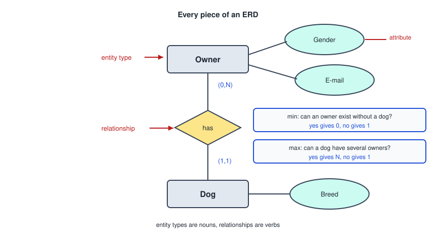

The cardinalities are written as `(min, max)` next to each entity type, and you get them by asking two questions.

- For the minimum, can this thing exist without the other one? Yes gives 0, no gives 1.
- For the maximum, can this thing be linked to several of the other? Yes gives N, no gives 1.

---

## Types Of Relationship

Based on the combination of the maximum cardinalities of two entity types.

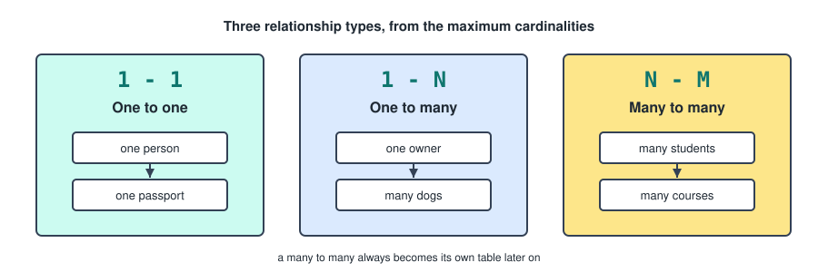

1. **One to one**, `1-1`.
2. **One to many**, `1-N`.
3. **Many to many**, `N-N` or `N-M`.

---

## Types Of Attributes

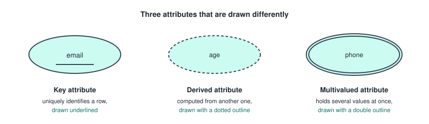

- **Key attribute**: the attribute that uniquely identifies an entity. Drawn underlined.
- **Derived attribute**: an attribute that can be derived from another one, like age from date of birth. Drawn with a dotted outline.
- **Multivalued attribute**: an attribute that can hold many values, like several phone numbers. Drawn with a double outline.

Derived and multivalued attributes are the two that get special treatment later, so it is worth marking them properly now.

---

## Degree Of A Relationship

The number of entity types linked by a relationship is called the degree.

- **Unary**, degree 1, an entity type related to itself. An employee manages other employees.
- **Binary**, degree 2, the normal case.
- **Ternary**, degree 3, three entity types in one relationship.

---

## Attributes Of Relationships

A relationship attribute assigns properties to the relationship between entity types, rather than to either entity type on its own.

A grade belongs to the pairing of a student and a course, not to the student and not to the course.

In practice these show up on many to many relationships, because that is the case that gets its own table later and therefore has somewhere to put them. On a one to many you can always push the attribute onto the many side instead, which is why the rule is usually taught as "only on N-M".

---

## Extended Entity Relationship Diagrams

An EERD adds inheritance to the picture.

- **Generalization**: for subtypes with common relationships and attributes, we create a supertype.
- **Specialisation**: from a supertype we create several subtypes that inherit the properties and relationships of the supertype, but each has its own additional relationships and attributes.

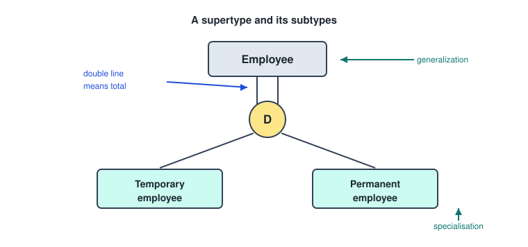

Generalization works bottom up, you noticed two things were similar. Specialisation works top down, you noticed one thing came in several flavours. Same diagram either way.

---

## EERD Links

Two questions, asked separately.

Must every supertype entity be in a subtype?
- **Total inheritance**: each entity of the supertype is also an entity of one or more subtypes. Drawn with a double line.
- **Optional inheritance**: an entity of the supertype can also be an entity of one or more subtypes, but this is not mandatory. Drawn with a single line.

Can one entity be in several subtypes at once?
- **Disjunctive inheritance**: an entity of the supertype can be an entity of at most one subtype. Marked `D`.
- **Overlapping inheritance**: an entity of a supertype can be an entity of multiple subtypes. Marked `O`.

---

## EERD Combined Links

Combining the two gives four cases.

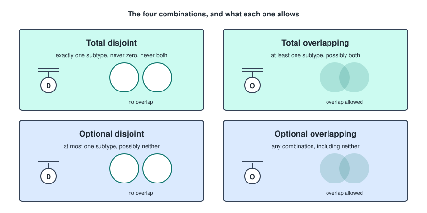

- **Total disjoint**: exactly one subtype. Never zero, never two.
- **Total overlapping**: at least one subtype, and possibly several.
- **Optional disjoint**: at most one subtype, and possibly none.
- **Optional overlapping**: any combination at all, including none.

The word "total" always removes the option of belonging to nothing, and "disjoint" always removes the option of belonging to two. So the only case that allows both "neither" and "both" is optional overlapping, and the only case that allows neither of them is total disjoint.

---

## Logical Data Model

The question to ask yourself: how should we structure the data according to our chosen database model?

Here we use the relational database model, which structures data in tables and connects those tables using keys.

---

## From Conceptual To Logical

Four steps, in order.

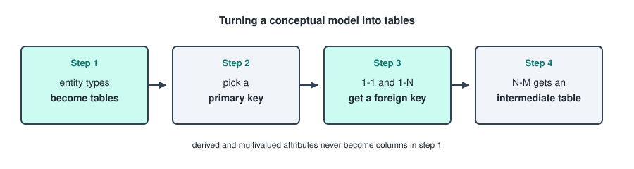

1. All entity types from the conceptual model become tables.
2. We pick a primary key for every table.
3. For all `1-1` and `1-N` relationships, a primary key is transferred as a foreign key.
4. For all `N-M` relationships, an intermediate table is created.

### Step 1, Entity Types Become Tables

The entity type is the title of the table, and the attributes become the rows of the table in the diagram, which are the columns once the table actually exists.

Derived attributes and multivalued attributes are not added.

Derived attributes are left out because storing them means storing the same fact twice, and the two copies will drift apart. Multivalued attributes are left out because a cell holds one value, so they need a table of their own.

### Step 2, Pick A Primary Key

The key attribute from the conceptual model becomes the primary key in the logical model.

To mark a primary key, you write `PK` on the left side of the row.

### Step 3, Transfer The Key

You take a PK from one table and write it at the end of the other table with `FK` before it, for foreign key.

For a `1-N` relationship, the foreign key always goes in the table on the many side, which is the one whose maximum cardinality is 1. A dog has exactly one owner, so `owner_id` goes into `dog`. Putting it the other way round would mean one owner row holding a list of dog ids, which a cell is not allowed to do.

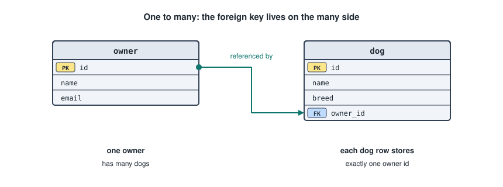

Then you draw the link from the FK to the PK it points at, using these ends.

```
(1)  ->  |        exactly one
(0)  ->  o        zero or one
(N)  ->  <        many
```

### Multivalued Attributes

For every multivalued attribute we create a new table, with the name of the attribute as the name of the table.

- We add the PK of the original entity type table to the new table as a foreign key, but you notate it as `PK FK`, because it is part of the key there as well.
- The link is drawn `|<` going into the multi table, and `||` going into the entity type table.

So a person with several phone numbers gets a `phone` table holding `person_id` plus the number, one row per number.

### Step 4, The Intermediate Table

For a many to many, we create an intermediate table with the relationship as its title.

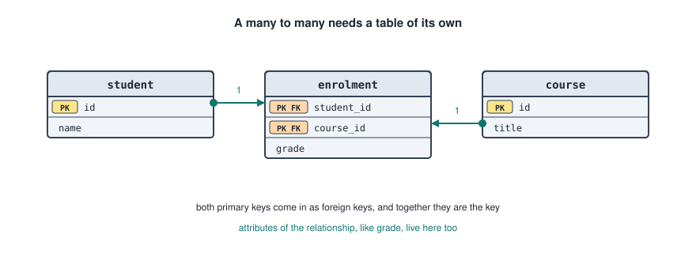

- We add both PKs from both entity type tables into the intermediate table as foreign keys, notated as `PK FK`.
- The attributes of the relationship can be added as rows to the intermediate table.
- You connect the PK from each table to the corresponding `PK FK` of the intermediate table, drawn `o<` going into the intermediate table and `||` going into the entity type tables.

The pair of foreign keys together is the primary key, which is exactly what stops the same student being enrolled in the same course twice.

---

## Exceptions

- **Tables related to themselves**, from a unary relationship. The FK points at the PK of the same table. An employee table with a `manager_id` that holds another employee's id.
- **Extended entity relationship diagrams**. Make a table for the supertype only, and add all the attributes of the subtypes to it as well.

That last one is the simplest of the three ways to flatten inheritance. It means subtype specific columns sit empty for rows of the other subtype, which is the price you pay for having one table instead of three.

---

## Physical Data Model

The question to ask yourself: how should we describe the data structure according to our chosen DBMS?

It completes the logical data model with technical details, like the data type of the columns, the maximum length of a value, and whether a column can be NULL.

---

## From Logical To Physical

1. Give all tables and columns a clear name, within agreed conventions.
2. Determine for every column a data type, and where necessary a maximum length.
3. Indicate whether the value in a column may be empty or not.

---

## Naming Conventions

- Primary keys use the name `id`, marked yellow.
- Foreign keys use the name `table_id`, marked blue.
- Keep everything lowercase and use underscores.

---

## Common Data Types

The notes stop at "pick a data type", so here are the ones actually used.

- `INTEGER`, `BIGINT` for whole numbers.
- `DECIMAL(p, s)` for exact numbers with decimals. Money goes here, never in a float.
- `REAL`, `DOUBLE PRECISION` for approximate numbers.
- `VARCHAR(n)` for text with a limit, `TEXT` for text without one.
- `CHAR(n)` for fixed length text, which is rarer than people think.
- `BOOLEAN` for true and false.
- `DATE`, `TIME`, `TIMESTAMP` for points in time.

---

## Creating The Tables

The physical model translates almost line for line into DDL.

```sql
CREATE TABLE owner (
    id       INTEGER PRIMARY KEY,
    name     VARCHAR(80) NOT NULL,
    email    VARCHAR(120) UNIQUE
);

CREATE TABLE dog (
    id        INTEGER PRIMARY KEY,
    name      VARCHAR(80) NOT NULL,
    breed     VARCHAR(60),
    owner_id  INTEGER NOT NULL REFERENCES owner(id)
);
```

The constraints are the part that carries the design across.
- `PRIMARY KEY` is the key you chose in step 2.
- `REFERENCES` is the foreign key from step 3, and it is what makes the database refuse a dog whose owner does not exist.
- `NOT NULL` is step 3 of the physical model.
- `UNIQUE` is a candidate key you did not pick as the primary one.
- `CHECK (age >= 0)` enforces a domain.

---

## Changing And Removing Rows

The rest of DML, since it comes up long before you get to a clever SELECT.

```sql
INSERT INTO owner (id, name, email) VALUES (1, 'Alan', 'alan@mail.com');

UPDATE owner SET email = 'new@mail.com' WHERE id = 1;

DELETE FROM owner WHERE id = 1;
```

The `WHERE` is not optional in practice. An `UPDATE` or `DELETE` without one hits every row in the table.

---

## The Order A Query Runs In

Before the individual clauses, this is the thing that explains most confusing SQL errors.

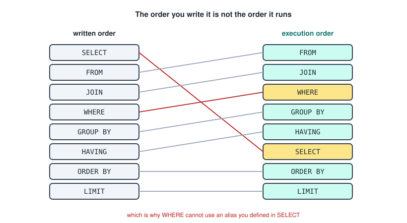

SELECT is written first and runs almost last. That is why an alias you create in SELECT cannot be used in WHERE, but can be used in ORDER BY, which runs after it.

---

## SELECT

```sql
SELECT col                      -- one column
SELECT col1, col2, col3         -- several columns
SELECT *                        -- every column
SELECT DISTINCT col             -- the column with duplicate rows removed
SELECT col AS new_col           -- the column, renamed in the output
SELECT col || ' ' || col2       -- the two columns combined into one
```

`AS` only renames the column in the result. It changes nothing in the table.

The `||` operator concatenates strings. It is the standard SQL spelling and works in PostgreSQL and SQLite. MySQL uses `CONCAT(col, ' ', col2)` instead.

You can also select something that is not a column at all, like `SELECT price * 1.21 AS price_incl`, and that expression becomes a new column in the output. Selecting a column name that does not exist in the table is an error, not a new column.

---

## Operators

```sql
AVG(col)                        -- average
MAX(col)   MIN(col)             -- largest and smallest
SUM(col)                        -- total
COUNT(col)                      -- number of non NULL values in col
COUNT(*)                        -- number of rows
LOWER(col)   UPPER(col)         -- case conversion
SUBSTRING(col FROM 3)           -- everything from position 3, that position included
```

`COUNT(col)` and `COUNT(*)` are not the same thing, and the difference is NULLs. `COUNT(*)` counts rows. `COUNT(col)` skips the rows where that column is empty. The same is true of the others: `AVG` divides by the number of non NULL values, not by the number of rows.

---

## Quotations

- **Single quotes** for strings and dates, `'London'`, `'2024-01-31'`.
- **Double quotes** for table names, column names, and aliases that contain spaces or special characters.

Getting these the wrong way round is the classic first error. `"London"` asks for a column called London.

---

## FROM

```sql
FROM schema_name.table_name         -- one table
FROM table1, table2                 -- implicit join
FROM table1 JOIN table2 ON t1.col = t2.col   -- explicit join
```

The comma form creates an **implicit join**, which joins the tables using the cartesian product, every row of table 1 paired with every row of table 2. With a `WHERE` behind it, that gives the same result as an inner join, and without one it gives you a table the size of both multiplied together.

Use the explicit form. It says what you meant, and a forgotten condition is a syntax error instead of a two million row result.

---

## The Joins

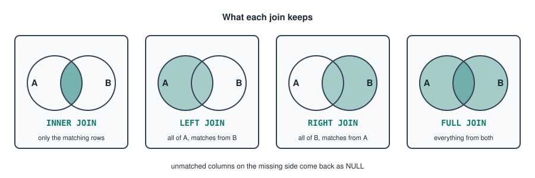

**INNER JOIN**, or just `JOIN`.
```sql
SELECT col, col, col
FROM table1
INNER JOIN table2 ON col_table1 = col_table2;
```
- Selects the rows that match on both sides.
- Drops the rows that do not match, from either table.

**LEFT OUTER JOIN**, or `LEFT JOIN`.
- Selects everything from the left table, and only the matches from the right table.
- Where the right table has nothing to give, the columns come back as NULL.
- Rows of the right table that do not match are dropped.

**RIGHT OUTER JOIN**, or `RIGHT JOIN`.
- Selects everything from the right table, and only the matches from the left table.
- Where the left table has nothing to give, the columns come back as NULL.
- Rows of the left table that do not match are dropped.

**FULL OUTER JOIN**, or `FULL JOIN`.
- Selects everything from both tables.
- Missing values on either side come back as NULL.
- Nothing is dropped.

Two more worth knowing. `CROSS JOIN` is the cartesian product written on purpose. A **self join** is a table joined to itself, which is how you query a unary relationship.

```sql
SELECT e.name, m.name AS manager
FROM employee e
LEFT JOIN employee m ON e.manager_id = m.id;
```

The `LEFT` there is doing work. An inner join would silently drop whoever is at the top of the company.

---

## WHERE

WHERE filters individual rows, and it runs before SELECT even though it is written after it.

```sql
WHERE condition                     -- =  <  >  <=  >=  !=
WHERE condition AND condition
WHERE condition OR condition
WHERE col IS NULL
WHERE col IS NOT NULL
WHERE col BETWEEN 10 AND 20         -- both ends included
WHERE col LIKE 'Je%'
WHERE col IN ('Paris', 'Lyon')
```

`LIKE` searches the text of a column. `col LIKE 'Je%'` returns rows like Jerry and Jess. Two wildcards make it more precise.
- `%` matches zero or more characters.
- `_` matches exactly one character.

NULL is the trap here. It means unknown, not empty, so `col = NULL` is never true for anything, not even for the rows that are NULL. That is the entire reason `IS NULL` exists as separate syntax.

---

## GROUP BY And HAVING

`GROUP BY` rolls all the rows sharing a value into one group, which is what makes the aggregate operators useful.

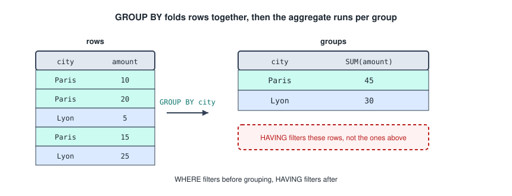

```sql
GROUP BY col
GROUP BY col1, col2, col3
```

`HAVING` filters those groups, and applies after the grouping.

```sql
HAVING condition
HAVING condition AND condition
HAVING condition OR condition
```

Put together, on the example in the diagram.
```sql
SELECT city, SUM(amount) AS total
FROM sales
WHERE amount > 0
GROUP BY city
HAVING SUM(amount) > 40;
```

WHERE throws away rows before the grouping, HAVING throws away groups after it. Same job, different moment.

One rule follows from this: every column in the SELECT must either appear in the GROUP BY or be inside an aggregate. There is no sensible answer to "which amount" once five rows became one.

---

## ORDER BY

```sql
ORDER BY col                    -- ascending, the default
ORDER BY col ASC                -- ascending, said out loud
ORDER BY col DESC               -- descending
ORDER BY col1 DESC, col2 ASC    -- second column breaks ties in the first
```

Without an ORDER BY, the order of the rows is not guaranteed by anything, even if it looks stable.

---

## LIMIT

```sql
LIMIT 10                        -- the first 10 rows only
LIMIT 10 OFFSET 20              -- 10 rows, starting after the first 20
```

`OFFSET` skips rows before the limit is applied, which is how paging through results works: page 3 of 10 per page is `LIMIT 10 OFFSET 20`.

MySQL also allows the short form `LIMIT 20, 10`, where the first number is the offset and the second is the count. The order being backwards from how it reads is exactly why the `OFFSET` spelling is worth preferring.

LIMIT runs last of everything, so it is applied after the sorting, not before it.

---

## Privileges

Access control is DCL, and it is what the security part of a DBMS looks like in practice.

```sql
GRANT privilege ON SCHEMA schema_name TO user;
GRANT privilege ON TABLE table_name TO user;
```

The privileges themselves.
- `ALL`: all rights except `DROP`.
- `SELECT`: read rights.
- `UPDATE`: rights to update columns, needs `SELECT` to be useful.
- `DELETE`: rights to delete rows, needs `SELECT` to be useful.
- `CREATE`: rights to create a schema or a table.
- `USAGE`: rights to access a schema at all.

Taking them back again.
```sql
REVOKE privilege ON SCHEMA schema_name FROM user;
REVOKE privilege ON TABLE table_name FROM user;
```

`USAGE` on the schema is the one people forget. Without it, a user with `SELECT` on a table still cannot reach the table to select from it.

---

## Putting It Together

The whole path, in one line each.

- Talk to the users, draw entity types, attributes and relationships as an ERD.
- Turn every entity type into a table, pick primary keys, push foreign keys onto the many side, give every many to many its own table.
- Add data types, lengths and NULL rules, then write the `CREATE TABLE` statements.
- Query it with SELECT, remembering that it runs almost last.
