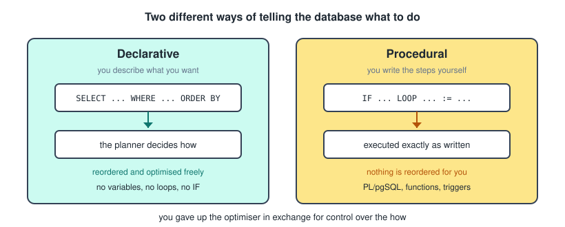
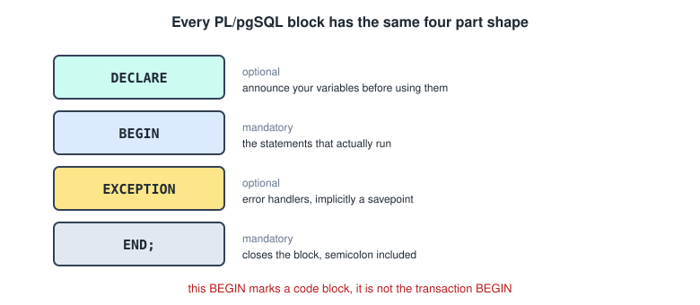
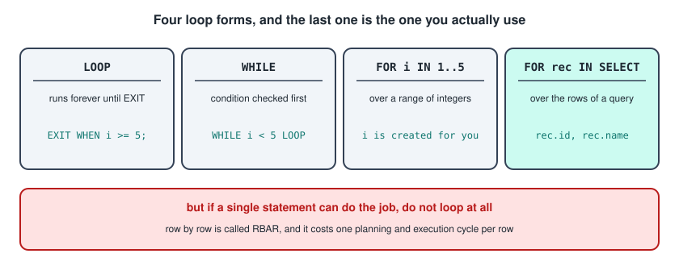
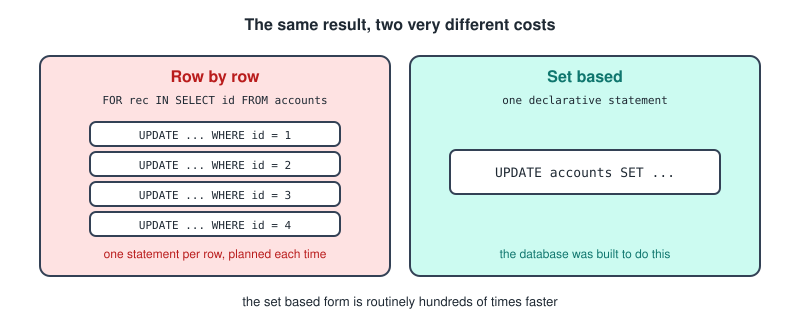
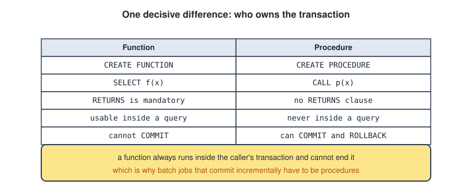
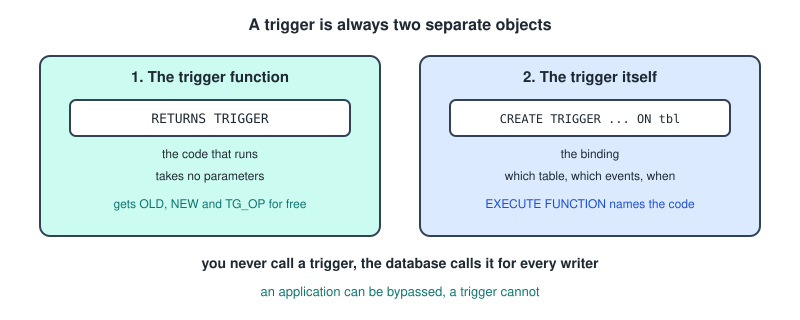
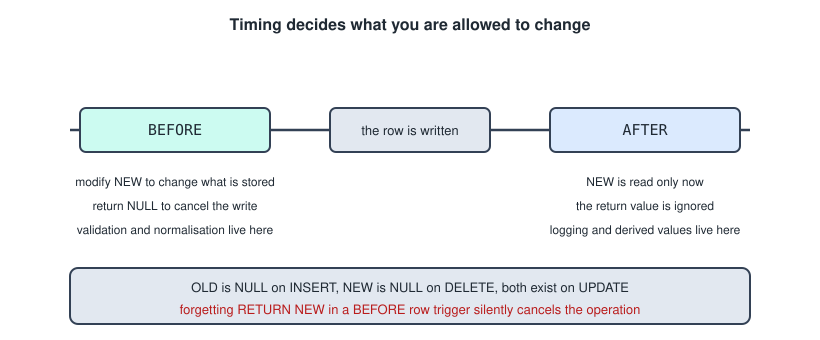
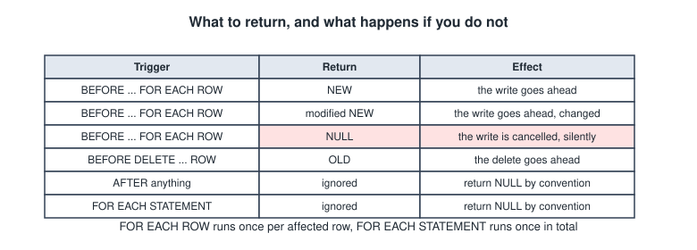
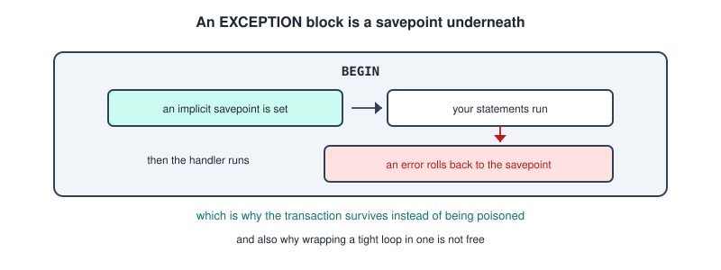
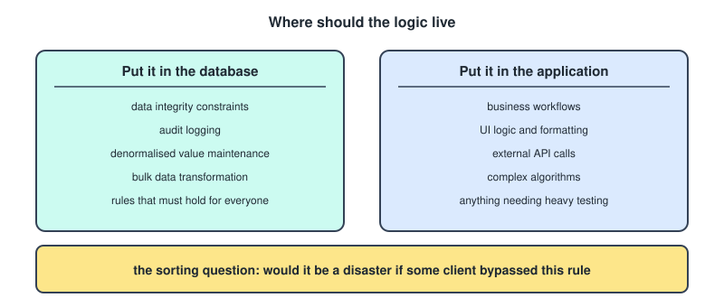

# Procedural SQL

Everything in the Data Storage And SQL file was declarative. You described a result and the planner worked out how to produce it. This file is about the point where SQL stops being a query language and starts being a programming language, with variables, loops, conditions, and code that the database stores and runs on your behalf.

The language here is PL/pgSQL, which is what PostgreSQL uses. Oracle has PL/SQL and SQL Server has T-SQL. They are the same idea wearing different syntax.

---

## Declarative Vs Procedural

Declarative SQL describes what you want. You never write a loop over the rows, never say how to sort, never choose which index to use.

```sql
SELECT name FROM students WHERE year = 2 ORDER BY name;
```

Nothing in that statement is an instruction. It is a specification of the desired result, and the planner is free to satisfy it however it likes. That freedom is exactly why two people can write the same query differently and get the same plan.

Procedural SQL is the opposite. You write steps, and they run in the order you wrote them. The database cannot reorder or optimize them, because you have taken control of the how.

```sql
DO $$
DECLARE
    counter INTEGER := 0;
BEGIN
    WHILE counter < 5 LOOP
        RAISE NOTICE 'counter is %', counter;
        counter := counter + 1;
    END LOOP;
END $$;
```

That is a program. It runs top to bottom, five times through the loop, printing each time.



The two side by side.

- **You specify**: what you want, against how to do it.
- **Execution order**: the planner decides, against exactly as written.
- **Optimised**: heavily, against not at all.
- **Variables, loops, `IF`**: absent, against present.
- **Set based**: yes, operating on whole tables, against row by row being possible.

---

## Why Procedural SQL Exists

Some things simply cannot be written as a single declarative statement.

- If the balance is under 100 apply a fee, otherwise apply interest, and the rule depends on the account type.
- Loop through each pending order and process it, stopping if any fails.
- Whenever someone updates this table, automatically write a row to an audit log.
- Retry this operation up to three times.

You can often force these into clever declarative SQL using `CASE` or `WITH RECURSIVE`, and when you can, you should. But conditional branching, iteration, error handling, and automatic reactions to data changes are what procedural code is actually for.

---

## The DO Block

Before functions and triggers, learn the simplest form. A `DO` block is an anonymous block of procedural code that runs once immediately and is then discarded. Nothing is stored, which makes it the right place to experiment.

```sql
DO $$
BEGIN
    RAISE NOTICE 'Hello from inside the database';
END $$;
```

Run that in the pgAdmin Query Tool and the output appears in the **Messages** tab, not in the Data Output grid. That catches everyone the first time.

### What The Dollar Signs Are For

Your procedural code is handed to PostgreSQL as a string. Normally strings are wrapped in single quotes, but procedural code is full of single quotes already, and escaping every one of them would be miserable.

So PostgreSQL lets you use `$$` as the string delimiter instead. Everything between the opening and closing `$$` is one big string literal, and single quotes inside need no escaping.

```sql
DO $body$ ... $body$;
DO $func$ ... $func$;
```

You can put a tag between the dollar signs, which is useful if the code itself contains `$$`. This is purely a quoting mechanism and has nothing to do with procedural logic.

---

## Anatomy Of A Block

Every PL/pgSQL block has the same shape, whether it is a `DO` block, a function body, or a trigger function.

```
[ DECLARE
      declarations ]
BEGIN
      statements
[ EXCEPTION
      error handlers ]
END;
```



- **`DECLARE`** is optional, and is where you announce variables before using them.
- **`BEGIN ... END`** is mandatory, and holds the body.
- **`EXCEPTION`** is optional, and handles errors.

One warning worth absorbing now: this `BEGIN` is **not** the transaction `BEGIN`. Same word, completely different meaning. Here it only marks the start of a code block. You get used to telling them apart from context.

Every statement ends with a semicolon, including `END;`.

---

## Variables

Variables are declared with a type, and assignment uses `:=` rather than `=`.

```sql
DO $$
DECLARE
    student_name TEXT;                    -- declared, starts as NULL
    total        INTEGER := 0;            -- declared with an initial value
    tax_rate     NUMERIC := 0.21;
    today        DATE := CURRENT_DATE;
BEGIN
    total := total + 10;
    RAISE NOTICE 'total is %, rate is %', total, tax_rate;
END $$;
```

The points to absorb.

- Variables use **the same types as table columns**, so `INTEGER`, `TEXT`, `NUMERIC`, `DATE`, `BOOLEAN` and the rest.
- **Assignment is `:=`**. In PL/pgSQL, `=` means comparison. PostgreSQL tolerates `=` for assignment, but write `:=`, because it is clearer and it is the standard spelling.
- An uninitialised variable is `NULL`.
- `CONSTANT` makes a variable unchangeable, as in `pi CONSTANT NUMERIC := 3.14159;`.

### Anchored Types

Rather than guessing a column's type, you can borrow it.

```sql
DECLARE
    s_name    students.name%TYPE;      -- whatever type students.name is
    whole_row students%ROWTYPE;        -- a variable holding an entire row
```

`%TYPE` means the same type as that column, so if someone later changes `students.name` from `VARCHAR(50)` to `TEXT`, your code adapts on its own. `%ROWTYPE` gives you a composite variable whose fields you reach with dots, as in `whole_row.name`.

---

## RAISE

`RAISE` is your print statement, and the only real debugging tool you have inside a function.

```sql
RAISE NOTICE 'Value is %', some_variable;
```

The `%` is a placeholder filled by the arguments in order, the same way `printf` works.

The severity level changes what happens.

- **`NOTICE`** prints a message and execution continues.
- **`WARNING`** prints more prominently and continues.
- **`EXCEPTION`** throws an error and aborts the transaction.

`RAISE EXCEPTION` is how you deliberately reject something.

```sql
RAISE EXCEPTION 'Balance cannot be negative: %', new_balance;
```

---

## SELECT INTO

This is the bridge between the declarative half and the procedural half. You run a query and store its result in a variable.

```sql
DO $$
DECLARE
    bal NUMERIC;
BEGIN
    SELECT balance INTO bal FROM accounts WHERE id = 1;
    RAISE NOTICE 'Balance is %', bal;
END $$;
```

Three behaviours you have to know, because two of them are silent.

- **No rows found**, and the variable becomes `NULL`. No error is raised, which is a common source of bugs.
- **Multiple rows found**, and you get the first row while the rest are discarded. Again no error.
- Adding **`STRICT`** makes both of those throw errors instead.

```sql
SELECT balance INTO STRICT bal FROM accounts WHERE id = 1;
-- errors if zero rows, and errors if more than one row
```

Several columns at once works as you would expect.

```sql
SELECT name, balance INTO acct_name, acct_bal FROM accounts WHERE id = 1;
```

---

## FOUND

`FOUND` is a special boolean that PostgreSQL sets automatically after certain statements.

```sql
SELECT balance INTO bal FROM accounts WHERE id = 999;
IF NOT FOUND THEN
    RAISE EXCEPTION 'Account 999 does not exist';
END IF;
```

It is set by `SELECT INTO`, by `UPDATE`, `DELETE` and `INSERT` where it means at least one row was affected, and by `FOR` loops where it means the loop iterated at least once.

---

## Conditions

`IF` works the way it does everywhere else, with two syntax details that catch people.

```sql
IF balance < 0 THEN
    RAISE EXCEPTION 'Overdrawn';
ELSIF balance < 100 THEN
    RAISE NOTICE 'Low balance';
ELSE
    RAISE NOTICE 'Fine';
END IF;
```

It is **`ELSIF`**, not `ELSEIF` and not `ELSE IF`, and it closes with **`END IF;`**.

### CASE

There are two forms. The simple form matches one expression against values.

```sql
CASE account_type
    WHEN 'savings' THEN rate := 0.03;
    WHEN 'current' THEN rate := 0.01;
    ELSE rate := 0.00;
END CASE;
```

The searched form evaluates full conditions instead.

```sql
CASE
    WHEN balance > 10000 THEN tier := 'gold';
    WHEN balance > 1000  THEN tier := 'silver';
    ELSE tier := 'bronze';
END CASE;
```

One difference worth remembering: a procedural `CASE` with no matching branch and no `ELSE` raises an error. The `CASE` expression you would write inside a `SELECT` returns `NULL` instead. Different things, same keyword.

### The NULL Trap

`IF x = NULL` is never true, because comparing anything to NULL yields NULL rather than true. Use `IF x IS NULL`. In PL/pgSQL a NULL condition is treated as false, so the wrong version fails silently instead of erroring, which is worse.

---

## Loops

There are four loop forms, and you should be able to recognise all of them.



### Basic LOOP

Runs forever until something exits it.

```sql
DECLARE i INTEGER := 0;
BEGIN
    LOOP
        i := i + 1;
        EXIT WHEN i >= 5;
    END LOOP;
    RAISE NOTICE 'Finished at %', i;
END;
```

`EXIT` breaks out and `CONTINUE` skips to the next iteration. Both accept `WHEN`.

### WHILE

The condition is checked before each iteration.

```sql
WHILE i < 5 LOOP
    i := i + 1;
END LOOP;
```

### FOR Over A Range

```sql
FOR i IN 1..5 LOOP
    RAISE NOTICE 'i = %', i;
END LOOP;

FOR i IN REVERSE 5..1 LOOP ... END LOOP;
FOR i IN 1..10 BY 2 LOOP ... END LOOP;      -- 1, 3, 5, 7, 9
```

You do **not** declare the loop variable. `i` is created automatically and exists only inside the loop, which is a genuine syntax quirk.

### FOR Over Query Results

This is the one you will actually use, iterating over the rows a query returns.

```sql
DO $$
DECLARE
    rec RECORD;
BEGIN
    FOR rec IN SELECT id, name, balance FROM accounts ORDER BY id
    LOOP
        RAISE NOTICE 'Account % (%) has %', rec.id, rec.name, rec.balance;
    END LOOP;
END $$;
```

`RECORD` is a flexible row shaped variable that takes whatever columns the query returns, accessed with dot notation. It differs from `%ROWTYPE`, which is fixed to one table's shape.

---

## Do Not Loop When A Statement Will Do

This is the single most important warning in the whole topic. Being able to loop over rows does not mean you should.

```sql
-- bad, row by row and procedural
FOR rec IN SELECT id FROM accounts LOOP
    UPDATE accounts SET balance = balance * 1.05 WHERE id = rec.id;
END LOOP;

-- good, set based and declarative
UPDATE accounts SET balance = balance * 1.05;
```



Both produce the same result. The second is routinely hundreds of times faster, because the first runs one separate statement per row, each with its own planning and execution overhead. Databases are engineered to operate on sets, and looping throws that away.

The anti pattern has a nickname, **RBAR**, standing for row by agonising row.

→ if a single declarative statement can do it, use the single statement.

---

## Functions

A function is procedural code saved in the database under a name, so you can call it repeatedly.

```sql
CREATE OR REPLACE FUNCTION get_balance(account_id INTEGER)
RETURNS NUMERIC
AS $$
DECLARE
    result NUMERIC;
BEGIN
    SELECT balance INTO result FROM accounts WHERE id = account_id;
    RETURN result;
END;
$$ LANGUAGE plpgsql;
```

Reading it piece by piece.

- `CREATE OR REPLACE FUNCTION` creates it, overwriting an existing one of the same signature.
- `get_balance(account_id INTEGER)` is the name and the typed parameters.
- `RETURNS NUMERIC` is the type it gives back, and it is **mandatory**.
- `AS $$ ... $$` is the dollar quoted body.
- `LANGUAGE plpgsql` says which language the body is written in, and it is **mandatory**.

Calling it works exactly like calling a built in function.

```sql
SELECT get_balance(1);
SELECT name, get_balance(id) FROM accounts;
```

That second line is the payoff. Your function composes with ordinary SQL.

### Parameters

```sql
CREATE FUNCTION transfer_fee(amount NUMERIC, rate NUMERIC DEFAULT 0.01)
RETURNS NUMERIC AS $$
BEGIN
    RETURN amount * rate;
END;
$$ LANGUAGE plpgsql;

SELECT transfer_fee(1000);         -- uses the default rate, gives 10
SELECT transfer_fee(1000, 0.05);   -- gives 50
```

Parameter modes are `IN`, which is the read only default, `OUT` for an output value, and `INOUT` for both.

### Return Types

A single value is the common case.

```sql
RETURNS INTEGER ... RETURN 42;
```

Nothing at all is also allowed.

```sql
RETURNS VOID ... RETURN;
```

A whole table is the powerful one.

```sql
CREATE FUNCTION students_in_year(y INTEGER)
RETURNS TABLE(student_id INTEGER, student_name TEXT)
AS $$
BEGIN
    RETURN QUERY
        SELECT id, name FROM students WHERE year = y;
END;
$$ LANGUAGE plpgsql;

SELECT * FROM students_in_year(2);
```

`RETURN QUERY` sends the result of a query back, and it does **not** exit the function, so you can call it several times to accumulate rows and then finish with a bare `RETURN;`.

Rows one at a time work too.

```sql
RETURNS SETOF INTEGER
...
    RETURN NEXT some_value;      -- append one row and keep going
END LOOP;
RETURN;
```

Worth noting against the views file: a function returning a table is the other way to make a query into a reusable object, and unlike a view it can take **parameters**.

---

## A Complete Function

Every construct so far appears in this one.

```sql
CREATE OR REPLACE FUNCTION apply_monthly_interest(
    acct_id INTEGER,
    rate    NUMERIC DEFAULT 0.02
)
RETURNS NUMERIC
AS $$
DECLARE
    current_bal NUMERIC;
    new_bal     NUMERIC;
BEGIN
    SELECT balance INTO current_bal FROM accounts WHERE id = acct_id;

    IF NOT FOUND THEN
        RAISE EXCEPTION 'Account % does not exist', acct_id;
    END IF;

    IF current_bal <= 0 THEN
        RAISE NOTICE 'No interest on a non positive balance';
        RETURN current_bal;
    END IF;

    new_bal := current_bal * (1 + rate);

    UPDATE accounts SET balance = new_bal WHERE id = acct_id;

    RETURN new_bal;
END;
$$ LANGUAGE plpgsql;
```

Variables, `SELECT INTO`, `FOUND`, `IF`, `RAISE`, an early `RETURN`, an `UPDATE`, and a final `RETURN`.

---

## Volatility Categories

These affect how much the planner is allowed to optimise a call.

- **`IMMUTABLE`** means the same input always gives the same output and the function reads nothing from the database, like a temperature conversion. The planner can pre compute it.
- **`STABLE`** means the result is consistent within one statement, but the function reads the database.
- **`VOLATILE`** means anything goes and repeated calls may differ. This is the **default**, and it is required if the function modifies data.

```sql
CREATE FUNCTION double_it(n INTEGER) RETURNS INTEGER
AS $$ BEGIN RETURN n * 2; END; $$
LANGUAGE plpgsql IMMUTABLE;
```

Declaring a function immutable when it is not is a way to get quietly wrong results, so only claim it when it is true.

---

## Procedures

Procedures arrived in PostgreSQL 11. They look like functions with one decisive difference.

```sql
CREATE OR REPLACE PROCEDURE transfer_money(
    from_id INTEGER,
    to_id   INTEGER,
    amount  NUMERIC
)
AS $$
BEGIN
    UPDATE accounts SET balance = balance - amount WHERE id = from_id;
    UPDATE accounts SET balance = balance + amount WHERE id = to_id;
END;
$$ LANGUAGE plpgsql;

CALL transfer_money(1, 2, 50);
```



The last row of that comparison is the real reason procedures exist. A function always runs inside the caller's transaction and cannot end it. A procedure can manage transactions itself.

```sql
CREATE PROCEDURE process_batches()
AS $$
DECLARE i INTEGER;
BEGIN
    FOR i IN 1..10 LOOP
        UPDATE items SET processed = true WHERE batch_id = i;
        COMMIT;                     -- commit each batch separately
    END LOOP;
END;
$$ LANGUAGE plpgsql;
```

That is impossible in a function.

→ procedures for long running batch jobs that want incremental commits, functions for everything else.

---

## Triggers

A trigger is code that runs automatically when something happens to a table. You never call it. You define the rule once, and from then on the database enforces it on every `INSERT`, `UPDATE` or `DELETE`, no matter who does it or from which application.

That last part is the whole value. An application can be bypassed, a trigger cannot.

### It Is Always Two Objects

This is the structural thing people get wrong. You always write two separate things.



First the trigger function, which is the code. It returns the special type `TRIGGER` and takes no parameters.

```sql
CREATE OR REPLACE FUNCTION log_balance_change()
RETURNS TRIGGER
AS $$
BEGIN
    INSERT INTO audit_log(account_id, old_balance, new_balance, changed_at)
    VALUES (OLD.id, OLD.balance, NEW.balance, NOW());

    RETURN NEW;
END;
$$ LANGUAGE plpgsql;
```

Then the trigger itself, which is the binding saying when to run that function on which table.

```sql
CREATE TRIGGER balance_audit
AFTER UPDATE ON accounts
FOR EACH ROW
EXECUTE FUNCTION log_balance_change();
```

Now every update to `accounts` writes an audit row on its own.

---

## OLD And NEW

Inside a trigger function you get two automatic variables holding row data, and which of them exists depends on the event.

- On **`INSERT`**, `OLD` is NULL and `NEW` is the row being inserted.
- On **`UPDATE`**, `OLD` is the row before and `NEW` is the row after.
- On **`DELETE`**, `OLD` is the row being deleted and `NEW` is NULL.

You reach the fields with dots, so `NEW.balance` and `OLD.name`.

Two more automatic variables are worth knowing. `TG_OP` holds `'INSERT'`, `'UPDATE'` or `'DELETE'`, which lets one function serve several events, and there are also `TG_TABLE_NAME`, `TG_WHEN` and `TG_LEVEL`.

---

## Timing



- **`BEFORE`** fires before the change is written. You can modify `NEW` to change what actually gets stored, or return `NULL` to cancel the operation entirely.
- **`AFTER`** fires after the change is written. `NEW` is read only at this point, so modifying it does nothing, and the return value is ignored. This is where logging, notifications, and updates to other tables belong.
- **`INSTEAD OF`** only works on views, and is what makes a non updatable view updatable.

---

## Row Level Vs Statement Level

Consider a statement that touches a thousand rows.

```sql
UPDATE accounts SET balance = balance * 1.05;
```

- **`FOR EACH ROW`** means the function runs a thousand times, once per affected row, and `OLD` and `NEW` are available.
- **`FOR EACH STATEMENT`** means the function runs once for the whole statement, and `OLD` and `NEW` are **not** available, because there is no single row to point at.

Row level is the common case. Statement level suits things like logging that a bulk update happened.

---

## The Return Value Rules

These are the part that catches people out, so they are worth a table of their own.



Forgetting `RETURN NEW` in a `BEFORE` row trigger **silently cancels the operation**. The function returns NULL by default, the row is discarded, and no error appears anywhere. That is the classic trigger bug.

---

## Two Worked Triggers

The first validates and normalises before the write.

```sql
CREATE OR REPLACE FUNCTION validate_account()
RETURNS TRIGGER AS $$
BEGIN
    IF NEW.balance < 0 THEN
        RAISE EXCEPTION 'Balance cannot be negative (got %)', NEW.balance;
    END IF;

    NEW.owner := TRIM(INITCAP(NEW.owner));   -- tidy the data before storing it
    NEW.updated_at := NOW();

    RETURN NEW;                               -- essential
END;
$$ LANGUAGE plpgsql;

CREATE TRIGGER check_account
BEFORE INSERT OR UPDATE ON accounts
FOR EACH ROW
EXECUTE FUNCTION validate_account();
```

Note `BEFORE INSERT OR UPDATE`, which is one trigger covering two events.

The second maintains a derived value after the write.

```sql
CREATE OR REPLACE FUNCTION update_enrolment_count()
RETURNS TRIGGER AS $$
BEGIN
    IF TG_OP = 'INSERT' THEN
        UPDATE courses SET enrolled = enrolled + 1 WHERE id = NEW.course_id;
    ELSIF TG_OP = 'DELETE' THEN
        UPDATE courses SET enrolled = enrolled - 1 WHERE id = OLD.course_id;
    END IF;
    RETURN NULL;
END;
$$ LANGUAGE plpgsql;

CREATE TRIGGER maintain_count
AFTER INSERT OR DELETE ON enrolments
FOR EACH ROW
EXECUTE FUNCTION update_enrolment_count();
```

---

## Conditional Triggers

A `WHEN` clause skips the function entirely unless the condition holds.

```sql
CREATE TRIGGER only_on_big_changes
AFTER UPDATE ON accounts
FOR EACH ROW
WHEN (OLD.balance IS DISTINCT FROM NEW.balance)
EXECUTE FUNCTION log_balance_change();
```

`IS DISTINCT FROM` is NULL safe inequality. Writing `!=` there would give NULL whenever either side is NULL, and the trigger would not fire.

---

## Trigger Dangers

Triggers are powerful precisely because they are invisible, and that is also the problem.

- **Invisible.** Someone runs a simple `INSERT` and five other things happen. Debugging is painful because nothing in the visible SQL hints at any of it.
- **Cascading.** A trigger on table A updates table B, whose trigger updates table A, and round it goes.
- **Performance.** A row level trigger on a bulk update of a million rows runs a million times.
- **Ordering.** Several triggers on the same event fire in **alphabetical order by name**. That is genuinely the rule.

Housekeeping is straightforward.

```sql
DROP TRIGGER balance_audit ON accounts;
ALTER TABLE accounts DISABLE TRIGGER balance_audit;
```

---

## Error Handling

An `EXCEPTION` clause catches errors by name.

```sql
BEGIN
    UPDATE accounts SET balance = balance - 100 WHERE id = 1;
    INSERT INTO log VALUES ('transfer done');
EXCEPTION
    WHEN division_by_zero THEN
        RAISE NOTICE 'Divided by zero';
    WHEN unique_violation THEN
        RAISE NOTICE 'Duplicate key';
    WHEN OTHERS THEN
        RAISE NOTICE 'Something failed: %', SQLERRM;
END;
```

`SQLERRM` holds the error message and `SQLSTATE` the error code. `WHEN OTHERS` catches everything.



The mechanism is the important part. A block with an `EXCEPTION` clause is implicitly wrapped in a **savepoint**. When an error fires, everything done inside that block is rolled back to the savepoint and then the handler runs, which is why the transaction survives instead of being poisoned.

The consequence is that `EXCEPTION` blocks are not free. They set up and release a savepoint every time, so do not wrap a tight loop in one.

---

## In The Database Or In The Application

The last question, and the one most likely to be asked as an open discussion rather than as syntax.



### The Case For The Database

- **It cannot be bypassed.** If three applications, an import script, and a colleague in pgAdmin all write to the same table, a trigger or constraint enforces the rule for all of them. Application validation only protects the application that implements it.
- **No round trips.** A procedure looping over 10,000 rows does it all inside the server. The same logic in an application means 10,000 network round trips, which is often the dominant cost.
- **Data proximity.** Complex multi step work stays where the data lives, with nothing serialised and shipped.
- **A single point of change.** Fix the rule once and every client gets the fix.
- **Atomicity is natural**, since the logic already runs inside a transaction.

### The Case For The Application

- **Testability.** Application code has mature unit testing frameworks, mocking, and CI. Testing PL/pgSQL is comparatively awkward.
- **Version control and deployment.** Application code lives in Git with reviews and rollbacks. Database functions need migration scripts, and what is deployed easily drifts from what is in the repository.
- **Debugging.** Breakpoints, stack traces and profilers are mostly unavailable. You debug with `RAISE NOTICE`.
- **Portability.** PL/pgSQL does not run on MySQL or SQL Server. Application logic moves.
- **Scaling.** Application servers scale horizontally by adding machines. The database is usually the hardest tier to scale, so CPU heavy work there loads your most precious resource.
- **Visibility.** Triggers act invisibly, while application logic is explicit in the code path someone is reading.

### Where It Lands

The modern default leans towards a thin database and a thick application, but with integrity rules kept in the database, because that is the only place they can actually be guaranteed.

→ the sorting question is whether it would be a disaster if some client bypassed the rule. If yes, it belongs in the database. If it is just business process, it belongs in the application.

---

## Quick Recap

- **Declarative** says what and lets the planner optimise. **Procedural** says how and runs literally.
- The block shape is `DECLARE`, `BEGIN`, `EXCEPTION`, `END;`, and that `BEGIN` is not the transaction one.
- `$$` is dollar quoting, a way of avoiding escaping every quote in the body.
- Assignment is `:=`. `SELECT ... INTO var` moves a query result into a variable, and returns NULL silently when nothing matches unless you add `STRICT`.
- `FOUND` tells you whether the last statement touched anything.
- `ELSIF`, and `END IF;`. `IF x = NULL` is never true, so use `IS NULL`.
- Four loop forms, and `FOR rec IN SELECT` is the one you use. `RECORD` holds whatever the query returns.
- **Do not loop when one statement would do.** Row by row is RBAR and costs a full planning cycle per row.
- Functions have a mandatory `RETURNS`, are called with `SELECT`, and compose inside queries. Procedures have no `RETURNS`, are called with `CALL`, and can `COMMIT`.
- A trigger is two objects: a function returning `TRIGGER`, plus the `CREATE TRIGGER` binding.
- `BEFORE` can modify `NEW` or cancel with `NULL`. `AFTER` can do neither. Always `RETURN NEW` in a `BEFORE` row trigger.
- `OLD` is NULL on insert, `NEW` is NULL on delete, `TG_OP` tells you which event fired.
- Triggers on the same event fire in alphabetical order by name.
- An `EXCEPTION` block is a savepoint underneath, which is why the transaction recovers.
