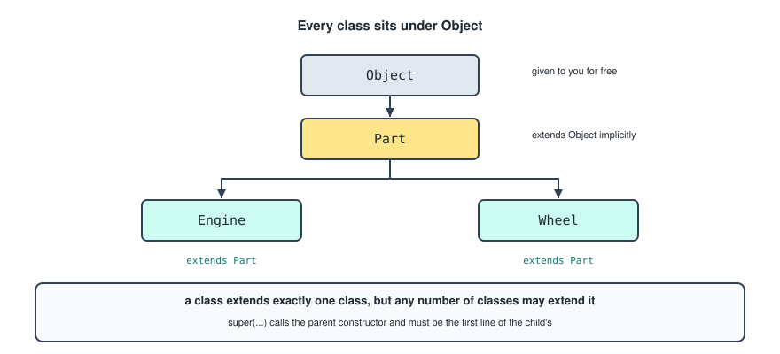
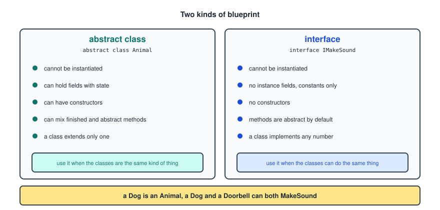
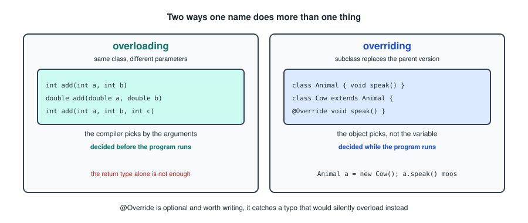
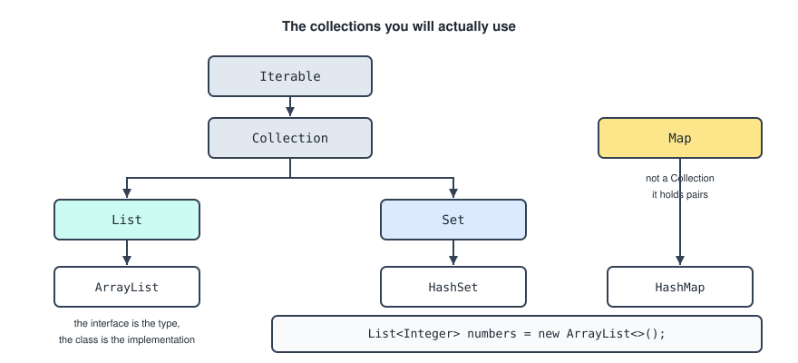
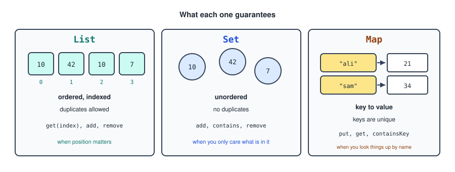
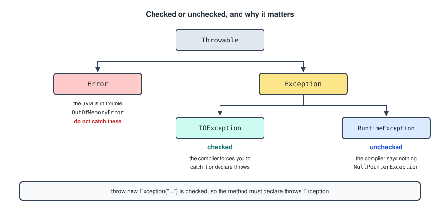
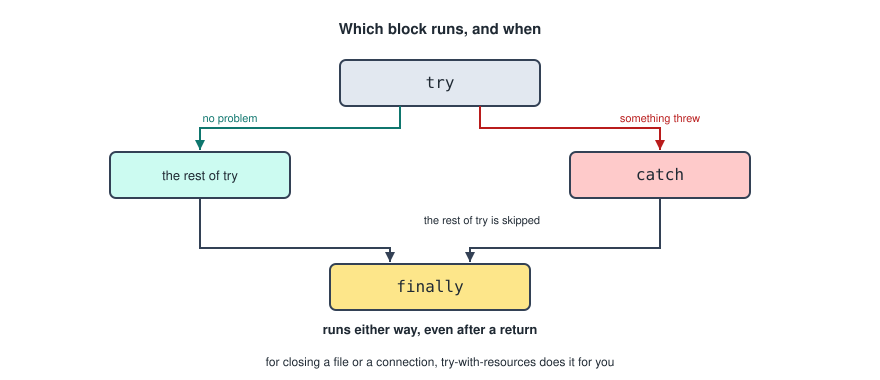
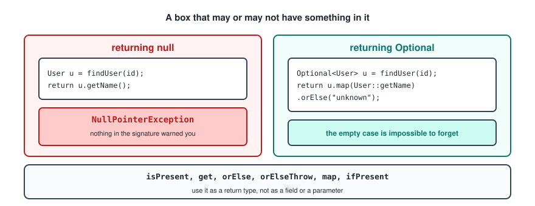
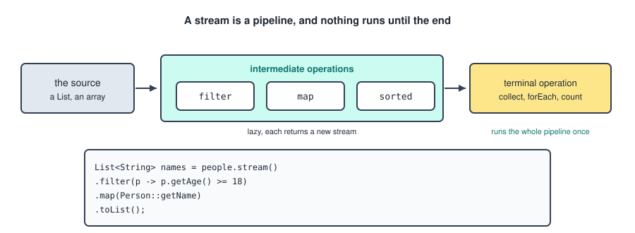
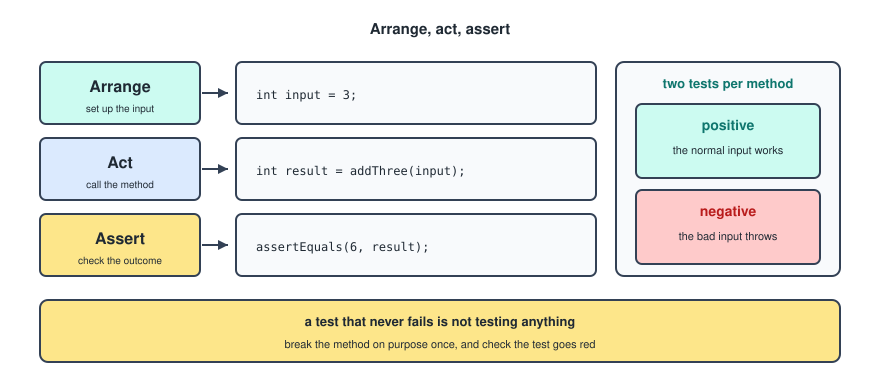

# Java Advanced

This picks up from `Java.md`, which covers types, methods, classes and objects. Everything here builds directly on those.

---

## The Four Pillars

Object oriented programming is usually summarized as four ideas, and the rest of this file is really just those four in detail.

- **Encapsulation**: keep the data private and expose behavior instead. Covered by access modifiers and getters in the first file.
- **Inheritance**: a class can build on another rather than repeating it.
- **Polymorphism**: one name can mean different things depending on what it is called on.
- **Abstraction**: describe what something can do without saying how, which is what abstract classes and interfaces are for.

---

## Inheritance

Every class extends, meaning inherits from, the class `Object`, whether you say so or not. A class can only extend one other class.



```java
public class Part {

    private String name;

    public Part(String name) {
        this.name = name;
    }
}
```

```java
public class Engine extends Part {

    private int horsepower;

    public Engine(String name, int horsepower) {
        super(name);
        this.horsepower = horsepower;
    }
}
```

`extends` gives `Engine` everything `Part` has. `super(name)` calls the parent constructor, and it must be the first statement in the child constructor, because the parent part of the object has to exist before the child adds to it.

`super` is also how you reach a parent method you have overridden.

```java
@Override
public String toString() {
    return super.toString() + ", " + horsepower;
}
```

One clarification on the copybook. **Single inheritance** means a class can extend only one class. It does not mean only one class can extend a given parent, and it does not mean an abstract class can only be extended once. Any number of classes can extend `Part`.

The rule of thumb for when to use it: inheritance says "is a". An Engine is a Part, so it fits. If you catch yourself extending a class just to reuse a method, holding an instance of it as a field is usually the better answer.

---

## Abstract Classes

An abstract class is a blueprint that cannot be instantiated. It exists to be extended.

```java
public abstract class Animal {

    private String name;

    public Animal(String name) {
        this.name = name;
    }

    public abstract String makeSound();      // no body, subclasses must supply one

    public void introduce() {                // a normal method, inherited as is
        System.out.println("I say " + makeSound());
    }
}
```

```java
public class Cow extends Animal {

    public Cow(String name) {
        super(name);
    }

    @Override
    public String makeSound() {
        return "Moo";
    }
}
```

`new Animal("x")` does not compile, because half the class is missing. `new Cow("Bella")` does.

The reason to reach for one is the combination visible above: a shared implementation in `introduce`, and a hole in `makeSound` that every subclass must fill.

---

## Interfaces

An interface is also a blueprint, and any number of classes can implement it. A class can implement as many interfaces as it likes, which is how Java gets around having only single inheritance.

```java
public interface IMakeSound {
    void sayHiInYourOwnWay();
}
```

```java
public class Cow implements IMakeSound {

    @Override
    public void sayHiInYourOwnWay() {
        System.out.println("Moo");
    }
}
```

Methods in an interface are `public` and `abstract` automatically, so writing those keywords is allowed and redundant.

Since Java 8 an interface can also carry a `default` method with a body, which exists so that a new method can be added to an interface without breaking every class that already implements it.

```java
public interface IMakeSound {
    void sayHiInYourOwnWay();

    default void sayHiTwice() {
        sayHiInYourOwnWay();
        sayHiInYourOwnWay();
    }
}
```

### Choosing Between Them



The short version. An abstract class is for things that **are** the same kind of thing and share state. An interface is for things that **can do** the same thing and share nothing else. A Dog is an Animal. A Dog and a Doorbell can both MakeSound.

The naming convention in the copybook, prefixing with `I`, is common in C# and rare in Java, where the interface usually takes the plain name and the class gets the qualifier: `List` and `ArrayList`, not `IList` and `List`.

---

## Polymorphism

Polymorphism is the ability of an object to take on multiple forms. It shows up in two places.



### Overloading

Several methods in the same class share a name but have different parameters.

```java
int add(int a, int b) { return a + b; }
double add(double a, double b) { return a + b; }
int add(int a, int b, int c) { return a + b + c; }
```

The compiler picks based on the arguments at the call site, so this is decided before the program runs. The parameter list has to differ, either in number or in types. A different return type alone is not enough and will not compile.

### Overriding

A subclass provides a specific implementation of a method that is already defined in its parent class.

```java
public class Animal {
    public void speak() { System.out.println("..."); }
}

public class Cow extends Animal {
    @Override
    public void speak() { System.out.println("Moo"); }
}
```

Here the decision happens while the program runs, and it depends on the object rather than the variable.

```java
Animal a = new Cow();
a.speak();               // Moo
```

The variable is an `Animal`, so the compiler will only let you call methods that `Animal` has. The object is a `Cow`, so the Cow version is the one that actually runs. That gap between the declared type and the real type is what polymorphism is, and it is what lets you write a method taking `Animal` and pass it anything.

```java
public void introduce(Animal animal) {
    animal.speak();          // works for every subclass, forever
}
```

`@Override` is optional and worth writing every time. Without it, a typo in the method name silently creates a new unrelated method, and the parent version keeps running.

---

## Collections

An array is fixed size. The collections framework is what you use for everything else.



The pattern to notice is that the left hand names are interfaces and the right hand names are classes. You declare the variable as the interface and construct the class.

```java
List<Integer> numbers = new ArrayList<>();
```

That way swapping `ArrayList` for `LinkedList` later touches one line. The empty `<>` is the **diamond operator**, and it means the compiler should infer the type from the left side rather than making you write it twice.

### Generics

The `<Integer>` part is a **generic type parameter**, and it is what makes a collection type safe.

```java
List<String> names = new ArrayList<>();
names.add("Angelo");
names.add(42);              // does not compile
String first = names.get(0);   // no cast needed
```

Without it you would be putting `Object` in and casting on the way out, which is how Java worked before generics existed. Generics only accept reference types, which is why it is `List<Integer>` and never `List<int>`.

---

## List

Ordered, indexed, duplicates allowed.



```java
List<Integer> numbers = new ArrayList<>();

numbers.add(42);                 // adding
numbers.get(0);                  // getting by index
numbers.size();                  // how many
numbers.remove(0);               // removing by index
numbers.indexOf(42);             // the index of a value, or -1
numbers.contains(42);            // checking for a value
numbers.isEmpty();
numbers.set(0, 7);               // replacing at an index
```

There is one trap in `remove` on a `List<Integer>`. `remove(int)` removes by index and `remove(Object)` removes by value, so `numbers.remove(1)` removes position 1 rather than the number 1. Write `numbers.remove(Integer.valueOf(1))` when you meant the value.

## Set

Unordered, and no duplicates.

```java
Set<String> names = new HashSet<>();

names.add("Angelo");
names.add("Angelo");             // ignored, the set already has it
names.contains("Angelo");
names.remove("Angelo");
names.size();
```

There is no `get(index)`, because there is no order to index into. Use it when the only questions you ask are "is this in here" and "what is in here".

For a set that keeps insertion order use `LinkedHashSet`, and for one that keeps sorted order use `TreeSet`.

## Map

Key and value pairs. Keys are unique, values need not be.

```java
Map<String, Integer> ages = new HashMap<>();

ages.put("Angelo", 21);          // adding or replacing
ages.get("Angelo");              // the value, or null
ages.getOrDefault("Sam", 0);     // the value, or a fallback
ages.containsKey("Angelo");
ages.remove("Angelo");
ages.keySet();                   // all the keys
ages.values();                   // all the values
ages.entrySet();                 // both, for looping
```

Looping over one.

```java
for (Map.Entry<String, Integer> entry : ages.entrySet()) {
    System.out.println(entry.getKey() + " is " + entry.getValue());
}
```

A `Map` is not a `Collection`, which is why it sits off to the side in the diagram. It holds pairs rather than elements, so it does not fit the same interface.

### A Note On Arrays.asList

The copybook has this as the old way of making a list, and mentions it can mix values.

```java
List myList = Arrays.asList(1, 2, 3);
```

Two things are going on. Values can be mixed only because the variable was declared as a **raw type**, with no `<>`, which switches off type checking entirely. That is not a feature to use; it is what generics were introduced to fix.

The second thing is more likely to bite you. `Arrays.asList` returns a fixed size list backed by the original array, so `add` and `remove` on it throw `UnsupportedOperationException`. The modern equivalents.

```java
List<Integer> fixed = List.of(1, 2, 3);                     // immutable
List<Integer> mutable = new ArrayList<>(List.of(1, 2, 3));  // a real list
```

---

## Exceptions

An exception is an object describing something that went wrong. Every one of them is a subclass of `Throwable`.



The split that matters is between checked and unchecked.

- **Checked** exceptions extend `Exception` but not `RuntimeException`. The compiler forces you to either catch them or declare `throws` on the method. `IOException` is the usual example.
- **Unchecked** exceptions extend `RuntimeException`. The compiler says nothing, and they usually indicate a bug rather than a situation. `NullPointerException`, `IllegalArgumentException` and `ArrayIndexOutOfBoundsException` are all unchecked.
- **Errors** extend `Error` and mean the JVM itself is in trouble, like `OutOfMemoryError`. Do not catch these.

### Try And Catch

```java
try {
    code that may cause an exception;
} catch (Exception e) {
    code that executes if an exception occurs;
}
```



The moment something throws inside `try`, the rest of the `try` block is skipped and control jumps to `catch`.

Catch the specific type rather than `Exception` where you can, and catch several separately when they need different handling.

```java
try {
    process(file);
} catch (FileNotFoundException e) {
    System.out.println("No such file");
} catch (IOException e) {
    System.out.println("Could not read it: " + e.getMessage());
}
```

An empty catch block is the thing to avoid. Swallowing an exception silently means the program carries on in a state you did not plan for, and the eventual failure happens somewhere unrelated.

### Finally

A `finally` block runs either way, whether the try succeeded or the catch fired, and even after a `return`.

```java
try {
    scanner = new Scanner(file);
} catch (FileNotFoundException e) {
    return null;
} finally {
    scanner.close();
}
```

For anything closeable, **try-with-resources** does the same job without the block, by closing whatever it opened.

```java
try (Scanner scanner = new Scanner(file)) {
    return scanner.nextLine();
}
```

### Throwing

You can also manually throw an exception.

```java
if (text == null) {
    throw new IllegalArgumentException("Message");
}
```

Note the type. `throw new Exception("Message")` is a **checked** exception, so the method has to declare `throws Exception`, and every caller then has to handle it. For a bad argument, `IllegalArgumentException` is unchecked and says far more about what went wrong.

Writing your own is one line.

```java
public class PonyNotFoundException extends RuntimeException {
    public PonyNotFoundException(String name) {
        super("No pony called " + name);
    }
}
```

That is exactly what the Spring Boot notes use to turn a missing row into a 404.

---

## Optional

`Optional` is a class that helps when a method may have nothing to return, and it removes the possibility of a `NullPointerException` by wrapping the value in a container.



```java
public static Optional<User> findUser(String name) {
    User user = lookup(name);
    return Optional.ofNullable(user);
}
```

Creating one.

```java
Optional.of(value);            // throws if value is null
Optional.ofNullable(value);    // empty if value is null
Optional.empty();
```

Using one.

```java
opt.isPresent();                     // is there something in it
opt.get();                           // the value, throws if empty
opt.orElse(fallback);                // the value, or a default
opt.orElseThrow(() -> new PonyNotFoundException(name));
opt.map(User::getName);              // transform if present
opt.ifPresent(user -> print(user));  // do something if present
```

The point is not that it makes null impossible, it is that the type in the signature warns you. A method returning `User` gives no hint that it might hand back nothing, whereas one returning `Optional<User>` cannot be used without deciding what happens when it is empty.

Calling `get()` without checking first defeats the whole thing, so prefer `orElse` or `orElseThrow`. Use `Optional` as a return type, not as a field or a parameter.

This is also why `findById` on a Spring Data repository returns `Optional<T>`.

---

## Lambdas

A lambda is a short way of writing a function with no name. Anywhere an interface has exactly one abstract method, a lambda can stand in for an implementation of it.

```java
names.forEach(name -> System.out.println(name));
```

The shapes.

```java
() -> doSomething()                   // no parameters
n -> n * 2                            // one parameter, one expression
(a, b) -> a + b                       // several parameters
(a, b) -> { return a + b; }           // a block, so return is explicit
```

A **method reference** is shorter still when the lambda does nothing but call one method.

```java
names.forEach(System.out::println);
people.stream().map(Person::getName);
```

---

## Streams

A stream is a pipeline over a collection. Nothing happens until the last step.



```java
List<String> names = people.stream()
        .filter(p -> p.getAge() >= 18)
        .map(Person::getName)
        .sorted()
        .toList();
```

The three parts.

- The **source** is a collection or an array.
- The **intermediate operations** each return a new stream and are lazy, so they do nothing on their own. `filter`, `map`, `sorted`, `distinct`, `limit`.
- The **terminal operation** runs the whole pipeline once. `toList`, `collect`, `forEach`, `count`, `anyMatch`, `findFirst`, `reduce`.

A pipeline with no terminal operation does nothing at all, which is a confusing first bug.

Streams do not modify the source collection, they produce a new result. That is the same reasoning behind `map` and `filter` in the JavaScript notes, and the two read almost identically.

---

## Records And Enums

Both of these are covered in `Spring_Boot_Advanced.md`, in the context where they are used most, so the short version here.

A **record** is an immutable data class where you declare only the field types and names, and get the constructor, accessors, `toString`, `equals` and `hashCode` for free.

```java
public record Person(String name, int age) {}
```

An **enum** is a class representing a fixed set of named constants, which the compiler and the IDE both know the whole list of.

```java
public enum Role {
    STUDENT, TEACHER, ADMINISTRATOR
}
```

Reach for a record for anything that just carries values, and an enum any time a variable has a small, known, fixed set of valid values, in place of a string.

---

## equals And hashCode

`Object` gives every class a default `equals` that compares addresses, which is the same behaviour as `==`. Overriding it is how you say what "the same" means for your class.

```java
@Override
public boolean equals(Object o) {
    if (this == o) return true;
    if (!(o instanceof Person other)) return false;
    return age == other.age && Objects.equals(name, other.name);
}

@Override
public int hashCode() {
    return Objects.hash(name, age);
}
```

The rule is that these two are always overridden together. `HashMap` and `HashSet` find an object by its hash first and only then compare with `equals`, so an object with a correct `equals` and an inherited `hashCode` gets filed under the wrong bucket and is never found again. A `Set` will happily hold two objects you consider equal.

Records generate both correctly, which is one more reason to use them for data.

---

## Unit Testing

Tests can be run at any time to check your work. In unit testing, small pieces of code, called units, are tested individually.



The method being tested.

```java
public static int addThree(Integer number) {
    if (number == null) {
        throw new IllegalArgumentException("no null");
    }
    return number + 3;
}
```

The parameter has to be `Integer` and not `int`. A primitive `int` can never be null, so `if (number == null)` on an `int` does not compile, and the negative test could not pass `null` in the first place.

### A Positive Test

```java
@Test
public void addThreeWorksCorrectly() {
    Assertions.assertEquals(6, addThree(3));
}
```

`Assertions` is the JUnit 5 class, `assertEquals` takes the expected result first and the actual result second. That order matters for the failure message, which reads "expected 6 but was 7".

### A Negative Test

```java
@Test
public void addThreeWithNull() {
    Exception e = Assertions.assertThrows(
            IllegalArgumentException.class,
            () -> addThree(null));

    Assertions.assertEquals("no null", e.getMessage());
}
```

`assertThrows` takes the exception class you expect and a lambda that should throw it. It fails if nothing is thrown, and it returns the exception so you can check the message.

### The Assertions Worth Knowing

```java
assertEquals(expected, actual);
assertNotEquals(unexpected, actual);
assertTrue(condition);        assertFalse(condition);
assertNull(value);            assertNotNull(value);
assertThrows(Type.class, () -> code());
```

### Remarks

- In some cases it is better to write your tests before your actual code, which is **test driven development**. Writing the test first forces you to decide what the method should do before deciding how.
- Testing is better than just trying your code in the main method, and more convenient. A `main` method has to be read to know if it worked; a test either passes or does not, and it runs again for free every time you change something.
- Write both a positive and a negative test for anything with a rule in it. The positive one proves it works, the negative one proves the rule is actually enforced.
- A test that never fails is not testing anything. Break the method on purpose once and check the test goes red.

### The Dependencies

The copybook lists two, and the first one should not be there. `junit:junit:3.8.1` is JUnit 3, from a different era, and it does not understand `@Test` from JUnit 5 or the `Assertions` class. Mixing them is why tests sometimes appear not to run at all.

For a plain Maven project, JUnit 5 alone.

```xml
<dependency>
    <groupId>org.junit.jupiter</groupId>
    <artifactId>junit-jupiter</artifactId>
    <version>5.11.4</version>
    <scope>test</scope>
</dependency>
```

`junit-jupiter` is the aggregate, bringing both the API you write against and the engine that runs the tests. `junit-jupiter-api` on its own compiles your tests but never executes them.

In a Spring Boot project you need neither, because the starter already includes JUnit 5, Mockito and AssertJ.

```xml
<dependency>
    <groupId>org.springframework.boot</groupId>
    <artifactId>spring-boot-starter-test</artifactId>
    <scope>test</scope>
</dependency>
```

`<scope>test</scope>` on any of these means the dependency is available while compiling and running tests, and is left out of the built artifact.
