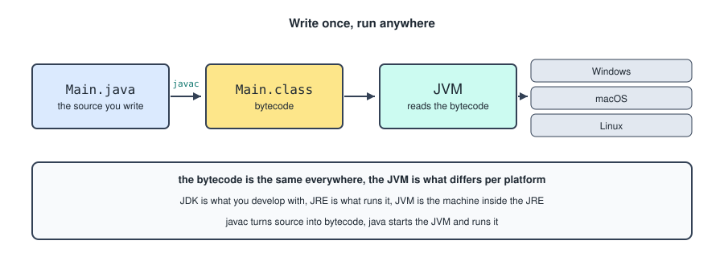
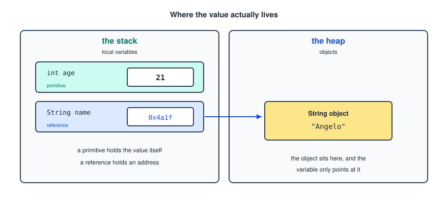
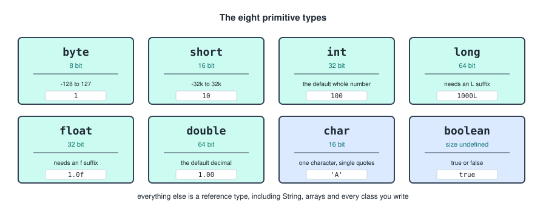
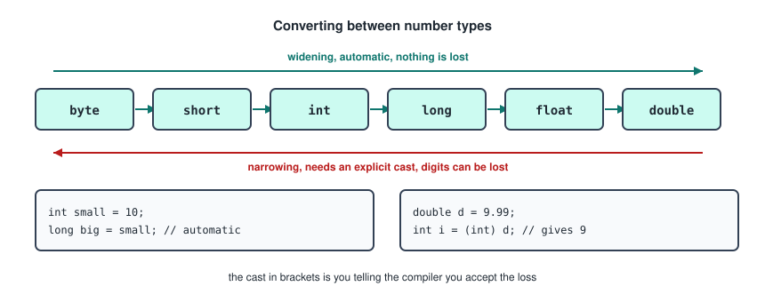
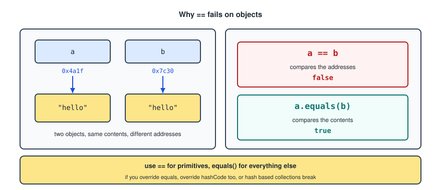
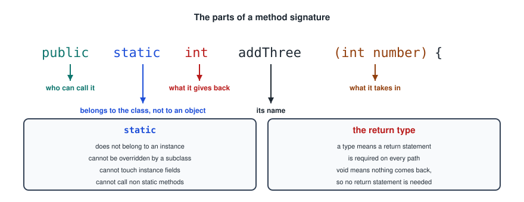
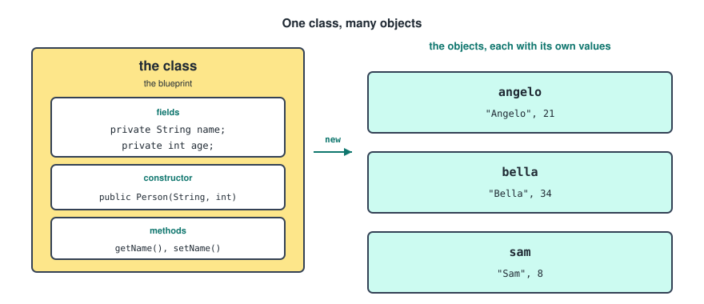
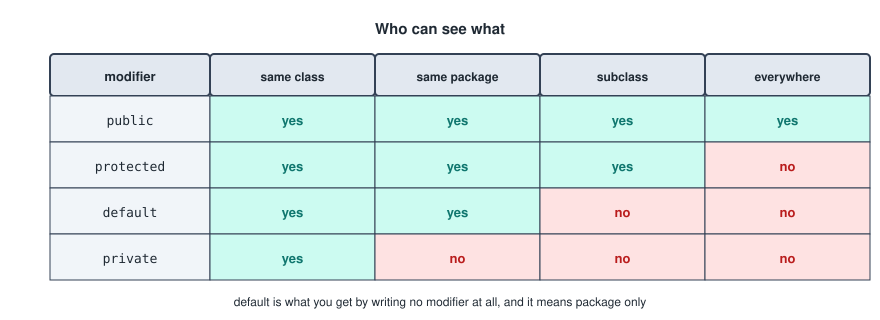
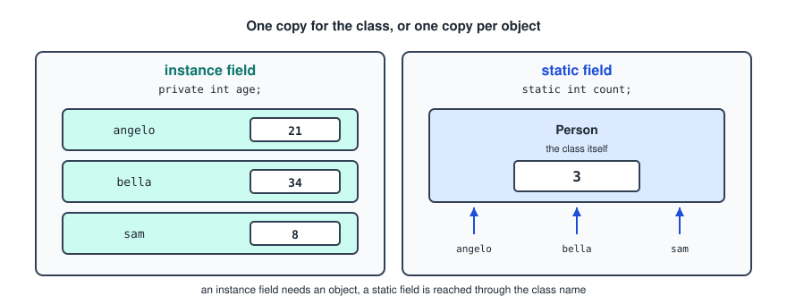

## What Is Java ?

Java is a **compiled**, **statically typed**, **object oriented** language. Each of those three words costs you something up front and pays you back later.

- **Compiled** means an extra step before you can run anything, and mistakes caught before the program starts rather than during it.
- **Statically typed** means writing the type of everything, and the compiler refusing code that would not make sense.
- **Object oriented** means everything lives inside a class, and there is no code floating outside one.

Install the Java Development Kit by going to [Oracle JDK](https://www.oracle.com/java/technologies/javase/jdk-downloads.html) or [OpenJDK](https://openjdk.org) for a free version. The java package manager is `java` and the java compiler package manager is `javac`.

### The Compilation Step



Your `.java` file is compiled by `javac` into a `.class` file containing **bytecode**, which is not machine code for any real processor. The **JVM**, the Java Virtual Machine, reads that bytecode and executes it. Since there is a JVM for every platform and the bytecode is identical everywhere, the same compiled file runs anywhere, which is the origin of the phrase "write once, run anywhere".

Three acronyms that get mixed up.

- **JVM**, the machine that runs bytecode.
- **JRE**, the JVM plus the standard libraries, which is what you need to *run* a Java program.
- **JDK**, the JRE plus the compiler and tools, which is what you need to *write* one.

### The Smallest Program

```java
public class Main {
    public static void main(String[] args) {
        System.out.println("Hello");
    }
}
```

`main` is where execution begins, and its signature is fixed. It has to be `public` so the JVM can call it, `static` so it can be called without an object existing yet, and it has to take a `String[]`, which holds any arguments typed on the command line.

---

## Printing Output

```java
System.out.print("text");        // prints
System.out.println("text");      // prints and moves to a new line
System.out.print("text\n");      // the same thing, done by hand
```

`\n` is an **escape sequence**, so it goes inside the quotes as part of the string. The other ones you will meet are `\t` for a tab, `\"` for a literal quote, and `\\` for a literal backslash.

For anything with values in it, `printf` beats gluing strings together with `+`.

```java
System.out.printf("%s is %d years old%n", name, age);
```

---

## Variables

Java splits every variable into one of two families, and the distinction explains a surprising number of later bugs.

- **Primitive**: a simple value, stored directly in memory.
- **Reference**: a memory address that points to a location where the actual object lives.



The primitive holds the value itself. The reference holds only an address, and the object it points at sits somewhere else.

### The Primitive Types



```java
int number = 100;
double price = 1.00;
char letter = 'A';
boolean ready = true;
byte b = 1;
short s = 10;
long big = 1000L;
float f = 1.0f;
```

Two of those need a suffix. A whole number literal is an `int` by default, so a `long` beyond the int range needs the `L`. A decimal literal is a `double` by default, so a `float` needs the `f`.

In practice you will use `int`, `double` and `boolean` almost exclusively. The others exist for memory savings that rarely matter now, with two exceptions: `long` for anything that could exceed about two billion, and `char` when you genuinely mean a single character.

### Everything Else Is A Reference

`String`, arrays, and every class you or anyone else writes are reference types. `String` is a class, which is why it is capitalised while `int` is not.

Each primitive also has a **wrapper class**: `Integer` for `int`, `Double` for `double`, `Boolean` for `boolean`, and so on. Wrappers are objects, so they can be `null`, and collections can only hold objects, which is why it is `List<Integer>` and never `List<int>`.

---

## Declaring And Assigning

Declaring reserves the name. Assigning gives it a value. They can be one line or two.

```java
int age;              // declare
age = 21;             // assign
int age = 21;         // both at once
```

For reference types the assignment is a call to a constructor with `new`.

```java
String name = "Angelo";
Person person = new Person("Angelo", 21);
```

`String` is the exception that does not need `new`, because the language gives it literal syntax.

Three modifiers worth knowing on a variable.

```java
final int MAX = 100;        // cannot be reassigned
static int count = 0;       // belongs to the class, not an instance
var list = new ArrayList<String>();   // the type is inferred
```

`var` only works for local variables and only when there is an initialiser to infer from.

---

## Type Casting



Going up the chain is **widening** and happens automatically, because nothing can be lost.

```java
int small = 10;
long big = small;
```

Going down is **narrowing** and requires an explicit cast, because something can be lost.

```java
double d = 9.99;
int i = (int) d;      // 9, the decimal part is cut off, not rounded
```

The cast in brackets is you telling the compiler that you accept the loss. Note that it truncates rather than rounds, so use `Math.round` when you meant to round.

Converting between a `String` and a number is not casting at all, it is a method call.

```java
int n = Integer.parseInt("42");
String s = String.valueOf(42);
```

---

## Strings

Strings are objects, and they are **immutable**: no method on a String changes it, they all return a new one.

```java
String name = "angelo";
name.toUpperCase();              // does nothing to name
name = name.toUpperCase();       // this is what you meant
```

That immutability is behind the note in the copybook about a reference sometimes still giving the original value after a change. The variable was never updated, because the method returned a new object instead of modifying the old one.

The methods that come up constantly.

```java
name.length();
name.charAt(0);
name.substring(1, 4);
name.toUpperCase();      name.toLowerCase();
name.trim();
name.contains("ang");    name.startsWith("a");
name.replace("a", "b");
name.split(",");
name.isEmpty();          name.isBlank();
```

### Comparing Strings

This is the single most common Java beginner bug.



Comparing a reference variable with `==` compares its memory address, which causes problems. Use `.equals()`, which compares the contents.

```java
a == b            // are these the same object
a.equals(b)       // do these have the same contents
```

For primitives, `==` is correct and is the only option, since they have no methods.

It sometimes appears to work with `==` on strings, because Java keeps identical literals in a shared pool and hands out the same object. The moment a string is built at runtime, from input or concatenation, the pool no longer applies and the comparison starts failing. Never rely on it.

---

## Reading Input

`Scanner` is a class in `java.util`, so it has to be imported.

```java
import java.util.Scanner;

Scanner scanner = new Scanner(System.in);

System.out.println("Enter your name:");
String name = scanner.nextLine();

System.out.println("Hello " + name);

scanner.close();
```

The methods for other types.

```java
scanner.nextLine();      // the whole line, including spaces
scanner.next();          // one word
scanner.nextInt();
scanner.nextDouble();
scanner.nextBoolean();
```

There is one trap. `nextInt` reads the number and leaves the newline behind it in the buffer, so the next `nextLine` returns an empty string. Either call an extra `nextLine` to consume it, or read everything with `nextLine` and parse it yourself.

---

## Operators

Arithmetic.

```java
+   -   *   /   %
```

`/` between two integers does integer division, so `7 / 2` is `3`, not `3.5`. Make one side a `double` if you wanted the decimal.

Comparison.

```java
==   !=   <   >   <=   >=
```

Logical.

```java
&&   ||   !
```

Both `&&` and `||` are **short circuiting**: if the left side already decides the answer, the right side is never evaluated. That is what makes this line safe.

```java
if (name != null && name.length() > 0)
```

Assignment shorthands.

```java
i += 1;    i -= 1;    i *= 2;    i /= 2;
i++;       i--;
```

---

## Conditionals

```java
if (condition) {
    code;
} else if (condition) {
    code;
} else {
    code;
}
```

Once one branch of an `if / else if` chain is true, the rest are skipped. Writing them as separate `if` statements instead means every condition is checked even after one has already matched, which is both slower and usually wrong.

The ternary operator, for when the whole thing is choosing between two values.

```java
String label = age >= 18 ? "adult" : "minor";
```

### Switch

When you are comparing one variable against many fixed values, a switch reads better.

```java
switch (day) {
    case "SATURDAY", "SUNDAY" -> System.out.println("weekend");
    case "FRIDAY" -> System.out.println("almost");
    default -> System.out.println("weekday");
}
```

That is the arrow form, which does not fall through between cases. The older colon form does, and needs a `break` at the end of every case, which is a classic source of bugs.

---

## Loops

Four shapes, each with a job it is best at.

```java
while (condition) {
    code;
}
```

```java
do {
    code;
} while (condition);
```

```java
for (int i = 0; i < 10; i++) {
    code;
}
```

```java
for (int num : numbers) {
    code;
}
```

- **while** when you do not know how many times, and the condition may be false from the start.
- **do while** when it must run at least once, since the condition is checked at the end.
- **for** when you know the count, or when you need the index.
- **enhanced for** when you just want each element, which is the one to reach for by default.

Two keywords work inside any of them.

```java
break;       // leave the loop entirely
continue;    // skip to the next iteration
```

---

## Methods



```java
public static int addThree(int number) {
    return number + 3;
}
```

- The **access modifier** decides who can call it.
- **static** means it belongs to the class rather than to an object.
- The **return type** indicates what the method gives back.
- The **name** is how it is called.
- The **parameters** are what it takes in.

### The Return Type

A real type means a `return` statement is required on every path out of the method. `void` means nothing will be returned, so no return statement is needed, although a bare `return;` can still be used to leave early.

### Static Methods

A static method does not belong to an instance, and that has consequences.

- It cannot be overridden by a subclass. A subclass can declare a method with the same signature, but that hides rather than overrides it, and which one runs is decided by the variable's type rather than the object's.
- It has no access to instance fields, since there is no instance to read them from.
- It has no access to non static methods, for the same reason.

`main` is static, which is why calling an ordinary method directly from it does not compile until you either make that method static too or create an object first.

### Overloading

Several methods in a class can share a name as long as their parameters differ. More on this in the advanced file.

```java
int add(int a, int b);
double add(double a, double b);
```

---

## Arrays

An array is a fixed size sequence of one type. The size is chosen when it is created and can never change.

```java
int[] numbers = {1, 2, 3};
int[] numbers = new int[3];      // three slots, all 0
```

```java
numbers[0];              // reading, indexes start at 0
numbers[1] = 42;         // writing
numbers.length;          // the size, a field and not a method
```

`length` has no brackets on an array, `length()` does on a String, and `size()` is what a List uses. All three mean the same thing and none of them is interchangeable.

Reading past the end throws `ArrayIndexOutOfBoundsException`, which is why the last valid index is always `length - 1`.

Arrays are rigid enough that most real code uses a `List` instead, which is in the advanced file.

---

## Classes And Objects

A class is a blueprint. An object is one thing built from it.



```java
public class Person {

    private String name;
    private int age;

    public Person(String name, int age) {
        this.name = name;
        this.age = age;
    }
}
```

```java
Person angelo = new Person("Angelo", 21);
Person bella = new Person("Bella", 34);
```

Each object gets its own copy of the fields, so changing `angelo` does nothing to `bella`.

### The Constructor

The constructor has the same name as the class and no return type, not even `void`. It runs once, when `new` is called.

`this` refers to the object currently being built, and it is what separates the field `this.name` from the parameter `name` when they share a name.

If you write no constructor at all, Java gives you an empty one. The moment you write any constructor, that free one disappears, which is why adding a constructor to a class can break code that was calling `new Person()`.

---

## Access Modifiers



- `public`, visible everywhere.
- `protected`, visible in the class, its package, and its subclasses.
- default, written by putting no modifier at all, visible in the package only.
- `private`, visible in the class only.

The habit to build is **fields private, methods public**. That is **encapsulation**: the outside world goes through your methods rather than reaching into your data, so you keep the ability to validate, rename or restructure later.

---

## Getters And Setters

Private fields need a public way in and out.

```java
public class Person {

    private String name;

    public String getName() {
        return name;
    }

    public void setName(String newName) {
        this.name = newName;
    }
}
```

A getter returns the field. A setter takes the new value and assigns it, and returns `void`.

They look like pointless ceremony until you need one of the things they enable: validating in the setter, computing in the getter, or leaving out a setter entirely so a field is read only from outside. The naming convention matters too, since Jackson and JPA both find your fields by looking for `getX` and `setX`.

---

## Static Versus Instance



An instance field gets one copy per object. A static field gets one copy shared by the whole class.

```java
public class Person {

    private static int count = 0;    // one, shared
    private String name;             // one per person

    public Person(String name) {
        this.name = name;
        count++;
    }

    public static int getCount() {
        return count;
    }
}
```

An instance member is reached through an object, `angelo.getName()`. A static member is reached through the class, `Person.getCount()`.

`static final` together is how constants are written, and they are conventionally in capitals.

```java
public static final double PI = 3.14159;
```

---

## toString

Printing an object gives you something like `Person@1b6d3586`, which is the class name and a hash. Overriding `toString` gives you something readable, and it is called automatically whenever the object is printed or concatenated into a string.

```java
public class Person {

    private String name;
    private int age;

    @Override
    public String toString() {
        return name + ", " + age;
    }
}
```

`toString` comes from `Object`, which every class inherits from, so this is overriding rather than inventing. The `@Override` annotation is optional and worth writing, since it makes the compiler check that you really are overriding something.

Two siblings from `Object` come up constantly and are covered in the advanced file: `equals`, for comparing contents, and `hashCode`, which has to be overridden alongside it.
