# CSS

CSS is the second layer a webpage is made of. The HTML says what things are, and this says what they look like. Most of the difficulty is not in the properties themselves, it is in knowing which rule wins when two of them disagree, and in how boxes size themselves.

---

## What CSS Is

CSS stands for **cascading style sheet**. It is used to control the visual presentation of the web.

The cascading part is the important word. Many rules can apply to the same element, and there is a defined order for deciding which one takes effect. That order is what the specificity section further down is about.

---

## The Anatomy Of A Rule

Every rule has the same shape.

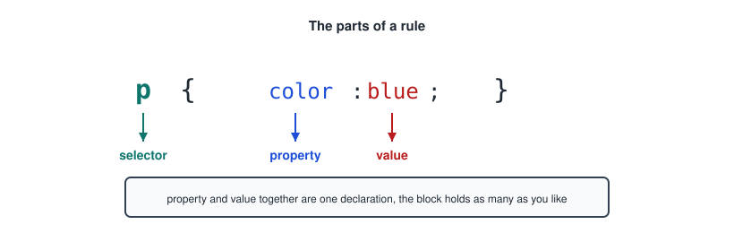

```css
p {
    color: blue;
    font-size: 15px;
}
```

- The **selector** picks which elements this applies to.
- The **property** is what you are changing.
- The **value** is what you are changing it to.
- Property and value together are one **declaration**, and every declaration ends in a semicolon.

---

## The Three Ways To Write CSS

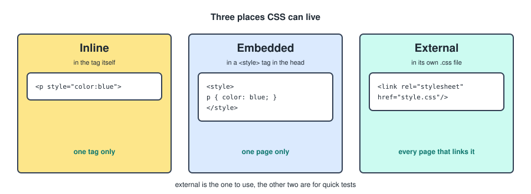

### Inline

Written directly in the HTML tag.

```html
<p style="color: blue;">paragraph</p>
```

It affects that one tag only, and it is the hardest thing to override later.

### Embedded

Written in the head of the HTML file inside its own tag.

```html
<style>
    p {
        color: blue;
        font-size: 15px;
    }
</style>
```

It affects that one page only.

### External

Written in a separate `.css` file. Link it from the head of the HTML file.

```html
<link rel="stylesheet" href="style.css" />
```

Then write normally in the CSS file.

```css
p {
    color: blue;
    font-size: 15px;
}
```

This is the one to use. One file styles every page that links it, and the browser caches it after the first load.

---

## Selectors

The part that decides what a rule reaches.

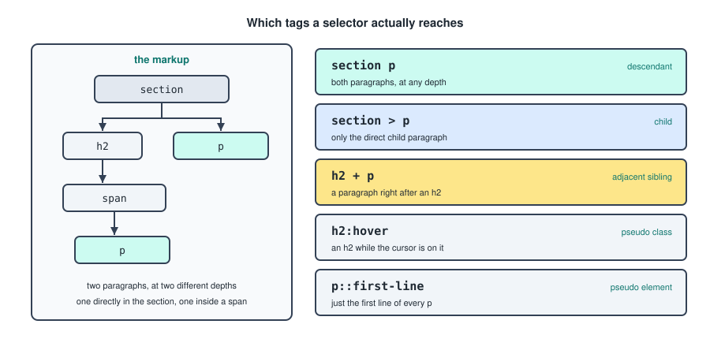

### Element

Selects all tags of that type on the page.

```css
p {
    color: blue;
}
```

### Class

Selects all tags carrying that class. Classes are not unique, which is the point of them.

```css
.name {
    color: blue;
}
```

```html
<p class="name">text</p>
```

### ID

Selects the tag with that id. An id should appear once per page.

```css
#name {
    color: blue;
}
```

```html
<p id="name">text</p>
```

### Everything

Mostly used to set a font for the whole page.

```css
* {
    font-family: sans-serif;
}
```

### Descendant

Selects a tag inside a specific tag, at any depth.

```css
section p {
    color: blue;
}
```

### Child

Acts like the descendant selector but only goes one layer deep, so it selects direct children only.

```css
section > p {
    color: blue;
}
```

This works, because the paragraph is a direct child.

```html
<section>
    <p></p>
</section>
```

This does not, because there is a span in between.

```html
<section>
    <span>
        <p></p>
    </span>
</section>
```

### Adjacent Sibling

Selects only the element directly after another one, at the same level.

```css
h2 + p {
    color: blue;
}
```

```html
<h2></h2>
<p></p>
```

### Pseudo Class

Selects elements based on their state.

```css
h2:hover {
    color: blue;
}
```

The rule applies every time the cursor is over an `<h2>`. Others worth knowing are `:focus` for the field the user is typing in, and `:first-child` and `:last-child` for position among siblings.

### Pseudo Element

Selects a specific part of an element.

```css
p::first-line {
    color: blue;
}
```

The single colon versus double colon is the convention that separates the two: a pseudo class picks a whole element in some state, a pseudo element picks a piece of one.

### Grouping

Selectors can be grouped with a comma when they share the same rules.

```css
h1, h2, h3 {
    font-family: sans-serif;
}
```

---

## Selector Specificity

The system of priority for when selectors conflict with each other.

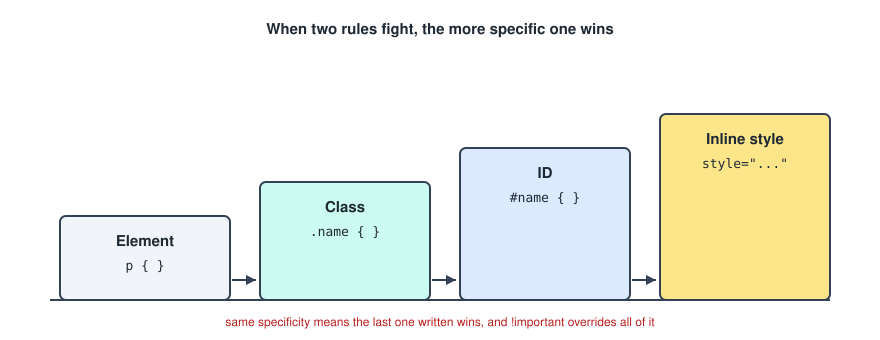

The general rule.

```
element  <  class / pseudo class  <  id  <  inline style
```

Two more things decide the rest.

- If two rules have the same specificity, the last one written applies.
- `!important` overrides rules and specificity, but it is unadvised. Once one rule uses it, the next problem gets solved with another one, and eventually nothing can be overridden by normal means.

---

## Normalize CSS

Browsers ship with their own default styles, and they do not agree with each other. Normalize is a stylesheet that levels those defaults so your page behaves the same everywhere.

```html
<link rel="stylesheet" href="normalize.css" />
```

Link it before your own stylesheet, otherwise it overwrites your rules instead of the browser's.

---

## Colours

```css
color: red;
color: rgb(0, 0, 0);
color: rgba(0, 0, 0, 0.5);
color: hsla(0, 0%, 0%, 0.5);
background-color: red;
```

- Named colours and hex codes like `#0f766e` are the everyday options.
- `rgb` takes three values from 0 to 255.
- `rgba` adds a transparency value from 0 to 1.
- `hsla` takes hue, saturation, lightness and alpha, which is the easiest one to adjust by hand, since a lighter version of a colour is the same rule with a higher lightness.

---

## Gradients

A gradient is a background, not a colour, so it goes on the `background` property.

```css
background: linear-gradient(to bottom, red, blue);
background: radial-gradient(red, blue);
background: conic-gradient(red, blue);
```

- **Linear** runs in a direction you give it.
- **Radial** runs outward in a circle from a central colour.
- **Conic** sweeps around a centre point.

Any of them can be prefixed with `repeating-` to tile the gradient instead of stretching it once.

---

## Background Images

```css
background-image: url("/folder/name.png");
background-position: center;
background-size: cover;
background-repeat: no-repeat;
background-attachment: fixed;
```

- `background-position: center` keeps the middle of the image in view when the box crops it.
- `background-size: cover` fills the box and crops the overflow, which is almost always what you want for a banner.
- `background-repeat: no-repeat` stops a small image tiling across the box.

Two images can be layered by separating them with a comma. The first one listed sits on top.

```css
background-image: url("front.png"), url("back.png");
```

---

## The Box Model

Every element is four boxes nested inside each other, and this is the thing to be sure of before any layout work.

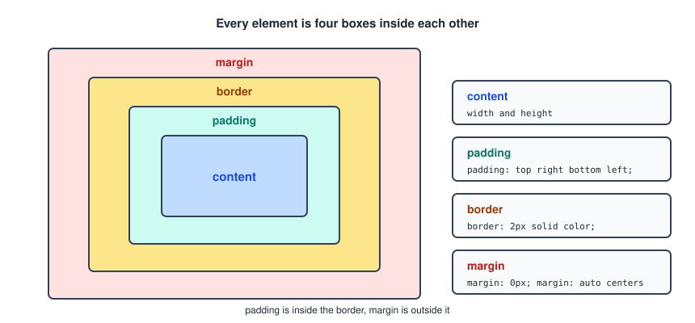

```css
width: 200px;
height: 100px;
padding: 10px 20px 10px 20px;
border: 2px solid black;
margin: 0px;
```

- **Content** is what `width` and `height` set.
- **Padding** is the space inside the border, in the order top, right, bottom, left.
- **Border** takes a width, a type and a colour.
- **Margin** is the space outside the border. `margin: auto` on the left and right centres the element in its parent.

One rule that was not in my notes and that saves a lot of confusion.

```css
* {
    box-sizing: border-box;
}
```

By default `width: 200px` means the content is 200px, and the padding and border are added on top, so the visible box is wider than the number you wrote. With `border-box`, the 200px includes the padding and border, which is how everyone expects it to work.

---

## Box Shadow

```css
box-shadow: 0px 4px 8px grey;
```

The values in order are horizontal offset, vertical offset, blur radius, colour.

---

## Fonts And Text

```css
font-family: "Helvetica", Arial, sans-serif;
font-size: 1rem;
font-weight: bold;
line-height: 1.5;
```

`font-family` takes a fallback list, read left to right. The browser uses the first one it has, so the last entry should always be a generic family like `sans-serif`.

`line-height` needs no unit. A plain number multiplies the font size, so it stays right when the font size changes.

### Text Alignment

```css
text-align: start;     /* left */
text-align: end;       /* right */
text-align: center;
text-align: justify;   /* equal on both edges */
```

`start` and `end` are the modern spellings, and they flip automatically in right to left languages, which `left` and `right` do not.

---

## Lists

```css
list-style: none;      /* removes the bullets */
list-style: inside;    /* bullets sit inside the box */
```

`list-style: none` on a `<ul>` is how almost every navigation bar starts.

---

## Units

Two families, and the choice matters more than it looks.

- **Absolute units** like `px` are a fixed size. Used for width, height, top, left, borders.
- **Relative units** like `em`, `rem` and `%` scale with something else. Used for anything that should move with respect to the things around it.

### Em And Rem

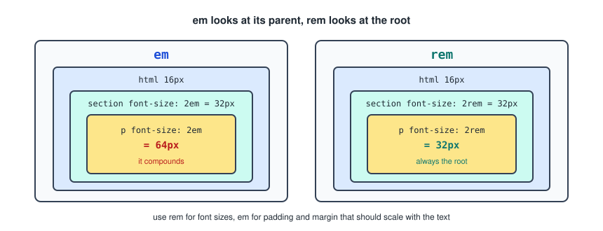

- **em** is relative to the font size of its parent element.
- **rem** is relative to the root element's font size, meaning the `html` font size.

That difference is the whole reason to prefer `rem` for font sizes. With `em`, nesting compounds: a `2em` paragraph inside a `2em` section is four times the base size. With `rem` it is always twice the root, wherever it sits.

Use `rem` for font sizes, and `em` for padding and margin that should scale along with the text of the element it is on.

---

## Block And Inline Elements

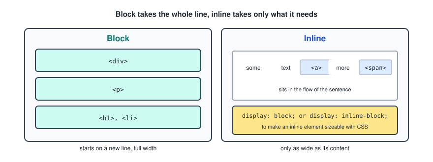

- **Block** elements take up the full width of the page and can be adjusted and edited normally with CSS.
- **Inline** elements take up only the space they need, like an `<a>` in a sentence, or an image.

Examples of block elements.

- `<div>`, the generic block container
- `<p>`
- headings
- `<li>`

Examples of inline elements.

- `<span>`, the generic inline container
- `<a>`

To adjust an inline element with CSS you first have to change what it is.

```css
display: block;
display: inline-block;
```

`inline-block` is usually the one you want. The element accepts width, height, padding and margin like a block, but stays in the flow of the line so it does not visually move on the page.

---

## Flexbox

Flexbox lays items out along one axis. You set it on the container, and the children become flex items.

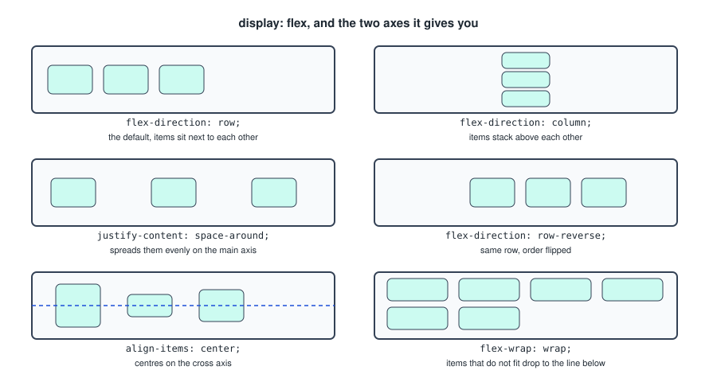

```css
display: flex;
```

That alone places the items next to each other. Everything after it adjusts how.

### Direction

```css
flex-direction: row;           /* the default, side by side */
flex-direction: column;        /* stacked above each other */
flex-direction: row-reverse;   /* to the right, order inverted */
```

The direction sets which axis is the main one, and that changes what the next two properties do.

### Spacing And Alignment

```css
justify-content: space-around;  /* spaces the items out evenly */
justify-content: center;        /* centres on the main axis */
align-items: center;            /* centres on the cross axis */
```

The pairing to memorise: `justify-content` works along the main axis, `align-items` works across it. In a row that means `justify-content` is horizontal and `align-items` is vertical. In a column they swap, which is the part that catches people out.

### Wrapping And Growing

```css
flex-wrap: wrap;      /* items that do not fit drop to the next line */
flex-grow: 1;         /* lets an item take spare space, default 0 */
flex-shrink: 1;       /* lets an item give up space, default 1 */
flex-basis: 50%;      /* the size it starts from before growing or shrinking */
```

The last three go on the items, not on the container. The first one goes on the container.

---

## Grid

Grid does two dimensions at once, so it is the right tool when you have rows and columns rather than a single line of items.

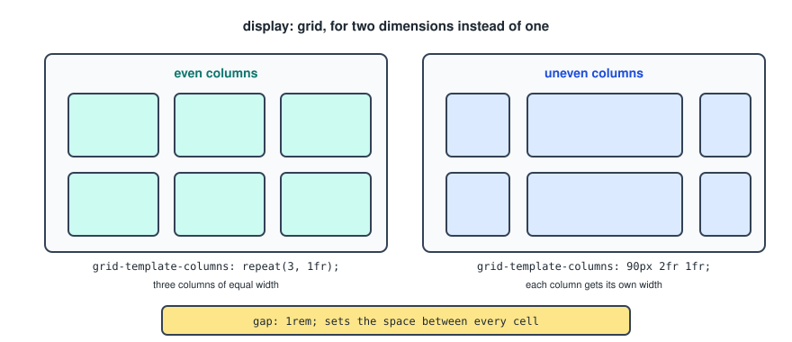

```css
display: grid;
grid-template-columns: 90px 2fr 1fr;
gap: 1rem;
```

The `fr` unit means a fraction of the space left over, so `2fr 1fr` gives the first column twice the width of the second.

### Even Columns

```css
grid-template-columns: repeat(3, 1fr);
```

`repeat` takes the number of columns and the width of each.

### Columns That Adapt On Their Own

```css
grid-template-columns: repeat(auto-fit, minmax(200px, 1fr));
```

This fits as many columns as it can, each at least 200px wide and each sharing the leftover space. It reflows on its own as the window changes, which covers a lot of what you would otherwise write media queries for.

### Gaps

```css
gap: 1rem;
grid-gap: 10px;
```

`gap` is the modern name and works in flexbox too. `grid-gap` is the older spelling of the same thing.

---

## Positioning

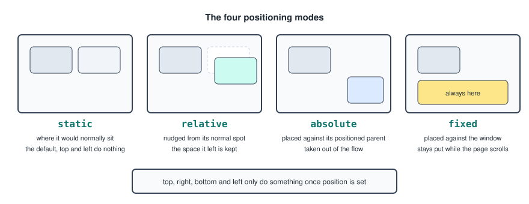

```css
position: static;     /* the default */
position: relative;   /* moved relative to its initial position */
position: absolute;   /* moved relative to its positioned ancestor */
position: fixed;      /* stays in place while the page scrolls */
top: 20px;
left: 40px;
```

`top`, `right`, `bottom` and `left` only do something once `position` is something other than `static`.

Two details that are worth having.

- `relative` keeps the space the element originally occupied, so nothing else moves. `absolute` takes the element out of the flow entirely, and everything else closes the gap.
- `absolute` positions against the nearest ancestor that itself has a position set, not against the page. The usual pattern is `position: relative` on the parent and `position: absolute` on the child.

---

## Transforms And Transitions

A transform changes how an element is drawn without disturbing anything around it.

```css
transform: rotate(45deg);
transform: scale(1.2);
transform: translate(10px, 20px);
```

`scale` is the one used inside a hover to make an item grow.

A transition tells the browser to animate a change instead of jumping to it.

```css
transition: property duration function delay;
transition: all 0.3s ease-in 0s;
```

- **property** is what to animate, like `width`, `height`, `transform`, or `all`.
- **duration** is in seconds.
- **function** is the easing, `linear`, `ease`, `ease-in`.
- **delay** is how long to wait before starting.

The transition goes on the element in its normal state, not inside the hover. Putting it in the hover means it animates on the way in and snaps back on the way out.

```css
.card {
    transition: transform 0.3s ease;
}

.card:hover {
    transform: scale(1.05);
}
```

---

## Nesting

Nesting lets you write your stylesheet in a more readable way.

Without nesting.

```css
nav {
    background-color: teal;
    padding: 1rem;
}

nav li {
    list-style: none;
}
```

With nesting.

```css
nav {
    background-color: teal;
    padding: 1rem;

    li {
        list-style: none;
    }
}
```

It avoids repeating selectors throughout the stylesheet. It is not a requirement, but it is good practice, and it keeps everything about one component in one block. Worth not going more than two or three levels deep, since deeply nested rules produce very specific selectors that become hard to override.

---

## Variables

Define your variables at the top of the file on `:root`, which is the html element.

```css
:root {
    --main-color: teal;
    --spacing: 1rem;
}
```

Then call them anywhere.

```css
nav {
    background-color: var(--main-color);
    padding: var(--spacing);
}
```

This is what makes a colour change a one line edit instead of a search and replace. They also cascade like any other property, so redefining `--main-color` inside a container changes it for everything in that container, which is how dark mode is usually built.

---

## Responsive Web Design

Responsive web design assures that your website is accessible from various different devices.

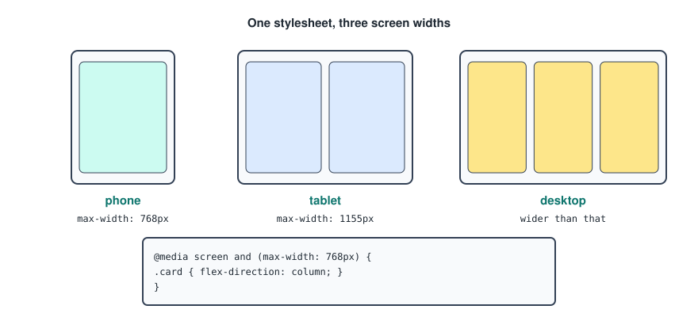

Mobile phone adaptiveness.

```css
@media screen and (max-width: 768px) {
    .card {
        flex-direction: column;
    }
}
```

Medium screen adaptiveness.

```css
@media screen and (max-width: 1155px) {
    .card {
        flex-direction: row;
    }
}
```

Two things that make media queries behave. The viewport meta tag has to be in the HTML head, otherwise a phone pretends to be a desktop and none of this fires. And when you use `max-width` breakpoints, write the desktop rules first and let the smaller screens override them, since a later rule of equal specificity wins.

---

## CRAP

CRAP stands for contrast, repetition, alignment and proximity. These four principles should be thought of while web designing, to make better and more conscious decisions.

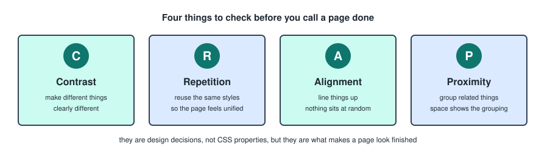

- **Contrast** means making different things clearly different, not slightly different.
- **Repetition** means reusing the same styles so the page reads as one thing.
- **Alignment** means nothing sits at a random position.
- **Proximity** means related things are close together, because space is what tells the eye what belongs to what.

They are design decisions rather than CSS properties, but they are the difference between a page that works and one that only nearly does.

---

## Quick Reference

Everything above, condensed.

### Font

```css
font-family: font, font, font;
line-height: 1.5;              /* no unit needed */
font-size: 1rem;               /* rem is the preferred unit */
font-weight: bold;
```

### Background

```css
background-color: color;
background-image: url(folder/image.png);
background-size: cover;
background-repeat: no-repeat;
background-attachment: fixed;
background-position: center;
```

### Box Model

```css
padding: top right bottom left;    /* px or em */
border: 2px solid color;
margin: top right bottom left;
margin: auto;                      /* centres */
box-shadow: 4px 4px 8px color;     /* x, y, blur, colour */
```

### Position

```css
position: absolute;    /* relative to the positioned ancestor */
position: relative;    /* relative to its initial position */
position: fixed;       /* holds position while scrolling */
top: value;
left: value;
```

### Flexbox

```css
display: flex;
flex-direction: row;
flex-direction: column;
align-items: center;              /* centres on the cross axis */
justify-content: center;          /* centres on the main axis */
justify-content: space-around;
flex-wrap: wrap;
```

### Grid

```css
display: grid;
grid-template-columns: 90px 2fr 1fr;          /* uneven */
grid-template-columns: repeat(3, 1fr);        /* even */
grid-template-columns: repeat(auto-fit, minmax(200px, 1fr));
grid-gap: 10px;
```

### Transform And Transition

```css
transform: rotate(45deg);
transform: scale(1.2);
transform: translate(10px, 20px);
transition: all 0.3s ease-in 0s;
```
