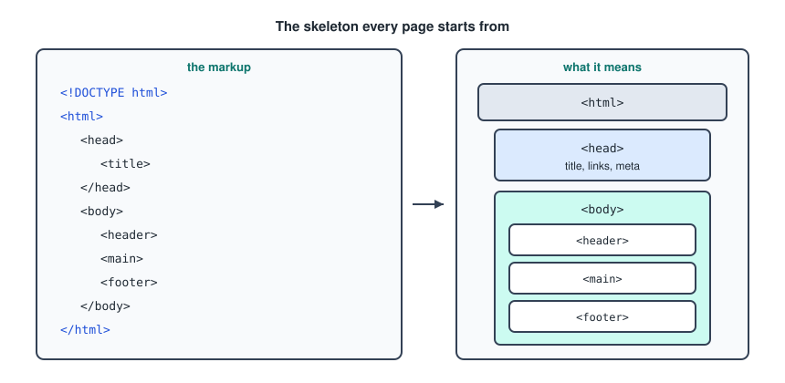
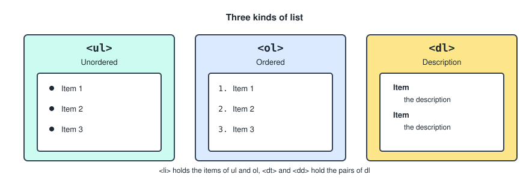
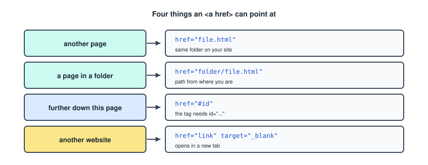
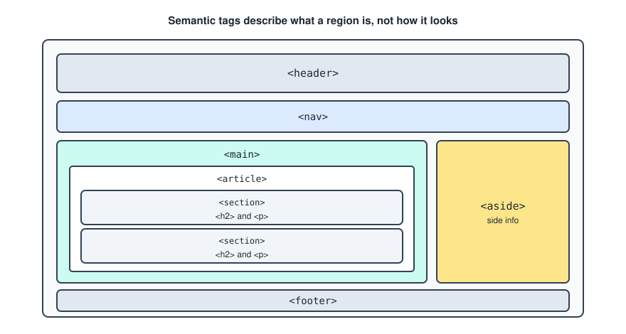
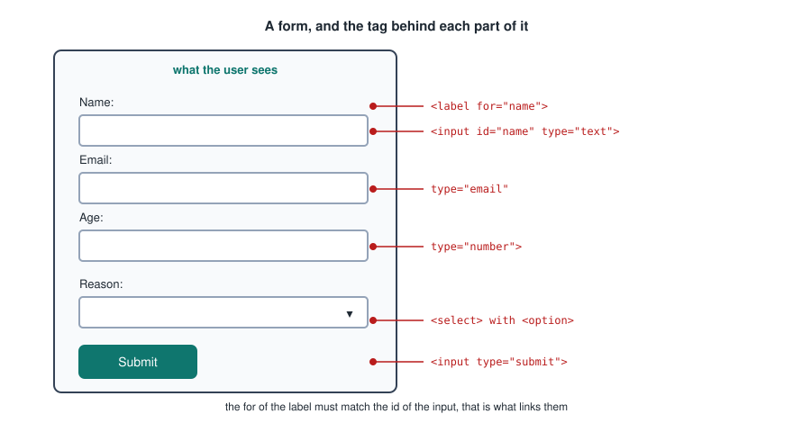
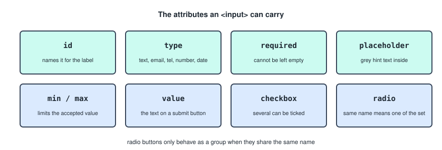

# HTML

HTML is the first of the three layers a web page is made of. This one is the structure, CSS is the appearance, and JavaScript is the behaviour. Get the structure right and the other two have something sensible to attach to.

---

## What HTML Is

HTML stands for **hypertext markup language**. It is the most basic building block of the web.

It is a markup language rather than a programming language. There is no logic in it, no variables and no loops. You are labelling pieces of content so the browser knows what each one is.

An element is written as an opening tag, some content, and a closing tag.

```html
<p>Some text</p>
```

A few elements have nothing to wrap, so they close themselves.

```html

```

Attributes go in the opening tag and configure the element.

```html
<a href="https://example.com" target="_blank">a link</a>
```

---

## The Elements Worth Knowing

The ones that come up constantly.

`<head>` `<title>` `<body>` `<header>` `<footer>` `<article>` `<section>` `<p>` `<q>` `<div>` `<span>` `` `<aside>` `<audio>` `<canvas>` `<datalist>` `<details>` `<embed>` `<nav>` `<search>` `<output>` `<progress>` `<video>` `<ul>` `<ol>` `<li>`

Two of them do nothing on their own and exist purely to be styled later.

- `<div>` is a generic block container.
- `<span>` is a generic inline container.

Reach for those two only when no element with actual meaning fits.

---

## Document Structure

Every page starts from the same skeleton.

```html
<!DOCTYPE html>
<html>
    <head>
        <title></title>
    </head>
    <body>
        <header></header>
        <main></main>
        <footer></footer>
    </body>
</html>
```



Each piece is doing a job.

- `<!DOCTYPE html>` tells the browser to use modern standards. Without it you get a compatibility mode nobody wants.
- `<html>` wraps everything, and should carry `lang="en"` so screen readers and translators know the language.
- `<head>` holds information about the page rather than content of the page. The title, the stylesheet link, the character encoding.
- `<body>` holds everything the visitor actually sees.

Two lines belong in the head of every page and were not in my notes.

```html
<meta charset="UTF-8" />
<meta name="viewport" content="width=device-width, initial-scale=1.0" />
```

The first stops accented characters turning into rubbish. The second stops phones rendering the page as a zoomed out desktop layout, so without it the responsive CSS later does nothing.

---

## Headings

Headings run from `<h1>` to `<h6>` and are a hierarchy, not a set of font sizes.

```html
<h1>The page title</h1>
<h2>A major section</h2>
<h3>Something inside that section</h3>
```

One `<h1>` per page, and no skipping levels on the way down. If a heading looks too big, that is a CSS problem, not a reason to use `<h3>` instead.

---

## Lists

Three kinds, and the choice says something about the content.



An unordered list, where the order carries no meaning.

```html
<ul>
    <li>Item 1</li>
    <li>Item 2</li>
    <li>Item 3</li>
</ul>
```

An ordered list, where it does.

```html
<ol>
    <li>Item 1</li>
    <li>Item 2</li>
</ol>
```

A description list, for pairs of a term and its description.

```html
<dl>
    <dt>Item</dt>
    <dd>Item description</dd>
</dl>
```

---

## Links

The `<a>` element with an `href` attribute, pointing at four different kinds of destination.



### Another page on your site

```html
<a href="file.html">name</a>
```

### A page inside a folder

```html
<a href="folder/file.html">name</a>
```

### Further down the same page

```html
<a href="#id">name</a>
```

Then give the target its id.

```html
<h2 id="id">Section title</h2>
```

### Another website

```html
<a href="https://example.com" target="_blank">name</a>
```

`target="_blank"` opens it in a new tab. When you use it on an external link, add `rel="noopener noreferrer"` as well, because without it the page you opened gets a reference back to yours.

---

## Images

```html

```

Other formats work the same way, `jpeg` and `svg` being the common ones alongside `png`.

The `alt` attribute is not optional in practice. It is what a screen reader announces, and what shows if the file fails to load. Leave it as `alt=""` only when the image is purely decorative.

There is a `width` attribute, but resizing a large photo with it means the visitor still downloads the large photo. Resize the file itself before you use it.

For an image with a caption, wrap it.

```html
<figure>
    
    <figcaption>The caption</figcaption>
</figure>
```

---

## Semantic HTML

Semantic tags describe what a region of the page is. A `<div>` says nothing, whereas `<nav>` says this is the navigation, which search engines and screen readers can both act on.



Wrap your list of page links in `<nav>`, and your headings and paragraphs in `<article>` and `<section>`.

```html
<main>
    <article>
        <section>
            <h2></h2>
            <p></p>
        </section>
        <section>
            <h2></h2>
            <p></p>
        </section>
    </article>
</main>
```

The distinction between the two containers is worth knowing. An `<article>` is something that would still make sense pulled out on its own, like a blog post. A `<section>` is a thematic chunk of a larger thing, and should have a heading.

`<aside>` is for information that is not important to the main content. Things you want in a side margin or a box off to the side.

---

## HTML Entities

Some characters cannot be typed directly, so they are written as entities.

```html
<p>&copy;</p>
```

The ones that come up.

- `&copy;` gives the copyright symbol.
- `&amp;` gives an ampersand.
- `&lt;` and `&gt;` give the angle brackets, which is how you show HTML code on a page.
- `&nbsp;` gives a space that will not break onto a new line.

---

## Forms

A form collects input from the visitor. Every input should be paired with a label.



```html
<form>
    <label for="name">Name:</label>
    <input id="name" type="text" />

    <label for="email">Email:</label>
    <input id="email" type="email" />

    <label for="phone">Phone:</label>
    <input id="phone" type="tel" />

    <label for="age">Age:</label>
    <input id="age" type="number" />

    <label for="date">Date:</label>
    <input id="date" type="date" />

    <label for="reason">Reason:</label>
    <select id="reason" name="reason">
        <option value="" disabled selected>Pick one</option>
        <option value="reason1">Reason 1</option>
        <option value="reason2">Reason 2</option>
    </select>

    <input type="submit" value="Submit" />
</form>
```

The `for` of the label has to match the `id` of the input. That pairing is what lets a screen reader announce the right label, and what makes clicking the label focus the field.

---

## Input Attributes

The `<input>` element changes completely depending on its `type`, and the other attributes stack on top.



```html
<input id="val" type="text" />
<input id="val" type="email" />
<input id="val" type="tel" />
<input id="val" type="number" />
<input id="val" type="date" />

<input id="val" type="text" required />
<input id="val" type="text" placeholder="hint text" />
<input id="val" type="number" min="0" max="120" />

<input type="submit" value="Submit" />
```

All of them can be combined on one input when needed.

### Checkboxes And Radios

A checkbox is independent, so several can be ticked at once.

```html
<input id="val" type="checkbox" />
```

A radio belongs to a group, and only one member of the group can be chosen.

```html
<form>
    <label for="male">Male:</label>
    <input name="gender" id="male" type="radio" />

    <label for="female">Female:</label>
    <input name="gender" id="female" type="radio" />
</form>
```

The `name` is what does the grouping. The `id` has to be different on each one, because that is what the label points at, but the `name` has to be the same, otherwise they are two unrelated buttons that can both be selected.

---

## What The Browser Does With It

Worth having in your head before the JavaScript file. The browser reads your markup once and builds an object tree out of it, called the DOM. From that moment on, the page on screen is drawn from the tree rather than from your file, which is why JavaScript changing a node changes what the visitor sees without the file ever changing.
