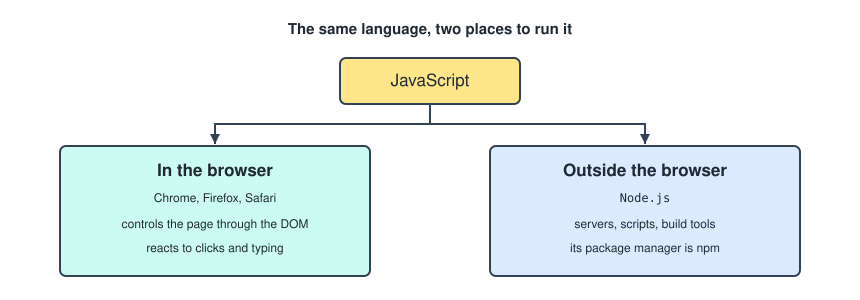
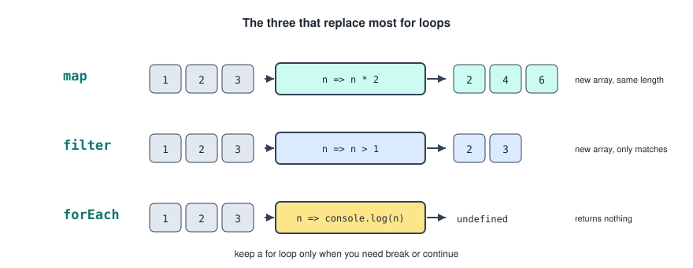
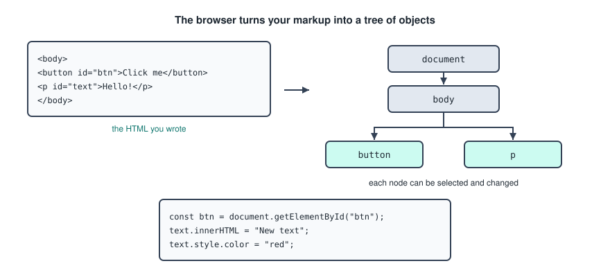
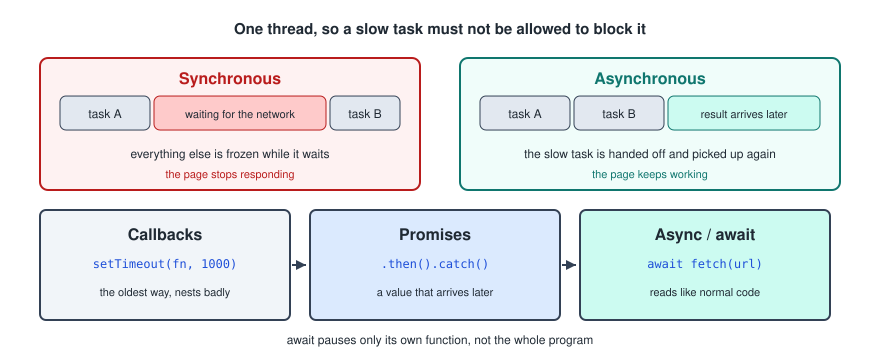
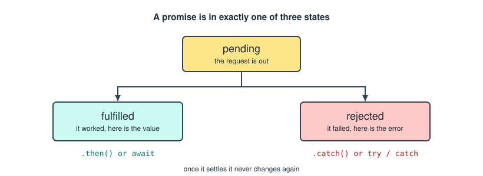

# JavaScript

JavaScript is the third layer. HTML gives the page structure, CSS gives it appearance, and this gives it behaviour. It is also the only one of the three that is an actual programming language.

The TypeScript half of this used to sit in the same file. It is now in `TypeScript.md`, which assumes everything here.

---

## What JavaScript Is

**JavaScript (JS)** is a programming language primarily used to make websites interactive.

- It can run **inside a browser** like Chrome, Firefox and Safari, to control webpages.
- It can also run **outside the browser** using **Node.js**.



Node is the **JavaScript runtime environment** that allows you to run JavaScript outside of a web browser. You can download Node from the [node.js](https://nodejs.org/en) website. The Node package manager is `npm`.

That second half is what makes JavaScript unusual. The same language you use for a button click also runs your build tools, your server, and the command that installs your dependencies.

---

## Variables

There are two ways to declare a variable.

The first is `let`, which can be updated but cannot be redeclared in the same scope. It is most commonly used for values that change.

```js
let age = 20;
age = 21;
```

The second is `const`. Unlike `let`, the variable cannot be reassigned and it must be initialised immediately. It is used for values that should not change.

```js
const name = "angelo";
```

Using `const` does not mean the value is immutable. Objects and arrays can still change internally.

```js
const user = { name: "Sam" };
user.name = "Alex";      // fine, the object changed
user = { name: "Alex" }; // error, the binding was reassigned
```

Default to `const`, and switch to `let` only when you find yourself needing to reassign. There is also an older keyword `var`, which you will see in old code and should not write, because it ignores block scope in ways that cause bugs.

---

## Types

The common types, with a variable of each.

```js
let number = 10;                      // Number
let text = "Hello";                   // String
let isReady = true;                   // Boolean
let nothing = null;                   // Null
let notDefined;                       // Undefined
let list = [1, 2, 3];                 // Array
let user = { name: "Sam", age: 22 };  // Object
```

JavaScript is **dynamically typed**. You do not specify types, and the type is determined at runtime.

`null` and `undefined` look like the same thing and are not. `undefined` means nothing was ever assigned. `null` means something was deliberately set to empty.

---

## Operators

Logical operators, which work on booleans.

- And `&&`
- Or `||`
- Not `!`

Arithmetic operators, which work on numbers.

- Addition `+`
- Subtraction `-`
- Multiplication `*`
- Division `/`
- Exponential `**`
- Remainder `%`

Assignment and comparison.

- Assigning `=`
- Comparing values `==`
- Comparing values and types `===`

That last pair needs care. `==` converts the types before comparing, so `"5" == 5` is true. `===` compares the value and the type, so `"5" === 5` is false. Always use `===`, and `!==` for the negative, unless you have a specific reason not to.

---

## Conditionals

Longhand.

```js
if (condition) {
    code;
} else if (condition) {
    code;
} else {
    code;
}
```

Shorthand, the ternary operator.

```js
condition ? valueIfTrue : valueIfFalse;
```

When using `else if`, once one branch is true the rest are skipped. Writing separate `if` statements instead means every one of them is checked even after one has matched.

---

## Functions

A normal function.

```js
function name() {
    code;
}
```

An arrow function.

```js
const name = () => {
    code;
};
```

Either can be called with `name()`, the same as in any other language. Arrow functions are the modern default in front end code, and they are what you will see throughout React.

An arrow function with a single expression can drop the braces and the return.

```js
const double = (n) => n * 2;
```

---

## Object Destructuring

Given this object.

```js
const user = { name: "Sam", age: 22 };
```

Destructuring it.

```js
const { name, age } = user;
```

Which is equivalent to this.

```js
const name = user.name;
const age = user.age;
```

Without destructuring you would write `user.name` every time you needed the name. With it, you write `name`.

You can also destructure in the function parameters.

```js
function printUser({ name, age }) {
    console.log(`${name} is ${age} years old`);
}
```

Called with `printUser(user)`. This example also shows template literals: backticks let you drop `${}` into a string instead of concatenating with `+`.

Arrays destructure by position rather than by name, which is exactly the syntax React's `useState` uses.

```js
const [first, second] = [10, 20];
```

---

## Arrays

Arrays are objects that can hold any type, and even mixed types.

```js
let numbers = [1, 2, 3];
let mixed = [1, "hello", true];
let empty = [];
```

Accessing elements.

```js
numbers[0]; // 1
numbers[2]; // 3
```

Modifying them.

```js
numbers[1] = 42;     // [1, 42, 3]
numbers.push(4);     // add to end     [1, 42, 3, 4]
numbers.pop();       // remove last    [1, 42, 3]
numbers.unshift(0);  // add to start   [0, 1, 42, 3]
numbers.shift();     // remove first   [1, 42, 3]
```

Looping with a for loop.

```js
for (let i = 0; i < numbers.length; i++) {
    console.log(numbers[i]);
}
```

Looping with the shorthand form.

```js
for (let i in numbers) {
    console.log(i);
}
```

Worth knowing that `for...in` gives you the **index**, not the value. `for...of` gives you the value, which is usually what you actually wanted.

```js
for (const n of numbers) {
    console.log(n);
}
```

---

## Array Methods

The ones that matter.

```js
numbers.length;                        // size
numbers.includes(42);                  // true
numbers.indexOf(42);                   // 1

numbers.map(n => n * 2);               // [2, 84, 6]
numbers.filter(n => n > 2);            // [42, 3]
numbers.forEach(n => console.log(n));  // undefined
```



In modern JavaScript, `map` and `forEach` replace for loops, unless you need core for loop functionality like `break` and `continue`.

The distinction between the three is what they hand back.

- `map` returns a new array of the same length, with every element transformed.
- `filter` returns a new array containing only the elements that passed the test.
- `forEach` returns nothing. It exists purely for the side effect.

Neither `map` nor `filter` changes the original array, which is why they suit React, where you should not be mutating data in place. `map` in particular is how a list of data becomes a list of components.

Two more worth adding.

```js
numbers.find(n => n > 2);              // the first match, or undefined
numbers.reduce((total, n) => total + n, 0);  // folds the array into one value
```

---

## The DOM

**DOM** stands for **Document Object Model**. It is how the browser represents your HTML as a tree of objects. Each HTML element becomes a **node** you can access and change with JavaScript.



Given this HTML.

```html
<button id="btn">Click me</button>
<p id="text">Hello!</p>
```

Selecting elements.

```js
const btn = document.getElementById("btn");
```

The other ways to select.

| Method | Returns | Example |
| --- | --- | --- |
| `querySelector` | first match | `document.querySelector("#btn")` |
| `querySelectorAll` | NodeList of all matches | `document.querySelectorAll(".item")` |
| `getElementsByClassName` | HTMLCollection | `document.getElementsByClassName("item")` |
| `getElementsByTagName` | HTMLCollection | `document.getElementsByTagName("li")` |

`querySelector` takes any CSS selector, which is why it has largely replaced the others. The same string you would write in a stylesheet works here.

Changing content and styles.

```js
const text = document.getElementById("text");
text.innerHTML = "New text";
text.style.color = "red";
```

`innerHTML` parses whatever you give it as HTML, so never put text that came from a user into it. `textContent` sets plain text and is the safe choice.

Creating a new element.

```js
const newDiv = document.createElement("div");
newDiv.textContent = "I'm new!";
document.body.append(newDiv);
```

Once you get to React, you stop doing any of this by hand. React holds its own picture of the tree and does the updating. It is still worth understanding, because it is what React is doing underneath.

---

## Event Listeners

Event listeners are how JavaScript reacts to user actions like clicks, typing, hovering and submitting forms.

```html
<button id="btn">Click me</button>
```

```js
const btn = document.getElementById("btn");

btn.addEventListener("click", () => {
    console.log("Button clicked!");
});
```

Other events you will use.

- `mouseover` and `mouseout`
- `input` and `change`
- `submit`
- `keydown`

The listener receives an event object, which carries what happened.

```js
input.addEventListener("input", (event) => {
    console.log(event.target.value);
});
```

`event.target` is the element the event came from, and `event.target.value` is what is currently typed in it. That exact line reappears in every React form.

---

## The Asynchronous Model

JavaScript is **single threaded**, meaning it can only execute one task at a time on the main thread. Some tasks like network requests, reading files, timers and fetching data from an API take time. If JavaScript waited for these synchronously, the entire program would freeze.

The solution is asynchronous programming. JavaScript uses an **asynchronous, non blocking model** to handle long running tasks without stopping execution.



### Callbacks

The oldest way. Something is delayed so it can wait for something else to finish. This is the most inefficient way to do it, and nesting several callbacks quickly becomes unreadable.

```js
setTimeout(() => {
    console.log("Done");
}, 1000);
```

### Promises

A **promise** represents a value that will be available in the future. It is in one of three states: pending, fulfilled, or rejected.



```js
fetch(url)
    .then(response => response.json())
    .then(data => console.log(data))
    .catch(err => console.error(err));
```

Once a promise settles, it never changes state again.

### Async And Await

The most modern way. `await` pauses only the function it is in, not the entire program, which is what lets many tasks run at once.

```js
async function fetchData() {
    const response = await fetch("https://api.example.com/data");
    const data = await response.json();
    console.log(data);
    return data;
}
```

Or as an arrow function.

```js
const fetchData = async () => {
    const response = await fetch("https://api.example.com/data");
    const data = await response.json();
    return data;
};
```

`await` only works inside a function marked `async`, and an `async` function always returns a promise, even when the body returns a plain value.

---

## Fetching From An API

`fetch` is a **Web API** used to make HTTP requests like GET, POST, PUT and DELETE. It is asynchronous and returns a promise, so it can be used with `then` and `catch` as above.

The best modern way to fetch is async and await paired with error handling using `try` and `catch`.

```js
async function fetchData() {
    try {
        const response = await fetch(url);
        const data = await response.json();
        return data;
    } catch (error) {
        console.error(error);
    }
}
```

`fetch` also takes options. You can specify the `method` and the `headers`. Without a method, `fetch` uses GET by default.

```js
async function createUser() {
    const response = await fetch("/users", {
        method: "POST",
        headers: {
            "Content-Type": "application/json"
        },
        body: JSON.stringify({ name: "Sam" })
    });

    const data = await response.json();
    return data;
}
```

One thing to watch. `fetch` only rejects on a network failure, so a 404 or a 500 still resolves successfully and the `catch` never runs. You have to check the status yourself.

```js
const response = await fetch(url);

if (!response.ok) {
    throw new Error("Request failed");
}
```

### Status Codes

- `2xx` success
- `3xx` redirect
- `4xx` client error
- `5xx` server error

---

## Exporting And Importing

When you want to use something from one file in another, you export it there and import it here.

A default export, one per file.

```js
export default fetchData;
```

Imported under any name you like.

```js
import fetchData from "./services/data";
```

Named exports, as many per file as you want.

```js
export const fetchData = async () => {};
export const createUser = async () => {};
```

Imported by their exact names, in braces.

```js
import { fetchData, createUser } from "./services/data";
```

You can also group things into one default export object.

```js
export default { fetchData, createUser };
```

Which is the pattern the services files in the React notes use.
