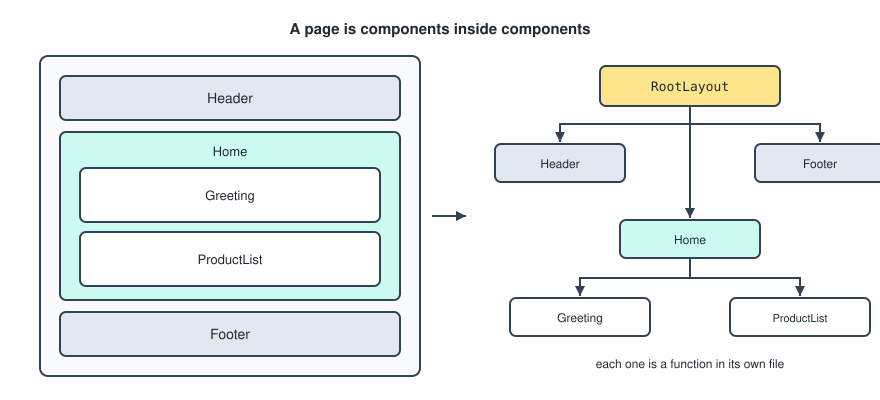
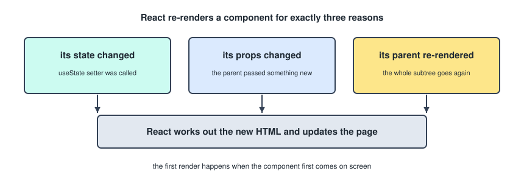
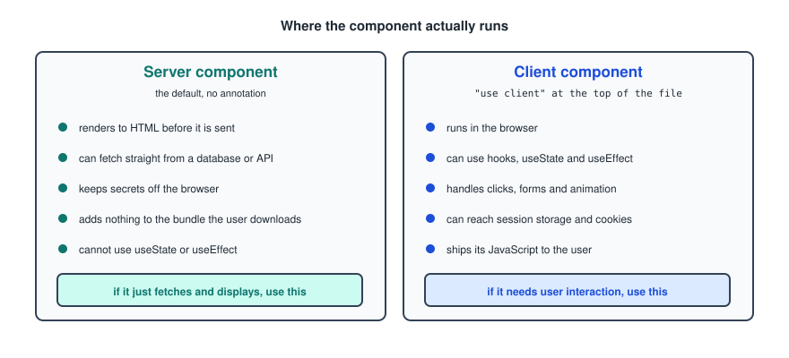
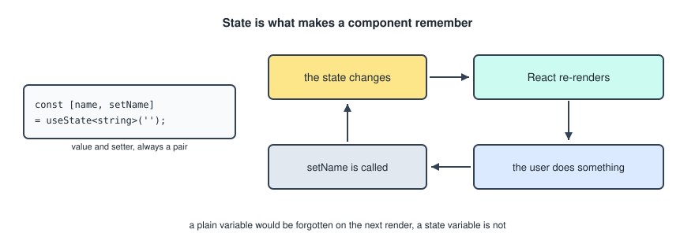
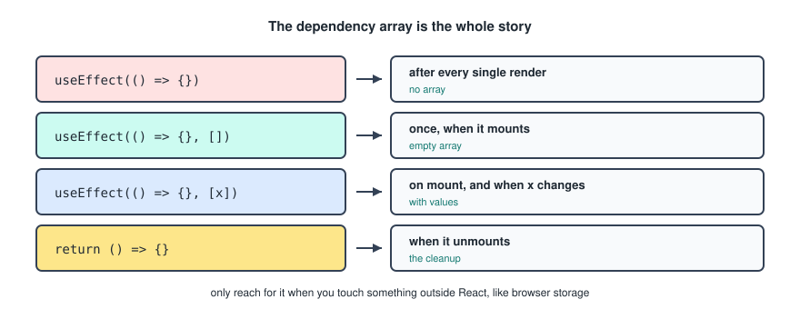
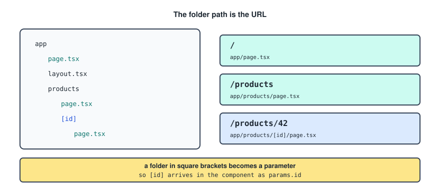
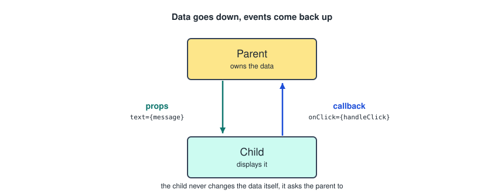
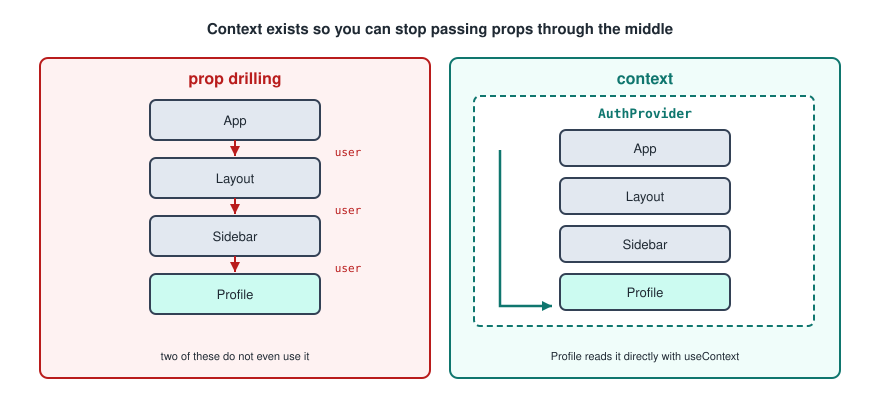

# React And Next

React is a JavaScript library for building interactive user interfaces. A user interface can be broken down into smaller building blocks called **components**, and components are the basis of everything here.

Next is a framework built on top of React that gives you building blocks for creating fast web applications: routing, server rendering and data fetching, all of which React on its own leaves to you.

---

## Setting Up

To set up a React project you need Node installed, because React is a JavaScript library. Node is the JavaScript runtime environment that allows you to run JavaScript outside of a web browser. You can download it from the [node.js](https://nodejs.org/en) website.

Next.js comes with React built in, so you do not install React separately.

```bash
npx create-next-app@latest projectName
```

The CLI asks you some questions. Choose according to your needs, and for a first project the defaults are fine.

Go into your project folder and run the development server. This is the command every time you want to work on the app.

```bash
npm run dev
```

That starts the Next.js dev server. Open [localhost:3000](http://localhost:3000) and you should see your app running.

---

## Project Structure

The folder layout, which makes everything else easier to follow.

```
React Project
├── app
│   ├── layout.tsx
│   └── page.tsx
│
├── assets
│   └── images
│
├── components
│   └── Component.tsx
│
├── public
│
├── services
│   └── ComponentService.ts
│
├── styles
│   └── global.css
│
└── types
    └── index.ts
```

The split that matters: `app` decides what URL shows what, `components` holds the reusable pieces, `services` holds anything that talks to an API, and `types` holds shared type definitions. Keeping data fetching out of components and in `services` is the habit worth forming early.

---

## Component Basics

Each component is its own separate TypeScript function in its own separate file. Components have properties called **props**, which are passed into the function.



A component file in the components directory.

```tsx
type Props = {
    name: string;
};

const Greeting: React.FC<Props> = ({ name }: Props) => {
    return <h1>Hello, {name}!</h1>;
};

export default Greeting;
```

The return value is in **JSX**, which lets you write HTML inside a TypeScript function, and TypeScript inside that HTML using curly braces.

The example uses object destructuring, the same as in the JavaScript notes. Without destructuring it looks like this instead.

```tsx
const Greeting: React.FC<Props> = (props: Props) => {
    return <h1>Hello, {props.name}!</h1>;
};
```

One small thing about the typing. `React.FC<Props>` already tells TypeScript what the props are, so annotating the parameter as well is saying it twice. Either of these is enough on its own.

```tsx
const Greeting: React.FC<Props> = ({ name }) => { ... };
const Greeting = ({ name }: Props) => { ... };
```

### JSX Rules

A few things about JSX catch people out, because it looks like HTML but is not.

- Attributes use camelCase, so `className` instead of `class`, and `onClick` instead of `onclick`.
- Every tag must close, including `` and `<br />`.
- A component must return one root element. Wrap siblings in a `<div>`, or in an empty fragment `<>...</>` when you do not want an extra element in the output.

### Rendering

Rendering is the process where React converts the component into HTML. React renders a component the first time it comes on screen.

After that, React re-renders based only on specific triggers.



- A change in state.
- A change in props, meaning data passed from a parent component.
- A parent component re-rendering.

---

## Components With Global Types

You can also pass prespecified global types as props to a component. The type is declared in the index file in the types directory.

The index file in the types directory.

```ts
export type Person = {
    id: number;
    name: string;
    age: number;
};
```

The component file in the components directory.

```tsx
import React from "react";
import { Person } from "@types";

type Props = {
    person: Person;
};

const Greeting: React.FC<Props> = ({ person }: Props) => {
    return <h1>Hello, {person.name}!</h1>;
};

export default Greeting;
```

The `@types` and `@components` style imports are path aliases, configured in `tsconfig.json`. They save you writing `../../../` chains as the folder tree gets deeper.

---

## The Home Page

The home page is the `page.tsx` file in the app directory. It acts as the `index.html` of the project, and it is where a component gets rendered.

```tsx
import Greeting from "@components/Greeting";

const Home = () => {
    return (
        <div>
            <Greeting person={data} />
        </div>
    );
};

export default Home;
```

Props are passed exactly like HTML attributes. A string can be passed in quotes, and anything else goes in curly braces.

---

## The Layout Page

The layout page is a built in page in Next. It represents what stays the same across all pages, like the header and the footer.

The header and footer are still written as component functions.

```tsx
import Link from "next/link";
import Image from "next/image";
import logo from "@assets/images/logo.png";

const Header: React.FC = () => {
    return (
        <header>
            <div>
                <Image src={logo} alt="Logo" />
            </div>
            <nav>
                <Link href="/">Home</Link>
                <Link href="/products">Products</Link>
            </nav>
        </header>
    );
};

export default Header;
```

For navigation menus we use the Next `<Link>` tag. It knows you are calling another page in `app`, so you give it `/page` rather than a full path. It also loads the next page without a full browser refresh, which is the actual reason to use it over a plain `<a>`.

For images we use the Next `<Image>` tag, which resizes and optimises the file for you. Images live in the assets directory. You can use the public directory, but it is not considered best practice.

The layout file in the app directory.

```tsx
import Header from "@components/Header";

const RootLayout = ({ children }: { children: React.ReactNode }) => {
    return (
        <html lang="en">
            <body>
                <Header />
                {children}
            </body>
        </html>
    );
};

export default RootLayout;
```

`{children}` is the part that must not be forgotten. It is where the current page gets slotted in, so without it the layout renders and the page never appears.

---

## Global CSS

Create a global CSS file for your global styles in the styles directory, then call the classes with `className="name"`.

The `global.css` file in the styles directory.

```css
.greeting {
    color: teal;
    font-size: 24px;
    background-color: lightgray;
    padding: 10px;
}
```

The component file.

```tsx
import "@styles/global.css";

const Greeting = ({ name }: { name: string }) => {
    return <h1 className="greeting">Hello, {name}!</h1>;
};

export default Greeting;
```

Global CSS is normally imported once, in the root layout, rather than in each component that uses it.

---

## Module CSS

You can also create page specific styles. Name the file `page.module.css` or `greeting.module.css`, then call the classes with `className={styles.name}`.

The `greeting.module.css` file in the styles directory.

```css
.title {
    color: teal;
    font-size: 24px;
    background-color: lightgray;
    padding: 10px;
}
```

The component file.

```tsx
import styles from "@styles/greeting.module.css";

const Greeting = ({ name }: { name: string }) => {
    return <h1 className={styles.title}>Hello, {name}!</h1>;
};

export default Greeting;
```

The import has to be `import styles from`, not a bare import, because a module stylesheet exports an object mapping your class names to generated unique ones. That renaming is what makes it scoped, so it avoids global conflicts. It supports pseudo classes like `:hover` the same as any other CSS.

---

## Tailwind CSS

**Tailwind** is a utility first CSS framework and it works very well with React. Instead of writing separate CSS files, you use predefined class names directly in your JSX.

Installing it.

```bash
npm install -D tailwindcss postcss autoprefixer
npx tailwindcss init -p
```

Then add Tailwind to your global CSS file.

```css
@tailwind base;
@tailwind components;
@tailwind utilities;
```

The component file.

```tsx
const Greeting = ({ name }: { name: string }) => {
    return <h1 className="text-2xl font-bold text-teal-700">Hello, {name}!</h1>;
};

export default Greeting;
```

Tailwind is fast once you are used to it, because no extra CSS files are needed and everything stays in the JSX.

Worth checking which version you installed. Tailwind v4 replaced the three `@tailwind` lines and the init step with a single line, and the setup above is the v3 one.

```css
@import "tailwindcss";
```

---

## Server And Client Components

This is the distinction that Next adds on top of React, and getting it wrong is the most common source of confusing errors.



### Client Components

Client components run in the browser. They handle user interactions, state and lifecycle. A client component always has the `"use client"` annotation at the top of the file.

- Rendered on the client.
- Can use hooks like `useState`, `useEffect` and `useContext`.
- Can handle interactivity: clicks, forms, animations.
- Are bundled into the client JavaScript, which increases the download size.

### Server Components

Server components run on the server. They render to HTML before being sent to the client. They are typically faster and carry no `"use client"` annotation, because that is the default.

- Rendered on the server during the initial request.
- Cannot use client hooks like `useState` and `useEffect`, because the server does not handle interactivity.
- Can fetch data directly from a database or API without exposing secrets to the client.
- Reduce the client bundle size, because the JavaScript for the component never gets sent to the browser.

### Combining Them

In modern React the common pattern is to use both: server components to fetch data and render static content, and client components to add interactivity on top.

- If the component needs user interaction, make it a client component.
- If it just fetches and displays data, leave it as a server component.
- Mix them wisely: server for performance, client for interactivity.

The rule that follows from this is worth stating on its own. `"use client"` applies to everything imported below it too, so put it as far down the tree as you can. Marking the layout as a client component turns the whole app into one.

---

## Hooks

Hooks are special functions in React that let you hook into React features like state, lifecycle and context, without using class components. They are only usable in client components.

There is one rule about where they go: hooks are only called at the top level of a component, never inside loops, conditions or nested functions. React tracks them by call order, so a hook that sometimes runs and sometimes does not breaks that tracking.

The useful ones.

- `useState` adds state to a functional component. Returns `[value, setter]`.
- `useEffect` runs the code inside it when a component is mounted. Used for interaction with an external system, like browser storage.
- `useInterval` is a custom hook for implementing polling.
- `useRouter` helps with page redirection.
- `usePathname` returns the value of the current URL as a string.
- `useSWR` is used for client side API requests, and has to be imported.

### The useState Hook

When creating a local variable in a component, always give it a state using `useState`. React is stateful, and giving a variable state is what lets the component remember and keep track of it.



The syntax.

```tsx
const [variable, setVariable] = useState<Type>(initialValue);
```

An example.

```tsx
const [name, setName] = useState<string>("");
```

That is a tuple being destructured, which is why it uses square brackets. Note the lowercase `string`: the capitalised `String` is the wrapper object type and is not what you want.

A plain `let` variable would be reset on the next render and changing it would not trigger one. That is the whole reason state exists.

### The useEffect Hook

`useEffect` performs side effects that are outside the scope of component rendering, like reading and updating browser storage. Only call it to interact with an external system. Otherwise use state and event handlers.



With no dependency array as the second parameter, it is called after every render, during mount and update.

```tsx
useEffect(() => {
    console.log("Component rendered");
});
```

With an empty dependency array, it is executed only once, after the first render, so in the mount phase.

```tsx
useEffect(() => {
    console.log("Component mounted");
}, []);
```

With one or more elements in the dependency array, it runs in the mount phase and after every render in the update phase, but only when one of the elements changed. This does not work across components, so `username` here has to be a state variable or a prop inside this component.

```tsx
useEffect(() => {
    console.log("Username changed so run effect");
}, [username]);
```

All the cases together.

- `useEffect(() => {}, [])` runs on mount only.
- `useEffect(() => {}, [x])` runs on mount, and when `x` changes.
- `useEffect(() => {})` runs on every render.
- `return () => {}` inside the effect runs on unmount.

The cleanup return is what stops timers and subscriptions piling up.

```tsx
useEffect(() => {
    const id = setInterval(tick, 1000);
    return () => clearInterval(id);
}, []);
```

### The useInterval Hook

`useInterval` is a custom hook that uses JavaScript's `setInterval` behind the scenes. The first parameter is a callback function, executed after every interval specified by the second parameter.

Installing it.

```bash
npm install use-interval
```

The syntax.

```tsx
useInterval(callbackFunction, intervalInMilliseconds);
```

### The useRouter Hook

`useRouter` helps you navigate to other places in your app, for when a button is pressed and you need to send the user to another page.

```tsx
const router = useRouter();
```

Then use it. This example pushes you to the home page.

```tsx
router.push("/");
```

In the app router it is imported from `next/navigation`, not from `next/router`, which is the older pages router version and will not work here.

```tsx
import { useRouter } from "next/navigation";
```

### The usePathname Hook

`usePathname` returns the value of the current URL as a string.

```tsx
const pathname = usePathname();
```

That does not sound very useful on its own, but it lets you trigger a `useEffect` on a URL change.

```tsx
useEffect(() => {
    console.log("Pathname changed to: " + pathname);
}, [pathname]);
```

The other common use is highlighting the active link in a navigation bar, by comparing `pathname` to each link's href.

### The useSWR Hook

`useSWR` stands for **stale while revalidate**. Think of it as a smart alternative to `useEffect` combined with `useState` for fetching data. `useSWR` is for client side API requests, whereas `useEffect` is for interaction with an external system like browser storage.

Installing it.

```bash
npm install swr
```

SWR caches the data for the given key, and re-fetches it in the background when needed.

```tsx
const fetcher = async () => {
    const res = await fetch("/api/data");
    return res.json();
};

const { data, error, isLoading } = useSWR("/api/data", fetcher);
```

What comes back.

- `data` is the fetched data.
- `error` is any error during the fetch.
- `isLoading` is whether the data is still loading.

The name describes the behaviour: it hands you the cached data immediately, then quietly checks for a newer version and updates if there is one.

---

## Forms And Binding State To An Input

States are what make forms work. When someone types in an input field you want to save what they typed into a stateful variable, so it can be processed.

An example of a login form.

```tsx
"use client";

const LoginForm: React.FC = () => {
    const [name, setName] = useState<string>("");
    const [error, setError] = useState<string>("");

    const handleSubmit = async (event: React.FormEvent<HTMLFormElement>) => {
        event.preventDefault();

        if (!name.trim()) {
            setError("Please fill in the name field.");
            return;
        }

        const role = await loginUser({ name });

        if (role) {
            setError("");
            sessionStorage.setItem("userRole", role);
        } else {
            setError("Invalid username or password");
        }
    };

    return (
        <form onSubmit={handleSubmit}>
            <label htmlFor="name">Name:</label>
            <input
                id="name"
                type="text"
                value={name}
                placeholder="Your Name"
                onChange={(event) => setName(event.target.value)}
            />
            {error && <p>{error}</p>}
            <button type="submit">Login</button>
        </form>
    );
};

export default LoginForm;
```

That event function is what React calls a callback function. The example shows how to set the value of an input field to a stateful variable.

Three details in there worth naming.

- `event.preventDefault()` stops the browser doing its default form submit, which would reload the page and throw away your state.
- `value={name}` together with `onChange` is what makes it a **controlled input**. React owns the value, and the field only shows what state says it should.
- `htmlFor` is JSX's spelling of the HTML `for` attribute, since `for` is a reserved word in JavaScript.

### The Service File

The actual logic comes from the user service file in the services directory, which contains the `loginUser` function used in `handleSubmit`. Data handling should always be done in the services directory.

```ts
export type UserRole = "admin" | "user" | null;

type Credentials = {
    name: string;
};

const loginUser = async ({ name }: Credentials): Promise<UserRole> => {
    const res = await fetch(`https://api.example.com/users?name=${name}`);

    if (!res.ok) {
        throw new Error("Failed to fetch user data");
    }

    const users: { name: string; role: UserRole }[] = await res.json();

    const foundUser = users.find((user) => user.name === name);

    return foundUser ? foundUser.role : null;
};

export default loginUser;
```

Keeping this out of the component is what lets you change the API without touching any JSX.

---

## Client Side Storage

Browser storage is a mechanism for storing client side data instead of relying only on server side storage, as used in the login form above. Store data that is safe to keep client side and that is needed across your whole application, so no passwords. You can only interact with browser storage in client components.

Adding an entry.

```tsx
sessionStorage.setItem("username", name);
```

Reading an entry.

```tsx
setUsername(sessionStorage.getItem("username"));
```

Deleting an entry.

```tsx
sessionStorage.removeItem("username");
```

Deleting everything.

```tsx
sessionStorage.clear();
```

One trap worth knowing. `sessionStorage` does not exist on the server, so reading it while the component body runs will crash the first render. Read it inside a `useEffect`, which only runs in the browser.

```tsx
useEffect(() => {
    setUsername(sessionStorage.getItem("username"));
}, []);
```

`sessionStorage` clears when the tab closes. `localStorage` has the same API and persists until it is removed.

### Cookies

Cookies are also a mechanism for storing client side data. You can use them for small pieces of data rather than just single values.

In contrast to browser storage, cookies are sent back and forth to the server with every request, which has a network performance impact. They can have a custom expiration time. They are also subject to security and privacy concerns like cross site scripting, session hijacking, tracking and theft, and can be secured with `HttpOnly` and `SameSite`.

An `HttpOnly` cookie cannot be read by JavaScript at all, which is exactly why it is the right place for an auth token and browser storage is not.

---

## The App Router

In the app directory some file names are reserved.

- `page.tsx` is the main entry point for each folder.
- `layout.tsx` contains the wrapping layout. Without one, the autogenerated layout in the root app folder is used.
- `head.tsx` customises the head of the page, including meta tags and the title.
- `error.tsx` is used in data fetching.
- `not-found.tsx` throws a 404.
- `loading.tsx` displays a loading state.

The folder structure is the routing. A folder called `products` containing a `page.tsx` becomes `/products`, with no configuration anywhere.



### Dynamic Routes

You can include dynamic routing, just like adding params to a path in Spring Boot. To add params to your paths, add them as folders wrapped in square brackets.

So `/folder/param1/param2` will open the specified `page.tsx`.

```
React Project
└── app
    ├── folder
    │   └── [param1]
    │       └── [param2]
    │           └── page.tsx
    │
    ├── layout.tsx
    └── page.tsx
```

To use the values of the params in your component, assign the params as props.

```tsx
type Props = {
    params: Promise<{
        param1: string;
        param2: string;
    }>;
};

const Greeting = async ({ params }: Props) => {
    const { param1, param2 } = await params;

    const res = await fetch(
        `https://api.example.com/data?param1=${param1}&param2=${param2}`
    );

    if (!res.ok) {
        throw new Error("Failed to fetch data");
    }

    const data = await res.json();

    return (
        <div>
            <h1>
                Hello, {param1} & {param2}!
            </h1>
            <p>Fetched Data: {JSON.stringify(data)}</p>
        </div>
    );
};

export default Greeting;
```

The `await params` line is the one to remember. Since the type says `Promise`, the object is not available until it resolves, so reading `params.param1` directly gives you undefined.

---

## Parent And Child Communication

In React, data flows downwards from a parent component to a child component using props. Think of props as function arguments for components.



```tsx
// Parent component
const Parent = () => {
    const message = "Hello from parent!";
    return <Child text={message} />;
};

// Child component
const Child = ({ text }: { text: string }) => {
    return <p>{text}</p>;
};
```

For information to travel back up, a parent passes a callback function to a child via props, and the child calls that callback to send information back.

```tsx
// Parent component
const Parent = () => {
    const handleChildClick = () => {
        alert("Child clicked the button!");
    };

    return <Child onClick={handleChildClick} />;
};

// Child component
const Child = ({ onClick }: { onClick: () => void }) => {
    return <button onClick={onClick}>Click Me</button>;
};
```

The child never changes the data itself. It reports that something happened, and the parent, which owns the state, decides what to do about it.

---

## Event Listeners

Event listeners are how React reacts to user actions like clicks, typing, hovering and submitting forms.

```tsx
const Button = () => {
    const handleClick = () => {
        console.log("Clicked!");
    };

    return <button onClick={handleClick}>Click me</button>;
};
```

Unlike plain JavaScript there is no `addEventListener`, and no selecting the element first. The handler is an attribute on the element in JSX, written in camelCase.

Pass the function, do not call it. `onClick={handleClick}` is right, `onClick={handleClick()}` runs it immediately during render. When you need to pass an argument, wrap it in an arrow function.

```tsx
<button onClick={() => handleDelete(item.id)}>Delete</button>
```

---

## React Context

**React Context** is a mechanism for sharing data across multiple components without passing props manually at every level. It avoids *prop drilling*, where props must be passed through many intermediate components that do not use them.



Context provides a global-like state that can be accessed by any component within a specific part of the component tree. A context consists of a **Provider**, which stores the data, and **Consumers**, which read it.

When the context value changes, all subscribed components automatically re-render. It is commonly used for authentication state, theme settings and language preferences, and is best suited to data that changes infrequently and is needed by many components.

A context file, here for authentication.

```tsx
"use client";

type AuthContextType = {
    user: User | null;
    setUser: (user: User | null) => void;
};

export const AuthContext = createContext<AuthContextType | null>(null);

export const AuthProvider = ({ children }: { children: React.ReactNode }) => {
    const [user, setUser] = useState<User | null>(null);

    return (
        <AuthContext.Provider value={{ user, setUser }}>
            {children}
        </AuthContext.Provider>
    );
};
```

Then wrap the root layout in that provider.

```tsx
const RootLayout = ({ children }: { children: React.ReactNode }) => {
    return (
        <html lang="en">
            <body>
                <AuthProvider>
                    <Header />
                    {children}
                </AuthProvider>
            </body>
        </html>
    );
};
```

Finally, using it in a component.

```tsx
"use client";

import { useContext } from "react";
import { AuthContext } from "../context/AuthContext";

const Profile = () => {
    const { user, setUser } = useContext(AuthContext)!;

    return (
        <div>
            <p>{user ? user.name : "Not logged in"}</p>
            <button onClick={() => setUser({ name: "Bernard" })}>Login</button>
        </div>
    );
};

export default Profile;
```

Two practical notes. Typing the context rather than passing `null` to `createContext` is what makes `user` and `setUser` autocomplete instead of erroring. And context is not a replacement for props: for data used by one or two components, props are simpler and easier to follow.

---

## Front End Security

Our backend expects an authentication JWT token whenever an API request is made from the front end. How you send it depends on where the component runs.

### Client Components

In your services file, specify `credentials: "include"`, which tells the browser to send the cookies along with the request.

```ts
const authenticate = async (user: User): Promise<User> => {
    const response = await fetch("/users/login", {
        method: "POST",
        headers: {
            "Content-Type": "application/json"
        },
        body: JSON.stringify(user),
        credentials: "include"
    });

    const data = await response.json();
    return data;
};
```

Then call the service in the component.

```tsx
const user = await authenticate({ username, password });
```

### Server Components

Server components are rendered on the server, so they have no access to browser cookie storage. The JWT token has to be sent manually in an Authorization header. The Java backend supports both scenarios, authentication using an Authorization header or secure cookies.

```ts
const getAllLecturers = async (cookies: ReadonlyRequestCookies) => {
    const token = cookies.get("authToken")?.value;

    const response = await fetch("/lecturers", {
        method: "GET",
        headers: {
            "Content-Type": "application/json",
            Authorization: `Bearer ${token}`
        },
        credentials: "include"
    });

    const data = await response.json();
    return data;
};
```

Then call the service in the component.

```tsx
const cookieStore = await cookies();
const lecturers = await LecturerService.getAllLecturers(cookieStore);
```

The header value has to be backticks rather than double quotes, otherwise `${token}` is sent to the server as those literal characters instead of the token.

This is also the transition point into back end development, since everything past the fetch call is the server's problem.
