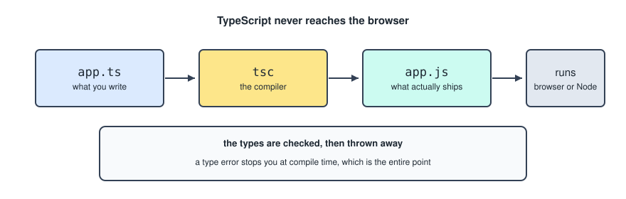
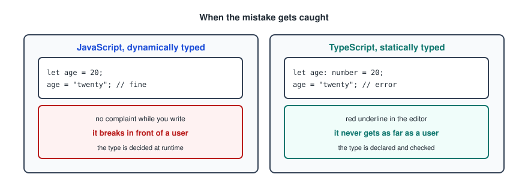
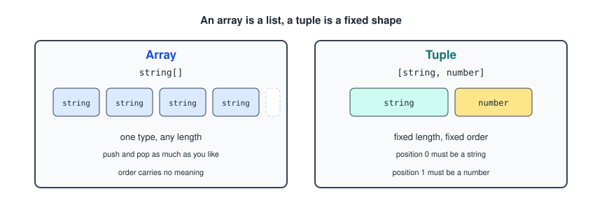

# TypeScript

This one assumes `JavaScript.md`. TypeScript does not replace any of it, it wraps a type system around it, so everything in that file is still true here.

---

## What TypeScript Is

**TypeScript (TS)** is a programming language that is a **superset of JavaScript**.

- It is developed and maintained by **Microsoft**.
- It adds **static typing** and other features to JavaScript.
- Any valid JavaScript code is also valid TypeScript code.

That last point is what superset means. You can rename a `.js` file to `.ts` and it still works, then add types gradually.

---

## Compiling

TypeScript does not run directly in the browser. It must be **compiled** into JavaScript, and the compiled JavaScript is what actually runs in the browser or in Node.



You install TypeScript with `npm`, and the compiler is called `tsc`.

```powershell
npm install typescript
```

```powershell
npx tsc app.ts
```

The important part of that diagram is what happens to the types: they are checked, and then thrown away. Nothing about them survives into the JavaScript. They exist to stop you at compile time, and that is the entire point of them.

---

## Static Versus Dynamic Typing



In JavaScript the type is decided at runtime, so a mistake shows up when a user hits it. In TypeScript the type is declared and checked, so the same mistake is a red underline in the editor and the file will not compile.

```ts
let age: number = 20;
age = "twenty";   // error, string is not assignable to number
```

Nothing here makes the finished program faster. It makes the mistakes arrive earlier, which on any project bigger than one file is worth a great deal.

---

## Variables

When declaring a variable you mention its type. The two keywords still work exactly as in JavaScript, `let` and `const`, but now there is type safety. The syntax is `variable: type`.

```ts
let age: number = 20;
let name: string = "Alex";
let isStudent: boolean = true;
```

TypeScript can usually work the type out on its own, so the annotation is often unnecessary.

```ts
let age = 20;      // inferred as number
age = "twenty";    // still an error
```

Annotate where it adds information, mainly function parameters and return types. Skip it where the value already says everything.

---

## Arrays

Arrays work exactly the same, just with type specifications.

```ts
let numbers: number[] = [1, 2, 3];
let names: string[] = ["Alice", "Bob"];
let mixed: (number | string)[] = [1, "hi", 2];
```

The `|` in that last line is a **union type**, meaning the value can be any one of the listed types. Pushing a number to an array of strings is a compile time error.

Unions are not only for arrays.

```ts
let id: number | string;
let role: "admin" | "user" | null;
```

That second form is a union of literal values, and it is a very common pattern. It means the only three things that variable can ever hold are those three, which the editor will then autocomplete for you.

---

## Objects

An object with its type written in place.

```ts
let user: { name: string; age: number } = {
    name: "Sam",
    age: 22
};
```

This is called an **inline object**. It is created once and it is not reusable.

To create a reusable object, use a `type` alias. This is easier to maintain and more efficient.

```ts
type User = {
    name: string;
    age: number;
};
```

Then use it as many times as you like. Editing the main `type` affects the objects everywhere in your project.

```ts
let user: User = {
    name: "Sam",
    age: 22
};
```

When defining reusable objects, `name?: string` makes that property optional.

```ts
type User = {
    name: string;
    age: number;
    email?: string;
};
```

You can check the type of a variable using `typeof`, which returns `object` in this case.

```ts
typeof user;
```

That is the JavaScript `typeof`, and it only knows the runtime types, so it reports `object` for every object regardless of which `type` you declared.

---

## Tuples

A tuple is a special array with a fixed structure, length and order.

```ts
let user: [string, number] = ["Alice", 20];
```



The difference from an array is that position carries meaning. Position 0 has to be a string and position 1 has to be a number, and there is no position 2.

This is the type behind React's `useState`, which is why that hook is destructured with square brackets: it hands back a pair where the first slot is the value and the second is the setter.

---

## Functions

Type validation can be added to function parameters and to the output.

```ts
const name = (variable: type, variable: type): outputType => {
    code;
};
```

A real one.

```ts
const add = (a: number, b: number): number => {
    return a + b;
};
```

A function that returns nothing is typed `void`.

```ts
const log = (message: string): void => {
    console.log(message);
};
```

An `async` function always returns a promise, so its return type is wrapped.

```ts
const fetchUser = async (id: number): Promise<User> => {
    const response = await fetch(`/users/${id}`);
    return response.json();
};
```

The return type is the one annotation always worth writing, even when it could be inferred, because it makes the compiler check the body against what you claimed rather than just believing whatever came out.

---

## Destructuring With Types

Destructuring in the parameters needs the type of the whole object, not of each piece.

```ts
function printUser({ name, age }: { name: string; age: number }) {
    console.log(`${name} is ${age} years old`);
}
```

Which is much easier to read with a type alias, and is exactly the shape React component props take.

```ts
function printUser({ name, age }: User) {
    console.log(`${name} is ${age} years old`);
}
```

---

## Classes

There are two ways to build a class. The first uses a constructor with separate parameters.

```ts
class Product {
    private id!: number;
    private name!: string;

    constructor(id: number, name: string) {
        this.id = id;
        this.name = name;
    }
}
```

Calling it.

```ts
const laptop = new Product(1, "Laptop");
```

The second uses a constructor taking a single object parameter.

```ts
class Product {
    private id!: number;
    private name!: string;

    constructor({ id, name }: { id: number; name: string }) {
        this.id = id;
        this.name = name;
    }
}
```

Calling it.

```ts
const laptop = new Product({ id: 1, name: "Laptop" });
```

The object form costs a few more characters and is worth it as soon as there are more than two parameters, because the call site says which value is which instead of relying on order.

### The Initialisation Problem

In TypeScript classes, **all properties must be initialised** either at declaration or inside the constructor. Otherwise TypeScript complains: property `name` has no initializer and is not definitely assigned in the constructor.

Two ways out.

```ts
private name!: string;        // trust me, this gets assigned before it is used
private name: string = "";    // give it a starting value
```

The `!` is the **definite assignment assertion**. It silences the check rather than satisfying it, so it is a promise you are making to the compiler.

There is a third option that avoids the problem entirely, by declaring and assigning in one place.

```ts
class Product {
    constructor(
        private id: number,
        private name: string
    ) {}
}
```

Putting an access modifier on a constructor parameter declares the property and assigns it in one step.

---

## Enums

An **enum**, short for enumeration, is a way to define a fixed set of named values.

```ts
enum Status {
    Loading,
    Success,
    Error
}
```

Using it.

```ts
let current: Status = Status.Loading;

if (current === Status.Success) {
    console.log("Done");
}
```

By default the members are numbered from 0, so `Status.Loading` is `0`. You can give them string values instead, which is easier to read when debugging.

```ts
enum Status {
    Loading = "loading",
    Success = "success",
    Error = "error"
}
```

Unlike everything else in this file, an enum does survive compilation and generates real JavaScript. For that reason a union of string literals is often preferred in front end code, since it does the same job and disappears at compile time.

```ts
type Status = "loading" | "success" | "error";
```

---

## Interfaces

Not in my original notes, but you will meet them immediately in React code.

```ts
interface User {
    name: string;
    age: number;
}
```

For describing the shape of an object, `interface` and `type` do almost the same thing. The differences that matter.

- An `interface` can be reopened and added to later. A `type` cannot.
- A `type` can describe things that are not objects, like unions and tuples. An `interface` cannot.

Pick one and stay consistent. These notes use `type`, which is also what the React file uses for component props.
