# Spring Boot Advanced

The first file gets a working API up. This one is about the things that decide whether it stays correct under load, and whether anyone else can safely use it. It starts with three Java features that show up everywhere in Spring code, then moves to transactions, JPA behaviour, and security.

---

## The Var Keyword

The `var` keyword allows a variable to be initialised without declaring its type, and the compiler infers it. The type has to be reasonably obvious from the right hand side. `var` can be used for local variables, in loops, and in try-with-resources.

Instead of this.

```java
Pony pony = ponyRepository.findPonyByName(name);
```

You can write this.

```java
var pony = ponyRepository.findPonyByName(name);
```

Two limits worth knowing. It only works for local variables, so never for fields, method parameters or return types. And it cannot be used without an initialiser, because there would be nothing to infer from.

```java
var pony;                    // does not compile
var ponies = new ArrayList<Pony>();   // fine, ArrayList<Pony>
```

Use it where the type is already written on the line, as in the second example above, and skip it where hiding the type makes the code harder to read.

---

## Records

Records are immutable data classes that require only the type and name of their fields. A record has a built in constructor and accessors, plus `toString`, `equals` and `hashCode`. Records cannot inherit from other classes, because they already inherit from `java.lang.Record`.

```java
public record Person(String name, int age) {}
```

That single line gives you everything. The accessors are named after the fields with no `get` prefix, so it is `person.name()` rather than `person.getName()`.

### The Canonical Constructor

The record automatically has a constructor called the **canonical constructor**, and you can add logic to it. There is no need to declare the arguments again, which is what makes it a compact constructor.

```java
public record Person(String name, int age) {
    public Person {
        if (age < 0) {
            throw new IllegalArgumentException("Age can't be negative");
        }
    }
}
```

The fields are assigned for you after the body runs, so there is no `this.age = age` to write.

### Overriding And Adding

You can override any of the auto generated methods.

```java
public record Person(String name, int age) {
    @Override
    public String toString() {
        return String.format("Person[name=%s, age=%d]", name, age);
    }
}
```

Records can also have their own methods, though those methods cannot change the state of the record.

```java
public record Person(String name, int age) {
    public boolean isAdult() {
        return age >= 18;
    }
}
```

This also means records can implement interfaces.

Records are not a replacement for entities. An entity needs a no argument constructor and mutable fields, and a record has neither. Use records for DTOs and for anything that is just carrying values.

---

## Enums

An `enum`, short for enumeration, is a special class that represents a group of constants. It gives a variable a limited set of options, which the IDE will offer in autocomplete, and which reads better than a string.

```java
enum Day {
    MONDAY, TUESDAY, WEDNESDAY, THURSDAY, FRIDAY, SATURDAY, SUNDAY;

    public boolean isWeekend() {
        return this == SUNDAY || this == SATURDAY;
    }
}
```

Or the smaller kind.

```java
enum Role {
    STUDENT, TEACHER, ADMINISTRATOR;
}
```

### Enums In An Entity

```java
@Entity
public class User {

    @Enumerated(EnumType.STRING)
    private Role role;
}
```

`EnumType.STRING` is doing real work and should never be left off. The default is `EnumType.ORDINAL`, which stores the position of the constant as a number, so `STUDENT` becomes `0` and `TEACHER` becomes `1`. The moment anyone inserts a new constant in the middle of the list, every existing row silently changes meaning. Storing the name costs a little space and cannot break.

In the SQL file the column is just text.

```sql
CREATE TABLE "user" (
    ROLE TEXT NOT NULL
);
```

`user` is a reserved word in PostgreSQL, which is why it needs the double quotes there. It is usually less trouble to call the table something else.

---

## Data Transfer Objects

A **DTO** is a simple Java object used to transfer data between the layers of an application, especially between the backend and the frontend.

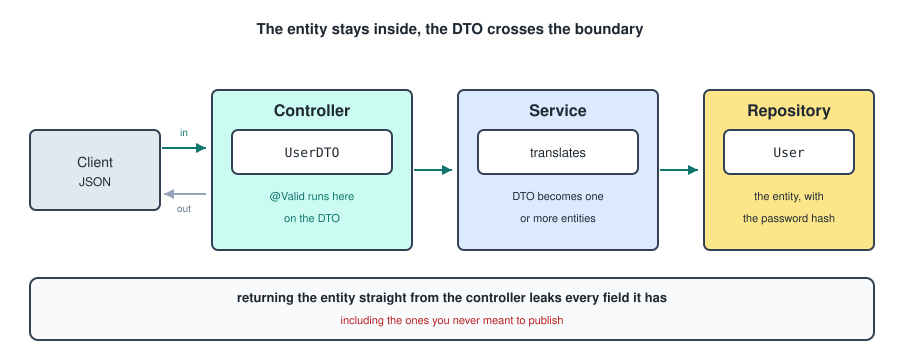

Why use them.

- **Data hiding**: expose only the necessary data to clients, hiding sensitive information or complex object structures.
- **Decoupling**: separate the internal data model from the external API representation.
- **Performance**: transferring only the required data improves network performance, especially in distributed systems.
- **Flexibility**: tailor DTOs to specific use cases, combining data from several entities or omitting unnecessary fields.

DTOs are usually kept in their own `dto` package next to the controller, and they act like a simpler form of the model classes. A record is the natural shape for one.

```java
public record UserDTO(
    @NotNull Long course,
    @NotNull Long lecturer
) {}
```

What happens.

- The controller takes a DTO as input.
- The validation happens on the DTO.
- The DTO is passed to the service, where it is translated into one or more models.
- A new DTO is sent back to the controller and ultimately to the client, optionally.

The strongest argument for them is the one your notes call data hiding. Returning a `User` entity from a controller publishes every field on it, including the password hash, and adding a field to the entity later silently adds it to your public API.

There is also a practical reason. Returning entities means Jackson walks your relationships while serialising, which either triggers a pile of lazy loads or loops forever between two entities that reference each other.

---

## Transactions

A transaction is a set of tasks which take place as a single, atomic, consistent, isolated, durable operation. By default, every database interaction, meaning every repository call, runs in its own transaction. At the end of a transaction the results are **committed**, meaning made permanent in the database.

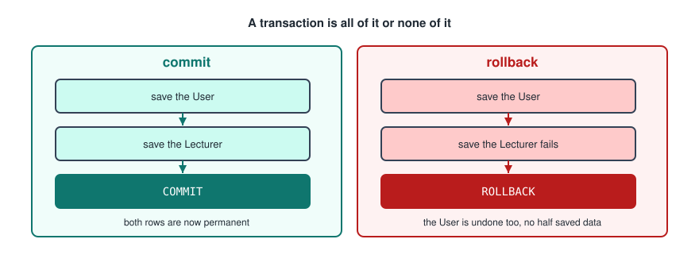

```java
@Transactional
public Lecturer addLecturer(LecturerInput lecturerInput) {
    User user = userService.signup(Role.LECTURER, lecturerInput.user());
    return lecturerRepository.save(new Lecturer(lecturerInput.expertise(), user));
}
```

In Spring you add `@Transactional` to wrap all the code from the start to the end of the annotated method in one transaction. Here a lecturer and a user are always committed together or not at all, which prevents dirty data.

Placing `@Transactional` at class level applies it to all public methods in the class, and you can use it at method level to override the class level settings. It is recommended in the service layer, as that is the layer right before objects are saved to the repository.

```java
@Service
@Transactional
public class LecturerService {}
```

### Why It Only Works From Outside

The `@Transactional` annotation only takes effect if the method is called from another class. The reason is how Spring implements it: at startup Spring wraps your bean in a **proxy**, and the proxy is what opens and closes the transaction before handing the call on to your real object. A call from another class goes through the proxy, but a call from inside the same class goes straight to `this` and skips the proxy entirely.

```java
@Service
public class PonyService {

    public void outer() {
        inner();          // no transaction, the proxy is bypassed
    }

    @Transactional
    public void inner() {}
}
```

The same reasoning explains two other rules. The method must be `public`, since a proxy cannot intercept a private method. And by default a transaction only rolls back on an unchecked exception, so a checked exception commits unless you say otherwise.

```java
@Transactional(rollbackFor = Exception.class)
```

### Programmatic Transactions

There are places where `@Transactional` cannot be used for technical reasons, such as a `@PostConstruct` method in a `DbInitializer`, because the proxy does not exist yet at that point in startup. There you use a programmatic transaction by injecting a `TransactionTemplate`.

```java
@PostConstruct
public void init() {
    transactionTemplate.executeWithoutResult(transactionStatus -> {
        clearAll();

        final var fullStack = courseRepository.save(new Course(
            "Full-stack development",
            "Learn how to build a full stack web application.",
            2,
            6
        ));
    });
}
```

---

## Transaction Isolation Levels

Isolation levels define how much one transaction is isolated from others, specifically how much it can see of changes made by another transaction that has not committed yet. Different levels balance consistency against performance.

There are mainly three problems that isolation levels prevent.

- **Dirty read**: a transaction reads uncommitted data from another transaction.
- **Non repeatable read**: a row is read twice and gives different values, because another transaction modified it in between.
- **Phantom read**: a query returns a different number of rows the second time, because another transaction inserted or deleted rows.

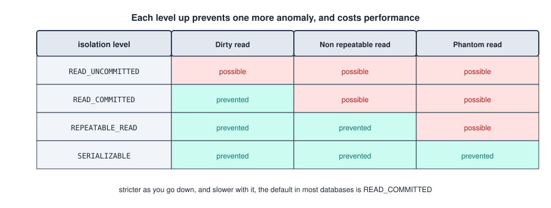

### READ_UNCOMMITTED

The lowest level. It allows dirty reads, so the current transaction can see the result of another uncommitted unit of work.

```java
@Transactional(isolation = Isolation.READ_UNCOMMITTED)
```

### READ_COMMITTED

Does not allow dirty reads, so only committed information can be read. It is the default in most databases, but you can also state it explicitly.

```java
@Transactional(isolation = Isolation.READ_COMMITTED)
```

### REPEATABLE_READ

Prevents dirty reads and non repeatable reads. Used when you want reads to be stable inside a transaction.

```java
@Transactional(isolation = Isolation.REPEATABLE_READ)
```

### SERIALIZABLE

Makes transactions behave as if they run one at a time. It prevents all the anomalies, which makes it the strongest and the slowest. The higher the isolation level, the lower the performance.

```java
@Transactional(isolation = Isolation.SERIALIZABLE)
```

---

## Propagation

When one method calls another and both are transactional, propagation decides whether the second one should start a new transaction or continue in the existing one.

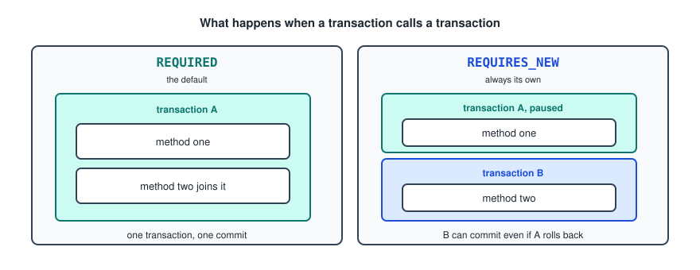

There are seven levels, and these are the two that matter.

### REQUIRED

If there is a transaction, join it. If not, start a new one. It reuses the caller's transaction, and creates one if needed. This is the default and by far the most common.

```java
@Transactional(propagation = Propagation.REQUIRED)
```

Because the two methods share one transaction, a failure anywhere rolls back everything.

### REQUIRES_NEW

Always start a new transaction, suspending the existing one. The caller's transaction is paused, the new one runs as a fully independent transaction, and when it finishes the caller's transaction resumes.

```java
@Transactional(propagation = Propagation.REQUIRES_NEW)
```

The use case is work that should survive the outer failure. Writing an audit log entry is the standard example: if the main operation rolls back, you still want the record that it was attempted.

---

## The Entity Lifecycle

When you use `@Transactional`, Spring creates a **persistence context**, also called the Entity Manager context. It is a unit of work that does four things.

- Tracks entities.
- Manages dirty checking, meaning it detects changes.
- Synchronises changes to the database during **flush**.
- Provides caching within the transaction, the first level cache.

When the transaction ends, the persistence context closes.

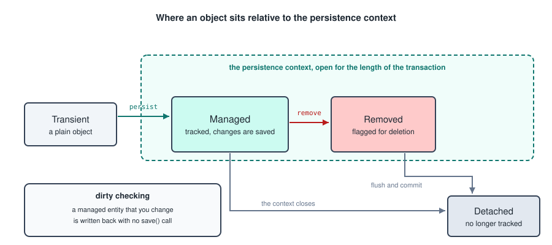

Four states describe where an entity sits in relation to that context.

- **Transient**: a new object that JPA does not know about. It is just a normal Java object, not associated with the database and not tracked. It becomes a new row on flush after being added with `persist`.
- **Managed**: a persistent object that JPA knows and is actively tracking. Its changes will be synced to the database on flush. A transient object becomes managed when it is saved.
- **Removed**: still managed, but flagged for deletion. It will be deleted from the database when the context flushes.
- **Detached**: no longer tracked by the persistence context. This happens when the transaction ends or the context closes, so after the context closes, every entity becomes detached.

### Dirty Checking

The consequence worth internalising is that inside a transaction you do not need to call `save` at all. A managed entity that you change is written back automatically when the context flushes.

```java
@Transactional
public void renamePony(Long id, String newName) {
    Pony pony = ponyRepository.findById(id).orElseThrow();
    pony.setName(newName);
    // no save call, the UPDATE happens at commit
}
```

That also means an accidental setter call on a managed entity writes to the database, which is a real source of surprise updates.

With the persistence context, transactions and the entity lifecycle in place, the behaviour of Spring Data JPA can be fully explained, and some operations can be simplified using cascades.

---

## Cascades

The focus here is persist cascading. When you save a parent entity, JPA automatically saves its child entities too, so you do not need to persist each child by hand. This is useful when entities have relationships.

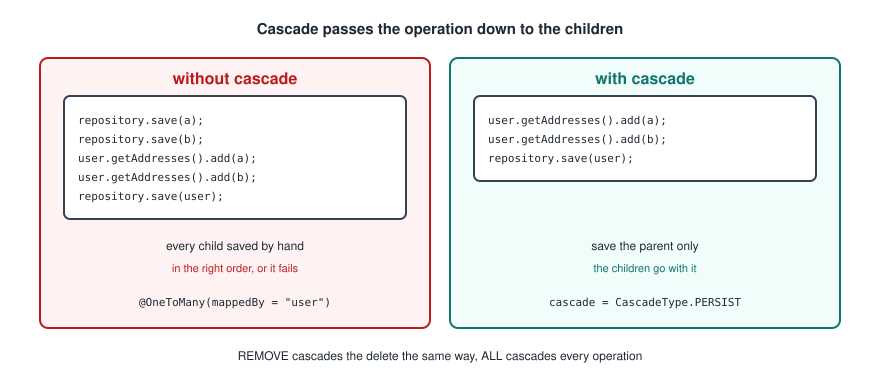

The domain model.

```java
@Entity
public class User {

    @Id
    @GeneratedValue
    private Long id;

    private String name;

    @OneToMany(mappedBy = "user", cascade = CascadeType.PERSIST)
    private List<Address> addresses = new ArrayList<>();
}
```

```java
@Entity
public class Address {

    @Id
    @GeneratedValue
    private Long id;

    private String street;

    @ManyToOne
    @JoinColumn(name = "user_id")
    private User user;
}
```

Without `PERSIST`, the children have to be saved first, in the right order.

```java
User user = new User("Ali");

Address a = new Address("Street 1");
Address b = new Address("Street 2");

addressRepository.save(a);
addressRepository.save(b);

user.getAddresses().add(a);
user.getAddresses().add(b);

userRepository.save(user);
```

With `PERSIST`, only the parent needs saving.

```java
User user = new User("Ali");

Address a = new Address("Street 1");
Address b = new Address("Street 2");

user.getAddresses().add(a);
user.getAddresses().add(b);

userRepository.save(user);
```

### The Cascade Types

- `PERSIST` saves the children when the parent is saved.
- `MERGE` reattaches detached children when the parent is merged.
- `REMOVE` deletes the children when the parent is deleted.
- `REFRESH` reloads the children when the parent is reloaded.
- `DETACH` detaches the children when the parent is detached.
- `ALL` applies all of the above.

`ALL` is convenient and worth thinking about before using, since it includes `REMOVE`. On a `@ManyToOne` pointing from an order to a customer, `CascadeType.ALL` means deleting one order deletes the customer, and with it every other order they had.

One detail your notes' version left out. The `mappedBy` and the matching `@ManyToOne` are what make this a normal one to many. A bare `@OneToMany(cascade = CascadeType.PERSIST)` with no `mappedBy` makes JPA create a third join table instead.

---

## Fetch Types

When you define a relationship between entities, you have to decide when the related entity should be loaded. That is what `FetchType` controls.

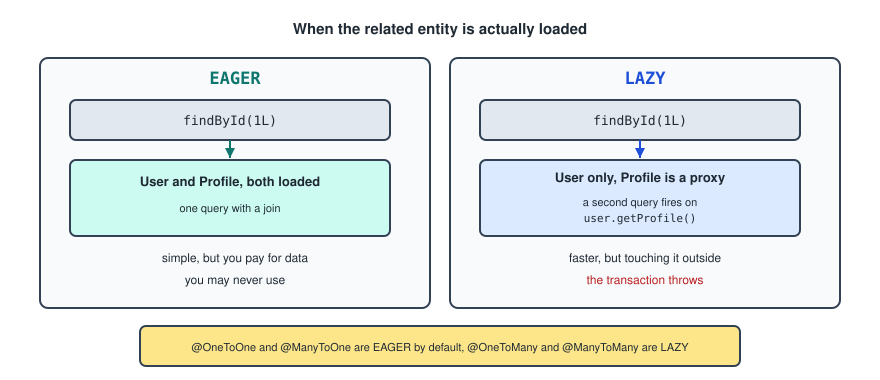

### EAGER

Retrieves the associated entity immediately. When you fetch the parent, Hibernate retrieves the related entity as well. Used when you always need the association. It simplifies access, since you never have to worry about it being unloaded, but it can cause performance problems if the related entity is large or if there are many relationships, because everything is fetched whether you use it or not.

```java
@Entity
public class User {

    @Id
    private Long id;

    @OneToOne(fetch = FetchType.EAGER)
    private Profile profile;    // fetched immediately with User
}
```

Querying for a user.

```java
User user = userRepository.findById(1L).get();
Profile profile = user.getProfile();   // already loaded
```

### LAZY

Only retrieves the associated entity when it is accessed. Initially only the parent is loaded, and the related entity is fetched on demand, typically through a proxy object. Used when the association is not always needed, which improves performance.

```java
@Entity
public class User {

    @Id
    private Long id;

    @OneToOne(fetch = FetchType.LAZY)
    private Profile profile;    // fetched only when accessed
}
```

```java
User user = userRepository.findById(1L).get();
Profile profile = user.getProfile();   // the fetch happens here, not before
```

Lazy loading only works while the entity is **managed**, meaning still inside the persistence context. Accessing a lazy property after the transaction has closed throws a `LazyInitializationException`.

That exception is the standard symptom of returning entities from a controller. The transaction ends in the service, then Jackson tries to serialise a lazy collection in the controller and there is no context left to load it from. Returning a DTO built inside the transaction avoids it entirely.

### The Defaults

- `@OneToOne` is **EAGER**.
- `@ManyToOne` is **EAGER**.
- `@OneToMany` is **LAZY**.
- `@ManyToMany` is **LAZY**.

The rule behind it: the "to one" sides are eager because loading one extra row is cheap, and the "to many" sides are lazy because loading an unknown number of rows is not.

### The N Plus 1 Problem

The most common performance bug in a JPA application comes straight out of this. Loading 100 stables and then reading `stable.getPonies()` on each one fires one query for the stables and then one more per stable, so 101 queries where 1 would do.

The fix is to ask for the association in the query.

```java
@Query("SELECT s FROM Stable s LEFT JOIN FETCH s.ponies")
List<Stable> findAllWithPonies();
```

Turning on `spring.jpa.show-sql=true` and counting the statements in the log is how you spot it.

---

## Orphan Removal

Orphan removal is an option, `orphanRemoval`, that you set on a relationship such as `@OneToOne` or `@OneToMany`. It automatically deletes a child entity when it is no longer referenced by its parent, which is useful when a child cannot exist without its parent.

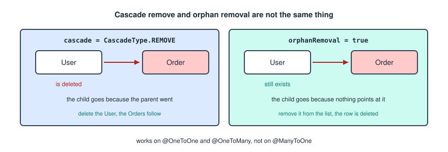

It is not the same as a cascade.

- `cascade = CascadeType.REMOVE` deletes the child when the parent itself is deleted.
- `orphanRemoval = true` deletes the child when the child is no longer referenced by the parent, even if the parent still exists.

It works on `@OneToOne` and `@OneToMany` relationships, not on `@ManyToOne`, which makes sense: the many side does not own the collection, so there is no reference for it to be dropped from.

Removing an order from the list deletes it from the database.

```java
@OneToMany(mappedBy = "user", cascade = CascadeType.ALL, orphanRemoval = true)
private List<Order> orders = new ArrayList<>();
```

```java
user.getOrders().remove(order);   // the row is deleted at commit
```

---

## Open API And Swagger

**Open API** is a specification, a blueprint for building and documenting REST APIs. It defines endpoints, parameters, responses and data models in a language agnostic way.

The Open API Specification defines a standard, language agnostic interface to HTTP APIs, which allows both humans and computers to discover and understand what a service can do without access to the source code or documentation, and without inspecting network traffic. When properly defined, a consumer can understand and interact with the remote service with a minimal amount of implementation logic.

**Swagger** is a set of tools built around the Open API specification. It lets you check how a backend behaves through a friendly interface, and you can try it at the [Swagger Pet Store Example](https://petstore.swagger.io/).

The dependency.

```xml
<dependency>
    <groupId>org.springdoc</groupId>
    <artifactId>springdoc-openapi-starter-webmvc-ui</artifactId>
    <version>2.8.4</version>
</dependency>
```

On the same level as the controller, service and repository directories, add a `config` directory containing a `SwaggerConfig` class, which loads and customises the interface.

```java
@Configuration
public class SwaggerConfig {

    @Bean
    public OpenAPI customOpenAPI() {
        return new OpenAPI()
                .info(new Info()
                        .title("title")
                        .version("1.0.0")
                        .description("API description"));
    }
}
```

Endpoints can then be annotated. There are several annotations available, and the two most important are `@Operation` and `@ApiResponse`.

```java
@Operation(summary = "Get course by id")
@ApiResponse(responseCode = "200", description = "The course")
@ApiResponse(responseCode = "404", description = "No course with that id")
@GetMapping("/{id}")
public Course getCourse(@PathVariable Long id) {
    return courseService.getCourse(id);
}
```

The interface is then at [localhost:3000/swagger-ui/index.html](http://localhost:3000/swagger-ui/index.html), adjusting the port to whatever `server.port` is set to.

Worth knowing that most of the documentation is generated from the code itself. Your method signatures, types and status codes are already read, so the annotations only add the parts that cannot be inferred, mainly the prose.

---

## CORS

**CORS**, **Cross Origin Resource Sharing**, is a browser security mechanism that controls whether a web application from one origin is allowed to access resources from another origin. By default, browsers block cross origin HTTP requests because of the Same Origin Policy.

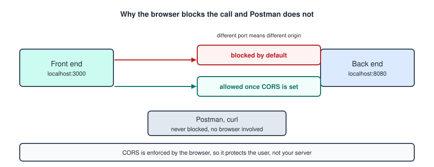

An origin is the combination of scheme, host and port, so `localhost:3000` and `localhost:8080` are different origins even though both are localhost. That is exactly the situation you are in while developing a Next front end against a Spring backend.

In Spring Boot, CORS specifies which origins, HTTP methods and headers are permitted to reach the backend API. When it is enabled, Spring sends response headers that tell the browser the request is allowed.

CORS mainly affects browser based requests and does not block tools like Postman or curl. This is worth being clear about: it is enforced by the browser, so it protects your users from other sites, and it is not a way to protect your server. Anyone can still call your API directly.

The annotation, added to a controller class.

```java
@RestController
@RequestMapping("/courses")
@CrossOrigin(origins = "http://localhost:3000")
public class CourseController {}
```

Or the global configuration, which is the better option since it lives in one place.

```java
@Configuration
public class CorsConfig implements WebMvcConfigurer {

    @Override
    public void addCorsMappings(CorsRegistry registry) {
        registry.addMapping("/**")
                .allowedOrigins("http://localhost:3000")
                .allowedMethods("GET", "POST", "PUT", "DELETE")
                .allowedHeaders("*")
                .allowCredentials(true);
    }
}
```

Two things to get right. The origin has to be the address the **front end** runs on, which is 3000 in these notes, not the backend's own port. And `allowCredentials(true)` is required for the browser to send cookies at all, so without it the `HttpOnly` JWT cookie in the next section never arrives. Note that `allowCredentials(true)` cannot be combined with `allowedOrigins("*")`, which is deliberate.

---

## Login And Session Security

It is important for the connection between the front end and the back end to be secure. These are the three measures that matter.

- **User signup**: transfer and store a password safely.
- **Authentication**: verify a user's identity.
- **Authorization**: check a user's permissions.

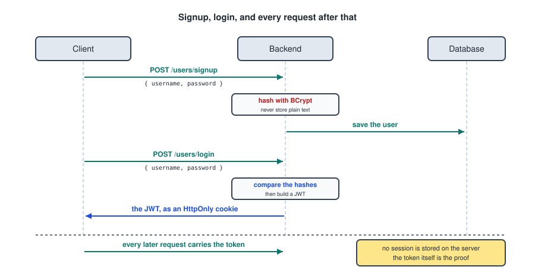

The dependencies, for Spring Security and for configuring the application as an OAuth 2 Resource Server. OAuth 2 is the industry standard protocol for authorization, enabling secure access to resources without sharing credentials.

```xml
<dependency>
    <groupId>org.springframework.boot</groupId>
    <artifactId>spring-boot-starter-oauth2-resource-server</artifactId>
</dependency>
<dependency>
    <groupId>org.springframework.boot</groupId>
    <artifactId>spring-boot-starter-security</artifactId>
</dependency>
```

### User Signup

A password should never be stored as plain text, since a data breach then hands over every account. The solution is to store a one way computed **hash**. Hashing is one sided and not reversible. Encryption is reversible, so an encrypted password can be recovered by whoever holds the key. That is why passwords are hashed and not encrypted.

The signup flow.

1. The client calls `POST /users/signup { username, password }`.
2. The backend checks whether the user already exists and whether the input is valid, then hashes the password using **BCrypt**.
3. The user is saved and a success message returned.

BCrypt specifically, rather than a general purpose hash like SHA-256, for two reasons. It is deliberately slow, which makes guessing millions of passwords expensive, and it salts each hash automatically, so two users with the same password get different stored values.

The encoder is registered as a bean.

```java
@Bean
public PasswordEncoder passwordEncoder() {
    return new BCryptPasswordEncoder();
}
```

Then used in the service.

```java
String hashed = passwordEncoder.encode(input.password());
```

### Authentication

Authentication is used for login, so that after a user has signed up and their credentials are safely stored, they can log back in.

The login flow.

1. The client calls `POST /users/login { username, password }`.
2. The backend looks up the user, hashes the incoming password and compares it with the stored hash using BCrypt. If they match, the backend generates a JWT.
3. The backend returns the user's name and role along with the token, which is stored as an `HttpOnly` cookie, which is more secure than `localStorage`.

The comparison is a method call rather than hashing and comparing strings yourself, because the salt is stored inside the hash.

```java
boolean ok = passwordEncoder.matches(rawPassword, user.getPasswordHash());
```

In Spring Security a token is generated at login to prove the user has been successfully authenticated. After verifying the username and password, the backend creates a JWT and sends it to the front end in an HTTP response, so the user does not need to send their credentials with every request, only the token.

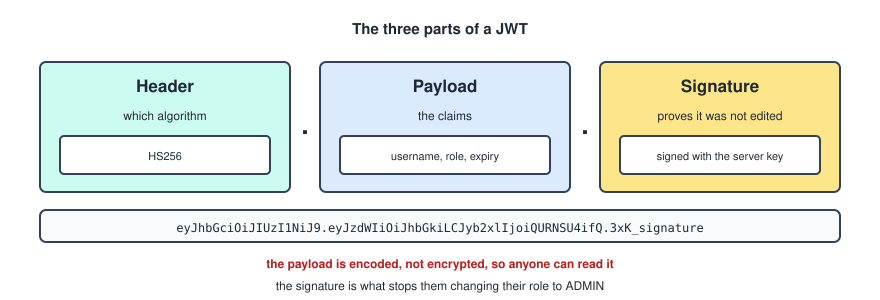

A JWT has three parts: a header, a payload and a signature. The user's name and role are stored in the payload, letting the backend authorize requests without querying the database each time. JWT based authentication is **stateless**, meaning the server stores no session data and can scale more easily.

The client must include the token with every request so the backend can verify who the user is. Storing it in an `HttpOnly` cookie improves security by preventing JavaScript from reading it, which reduces the damage an XSS attack can do.

The part people get wrong: the payload is **encoded, not encrypted**. Anyone holding the token can decode it and read the username and role. What stops them editing the role to `ADMIN` is the signature, which they cannot recompute without the server's secret key. So never put anything secret in the payload.

A logout endpoint exists so the backend can instruct the browser to remove the token. Since JWT authentication is stateless, the backend cannot log a user out by itself, and must explicitly clear the token stored on the client, usually by deleting the `HttpOnly` cookie.

### Authorization

Once a user is logged in, you decide what they can and cannot do based on their role. When a request arrives with a token, their role is checked to confirm they are allowed to make it.

Method level security has to be switched on in the security configuration.

```java
@Configuration
@EnableMethodSecurity
public class SecurityConfig {}
```

Then each endpoint carries its requirement.

```java
@PostMapping
@PreAuthorize("hasRole('ADMIN')")
public Student addStudent(@Valid @RequestBody StudentInput studentInput) {
    return studentService.addStudent(studentInput);
}
```

There is a naming convention hiding in `hasRole`. It prefixes the string with `ROLE_` before comparing, so `hasRole('ADMIN')` matches an authority stored as `ROLE_ADMIN`. If your authorities are stored as plain `ADMIN`, use `hasAuthority('ADMIN')` instead. Getting this wrong produces a 403 for a user who does have the right role, which is a confusing thing to debug.

Other expressions that come up.

```java
@PreAuthorize("hasAnyRole('ADMIN', 'LECTURER')")
@PreAuthorize("isAuthenticated()")
@PreAuthorize("#id == authentication.name")
```

### The Filter Chain

The piece that ties it together is the security configuration itself, which decides which paths are open and which require a token.

```java
@Bean
public SecurityFilterChain filterChain(HttpSecurity http) throws Exception {
    return http
            .csrf(csrf -> csrf.disable())
            .authorizeHttpRequests(auth -> auth
                    .requestMatchers("/users/signup", "/users/login").permitAll()
                    .requestMatchers("/swagger-ui/**", "/v3/api-docs/**").permitAll()
                    .anyRequest().authenticated())
            .oauth2ResourceServer(oauth -> oauth.jwt(Customizer.withDefaults()))
            .sessionManagement(session ->
                    session.sessionCreationPolicy(SessionCreationPolicy.STATELESS))
            .build();
}
```

The signup and login endpoints have to be `permitAll`, since a user cannot present a token before they have one. `STATELESS` says do not create server side sessions, which is the whole point of using JWTs. Disabling CSRF is normal for a stateless token API and would not be for a cookie and session based one.

---

## The Whole Picture

Where all of this ends up, in one line each.

- A request arrives at a controller, and the filter chain has already decided whether it is allowed in.
- `@Valid` checks the DTO, and a failure becomes a 400 through the exception handler rather than a 500.
- The controller hands a DTO to the service, which is where `@Transactional` opens a unit of work.
- Inside that transaction, entities are managed, so changes are written back without a `save` call and cascades reach the children.
- The repository turns method names into queries, and fetch types decide how much comes back with each one.
- The service builds a DTO from the entities before the transaction closes, and that is what the controller returns as JSON.
