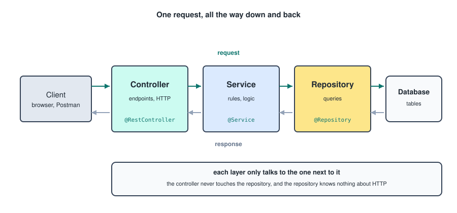
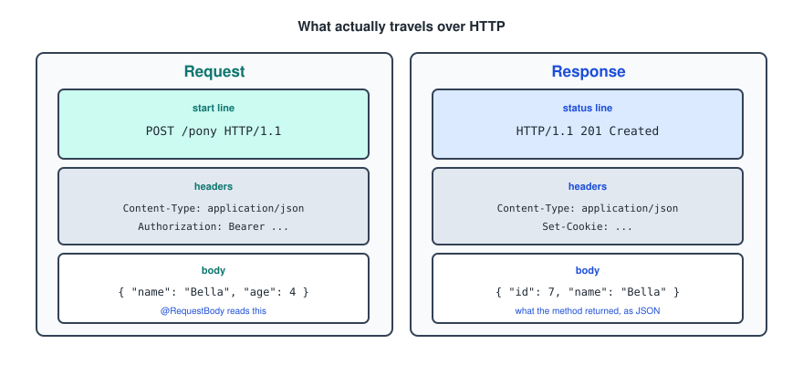
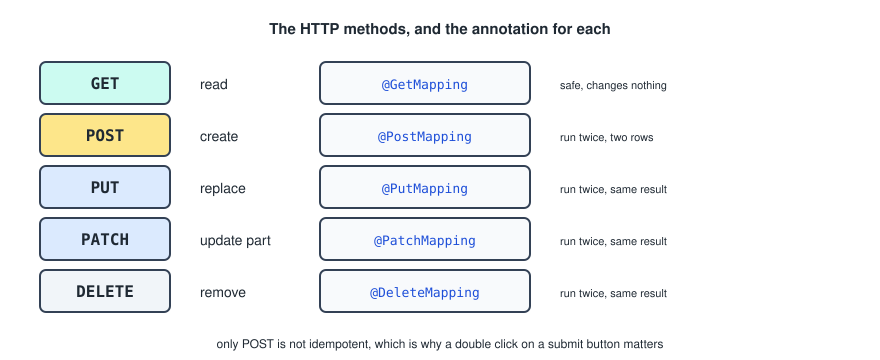
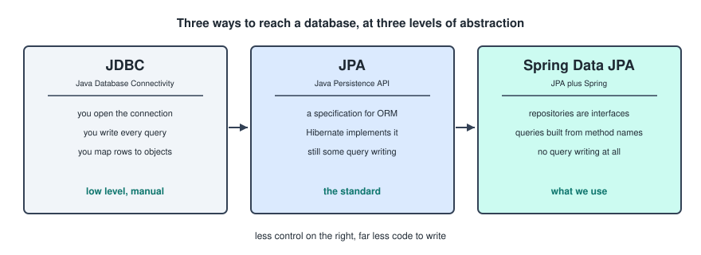
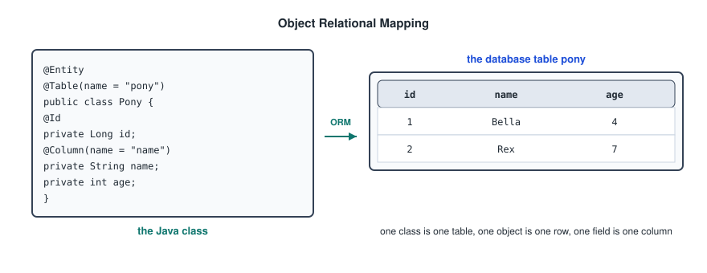
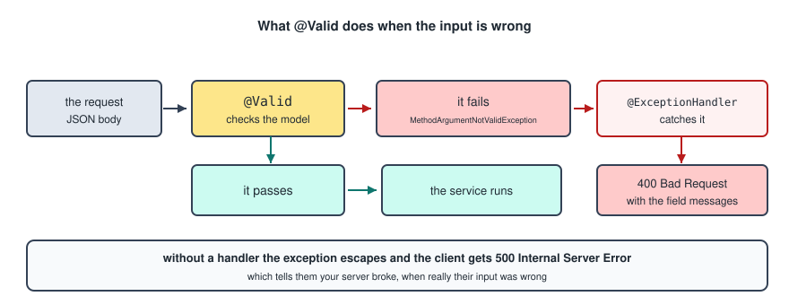
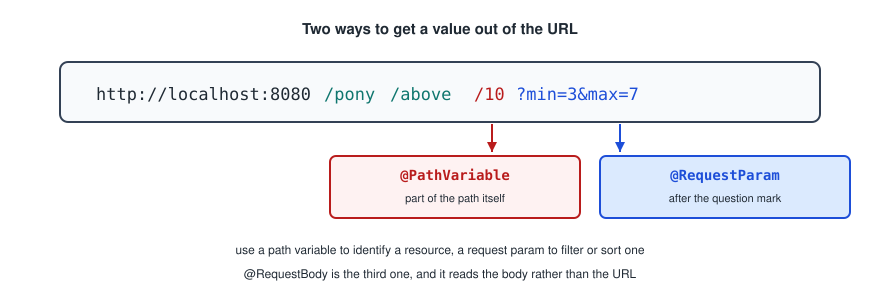
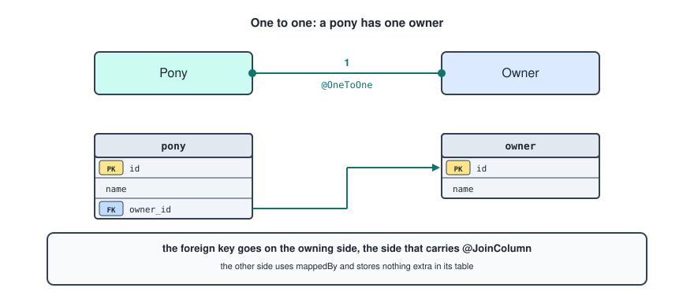
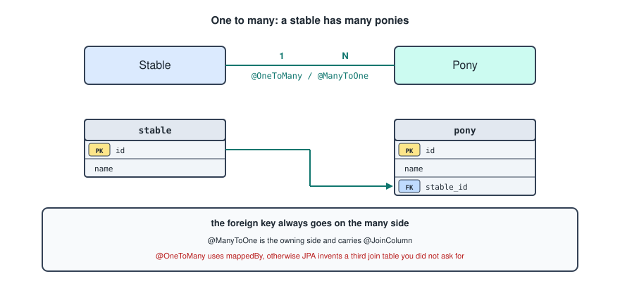
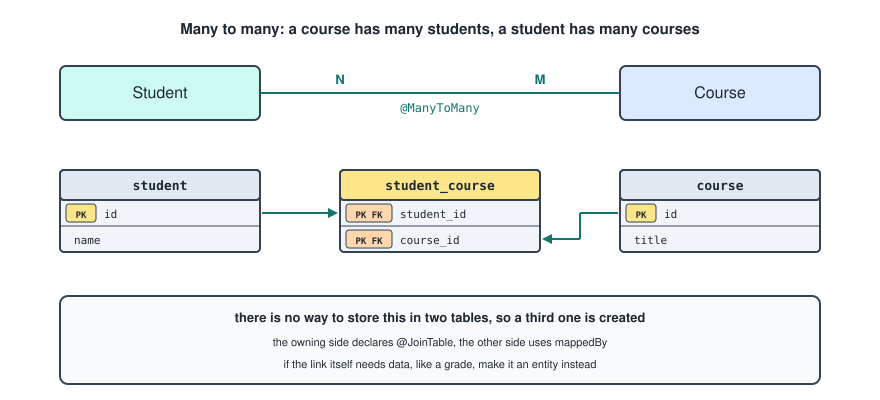

# Spring Boot

This is the other side of the front end notes. Everything the React file was fetching from has to be built by something, and this is that something.

The full set of operations a backend provides is called the **Application Programming Interface**, the API. The backend communicates with the frontend using the **Hyper Text Transfer Protocol**, HTTP.

Spring Boot is a backend framework that handles typical backend functionality, and it takes full control of your application. It works together with **Maven**, a build automation and dependency management tool for Java projects. One of the useful things Maven does is give you a folder structure to start from.

---

## The Layered Structure

Your backend is mainly divided into four directories, and the split is the single most important idea in the whole framework.



1. **Controller**: files here act like the door to the backend. The controller talks to browsers and Postman, and endpoints are defined here.
2. **Service**: files here hold the logic, meaning rules, calculations and validation. The service gives commands to the repository to store or retrieve data.
3. **Repository**: files here communicate with the database.
4. **Model**: files here represent your application classes, the building blocks of your application.

Each layer only talks to the one next to it. The controller never touches the repository, and the repository knows nothing about HTTP. That is what lets you swap the database without rewriting any endpoints, and test the service without starting a web server.

### Dependency Injection

The layers find each other through **dependency injection**. You never write `new PonyService()`. Spring creates one instance of each annotated class, keeps it in a container, and hands it to whoever declares it in their constructor.

```java
@RestController
public class PonyController {

    private final PonyService ponyService;

    public PonyController(PonyService ponyService) {
        this.ponyService = ponyService;
    }
}
```

That is **constructor injection**, and it is the recommended form. Since Spring 4.3 the `@Autowired` annotation is not needed when a class has a single constructor, which is why you will see it in older code and rarely in new code. Marking the field `final` is worth doing, because it makes it impossible to reassign the dependency later.

---

## The POM File

POM is short for **Project Object Model** and acts as your project's blueprint. The `pom.xml` file contains all the dependencies for your project, starting with the most obvious one, Spring Boot. It sits at the same level as the `src` directory.

```xml
<parent>
    <groupId>org.springframework.boot</groupId>
    <artifactId>spring-boot-starter-parent</artifactId>
    <version>3.4.1</version>
</parent>

<dependencies>
    <dependency>
        <groupId>org.springframework.boot</groupId>
        <artifactId>spring-boot-starter-web</artifactId>
    </dependency>
</dependencies>
```

Two things to notice. The `<parent>` block is what lets every dependency below it omit its `<version>`, because the parent already decided which versions work together. And anything called a **starter** is a bundle rather than a single library: `spring-boot-starter-web` pulls in Spring MVC, Jackson for JSON, and an embedded Tomcat server all at once.

---

## The Folder Structure

The recommended structure, which is what Maven and Spring Boot generate.

```
src
├── main
│   ├── java
│   │   ├── controller
│   │   │   └── PonyController
│   │   │
│   │   ├── model
│   │   │   └── Pony
│   │   │
│   │   ├── repository
│   │   │   └── PonyRepository
│   │   │
│   │   ├── service
│   │   │   └── PonyService
│   │   │
│   │   └── Application
│   │
│   └── resources
│       ├── application.properties
│       └── schema.sql
│
└── test
    └── java
        ├── PonyTest
        ├── PonyServiceTest
        └── IntegrationTest
```

`Application` has to sit at the top of the package tree, above the other folders. Spring scans downwards from wherever that class lives, so a controller in a package beside it rather than beneath it is simply never found.

---

## The Application Class

The Application file runs your whole backend. It converts your application into a Spring Boot backend, where Spring has full control.

```java
@SpringBootApplication
public class Application {
    public static void main(String[] args) {
        SpringApplication.run(Application.class, args);
    }
}
```

`@SpringBootApplication` is three annotations in one: it enables autoconfiguration, marks the class as a configuration source, and turns on component scanning of this package and everything below it.

When you run the application, the default address is [localhost:8080](http://localhost:8080). It changes only if you set `server.port` in `application.properties`, which the PostgreSQL configuration below does.

---

## HTTP Requests And Responses

Both a request and a response consist of a header section and a body. The headers are key value pairs carrying metadata, and the body contains the actual data in JSON format, as objects or arrays.



### The Methods



The word that describes the difference is **idempotent**, meaning running it twice has the same effect as running it once. Every method here is idempotent except POST, which creates something new each time. That is why a double click on a submit button can create two records, and why a retried DELETE is harmless.

### Status Codes

The response carries a status code, and returning the right one is part of writing a usable API.

- `200 OK` for a successful GET or PUT.
- `201 Created` for a successful POST.
- `204 No Content` for a successful DELETE.
- `400 Bad Request` when the input was wrong.
- `401 Unauthorized` when there is no valid login.
- `403 Forbidden` when there is a login but not the right role.
- `404 Not Found` when the thing does not exist.
- `500 Internal Server Error` when your code threw something you did not handle.

The distinction between 400 and 500 matters. A 400 says the client made a mistake, a 500 says you did.

---

## JPA And Databases

There are three ways to link backend code to a database: JDBC, JPA, and Spring Data JPA.



**JDBC** stands for **Java Database Connectivity** and is the manual, low level way. It requires you to write queries by hand in the repository layer.

**JPA** stands for **Java Persistence API** and is the more modern, automated, high level way. JPA alone still requires some query writing, but paired with Spring Boot it requires none.

Spring Data JPA translates object operations into database queries behind the scenes. The mapping of Java objects to database tables is called **ORM**, **Object Relational Mapping**. An ORM library works as a bridge between a Java application, with its classes and objects, and a relational database, with its tables and records. Its purpose is to automatically sync operations done on Java objects to the database.



One naming detail worth keeping straight. JPA is the specification, and **Hibernate** is the implementation of it that Spring Boot ships by default. When an error message mentions Hibernate, it is talking about the thing doing the actual work behind JPA.

### H2, The In Memory Database

Spring Data JPA works with many databases. `H2` is an in memory one: it runs and stops with the application, and loses all its data when the application stops. That makes it ideal for tests and for a first project, and useless for anything real.

The dependency in `pom.xml`.

```xml
<dependency>
    <groupId>com.h2database</groupId>
    <artifactId>h2</artifactId>
</dependency>
```

The properties in `application.properties`.

```properties
spring.datasource.url=jdbc:h2:mem:pony
spring.datasource.username=user
spring.datasource.password=password

spring.h2.console.enabled=true
spring.h2.console.path=/h2

spring.sql.init.mode=always

spring.jpa.database-platform=org.hibernate.dialect.H2Dialect
spring.jpa.hibernate.ddl-auto=none
spring.jpa.show-sql=true
```

The H2 console is a real browser interface to the database, reachable at `/h2` while the app runs, which is the fastest way to see what actually got saved.

### PostgreSQL, A Real Database

JPA can also be used with `postgresql`, which is an actual database and more useful than an in memory one.

The dependency in `pom.xml`.

```xml
<dependency>
    <groupId>org.postgresql</groupId>
    <artifactId>postgresql</artifactId>
    <version>42.7.3</version>
</dependency>
```

The properties in `application.properties`.

```properties
spring.application.name=name
server.port=3000

spring.jpa.hibernate.ddl-auto=create-drop
spring.jpa.show-sql=true
spring.jpa.properties.hibernate.dialect=org.hibernate.dialect.PostgreSQLDialect
spring.sql.init.mode=always

spring.datasource.url=jdbc:postgresql://localhost:5432/name
spring.datasource.username=username
spring.datasource.password=password
```

### The ddl-auto Setting

This is the property that decides who owns the table structure, and it causes more confusion than any other line in the file.

- `none` means Hibernate touches nothing, and your `schema.sql` is the source of truth.
- `create-drop` means Hibernate builds the tables from your entities at startup and drops them at shutdown.
- `update` means Hibernate adds anything missing and never removes anything.
- `validate` means Hibernate only checks that the entities match the existing tables.

There is a trap in combining `create-drop` with `spring.sql.init.mode=always`. By default the `schema.sql` and `data.sql` scripts run **before** Hibernate creates the tables, so your inserts fail against tables that do not exist yet. If you want both, add this line.

```properties
spring.jpa.defer-datasource-initialization=true
```

Otherwise pick one: either Hibernate generates the schema, or your SQL file does.

---

## The Model Directory

The model directory contains all the domain model classes. This is also where Hibernate Validation happens. Hibernate Validator is a validation framework that is very useful for simple validation.

```java
@Entity
@Table(name = "pony")
public class Pony {

    @Id
    @GeneratedValue(strategy = GenerationType.IDENTITY)
    private Long id;

    @Column(name = "name")
    @NotBlank(message = "Name may not be empty")
    private String name;

    @Column(name = "age")
    @Positive(message = "Age must be positive")
    private int age;

    // Database constructor
    protected Pony() {}

    // Normal constructor
    public Pony(String name, int age) {
        this.name = name;
        this.age = age;
    }

    public void setName(String name) {
        this.name = name;
    }

    public String getName() {
        return name;
    }

    public void setAge(int age) {
        this.age = age;
    }

    public int getAge() {
        return age;
    }
}
```

### The JPA Annotations

- `@Entity` tells JPA to manage this class, and it will look for a table that corresponds to it.
- `@Table` specifies the table name, which would be the class name by default.
- `@Id` and `@GeneratedValue` generate an id for each instance of the class.
- `@Column` specifies the column name, which would be the field name by default. When relating code to a database, fields translate to columns.
- `@Transient` on a field says it should not be mapped in the database.

The empty `protected` constructor is not decoration. JPA has to be able to create an instance before it has any values to put in it, so every entity needs a no argument constructor. It is `protected` rather than `public` so your own code cannot accidentally build an empty Pony.

Also worth knowing: use `Long` rather than `long` for the id. The wrapper can be `null`, which is how JPA tells a brand new object apart from one that came out of the database.

### Hibernate Validator

The dependency, which in a Spring Boot project should be the starter rather than the library on its own.

```xml
<dependency>
    <groupId>org.springframework.boot</groupId>
    <artifactId>spring-boot-starter-validation</artifactId>
</dependency>
```

The annotations.

- `@NotNull` validates that the annotated property is not null.
- `@AssertTrue` validates that the property is true.
- `@Size` validates that the property has a size between the `min` and `max` attributes. Applies to String, Collection, Map and array properties.
- `@Min` validates that the property is no smaller than the value, for example `@Min(value = 40, message = "pony must be larger than 40 cm")`.
- `@Max` validates that the property is no larger than the value, for example `@Max(value = 147, message = "pony must be smaller than 147 cm")`.
- `@Email` validates that the property is a valid email address.
- `@NotEmpty` validates that the property is not null or empty. Applies to String, Collection, Map and array values.
- `@NotBlank` applies only to text, and validates that the property is not null or whitespace.
- `@Positive` and `@Negative` apply to numeric values and validate that they are strictly positive or strictly negative. For the versions that allow zero there are separate annotations, `@PositiveOrZero` and `@NegativeOrZero`.

### How Validation Is Triggered

In the controller, `@Valid` tells Spring to check the input against the validator annotations in the relevant model class.



If the validation fails, a `MethodArgumentNotValidException` is thrown, and it can be handled in the controller to return a 400 with a message instead of a 500 with a stack trace.

Nothing is validated without `@Valid`. The annotations on the model do nothing on their own, which is the most common reason validation appears not to work.

### The Schema Files

The table for an `h2` database.

```sql
CREATE TABLE PONY (
    ID INT PRIMARY KEY AUTO_INCREMENT,
    NAME VARCHAR(255) NOT NULL,
    AGE INT
);
```

The same table for `postgresql`.

```sql
CREATE TABLE PONY (
    ID BIGSERIAL PRIMARY KEY,
    NAME VARCHAR(255) NOT NULL,
    AGE INT
);
```

Your notes had `AGE SERIAL` in the Postgres version. `SERIAL` is an auto incrementing integer meant for keys, so every pony would have been given a sequence number instead of an age. It should be a plain `INT`.

---

## The Controller

The controller files live in the controller directory and act as layer 1 of the layered structure.

```java
@RestController
@RequestMapping("/pony")
public class PonyController {

    private final PonyService ponyService;

    public PonyController(PonyService ponyService) {
        this.ponyService = ponyService;
    }

    // GET /pony
    @GetMapping
    public List<Pony> allPonies() {
        return ponyService.allPonies();
    }

    // GET a path variable          /pony/Bella
    @GetMapping("/{name}")
    public Pony getPonyByName(@PathVariable String name) {
        return ponyService.getPonyByName(name);
    }

    // GET a path variable          /pony/above/10
    @GetMapping("/above/{age}")
    public List<Pony> getPoniesAboveAge(@PathVariable int age) {
        return ponyService.getPoniesAboveAge(age);
    }

    // GET request params           /pony/between?min=3&max=7
    @GetMapping("/between")
    public List<Pony> getPoniesBetweenAges(@RequestParam int min, @RequestParam int max) {
        return ponyService.getPoniesBetweenAges(min, max);
    }

    // POST /pony
    @PostMapping
    public Pony addPony(@Valid @RequestBody Pony pony) {
        return ponyService.addPony(pony);
    }

    // PUT /pony/Bella
    @PutMapping("/{name}")
    public void updatePony(@PathVariable String name, @Valid @RequestBody Pony updatedPony) {
        ponyService.updatePony(name, updatedPony);
    }

    // DELETE /pony/Bella
    @DeleteMapping("/{name}")
    public void removePony(@PathVariable String name) {
        ponyService.removePony(name);
    }

    // One to one endpoint to add an owner to a pony
    @PostMapping("/{name}/owner")
    public Pony addOwner(@PathVariable String name, @Valid @RequestBody Owner owner) {
        return ponyService.addOwner(name, owner);
    }
}
```

### The Annotations

- `@RestController` tells Spring this is a controller, so dependencies should be injected and return values should be serialised to JSON.
- `@RequestMapping("/pony")` sets the base path for every endpoint in the class, so `@GetMapping("/{name}")` becomes `/pony/{name}`.
- `@Autowired` tells Spring to inject the dependency, though in newer versions it is no longer needed on a single constructor.

`@RestController` is `@Controller` plus `@ResponseBody`. The second half is what turns a returned `Pony` object into a JSON response body instead of trying to find an HTML template called "Pony".

### Getting Values Out Of The Request

Three annotations, three places to read from.



- `@PathVariable` reads a segment of the path itself, and is for identifying a resource.
- `@RequestParam` reads a value after the question mark, and is for filtering, sorting or paging.
- `@RequestBody` reads the JSON body and deserialises it into an object.

### Returning A Status Code

The controller above returns objects directly, which always produces a 200. To control the status, return a `ResponseEntity`.

```java
@PostMapping
public ResponseEntity<Pony> addPony(@Valid @RequestBody Pony pony) {
    Pony saved = ponyService.addPony(pony);
    return ResponseEntity.status(HttpStatus.CREATED).body(saved);
}
```

Or annotate the method when the status is always the same.

```java
@PostMapping
@ResponseStatus(HttpStatus.CREATED)
public Pony addPony(@Valid @RequestBody Pony pony) {
    return ponyService.addPony(pony);
}
```

---

## Handling Errors

Exception handlers turn a thrown exception into a sensible response instead of a 500 with a stack trace.

```java
@ResponseStatus(HttpStatus.BAD_REQUEST)
@ExceptionHandler({RuntimeException.class})
public Map<String, String> handleRuntimeException(RuntimeException e) {
    Map<String, String> errors = new HashMap<>();
    errors.put("error", e.getMessage());
    return errors;
}

@ResponseStatus(HttpStatus.BAD_REQUEST)
@ExceptionHandler(IllegalArgumentException.class)
public Map<String, String> handleIllegalArgument(IllegalArgumentException e) {
    Map<String, String> errors = new HashMap<>();
    errors.put("error", e.getMessage());
    return errors;
}

@ResponseStatus(HttpStatus.BAD_REQUEST)
@ExceptionHandler({MethodArgumentNotValidException.class})
public Map<String, String> handleValid(MethodArgumentNotValidException e) {
    Map<String, String> errors = new HashMap<>();
    for (FieldError error : e.getFieldErrors()) {
        errors.put(error.getField(), error.getDefaultMessage());
    }
    return errors;
}
```

The validation handler is the useful one. It walks the field errors and returns a map of field name to message, which is exactly the shape a front end form needs to put the message under the right input.

### Handling Them Once, Globally

Written like the above, those three methods only apply to the controller they are in, so a second controller needs its own copies. Moving them into a class annotated `@RestControllerAdvice` applies them across every controller in the application.

```java
@RestControllerAdvice
public class GlobalExceptionHandler {

    @ResponseStatus(HttpStatus.BAD_REQUEST)
    @ExceptionHandler(MethodArgumentNotValidException.class)
    public Map<String, String> handleValid(MethodArgumentNotValidException e) {
        Map<String, String> errors = new HashMap<>();
        for (FieldError error : e.getFieldErrors()) {
            errors.put(error.getField(), error.getDefaultMessage());
        }
        return errors;
    }
}
```

One thing to be careful about. Catching `RuntimeException` and returning 400 means every unexpected bug in your code is reported to the client as their mistake. It is better to define your own exceptions and handle those specifically.

```java
public class PonyNotFoundException extends RuntimeException {
    public PonyNotFoundException(String name) {
        super("No pony called " + name);
    }
}
```

```java
@ResponseStatus(HttpStatus.NOT_FOUND)
@ExceptionHandler(PonyNotFoundException.class)
public Map<String, String> handleNotFound(PonyNotFoundException e) {
    return Map.of("error", e.getMessage());
}
```

---

## The Service

The service files live in the service directory and act as layer 2 of the layered structure.

```java
@Service
public class PonyService {

    private final PonyRepository ponyRepository;
    private final OwnerRepository ownerRepository;

    public PonyService(PonyRepository ponyRepository, OwnerRepository ownerRepository) {
        this.ponyRepository = ponyRepository;
        this.ownerRepository = ownerRepository;
    }

    // GET
    public List<Pony> allPonies() {
        return ponyRepository.findAll();                 // built in JPA method
    }

    public Pony getPonyByName(String name) {
        Pony pony = ponyRepository.findByName(name);
        if (pony == null) {
            throw new PonyNotFoundException(name);
        }
        return pony;
    }

    public List<Pony> getPoniesAboveAge(int age) {
        if (age < 0) {
            throw new IllegalArgumentException("Age can't be less than 0");
        }
        return ponyRepository.findByAgeGreaterThan(age);
    }

    public List<Pony> getPoniesBetweenAges(int min, int max) {
        if (min < 0) {
            throw new IllegalArgumentException("Age can't be less than 0");
        }
        if (max > 100) {
            throw new IllegalArgumentException("Age can't be greater than 100");
        }
        return ponyRepository.findByAgeBetween(min, max);
    }

    // POST
    public Pony addPony(Pony pony) {
        return ponyRepository.save(pony);
    }

    // PUT
    public void updatePony(String name, Pony updatedPony) {
        Pony pony = getPonyByName(name);
        pony.setAge(updatedPony.getAge());
        ponyRepository.save(pony);
    }

    // DELETE
    public void removePony(String name) {
        Pony pony = getPonyByName(name);
        ponyRepository.delete(pony);
    }
}
```

`@Service` tells Spring this is a service, so it becomes a managed bean and its dependencies are injected.

The null check in `getPonyByName` is worth having. A derived query that finds nothing returns `null`, and without the check the next line calls a method on it and the client gets a 500 caused by a `NullPointerException` rather than a clear 404.

---

## The Repository

The repository files live in the repository directory and act as layer 3 of the layered structure.

```java
public interface PonyRepository extends JpaRepository<Pony, Long> {

    Pony findByName(String name);

    List<Pony> findByAgeGreaterThan(int age);

    List<Pony> findByAgeBetween(int min, int max);
}
```

Notice there is no implementation anywhere. Spring Data reads the method names at startup, works out what query each one means, and generates a class that implements the interface. The two type parameters on `JpaRepository` are the entity and the type of its id.

`@Repository` is what your notes had on it, and it is harmless, but it is not what makes this work. Extending `JpaRepository` is. The annotation is only required on repository classes you write yourself.

### The Built In Methods

These come from `JpaRepository` and need no declaration.

- `findAll()`
- `findById(id)`
- `save(entity)`
- `delete(entity)` and `deleteById(id)`
- `count()`
- `existsById(id)`

`findById` returns an `Optional<Pony>`, not a `Pony`, because the row may not exist. That forces you to decide what happens when it is missing.

```java
Pony pony = ponyRepository.findById(id)
        .orElseThrow(() -> new PonyNotFoundException(id));
```

### Building Your Own Query Methods

The method name is the query. It reads as `findBy` plus a field name plus an optional keyword.

- `find`, `count`, `exists`, `delete` to start the name
- `top` and `first` to limit the results, as in `findTop3ByOrderByAgeDesc`
- `StartingWith`, `EndingWith`, `Containing` for text
- `Equals`, `Not`, `IsNot`
- `GreaterThan`, `LessThan`, `Between`
- `IsNull`, `IsNotNull`
- `And`, `Or` to combine, as in `findByNameAndAge`
- `OrderBy` to sort, as in `findByAgeGreaterThanOrderByNameAsc`

If the name gets long enough to be unreadable, write the query yourself instead.

```java
@Query("SELECT p FROM Pony p WHERE p.age > :age AND p.name LIKE %:text%")
List<Pony> search(@Param("age") int age, @Param("text") String text);
```

That is **JPQL**, which queries your entities and their fields rather than tables and columns. Note it says `Pony` and `p.name`, the Java names, not `pony` and `name`.

---

## Relationships

An entity on its own is rare. Most of the work is in linking them, and there are three shapes to know. The vocabulary matters here: the **owning side** is the side that holds the foreign key and the side JPA looks at when deciding what to write. The other side is the **inverse side** and is marked with `mappedBy`.

### One To One

A pony has one owner, and that owner has one pony.



```java
@Entity
public class Pony {

    @Id
    @GeneratedValue(strategy = GenerationType.IDENTITY)
    private Long id;

    private String name;

    @OneToOne(cascade = CascadeType.ALL)
    @JoinColumn(name = "owner_id")
    private Owner owner;
}
```

```java
@Entity
public class Owner {

    @Id
    @GeneratedValue(strategy = GenerationType.IDENTITY)
    private Long id;

    private String name;

    @OneToOne(mappedBy = "owner")
    private Pony pony;
}
```

`@JoinColumn` names the foreign key column and marks this as the owning side. `mappedBy = "owner"` on the other side says the field called `owner` over in `Pony` is what maps this relationship, so do not create a second column for it.

The corresponding table.

```sql
CREATE TABLE OWNER (
    ID BIGSERIAL PRIMARY KEY,
    NAME VARCHAR(255) NOT NULL
);

CREATE TABLE PONY (
    ID BIGSERIAL PRIMARY KEY,
    NAME VARCHAR(255) NOT NULL,
    AGE INT,
    OWNER_ID BIGINT UNIQUE REFERENCES OWNER(ID)
);
```

The `UNIQUE` is what makes it one to one rather than many to one at the database level.

### One To Many

A stable has many ponies, and each pony is in one stable.



```java
@Entity
public class Stable {

    @Id
    @GeneratedValue(strategy = GenerationType.IDENTITY)
    private Long id;

    private String name;

    @OneToMany(mappedBy = "stable", cascade = CascadeType.ALL, orphanRemoval = true)
    private List<Pony> ponies = new ArrayList<>();

    public void addPony(Pony pony) {
        ponies.add(pony);
        pony.setStable(this);
    }
}
```

```java
@Entity
public class Pony {

    @Id
    @GeneratedValue(strategy = GenerationType.IDENTITY)
    private Long id;

    private String name;

    @ManyToOne
    @JoinColumn(name = "stable_id")
    private Stable stable;
}
```

The foreign key always goes on the many side, because a column holds one value and a pony has one stable. `@ManyToOne` is therefore the owning side, and `@OneToMany` is the inverse side with `mappedBy`.

Leaving out `mappedBy` is the classic mistake. JPA then assumes neither side owns the other and quietly creates a third join table called `stable_ponies`, which is almost never what you wanted.

The `addPony` helper exists because JPA only writes what the owning side says. Adding a pony to the list without also setting `pony.setStable(this)` changes nothing in the database.

The table.

```sql
CREATE TABLE STABLE (
    ID BIGSERIAL PRIMARY KEY,
    NAME VARCHAR(255) NOT NULL
);

CREATE TABLE PONY (
    ID BIGSERIAL PRIMARY KEY,
    NAME VARCHAR(255) NOT NULL,
    AGE INT,
    STABLE_ID BIGINT REFERENCES STABLE(ID)
);
```

### Many To Many

A course has many students, and a student takes many courses.



```java
@Entity
public class Student {

    @Id
    @GeneratedValue(strategy = GenerationType.IDENTITY)
    private Long id;

    private String name;

    @ManyToMany
    @JoinTable(
        name = "student_course",
        joinColumns = @JoinColumn(name = "student_id"),
        inverseJoinColumns = @JoinColumn(name = "course_id")
    )
    private Set<Course> courses = new HashSet<>();
}
```

```java
@Entity
public class Course {

    @Id
    @GeneratedValue(strategy = GenerationType.IDENTITY)
    private Long id;

    private String title;

    @ManyToMany(mappedBy = "courses")
    private Set<Student> students = new HashSet<>();
}
```

Here the third table is unavoidable, since there is no way to store this in two tables. `@JoinTable` on the owning side names it and names both of its foreign key columns.

The table.

```sql
CREATE TABLE STUDENT_COURSE (
    STUDENT_ID BIGINT REFERENCES STUDENT(ID),
    COURSE_ID BIGINT REFERENCES COURSE(ID),
    PRIMARY KEY (STUDENT_ID, COURSE_ID)
);
```

`Set` rather than `List` is the usual choice for a many to many, because the pair of ids is the primary key, so a duplicate is impossible anyway and a `Set` says that in the code.

One decision to make early. If the link itself needs data, like the grade a student got in a course, a plain `@ManyToMany` cannot hold it. Turn the join table into an entity of its own with two `@ManyToOne` relationships, and put the grade on it.

```java
@Entity
public class Enrolment {

    @EmbeddedId
    private EnrolmentId id;

    @ManyToOne
    private Student student;

    @ManyToOne
    private Course course;

    private int grade;
}
```

### Avoiding Infinite JSON

Two entities pointing at each other will serialise forever: the stable lists its ponies, each pony has its stable, which lists its ponies. Jackson follows that until it gives up.

The quick fix is a pair of annotations.

```java
@JsonManagedReference    // on the parent side
@JsonBackReference       // on the child side
```

The better fix is to not return entities from the controller at all, and return DTOs instead, which is where the advanced notes pick up.
