# Computer Systems

This file covers how a computer counts, what the parts inside the case actually do, how drives and file systems are laid out, how the operating system shares the processor between programs, how memory is organised, and the bit of electricity you need to know to not blow anything up.

---

## Number Systems

A computer only ever stores ones and zeros, so everything else is just a different way of writing the same value. Four bases come up all the time.

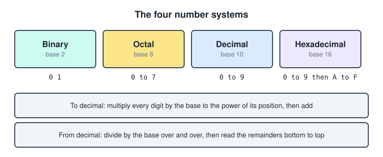

- **Binary**, base 2, digits `0` and `1`.
- **Octal**, base 8, digits `0` to `7`.
- **Decimal**, base 10, digits `0` to `9`.
- **Hexadecimal**, base 16, digits `0` to `9` and then `A` to `F`.

Two words you need before anything else.

- A **bit** is one single `0` or `1`. It is the smallest unit there is.
- A **byte** is 8 bits, which gives you 256 combinations, so the values `0` to `255`.

Octal and hexadecimal exist because writing long strings of bits by hand is painful. One octal digit stands for exactly 3 bits and one hex digit stands for exactly 4 bits, so they shorten binary without changing it.

---

## Binary To Decimal

Every position in a binary number is worth a power of two, starting at 2 to the power of 0 on the right. Multiply each bit by its position value and add everything up.

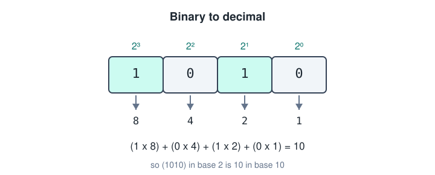

So `1010` is `(1 x 8) + (0 x 4) + (1 x 2) + (0 x 1)`, which is `10`.

The same trick works for any base. For octal the positions are powers of 8, for hexadecimal they are powers of 16.

---

## Decimal To Binary

Going the other way you divide instead of multiply. Divide by the base over and over, write down the remainder each time, and stop when the division gives 0.

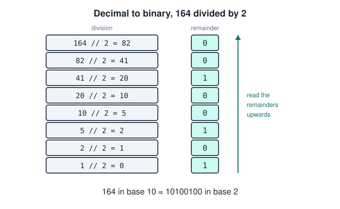

The remainders come out backwards, so you read them from the bottom up. That gives `164` in decimal as `10100100` in binary.

Same idea for the other bases, only the divisor changes.

- Binary, keep dividing by 2.
- Octal, keep dividing by 8.
- Hexadecimal, keep dividing by 16.

---

## Binary To Octal And Hexadecimal

These two are the easy ones because you never touch decimal at all. You just chop the binary into groups and translate each group on its own.

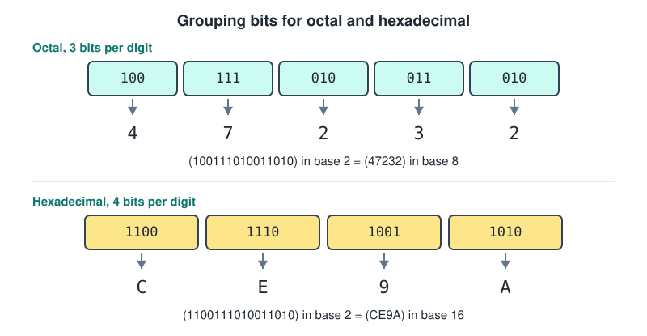

Group from the right, and pad the leftmost group with zeros if it comes up short.

For octal you take 3 bits at a time.

| Binary | Octal |
| --- | --- |
| `000` | 0 |
| `001` | 1 |
| `010` | 2 |
| `011` | 3 |
| `100` | 4 |
| `101` | 5 |
| `110` | 6 |
| `111` | 7 |

For hexadecimal you take 4 bits at a time.

| Binary | Hex | Binary | Hex |
| --- | --- | --- | --- |
| `0000` | 0 | `1000` | 8 |
| `0001` | 1 | `1001` | 9 |
| `0010` | 2 | `1010` | A |
| `0011` | 3 | `1011` | B |
| `0100` | 4 | `1100` | C |
| `0101` | 5 | `1101` | D |
| `0110` | 6 | `1110` | E |
| `0111` | 7 | `1111` | F |

You will see prefixes written in front of these so nobody has to guess which base they are looking at.

- `0` in front of an octal number, like `047232`.
- `0x` in front of a hexadecimal number, like `0xCE9A`.
- `0b` in front of a binary number, like `0b1010`.

---

## Adding Binary Numbers

Addition works exactly like it does in decimal, you just run out of digits much sooner. There are only four cases to remember.

```text
0 + 0 = 0
0 + 1 = 1
1 + 1 = 10      write 0, carry 1
1 + 1 + 1 = 11  write 1, carry 1
```

The carry moves one column to the left, same as carrying a ten in normal addition. Worked out on a full example.

```text
    1 1        carries
    1 0 1 1     (11)
  +   1 1 0      (6)
  ---------
  1 0 0 0 1     (17)
```

---

## Subtracting Binary Numbers

There are two ways to do this, and the second one is what hardware actually uses.

### Way 1, normal subtraction

You borrow from the column on the left, exactly like decimal subtraction. Borrowing a `1` from the next column gives you a `2` in the current one.

```text
   2
  1 0
-   1
-----
   1
```

It works, but it means a processor would need separate circuits for adding and for subtracting.

### Way 2, two's complement

Instead of subtracting, you make the second number negative and then add. That way one adder circuit handles both jobs.

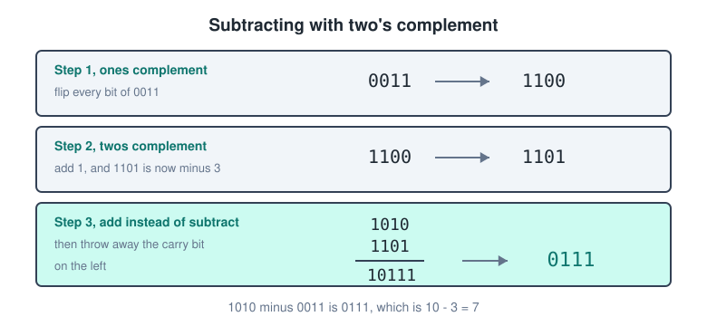

Turning `0011` into its negative takes two steps.

1. **Ones complement**, flip every bit. `0011` becomes `1100`.
2. **Twos complement**, add 1 to that result. `1100` becomes `1101`, and `1101` is now negative 3.

Now add instead of subtract.

```text
  1 0 1 0     (10)
+ 1 1 0 1     (-3)
---------
1 0 1 1 1
```

The answer came out one bit too long, so you throw away the carry bit on the far left and keep `0111`, which is 7. And `10 - 3` really is `7`.

---

## ASCII

Binary on its own is only numbers, so there has to be an agreed table that says which number means which character. That table is **ASCII**.

- Each character takes **1 byte**.
- Standard ASCII uses only 7 of those bits, so codes `0` to `127`. That covers the English letters, the digits, punctuation and some control codes.
- Extended ASCII uses the full 8 bits, so codes `0` to `255`, which adds accented letters and box drawing characters.

A few values worth knowing by heart.

| Character | Decimal | Binary |
| --- | --- | --- |
| `A` | 65 | `01000001` |
| `Z` | 90 | `01011010` |
| `a` | 97 | `01100001` |
| `0` | 48 | `00110000` |
| space | 32 | `00100000` |

Notice that lowercase is always exactly 32 above uppercase, which is one single bit of difference. That is why case conversion is so cheap to do.

Anything beyond the Latin alphabet needs **Unicode**, usually stored as UTF-8, where a character can take between 1 and 4 bytes.

---

## Hardware Components

Everything plugs into the motherboard and talks through it. Each part is bad at what the others are good at, which is the whole reason there are so many of them.

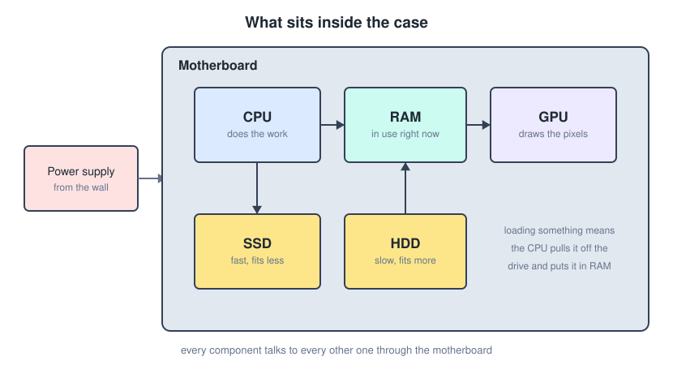

### Storage components

- **SSD**, solid state drive. Finds information fast but fits less and costs more per GB. Usually holds the operating system and the installed programs.
- **HDD**, hard disk drive, also called a spinning disk drive. Finds information slowly but fits far more for the money. Usually holds data.
- **RAM**, random access memory. Finds information very fast but fits far less, and it forgets everything the moment power is cut. It holds whatever you are using right now.

When you load something, the CPU pulls it off the drive and places it into RAM, because reading it from the drive every time would be far too slow.

### CPU

The **central processing unit**, also called the processor, does all of the actual work. It is extremely good at calculating and extremely bad at storing, which is exactly why RAM and the caches exist next to it.

### GPU

The **graphics processing unit**, also called the graphics card, is close to being a computer of its own. It works out which pixels need to light up on the screen, in what colour, and at what moment.

In a game the CPU knows where the objects belong, and the GPU knows how to make those objects look good.

### Power supply

Plugs into the wall outlet and regulates the power coming into the machine. It converts the AC from the wall into the DC voltages the components expect.

### Motherboard

The circuit board everything else sits on. Every component communicates through it, so it decides which parts are even compatible with each other.

---

## Virtual Machines

**Virtualization** means adding a software layer and a virtual system on top of a physical system, using **hypervisor** software. The physical machine is the PM and each virtual one is a VM.

Why bother.

- **Flexible sandbox.** Great for experimenting, because making a copy of a VM as a backup is trivial.
- **Easy to share.** A VM is only a file on your PM, so it moves to another PM like any other file.
- **Cost saving.** You can run many VMs on one piece of infrastructure instead of buying many machines.

### Types of virtualization

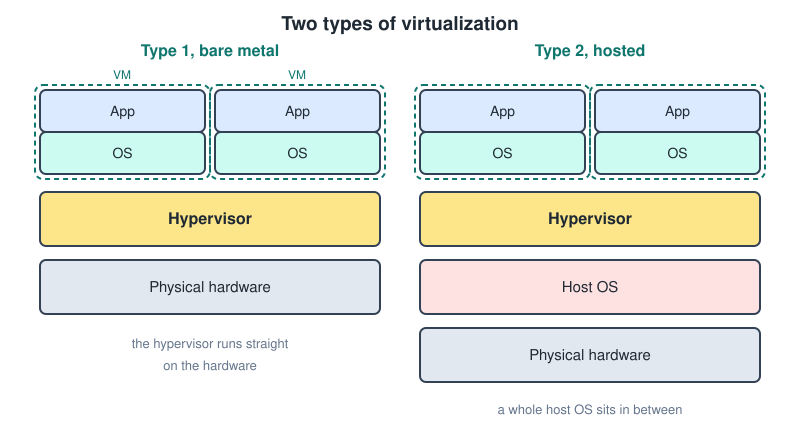

- **Type 1, bare metal.** The hypervisor runs straight on the physical hardware. Nothing sits underneath it. This is what servers and data centres use.
- **Type 2, hosted.** The hypervisor runs on top of a normal host operating system, so there is an extra layer in the way. This is VirtualBox or VMware Workstation on your own laptop.

Either way the hypervisor is what manages the resources allocated to each VM, so CPU cores, RAM and disk.

---

## Types Of Files In Virtualization

Both of these contain bootable media, they just differ in how much work is already done for you.

### ISO files

An ISO is a clean operating system with an installer, so you get the user interface and you make every choice yourself.

1. It is an image of an optical disk, so a CD or a DVD.
2. It is used to install an OS or software onto infrastructure.
3. You either mount or boot the ISO inside a VM, or burn it onto a disk for a physical install.

### OVA files

An OVA is a preconfigured operating system, often with no user interface at all.

1. It is a packaged format of a whole VM.
2. It is used to deploy preconfigured VMs onto VMware and similar platforms.
3. It lets you set up a VM quickly without going through the full installation that an ISO needs.

---

## Snapshots And Clones

Both of these copy a VM, but they copy it for different reasons.

### Snapshots

A snapshot backs up a VM at one moment in time. If you break something you just roll back one snapshot and carry on. They are cheap to take, which makes them perfect right before you try something risky.

### Clones

- **Linked clone.** A copy of a VM that shares space with the same virtual disk. It is fast and small, but it needs the parent VM to keep existing.
- **Full clone.** A complete independent copy. It takes a lot more space and a lot longer to create, but it does not need the parent VM at all.

---

## Disks

A hard drive stores data on spinning platters. Each platter has **tracks** running around it, and each track is cut into **sectors**.

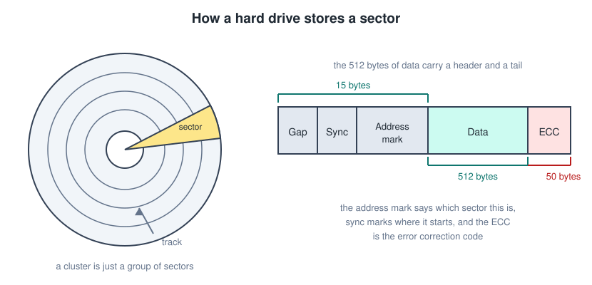

A sector is the smallest thing the drive can read or write, and the classic size is 512 bytes of data. Those 512 bytes are not alone on the disk though, they are wrapped in a header and a tail.

- **Gap**, empty space that separates one sector from the next.
- **Sync**, marks where the sector starts.
- **Address mark**, the id, which says which sector this actually is.
- **Data**, the 512 bytes you care about.
- **ECC**, the error correction code, roughly 50 bytes, used to repair small read errors.

A **cluster** is just a group of sectors treated as one unit by the file system.

---

## The Disk Control Unit

The **DCU** is the piece that actually drives the mechanics. The CPU never talks to the platters, it talks to the DCU.

It works in three steps.

1. **Seek.** Move the arm until the head sits over the right track.
2. **Search.** Read the header of each sector as the disk spins past, until the correct sector shows up.
3. **Transfer.** Send the data on to the CPU.

Those first two steps are mechanical, which is exactly why hard drives feel slow compared to anything electronic.

### Types of DCU

- **ATA**, discontinued.
- **SCSI**, used for servers.
- **S-ATA**, used from low end to high end.
- **M.2**, the current standard, and very fast. Strictly speaking M.2 is the physical slot and NVMe is the protocol that makes it quick, but the two names get used together.

---

## Cache On The Drive

HDDs are slow because the head and arm have to physically search for a while. The **cache** is a small piece of fast memory sitting inside the drive that behaves like RAM.

There is an algorithm built into the cache hardware that decides what gets to live there, and it usually keeps whichever data is used most often. When the CPU asks for something that is already in the cache, the arm never has to move at all.

---

## RAID

**RAID** stands for redundant array of independent disks. It is used to create redundant storage so that a failed drive is an inconvenience instead of a disaster.

The general principle is that the DCU has multiple disks at its disposal. The CPU only ever sees the DCU, and a DCU running several disks like this is called a **RAID controller**.

RAID is divided into levels according to reliability and time saving.

| Category | Level | Minimum disks | Disks that may fail |
| --- | --- | --- | --- |
| Striping | 0, non redundant | 2 | 0 |
| Mirroring | 1, mirrored | 2 | all but one |
| Parallel access | 2, redundant | 3 | 1 |
| Parallel access | 3 | 3 | 1 |
| Independent access | 4 | 3 | 1 |
| Independent access | 5 | 3 | 1 |
| Independent access | 6 | 4 | 2 |

The three you will actually meet are 0, 1 and 5, with 6 turning up on bigger arrays.

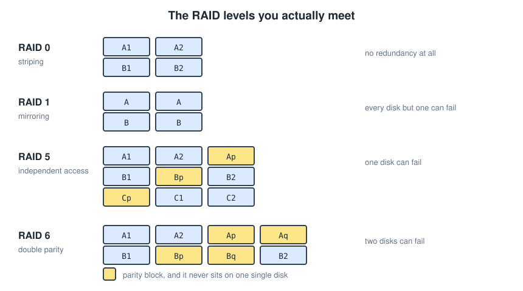

- **Striping, level 0.** Splits the data between the disks. Fast, and no redundancy at all, so losing one disk loses everything.
- **Mirroring, level 1.** Writes the same data to another disk. Safe, but you pay for double the storage.
- **Independent access, level 5.** Data is divided into blocks and a parity block is calculated. The parity is always written to a different disk than the data it protects, so no single disk holds all the parity.
- **Independent access, level 6.** Same as 5 but with double the parity blocks, so two disks can die at once.

### The parity calculation

Parity is worked out with **XOR**, which is just addition where you throw away the carry.

```text
0 + 0 = 0
1 + 1 = 0
1 + 0 = 1
0 + 1 = 1
```

So for two blocks of data.

```text
  0 0 1 0 1 0
  1 0 0 1 0 1
  -----------
  1 0 1 1 1 1     parity block
```

The nice property is that XOR undoes itself. If one of the data blocks is lost, XOR the surviving block with the parity and the missing block comes straight back.

---

## SSD Storage

Unlike HDDs, SSDs are very fast but fit less and cost more per GB. It helps to think of an SSD as RAM on steroids, with the difference that it keeps its contents when the power goes.

- It uses the same DCU interfaces as a hard drive, which is why it drops straight into the same slot.
- It is electronic rather than mechanical, so nothing has to move and nothing can be knocked out of alignment. That means better reliability and a longer life.
- It uses less energy than an HDD, which matters a lot in a laptop.

The one weakness is that flash cells wear out after a certain number of writes, so drives spread writes around the whole chip rather than hammering the same spot.

---

## GUID Partition Table

**GPT** divides an HDD or SSD into logical blocks, and it is what lets you install two operating systems on one drive.

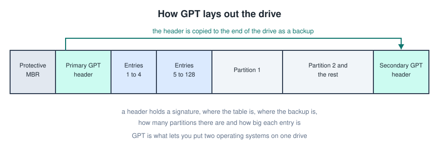

GPT always sits at the beginning of the drive, and it always keeps a copy at the end as a backup in case of faulty sectors.

The order on the drive is protective MBR, primary GPT header, the partition entries, then the partitions themselves, and finally the secondary GPT header.

A header contains the signature, the location of the GPT, the location of the backup GPT, the number of partitions, and the size of each entry in the partition table. GPT supports 128 entries by default.

---

## Blocks

File systems group sectors into **blocks**, and the block is the unit the file system reads and writes.

Every file uses at least one block, even a file with one character in it. That is why a folder full of tiny files can take up far more space on disk than the sum of their sizes.

---

## FAT File System

FAT works by linking. A file is represented by a **linked list of blocks**, where each block records which block comes next.

- USB sticks use **FAT32** by default, because just about every device on earth can read it.
- The tradeoff is a 4 GB limit per file, so a big video will not copy onto a FAT32 stick.
- Because it is a linked list, reading the middle of a big file means walking the chain from the start.

---

## EXT File System

Linux mainly uses **EXT4**. It splits the volume into four standard block types.

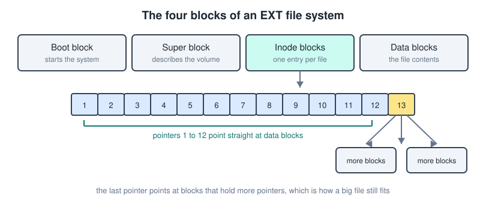

- **Boot block**, used to start the system.
- **Super block**, describes the volume itself, so size, block count and state.
- **Inode blocks**, one entry per file, holding the metadata and the pointers to the data.
- **Data blocks**, the actual file contents.

An inode holds a fixed set of pointers. The first twelve point straight at data blocks, and the last one points at a block that is itself full of pointers. That indirection is how a small fixed size inode can still describe a very large file.

Because the pointers are indexed rather than chained, jumping to the middle of a file is quick, which is the main practical difference from FAT.

---

## Process Scheduling

Every program executes code and instructions, and every program also keeps track of which instructions are still to be executed. A program that is actually running is a **process**, and it keeps track of

- program status,
- used files,
- memory limits,
- process state.

The scheduler is the part of the operating system that decides which process gets the CPU next.

### Preemptive and non preemptive

- **Preemptive.** The OS can interrupt a currently running process to switch the CPU to another one. Better response time, and resources are only allocated to a process for a limited time.
- **Non preemptive.** The OS cannot interrupt a running process. It has to finish fully before a new one starts. Slower response time, and resources stay fully allocated to that process the whole way through.

---

## The Scheduling Algorithms

Three of them, on the same three processes, so you can see what the choice actually costs.

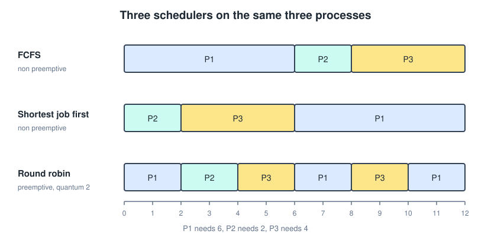

### First come first serve

Non preemptive. Processes execute in the order they arrived, and a process waits for the one before it to finish before it can start.

Simple, but it gives a long waiting time for short processes. One slow job at the front holds up everything behind it.

### Shortest job first

Non preemptive. Processes execute from shortest to longest, but they still wait for each other to finish.

Short processes get through quickly, which brings the average waiting time down. The cost is that long processes sit in the queue for a while, and if short jobs keep arriving they may never run at all.

### Round robin

Preemptive. Each process is given a fixed time slice, called a **quantum**, to execute in. Processes then execute in a circular motion, each one getting a limited period of CPU before it goes back to the queue.

Shorter waiting time than FCFS and no starvation, since everyone gets a turn. The cost is all the switching between processes, which is not free.

---

## System Calls And Interrupts

Two different ways the CPU gets told to do something it was not already doing.

- **System call.** A procedural method through which a program requests the help of the operating system kernel. The program asks, on purpose, for something it is not allowed to do itself, like opening a file or sending data over the network.
- **System interrupt.** An event where the CPU is asked to do a specific action by outside components. Nothing asked politely here, the hardware simply raises a signal and the CPU stops what it was doing to deal with it. A key press or a finished disk read is an interrupt.

---

## Types Of Memory

Memory splits into two families depending on whether the CPU works out of it directly.

- **Primary memory**, the working memory for the CPU. RAM and ROM.
- **Secondary memory**, storage. HDD, SSD, optical drives, flash drives, memory cards and magnetic tape.

Lined up by speed they form a hierarchy, and price per GB runs the opposite way to speed.

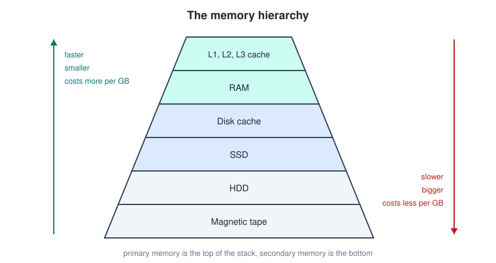

From slowest and cheapest to fastest and most expensive, that is magnetic tape, hard drive, solid state drive, disk cache, RAM, then L3, L2 and L1 cache.

---

## Read Only Memory

**ROM** stores permanent data and instructions that a device needs in order to start up. It survives a power cut, which is exactly why the boot process can live there.

Booting goes roughly like this.

1. The **BIOS** stored on the ROM is passed to the CPU. The BIOS is the set of instructions responsible for booting your OS.
2. The CPU loads that information into RAM.
3. A valid boot disk is found.
4. The OS is loaded and takes control of the CPU.

### Some ROM is writable

- **EEPROM**, electrically erasable programmable read only memory. It can be erased or reprogrammed electrically, byte by byte.
- **Flash ROM**, a faster type of EEPROM. It erases whole data blocks rather than single bytes, which is what makes it quick.

---

## CMOS Memory

**CMOS** memory stores the variable data that goes with the ROM, so peripheral settings, hard drive size, RAM size and the system time from the real time clock.

It is powered by a small battery so it always stays on, but its power consumption is tiny. When a desktop forgets the date every time you unplug it, that battery is flat.

---

## RAM Memory

RAM is the working memory, and it is built out of components that need constant attention.

- Capacitors and transistors that require high frequency pulses to hold their state.
- That frequency is referred to as the **refresh rate**, measured in megahertz.
- It is **volatile**, so the contents are lost the moment there is no power.

RAM splits into two branches, with a synchronous variant sitting under the dynamic one.

- **DRAM**, dynamic, and under it **DDR SDRAM**, synchronous.
- **SRAM**, static.

---

## SRAM, DRAM And DDR SDRAM

The difference comes down to how a single bit is stored, and everything else follows from that.

### Static RAM

1. Requires multiple transistors to store 1 bit.
2. Does not require refreshing.
3. Faster performance.
4. Consumes less power when idle.
5. Takes up more space and fits less data.
6. Costs more.
7. Used for the processor's cache.

### Dynamic RAM

1. Requires 1 transistor and 1 capacitor for 1 bit.
2. Must be continuously refreshed, because the capacitor leaks.
3. Slower performance.
4. Consumes more power, since refreshing never stops.
5. Takes up less space and fits more data.
6. Costs less.
7. Used for the computer's main memory.

### DDR SDRAM

1. Faster than plain DRAM, and able to handle several things at once.
2. Uses the system clock and multiple memory banks, which lets it process multiple instructions simultaneously.
3. **Double data rate** means it transfers on both the rising and the falling edge of the clock, so it gets more done per tick.

The generations differ in how much they move per clock pulse.

| Generation | Bits per pulse |
| --- | --- |
| DDR | 2 |
| DDR2 | 4 |
| DDR3 | 8 |
| DDR4 | 8, with better refresh handling |
| DDR5 | 16 |

---

## RAM Generations And Physical Types

Different generations are not compatible with each other, and the hardware makes sure of it. The notch in the teeth of the stick sits in a different place every generation, so a DDR4 stick physically will not seat in a DDR5 slot.

Two physical formats.

- **DIMM**, for desktops, the long one.
- **SO-DIMM**, for laptops, the compact one.

### CAS latency

**CAS latency**, written `CL`, is another characteristic of RAM. It represents the delay that occurs when switching between two memory locations.

`CL7` means the delay is 7 clock pulses. Lower is better, but it only means something when you compare sticks running at the same speed, since a pulse is shorter on faster RAM.

---

## The Memory Controller

The memory controller is the link between the CPU and the RAM. It accesses the addresses on the RAM, and that process is called the **memory bus**.

Addresses on RAM are random access, which means every memory location can be reached independently of every other one, in the same amount of time. That is also exactly why a controller is needed, because something has to arbitrate all those independent requests.

In modern devices the memory controller is built into the CPU itself, which cuts out a hop and lowers latency.

---

## Cache Memory

Cache memory speeds up processor performance by reducing wait time. The data you use the most is kept in cache memory inside the CPU.

It is faster than RAM and it does not need constant refreshing, because it is built from static RAM.

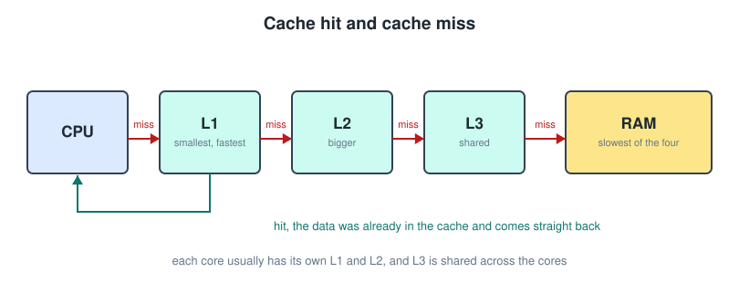

There are three levels of SRAM cache.

1. **L1**, smallest and fastest.
2. **L2**, bigger and slower.
3. **L3**, bigger and slower again.

Each core in the CPU typically has dedicated L1 and L2 memory, while L3 is more general and shared between the cores.

### Hit and miss

- **Hit.** The data was found in the cache, so access is quick.
- **Miss.** The data was not in the cache, so it has to be retrieved from RAM, which is slower.

The whole design rests on the fact that programs tend to reuse the same data and the same instructions over and over, so a small fast store catches most requests.

---

## Virtual Memory

Virtual memory is used when RAM is full. It allows programs to use more memory than the RAM available physically.

When RAM fills up, the system starts using a portion of SSD memory through the **paging** mechanism.

1. Virtual memory is divided into **4 KB pages** on the SSD.
2. Those pages are organised using a **page table**.
3. The SSD and CPU still have to communicate through the RAM even though it is full, and that shuffling is called swapping.

### Swapping

**Swapping** is the process of moving pages between the virtual memory inside the SSD and RAM. The SSD file used for this is called the **swap file**.

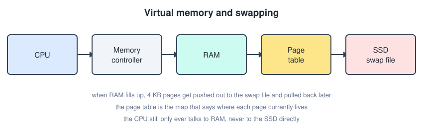

The page table is the link between the RAM and the SSD, since it is what records where each page currently lives.

Swapping saves you from an out of memory crash, but it is orders of magnitude slower than real RAM. A machine that swaps constantly feels frozen, and that is the sign you need more RAM rather than a bigger swap file.

---

## Electricity

Ohm's law ties the three basic quantities together, and the power formula sits right next to it.

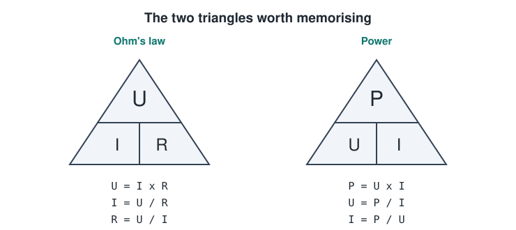

- `I` is **current**, in amperes.
- `U` is **voltage**, in volts.
- `R` is **resistance**, in ohms.
- `P` is **power**, in watts.

Two ways of reading the same relationship.

- **Voltage against current.** Higher voltage gives stronger current. This only holds while the resistance of the circuit stays constant.
- **Resistance against current.** Higher resistance gives lower current. This only holds while the voltage is fixed.

### AC and DC

- **Alternating current**, marked `~`. This is what comes out of the wall outlets and powers things like your fridge or the air conditioning. In Europe that is 230 volts, and the general range is 200 to 240.
- **Direct current**, marked with a solid line over a dashed one. AC gets transformed into DC to power things like your phone or laptop, typically somewhere between 12 and 40 volts.

That transformation is what the brick on your laptop charger is doing.

### Electricity consumption

Consumption is just power multiplied by time.

```text
consumption = power (W) x time (h)
```

The unit is the **watt hour**, `Wh`, and one `kWh` is 1000 `Wh`. That kWh is the unit your electricity bill is counted in.

---

## AREI Safety In Belgium

**AREI** is the general regulation on electrical installations in Belgium. It specifies things like

1. cable types and where they are allowed to run,
2. the maximum number of outlets on a circuit,
3. fuses and circuit breakers,
4. ground fault circuit breakers,
5. grounding and earthing.

### Cable colours

- **Blue**, neutral.
- **Yellow and green striped**, ground.
- **Brown**, live.

### Fuse and circuit breaker

A fuse or breaker detects a current overload or a short circuit. A coil and a bimetal strip heat up and interrupt the circuit before the cable does.

Typical capacities.

- 16 amps for a lighting circuit.
- 20 amps for standard outlets.
- 32 amps for a cooktop and similar heavy appliances.

### Ground fault circuit breaker

Also called a **residual current device**. It measures the incoming and outgoing current and compares them. If they do not match, current is leaking somewhere, and that somewhere could be a person, so the circuit is interrupted immediately.

Tolerances.

- 30 mA in wet areas.
- 300 mA in common areas.

### Grounding and earthing

Grounding diverts leaked currents into the ground so that nobody gets electrocuted if they end up part of the circuit. It works in conjunction with the ground fault circuit breaker, since the breaker needs somewhere for that leaked current to go before it can spot the imbalance.

The ground resistance has to stay below 30 ohms for this to work properly.

---

## Quick Recap

- Bit is one digit, byte is 8 bits, so 0 to 255.
- To decimal you multiply by powers of the base, from decimal you divide by the base and read the remainders upwards.
- 3 bits per octal digit, 4 bits per hex digit, and no decimal involved.
- Two's complement turns subtraction into addition, so one circuit does both.
- CPU does the work, RAM holds what is in use, drives hold what is not, and the motherboard connects it all.
- Type 1 hypervisors sit on the hardware, type 2 sit on a host OS.
- RAID 0 is speed, RAID 1 is safety, RAID 5 and 6 are both through parity.
- FAT chains blocks together, EXT indexes them through inodes.
- FCFS is fair but slow, SJF is fast but starves long jobs, round robin shares the CPU with a quantum.
- SRAM is fast and expensive so it becomes cache, DRAM is dense and cheap so it becomes main memory.
- Virtual memory buys you room at the cost of speed.
- `U = I x R` and `P = U x I` cover almost every electrical question you will be asked.
