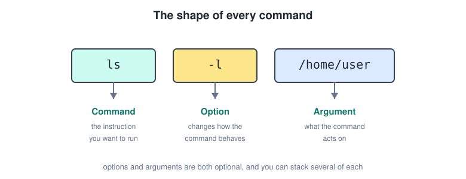
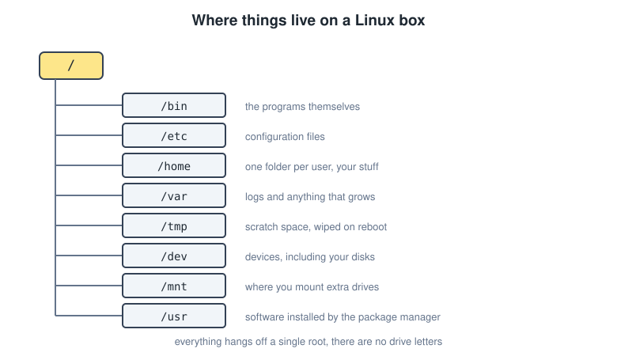
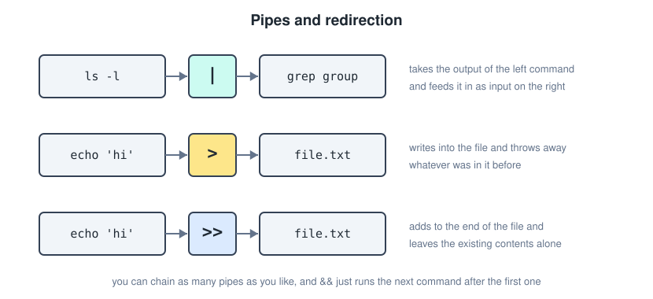
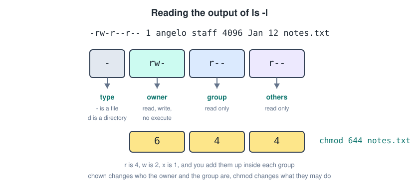
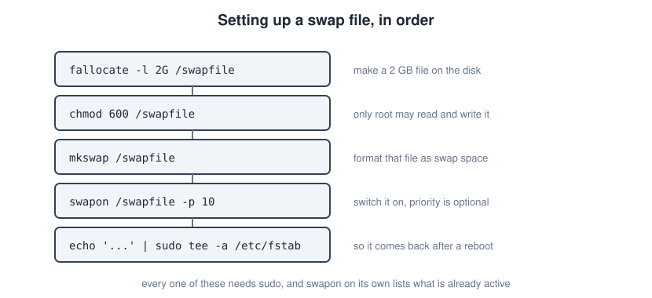
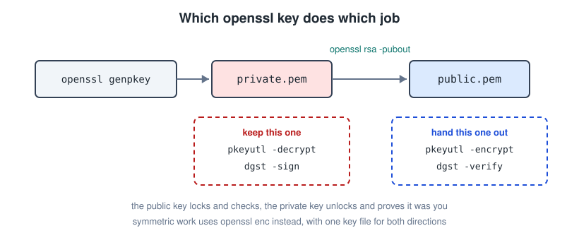

# Linux Bash

Linux does not hide anything behind a settings window. Everything is a file, and the terminal is the tool that gets at those files. This file collects every command from the Computer Systems and Computer Networks notes into one place, grouped by what you are actually trying to do rather than by the order they came up in class.

---

## The Shell And The Terminal

Two words that get used interchangeably and should not be.

- The **terminal** is the window. It draws text and takes your keystrokes.
- The **shell** is the program running inside that window. It reads what you typed, works out what you meant, and runs it.

**Bash** is the shell you will be using, and it is the default on most distributions. When you open a terminal you are dropped into your home directory with a prompt waiting.

```text
angelo@laptop:~$
```

- `angelo` is the user.
- `laptop` is the machine.
- `~` is where you are, and `~` always means your own home directory.
- `$` means a normal user. If it shows `#` you are root, and you should be careful.

---

## The Shape Of A Command

Every command follows the same pattern, and once you see it the rest is just vocabulary.



```text
ls -l /home/user
```

- **Command**, the instruction you want to run.
- **Option**, modifies the behaviour of the command. Short options use one dash, long options use two, as in `-h` or `--human-readable`.
- **Argument**, the target the command acts on.

Both the option and the argument are optional, and you can stack several of each.

Two things that show up everywhere.

- `&&` links commands on one line, and the second one only runs if the first one succeeded.
- `sudo` in front of a command runs it with superuser permissions. Anything touching system files, disks or packages needs it.

```bash
sudo apt update && sudo apt upgrade
```

---

## Where Things Live

Linux has no drive letters. Everything hangs off a single root, written `/`, and extra disks get mounted into that tree rather than sitting beside it.



The directories you will actually run into.

| Path | What is in it |
| --- | --- |
| `/bin` | the programs themselves |
| `/etc` | configuration files |
| `/home` | one folder per user, so your own stuff |
| `/var` | logs and anything that grows over time |
| `/tmp` | scratch space, wiped on reboot |
| `/dev` | devices, including your disks |
| `/mnt` | where you mount extra drives |
| `/usr` | software installed by the package manager |

Two shorthands worth knowing. `.` means the current directory and `..` means the one above it.

Note that in the copybook a directory sometimes got written as a dictionary. It is a folder either way, and directory is the correct word.

---

## Moving Around

Three commands cover navigation entirely.

```bash
pwd                     # returns your directory, so where you currently are
ls                      # lists the files in the current directory
cd /home/angelo         # changes your directory
```

`cd` takes a few useful shortcuts.

```bash
cd ../                  # goes up one directory
cd ../projects          # goes up one, then down into a sibling directory
cd ~                    # straight back to your home directory
cd -                    # back to wherever you just were
```

`ls` is the one you will type most, so its options are worth learning properly.

```bash
ls -l                   # long form, one file per line with permissions and size
ls -a                   # includes hidden files, the ones starting with a dot
ls -lh                  # sizes in KB and MB instead of raw bytes
ls -lS                  # sorted largest to smallest
ls -lSr                 # sorted smallest to largest
```

Combined with `grep` you can filter what comes back.

```bash
ls -l | grep "^d"       # only directories
ls -l | grep "^-"       # only files
ls -l | grep -v "^d"    # everything that is not a directory, so also only files
```

The `^` anchors the match to the start of the line, and the first character of an `ls -l` line is `d` for a directory or `-` for a file.

---

## Creating, Copying And Deleting

Making things.

```bash
touch notes.txt         # creates an empty file
mkdir project           # creates a directory
mkdir -p a/b/c          # creates a whole tree at once, parents included
```

Moving and copying. Both take the thing first and the destination second.

```bash
cp notes.txt backup/    # copies a file
cp -r project backup/   # copies a directory and everything in it
mv notes.txt archive/   # moves a file
mv notes.txt todo.txt   # renaming is just moving to a new name
```

Deleting, and this is where Linux does not ask twice.

```bash
rm notes.txt            # deletes a file
rmdir project           # deletes an empty directory only
rm -r project           # deletes a directory with things in it
rm -rf project          # same but forced, so it does not stop on locked files
```

There is no recycle bin. `rm -rf` on the wrong path is how people lose an afternoon, so read the line before pressing enter.

---

## Looking Inside Files

```bash
cat notes.txt           # dumps the whole file to the terminal
nano notes.txt          # opens the file for editing in the terminal
head notes.txt          # first 10 lines
tail notes.txt          # last 10 lines
tail -f /var/log/syslog # follows a file live as it grows
less notes.txt          # scrollable view, q to quit
```

`cat` also concatenates, which is where the name comes from.

```bash
cat part1.txt part2.txt > whole.txt
```

`nano` shows its shortcuts along the bottom, where `^` means control. So `^O` writes the file out and `^X` exits.

---

## Finding Things

`find` searches by name, type or permission. It takes the directory to search in first.

```bash
find . -name notes.txt          # by name, starting in the current directory
find /home -name "*.txt"        # wildcards work, quote them so bash leaves them alone
find . -type f                  # only files
find . -type d                  # only directories
find . -perm 755                # files with those exact permissions
```

`grep` searches inside files rather than for them.

```bash
grep "error" logfile            # every line containing error
grep -i "error" logfile         # case insensitive
grep -n "error" logfile         # with line numbers
grep -r "error" .               # recursively through a whole directory
```

It also understands anchors and patterns.

```bash
grep "^start" file              # lines starting with start
grep "end$" file                # lines ending with end
```

---

## Reshaping Text

These are small on their own and powerful once piped together.

```bash
wc -l file              # counts lines
wc -w file              # counts words
wc -m file              # counts characters
sort file               # sorts the lines alphabetically
sort -n file            # sorts numerically
sort -u file            # sorts and removes duplicates
```

`cut` splits each line and keeps the fields you asked for.

```bash
cut -d ":" -f 1 /etc/passwd
```

- `-d` is the delimiter, so the character to split at.
- `-f` is which field to keep, counting from 1.

`tr` translates or squeezes characters.

```bash
tr "a" "b" < file       # replaces every a with a b
tr -d " " < file        # deletes every space
tr -s " " < file        # squeezes runs of spaces down to one
```

`tr` only reads from standard input, which is why it is nearly always on the right hand side of a pipe.

---

## Comparing Files

```bash
cmp file1 file2         # tells you the first byte where they differ
diff file1 file2        # shows line by line what differs
diff -u file1 file2     # unified format, the one patches are written in
```

`cmp` answers whether they differ, `diff` answers how.

---

## Pipes And Redirection

This is the idea the whole shell is built on. Every command reads from standard input and writes to standard output, and you get to rewire both.



```bash
ls -l | grep group              # the pipe feeds one command's output into the next
echo "hello" > file.txt         # writes into the file, overwriting what was there
echo "hello" >> file.txt        # appends to the end instead
```

`echo` prints text, and with `-e` it understands escape characters.

```bash
echo -e "line1\nline2\nline3" > file.txt
```

Pipes chain as far as you like, which is where the real power is.

```bash
cat /var/log/syslog | grep "error" | cut -d " " -f 5 | sort | uniq -c | sort -nr
```

That one line reads the log, keeps the error lines, pulls out the fifth field, counts how often each value appears and sorts by the count. No single command does that, and no single command needs to.

---

## Permissions And Ownership

After `ls -l` the terminal shows a list of files in a fixed format, and the first ten characters are the permissions.



```text
-rw-r--r--   1  angelo  staff  4096  Jan 12  notes.txt
```

Reading it left to right.

- The first character is `d` for a directory or `-` for a file.
- The next three are the **owner** permissions.
- The next three are the **group** permissions.
- The last three are the **others** permissions.

Each group of three is always read, write, execute in that order, and a dash means that permission is missing.

### Changing the owner

```bash
chown angelo notes.txt          # sets a new owner
chown angelo:staff notes.txt    # sets the owner and the group
chown :staff notes.txt          # sets only the group
```

### Changing the permissions

There are two ways. The numeric one adds up values per group.

```text
r = 4      w = 2      x = 1
```

So `rw-` is `4 + 2 = 6`, and `r--` is `4`.

```bash
chmod 644 notes.txt     # rw- for the owner, r-- for group and others
chmod 664 notes.txt     # rw- for owner and group, r-- for others
chmod 755 script.sh     # rwx for the owner, r-x for everyone else
chmod 000 notes.txt     # nobody can do anything with it
```

The symbolic one adds or removes single permissions without touching the rest.

```bash
chmod u+rx notes.txt    # u is the user, so the owner
chmod g+rx notes.txt    # g is the group
chmod o+rx notes.txt    # o is others
chmod o-w notes.txt     # removes write from others
```

On a directory the `x` bit does not mean execute, it means you are allowed to enter it. A directory with `r` but no `x` lets you list the names and nothing else.

---

## Disks And Partitions

```bash
lsblk                   # lists all disks attached to the system, as a tree
df                      # disk space usage per mounted file system
df -h                   # the same in MB and GB instead of blocks
```

Preparing a new partition takes two steps, both of which need `sudo`.

```bash
sudo mkfs -t ext4 /dev/sdb1      # creates a file system on the device
sudo mount /dev/sdb1 /mnt/data   # attaches that file system to a directory
```

A **device** here means a partition, and the directory you attach it to is the **mount point**. Until it is mounted the partition exists but nothing can reach it.

---

## Processes

```bash
ps                      # processes attached to your current terminal window
ps aux                  # every process from every user, with CPU usage
top                     # the same but live and updating
uptime                  # how long the machine has been up and its load average
```

`ps aux` is the one to pipe into `grep` when you are hunting for something specific.

```bash
ps aux | grep firefox
```

Once you have the process id you can stop it.

```bash
kill 4821               # asks the process to shut down cleanly
kill -9 4821            # forces it, only when the polite version failed
```

---

## Memory And Swap

```bash
free -h                 # memory usage for RAM and swap, in readable units
swapon                  # lists the current swap files and their priority
```

Higher priority swap areas get used first.

Creating a swap file from scratch runs in a fixed order, and every step needs `sudo`.



```bash
sudo fallocate -l 2G /swapfile      # makes a 2 GB file
sudo chmod 600 /swapfile            # only root may read and write it
sudo mkswap /swapfile               # formats that file as swap
sudo swapon /swapfile -p 10         # switches it on, priority optional
```

The `600` matters. A swap file readable by anyone would leak whatever was in memory.

To make it survive a reboot, add a line to `/etc/fstab`.

```bash
echo '/swapfile none swap sw 0 0' | sudo tee -a /etc/fstab
```

Reading that line field by field.

- `/swapfile` is the path to the swap file.
- `none` is the mount point, and a swap file does not need one.
- `swap` is the type.
- `sw` is the option.
- The first `0` means no backup.
- The second `0` means no file system check at boot.

`tee -a` is used instead of `>>` because the redirect would happen as your own user, before `sudo` ever runs, and you have no write permission on `/etc/fstab`.

---

## Software Packages

On Debian and Ubuntu the package manager is `apt`.

```bash
apt list                        # every installable package in the repository
sudo apt update                 # refreshes the repository list
sudo apt upgrade                # updates what is already installed
sudo apt install nginx          # installs software
sudo apt remove nginx           # uninstalls software
```

`update` and `upgrade` are two different things. `update` only refreshes the catalogue, `upgrade` is what actually changes anything.

---

## Services

`systemctl` is how you interact with `systemd`, the thing that starts and supervises services.

```bash
systemctl status ssh            # is it running, and what did it last log
sudo systemctl start ssh        # start it now
sudo systemctl stop ssh         # stop it now
sudo systemctl restart ssh      # stop then start
sudo systemctl enable ssh       # start it automatically at boot
sudo systemctl disable ssh      # do not start it at boot
```

`start` and `enable` are unrelated. One is about right now, the other is about the next boot.

---

## Small Everyday Commands

```bash
echo "hello"            # prints text in the terminal
date                    # prints the current date and time
cal 3 2026              # prints a calendar for that month and year
man ls                  # the manual page, so how a command is actually used
```

`man` is the one to reach for before searching online. Every option in this file is documented there.

---

## OpenSSL, Symmetric Encryption

One key for both directions, so the same file has to be present to encrypt and to decrypt.

Generate a random key first.

```bash
openssl rand -out aes.key 32
```

That is 32 bytes, which is 256 bits, which is what `aes-256` expects.

Encrypt and decrypt with that key.

```bash
openssl enc -aes-256-cbc -salt -in plain.txt -out cipher.enc -pass file:aes.key
openssl enc -d -aes-256-cbc -in cipher.enc -out plain2.txt -pass file:aes.key
```

- `-aes-256-cbc` picks the cipher and the mode, and CBC is the chained one that avoids patterns.
- `-salt` adds randomness so the same input never produces the same output twice.
- `-d` is what turns encryption into decryption.

---

## OpenSSL, Asymmetric Encryption

Here there are two keys, and which one you use depends on which direction you are going.



Generate the private key, then derive the public one from it.

```bash
openssl genpkey -algorithm RSA -out private.pem
openssl rsa -pubout -in private.pem -out public.pem
```

The public key can always be rebuilt from the private key, but never the other way round. That is the whole point.

Encrypt with the public key, decrypt with the private one.

```bash
openssl pkeyutl -encrypt -inkey public.pem -pubin -in plain.txt -out cipher.enc
openssl pkeyutl -decrypt -inkey private.pem -in cipher.enc -out plain2.txt
```

`-pubin` tells openssl that the key file it was handed is a public key rather than a private one.

RSA can only encrypt something smaller than the key itself, which is exactly why real systems use hybrid encryption and only send a symmetric key this way.

---

## OpenSSL, Hashing

Hashing generates a fixed length value from the contents of a file, and it does not go backwards.

```bash
md5sum file             # generates a hash of the file contents, insecure now
sha1sum file            # also insecure now
sha256sum file          # the one to actually use
openssl dgst -sha256 file       # same output, different tool
```

Adding a key turns a hash into an **HMAC**, which proves the file came from someone holding that key rather than just proving it was not corrupted.

```bash
openssl dgst -sha256 -hmac "secretkey" file
```

The usual practical use is verifying a download. Hash the file you got and compare it against the hash the site published.

---

## OpenSSL, Digital Signatures

A signature is a hash encrypted with your private key. Anyone with your public key can check it, and nobody without your private key can produce it.

```bash
openssl dgst -sha256 -sign private.pem -out file.out file.in
openssl dgst -sha256 -verify public.pem -signature file.out file.in
```

- `file.in` is the original file.
- `file.out` is the signature that was produced.

Verification either prints `Verified OK` or fails, and it fails if either the file or the signature was touched.

---

## OpenSSL, Self Signed Certificates

A certificate starts life as a **certificate signing request**, which bundles a public key together with who you claim to be.

```bash
openssl req -new -key private.pem -out cert.csr
```

That one asks you to fill in the country, organisation and common name.

Sign the request with the same private key and you get a self signed certificate.

```bash
openssl x509 -req -days 365 -in cert.csr -signkey private.pem -out cert.crt
```

Inspecting it.

```bash
openssl x509 -in cert.crt -text -noout           # the full contents
openssl x509 -in cert.crt -noout -issuer -subject
```

If the issuer and the subject fields are the same, the certificate is self signed.

```bash
openssl verify cert.crt
```

This one fails, because the certificate vouches only for itself and nothing in the trust store backs it up.

---

## OpenSSL, Certificates Signed By A CA

Now with a **certificate authority** in the middle, which is how real certificates work.

First build the CA. It needs its own key and its own self signed certificate, valid for a long time.

```bash
openssl genpkey -algorithm RSA -out ca.key
openssl req -key ca.key -new -x509 -out ca.crt -days 3650
```

Then the server makes its own key and its own request.

```bash
openssl genpkey -algorithm RSA -out server.key
openssl req -key server.key -new -out server.csr
```

The CA signs that request, which is the step that combines the two.

```bash
openssl x509 -req -in server.csr -CA ca.crt -CAkey ca.key -CAcreateserial -out server.crt -days 365
```

Now check the result.

```bash
openssl x509 -in server.crt -noout -issuer -subject
```

The issuer and the subject are different this time, so the certificate is not self signed, it is signed by the CA.

```bash
openssl verify -CAfile ca.crt server.crt
```

This one succeeds, because the chain leads back to a certificate that was trusted up front.

---

## Command Reference

Everything above in one table, for when you know what you want and only need the name.

| Command | What it does |
| --- | --- |
| `pwd` | returns your current directory |
| `ls` | lists files and folders |
| `cd` | changes your directory |
| `touch` | creates a file |
| `mkdir` | creates a directory |
| `cp` | copies a file |
| `mv` | moves or renames a file |
| `rm` | deletes a file |
| `rmdir` | deletes an empty directory |
| `cat` | displays the contents of a file |
| `nano` | edits a file in the terminal |
| `head` and `tail` | first or last lines of a file |
| `find` | finds files by name, type or permission |
| `grep` | searches for text inside files |
| `cut` | splits lines and keeps chosen fields |
| `tr` | replaces, deletes or squeezes characters |
| `sort` | sorts the lines of a file |
| `wc` | counts lines, words or characters |
| `cmp` | says where two files first differ |
| `diff` | compares two files in detail |
| `echo` | displays text in the terminal |
| `chmod` | changes permissions |
| `chown` | changes ownership |
| `lsblk` | lists disks attached to the system |
| `df` | displays disk space usage |
| `mkfs` | creates a file system on a device |
| `mount` | attaches a file system to a directory |
| `ps` | lists processes |
| `top` | lists processes live |
| `uptime` | system load and how long it has been up |
| `kill` | stops a process |
| `free` | displays memory usage |
| `swapon` | lists or activates swap space |
| `fallocate` | creates a file of a set size |
| `mkswap` | formats a file as swap |
| `apt` | installs and removes software |
| `systemctl` | interacts with systemd services |
| `date` | displays the date and time |
| `cal` | displays a calendar |
| `man` | shows the manual for a command |
| `openssl` | encryption, hashing, signatures and certificates |

---

## Quick Recap

- Command, option, argument, and `sudo` in front when it touches the system.
- One root, no drive letters, and `.` and `..` get you around it.
- `rm` does not ask and there is no recycle bin.
- `|` chains commands, `>` overwrites a file, `>>` appends to it.
- Permissions are owner, group, others, and `r` is 4, `w` is 2, `x` is 1.
- `ps` and `top` for processes, `free` and `swapon` for memory, `lsblk` and `df` for disks.
- `apt update` refreshes the list, `apt upgrade` actually changes things.
- With openssl, `enc` is symmetric, `pkeyutl` is asymmetric, `dgst` is hashing and signing, and `x509` is certificates.
