# Cisco IOS CLI

The Computer Networks file explained what VLANs, OSPF, ACLs and NAT are. This one is about typing them into a box. Every command here is Cisco IOS, the operating system that runs on Catalyst switches and ISR routers, and it is what you meet in Packet Tracer and in any CCNA lab.

The order follows the networks file: get into the device, secure it, give it an address, then build outward through switching, routing and filtering.

---

## Getting In

To configure a switch or a router you need a console cable and a terminal client such as PuTTY, which gives you the CLI. Once the device is on the network you can reach it over SSH instead, which is the normal way after the first setup.

The CLI is not one flat prompt. It is a hierarchy of modes, and the prompt tells you which one you are standing in.

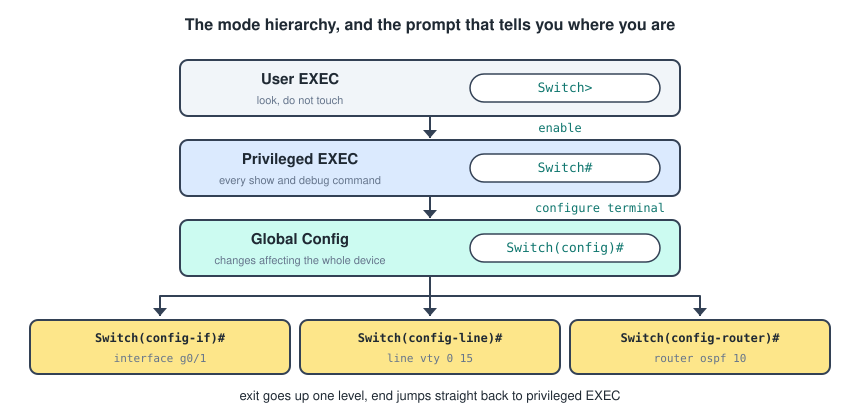

Getting down the hierarchy uses one command per level.

```text
Switch> enable
Switch# configure terminal
Switch(config)# interface gigabitEthernet 0/1
Switch(config-if)#
```

Getting back up has two commands, and the difference matters when you are four levels deep.

- **`exit`** goes up exactly one level.
- **`end`**, or `Ctrl+Z`, jumps straight back to privileged EXEC from wherever you are.

The mode you are in decides which commands exist. Typing `show ip route` in global config mode fails, because `show` belongs to EXEC mode. The exception is `do`, which runs an EXEC command from inside config mode without leaving it.

```text
Switch(config)# do show ip interface brief
```

---

## Editing Shortcuts

The CLI has a few conveniences that save a lot of typing, and they are worth learning early because you will type the same commands hundreds of times.

- **`Tab`** completes the current keyword.
- **`?`** lists what can come next. `sh ?` lists every command starting with `sh`, and `show ip ?` lists every option of `show ip`.
- **Abbreviation** works as long as the shortening is unambiguous, so `conf t` is `configure terminal` and `int g0/1` is `interface gigabitEthernet 0/1`.
- **Up arrow** or `Ctrl+P` recalls previous commands.
- **`Ctrl+C`** aborts the current command, and **`Ctrl+Shift+6`** breaks out of a running process such as a long ping or a traceroute.

Two more that stop the output getting in your way.

```text
Switch(config)# no ip domain-lookup
Switch(config)# line console 0
Switch(config-line)# logging synchronous
```

`no ip domain-lookup` stops the device treating a mistyped command as a hostname and hanging for thirty seconds trying to resolve it. `logging synchronous` stops console messages interrupting the line you are halfway through typing.

Note the pattern in that first one. **Almost every IOS command is undone by putting `no` in front of it**, which is the single most useful thing to know about the syntax.

---

## The Two Configuration Files

Every device holds two copies of its configuration, and the difference between them is where a lot of lost work goes.

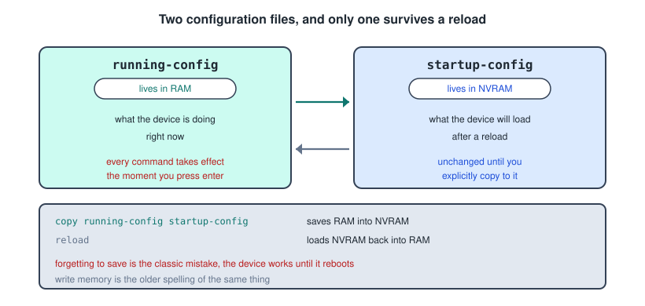

There is no separate apply or commit step. A command takes effect the moment you press enter, which is why a mistake on a remote device can lock you out instantly. What does not happen automatically is saving.

```text
Switch# copy running-config startup-config
Switch# write memory
```

Those two do the same thing, and `write memory` is the older spelling you will still see in documentation. Checking and clearing.

```text
Switch# show running-config
Switch# show startup-config
Switch# erase startup-config
Switch# reload
```

Erasing the startup config and reloading is how you return a lab device to factory state. On a switch you normally delete the VLAN database at the same time, since VLANs are not stored in the startup config.

```text
Switch# delete vlan.dat
```

---

## Basic Device Setup

The first handful of commands on any new device are always the same, so it is worth having them as one block.

```text
Switch> enable
Switch# configure terminal
Switch(config)# hostname S1
S1(config)# no ip domain-lookup
S1(config)# banner motd #Authorised access only#
```

The hostname changes the prompt immediately, which is your confirmation it worked. The banner is a legal notice shown before login, and the `#` characters are delimiters marking where the message starts and stops, so any character not appearing in the message will do.

---

## Passwords

There are three separate passwords on an IOS device, guarding three different doors.

```text
S1(config)# enable secret class
S1(config)# line console 0
S1(config-line)#  password cisco
S1(config-line)#  login
S1(config-line)#  exit
S1(config)# line vty 0 15
S1(config-line)#  password cisco
S1(config-line)#  login
```

- **`enable secret`** guards the jump from user EXEC to privileged EXEC.
- **The console password** guards physical access through the console port.
- **The VTY password** guards remote access over Telnet and SSH. `0 15` covers all sixteen virtual terminal lines.

The `login` command is what makes the line actually prompt for the password. Without it the password sits in the configuration and is never asked for, which is a common and quiet mistake.

**`enable secret` and `enable password` are not the same thing.** The older `enable password` stores the password in plain text, `enable secret` stores a hash of it. Use `enable secret` and nothing else. If both are configured, the secret wins.

The remaining passwords are still plain text in the configuration file, so one more command obscures them.

```text
S1(config)# service password-encryption
```

That applies a weak reversible cipher to every plain text password in the config, current and future. It stops someone reading passwords over your shoulder and it stops nothing else, so treat it as a courtesy rather than security.

---

## SSH

Telnet sends everything, passwords included, in clear text. SSH is the replacement, and configuring it takes five steps because the device has to generate a key pair first.

```text
S1(config)# ip domain-name example.com
S1(config)# username admin secret adminpass
S1(config)# crypto key generate rsa
How many bits in the modulus [512]: 1024
S1(config)# ip ssh version 2
S1(config)# line vty 0 15
S1(config-line)#  transport input ssh
S1(config-line)#  login local
```

Why each one is there.

- **A hostname and a domain name** are both required, because together they form the name the key pair is generated against. Generating a key with the default hostname `Switch` fails.
- **`crypto key generate rsa`** creates the key pair. Use 1024 bits or more, since 512 is too weak and some IOS versions refuse to enable SSH version 2 below 768.
- **`transport input ssh`** tells the VTY lines to accept SSH and refuse Telnet. Writing `transport input all` leaves Telnet open, which defeats the point.
- **`login local`** tells the lines to check the local username database rather than the line password, which is what makes the `username` command take effect.

Verify with `show ip ssh`.

---

## Interfaces

Everything that touches a cable is configured under an interface. The pattern is the same on a router and a switch.

```text
R1(config)# interface gigabitEthernet 0/0/0
R1(config-if)#  description Link to S1
R1(config-if)#  ip address 192.168.1.1 255.255.255.0
R1(config-if)#  no shutdown
```

Four things worth pinning down.

- **The interface name** is type plus slot and port, so `g0/0/0`, `f0/1`, `s0/1/0`. Abbreviating the type is fine.
- **`description`** is a comment stored in the config. It costs nothing and saves you later.
- **`ip address`** takes the address and the full dotted mask, not slash notation.
- **`no shutdown`** brings the interface up. **Router interfaces are administratively down by default**, and switch access ports are not, which is the single most common reason a new router link does not work.

To configure several ports identically, use a range.

```text
S1(config)# interface range fastEthernet 0/1 - 24
S1(config-if-range)#  switchport mode access
S1(config-if-range)#  switchport access vlan 10
```

Serial links have one extra detail. The DCE end of the link supplies the clock, so it needs a clock rate.

```text
R1(config)# interface serial 0/1/0
R1(config-if)#  ip address 10.0.0.1 255.255.255.252
R1(config-if)#  clock rate 128000
R1(config-if)#  no shutdown
```

`show controllers serial 0/1/0` tells you which end is DCE.

---

## Giving A Switch An IP Address

A layer 2 switch forwards frames using MAC addresses and needs no IP address to do its job. It needs one only so that you can reach it remotely, and that address goes on a **switched virtual interface**, the SVI.

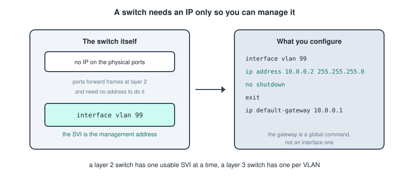

```text
S1(config)# interface vlan 99
S1(config-if)#  ip address 192.168.99.2 255.255.255.0
S1(config-if)#  no shutdown
S1(config-if)# exit
S1(config)# ip default-gateway 192.168.99.1
```

Two things catch people here.

**The SVI only comes up if its VLAN exists and at least one active port is in that VLAN.** Configuring `interface vlan 99` on a switch where VLAN 99 has no member ports leaves the interface down, and the address does nothing.

**`ip default-gateway` is a global command, not an interface one.** A layer 2 switch does not route, so it cannot use a routing table. It needs this single entry to know where to send replies destined for another subnet. On a layer 3 switch you use `ip routing` and real routes instead, and `ip default-gateway` is ignored.

---

## VLANs

Creating a VLAN and putting ports into it are two separate jobs.

```text
S1(config)# vlan 10
S1(config-vlan)#  name Staff
S1(config-vlan)# exit
S1(config)# vlan 20
S1(config-vlan)#  name Students
```

Then the ports.

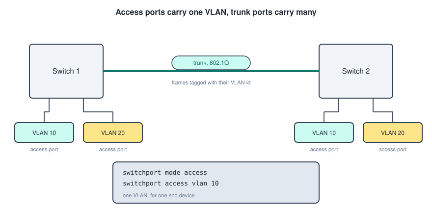

```text
S1(config)# interface range fastEthernet 0/1 - 8
S1(config-if-range)#  switchport mode access
S1(config-if-range)#  switchport access vlan 10
```

`switchport mode access` fixes the port as an access port so it never negotiates a trunk. `switchport access vlan 10` puts it in the VLAN, and it creates VLAN 10 automatically if it does not already exist, though creating it explicitly with a name is better practice.

Removing things.

```text
S1(config-if)# no switchport access vlan       -- port returns to VLAN 1
S1(config)# no vlan 10                          -- deletes the VLAN entirely
```

Deleting a VLAN that still has ports in it leaves those ports orphaned and unable to communicate, so move the ports first.

---

## Trunks

A trunk carries several VLANs over one link, tagging each frame with `802.1Q` so the far end knows which VLAN it belongs to.

```text
S1(config)# interface gigabitEthernet 0/1
S1(config-if)#  switchport mode trunk
S1(config-if)#  switchport trunk native vlan 99
S1(config-if)#  switchport trunk allowed vlan 10,20,99
```

- **`switchport mode trunk`** forces the port to be a trunk.
- **`switchport trunk native vlan 99`** changes the native VLAN, the one whose frames cross untagged. It defaults to VLAN 1, and moving it off VLAN 1 is standard security advice. **The native VLAN must match on both ends** or the switch logs a mismatch and the two VLANs effectively merge.
- **`switchport trunk allowed vlan`** limits which VLANs may cross. Without it every VLAN is allowed, which is more exposure than you need.

On switches that support `802.1Q` and ISL you also have to pick the encapsulation first, and on modern switches this command is not available because there is nothing to choose.

```text
S1(config-if)# switchport trunk encapsulation dot1q
```

### Turning Off Negotiation

By default a Cisco switch port will negotiate whether to become a trunk, using the **dynamic trunking protocol**. That is convenient and it is also a documented attack path, since a rogue device can negotiate itself a trunk and reach every VLAN.

```text
S1(config-if)# switchport nonegotiate
```

The full hardening pattern from the networks file is to set every port explicitly and shut down what you are not using.

```text
S1(config)# interface range fastEthernet 0/9 - 24
S1(config-if-range)#  switchport mode access
S1(config-if-range)#  switchport access vlan 999
S1(config-if-range)#  shutdown
```

VLAN 999 here is a parking VLAN that routes nowhere, so an unused port is both disabled and isolated.

Verify with `show interfaces trunk`, which lists the trunking ports, their native VLAN, and which VLANs are allowed and active.

---

## Inter-VLAN Routing

The networks file gave three methods. Here is what each one looks like as configuration.

### Legacy Routing

One router interface per VLAN, each cabled to an access port on the switch. Nothing special about the configuration, which is exactly the point: it is just two ordinary interfaces.

```text
R1(config)# interface gigabitEthernet 0/0/0
R1(config-if)#  ip address 192.168.10.1 255.255.255.0
R1(config-if)#  no shutdown
R1(config)# interface gigabitEthernet 0/0/1
R1(config-if)#  ip address 192.168.20.1 255.255.255.0
R1(config-if)#  no shutdown
```

It stops being viable the moment you have more VLANs than the router has ports.

### Router On A Stick

One physical link carrying everything, divided into **subinterfaces**.

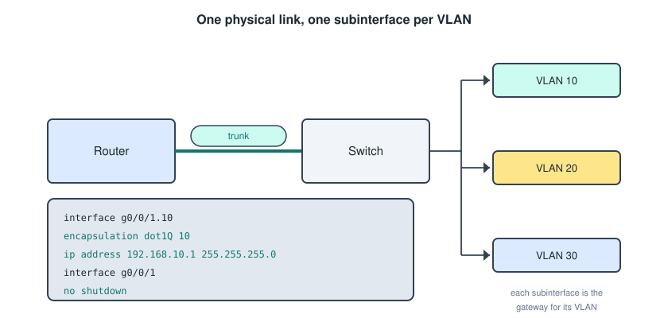

```text
R1(config)# interface gigabitEthernet 0/0/1.10
R1(config-subif)#  encapsulation dot1Q 10
R1(config-subif)#  ip address 192.168.10.1 255.255.255.0
R1(config-subif)# exit
R1(config)# interface gigabitEthernet 0/0/1.20
R1(config-subif)#  encapsulation dot1Q 20
R1(config-subif)#  ip address 192.168.20.1 255.255.255.0
R1(config-subif)# exit
R1(config)# interface gigabitEthernet 0/0/1
R1(config-if)#  no shutdown
```

Four details that decide whether this works.

- **The subinterface number is conventional, not functional.** Naming it `.10` for VLAN 10 is a convention everyone follows, but the VLAN is set by `encapsulation dot1Q 10`, and that is the line that matters.
- **`encapsulation` must come before `ip address`** on a subinterface, or IOS rejects the address.
- **The physical interface needs `no shutdown`**, and it takes no IP address of its own. Subinterfaces inherit their up or down state from it.
- **The switch port at the other end must be a trunk.** An access port here is the most common failure.

For the native VLAN, add the keyword so that untagged frames are handled.

```text
R1(config-subif)# encapsulation dot1Q 99 native
```

### Layer 3 Switch

An SVI per VLAN on the switch itself, with no router in the path at all.

```text
S1(config)# ip routing
S1(config)# interface vlan 10
S1(config-if)#  ip address 192.168.10.1 255.255.255.0
S1(config-if)#  no shutdown
S1(config)# interface vlan 20
S1(config-if)#  ip address 192.168.20.1 255.255.255.0
S1(config-if)#  no shutdown
```

**`ip routing` is the command that turns the switch into a router**, and forgetting it means the SVIs come up and nothing passes between them.

To connect a layer 3 switch to a router you convert a switchport into a routed port, which behaves exactly like a router interface.

```text
S1(config)# interface gigabitEthernet 1/0/1
S1(config-if)#  no switchport
S1(config-if)#  ip address 10.0.0.2 255.255.255.252
```

---

## Static Routing

A router knows about directly connected networks automatically. Everything else you either configure by hand or learn from a protocol.

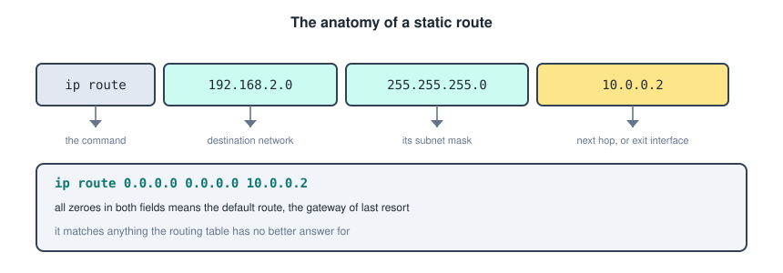

```text
R1(config)# ip route 192.168.2.0 255.255.255.0 10.0.0.2
R1(config)# ip route 192.168.2.0 255.255.255.0 serial 0/1/0
R1(config)# ip route 192.168.2.0 255.255.255.0 serial 0/1/0 10.0.0.2
```

Those are the three forms.

- **Next hop**, giving the address of the router on the far side. The router has to do a second lookup to find how to reach that address, which is called a recursive lookup.
- **Exit interface**, naming the local interface to send out of. This works cleanly on point to point links such as serial. On an ethernet link it forces the router to ARP for every destination, so it is discouraged.
- **Fully specified**, giving both. This is the correct form on a multiaccess ethernet link.

The **default route** uses all zeroes for both the network and the mask, meaning match anything.

```text
R1(config)# ip route 0.0.0.0 0.0.0.0 10.0.0.2
```

That is the gateway of last resort, and it appears in the routing table marked with `S*`.

A **floating static route** is a backup that only activates when the primary path dies, made by raising its administrative distance above the default of 1.

```text
R1(config)# ip route 192.168.2.0 255.255.255.0 10.0.0.2
R1(config)# ip route 192.168.2.0 255.255.255.0 10.0.1.2 5
```

The trailing `5` is the administrative distance. Lower wins, so the second route sits unused in the configuration until the first one goes away.

For IPv6 the commands mirror these, with `ipv6 unicast-routing` needed first to enable routing at all.

```text
R1(config)# ipv6 unicast-routing
R1(config)# ipv6 route 2001:db8:2::/64 2001:db8:1::2
R1(config)# ipv6 route ::/0 2001:db8:1::2
```

---

## Reading The Routing Table

```text
R1# show ip route
```

The codes in the left column are the ones from the networks file.

- **`C`** is a directly connected network.
- **`L`** is the address assigned to a router interface, shown as a `/32` host route.
- **`S`** is a static route, and **`S*`** is the candidate default.
- **`O`** is a network learned from OSPF.

Each entry also carries two numbers in brackets, written as `[110/65]`. The first is the **administrative distance**, which is how much the router trusts the source, and the second is the **metric**, which is how good the path is within that source. Directly connected is 0, static is 1, OSPF is 110.

Useful narrower views.

```text
R1# show ip route static
R1# show ip route ospf
R1# show ip route 192.168.2.0
R1# show ip protocols
```

---

## Wildcard Masks

Two things in IOS take a wildcard mask rather than a subnet mask: OSPF network statements and every ACL. It is worth getting straight before either.

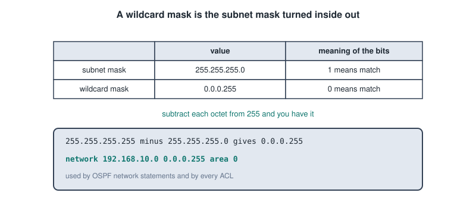

A subnet mask uses `1` to mean "this bit is network". A wildcard mask uses `0` to mean "this bit must match", so it is the subnet mask inverted.

```text
subnet mask     255.255.255.0     ->   wildcard   0.0.0.255
subnet mask     255.255.255.252   ->   wildcard   0.0.0.3
subnet mask     255.255.0.0       ->   wildcard   0.0.255.255
```

Subtract each octet from 255 and you have it. Two shorthands appear constantly and are worth recognising on sight.

- **`0.0.0.0`** means every bit must match, so exactly one host. The keyword `host` is the same thing.
- **`255.255.255.255`** means no bit has to match, so anything at all. The keyword `any` is the same thing.

```text
access-list 10 permit 192.168.10.5 0.0.0.0
access-list 10 permit host 192.168.10.5        -- identical
```

---

## OSPF

Single area OSPF takes three or four commands. The concepts behind them are in the networks file, so this is what each line actually decides.

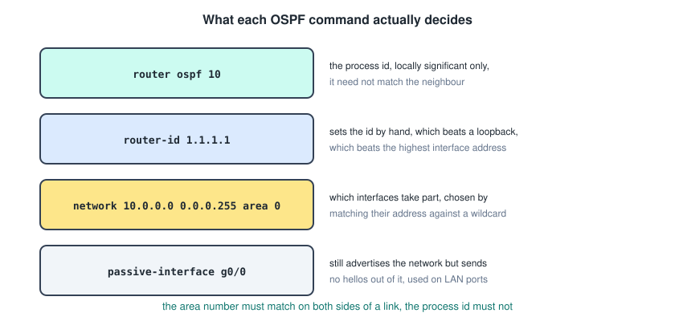

```text
R1(config)# router ospf 10
R1(config-router)#  router-id 1.1.1.1
R1(config-router)#  network 192.168.10.0 0.0.0.255 area 0
R1(config-router)#  network 10.0.0.0 0.0.0.3 area 0
R1(config-router)#  passive-interface gigabitEthernet 0/0/0
```

**The process id is local.** `router ospf 10` on one router happily forms an adjacency with `router ospf 55` on another. It is a label for the process on that box, nothing more. **The area number is not local**, and it has to match on both ends of a link.

**The network statement does not advertise a network directly.** It selects which interfaces participate, by matching each interface's address against the address and wildcard given. Any interface that matches is put in the named area, starts sending hellos, and has its network advertised. That indirection is why people get it wrong: you are describing interfaces, not routes.

The router id follows the three step rule from the networks file, so `router-id` beats the highest loopback address, which beats the highest physical interface address. Setting it explicitly is the sane choice, and a loopback is the next best.

```text
R1(config)# interface loopback 0
R1(config-if)#  ip address 1.1.1.1 255.255.255.255
```

**A changed router id does not take effect until the process restarts.**

```text
R1# clear ip ospf process
```

### Passive Interfaces

An interface facing only end devices should not send hellos, since there is no router out there to hear them and broadcasting your routing topology onto a user LAN is an information leak.

```text
R1(config-router)# passive-interface gigabitEthernet 0/0/0
```

The network is still advertised to other routers. Only the hellos stop. To flip the logic when most interfaces are user facing.

```text
R1(config-router)# passive-interface default
R1(config-router)# no passive-interface serial 0/1/0
```

### Influencing The DR Election

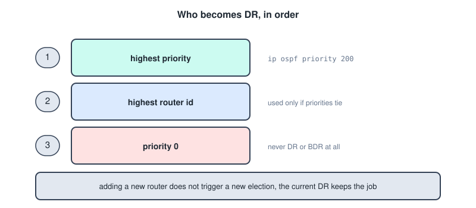

Priority is per interface, not per router, because a router can be DR on one segment and a DROther on another.

```text
R1(config)# interface gigabitEthernet 0/0/1
R1(config-if)#  ip ospf priority 200
```

Setting priority to `0` guarantees the router will never be DR or BDR on that segment. Since an election is not rerun when a new router appears, changing priority needs `clear ip ospf process` on the current DR to take effect.

### Cost And Bandwidth

The cost formula from the networks file is reference bandwidth divided by interface bandwidth. The default reference bandwidth is 100 Mbps, which means every interface at 100 Mbps or faster gets a cost of 1 and gigabit and ten gigabit links become indistinguishable.

```text
R1(config-router)# auto-cost reference-bandwidth 10000
```

That raises the reference to 10 Gbps so the fast links separate again. **It must be set identically on every router in the area**, or the costs disagree and routing gets strange.

You can also set a cost directly on an interface, which is the more predictable option.

```text
R1(config-if)# ip ospf cost 30
```

Note that `bandwidth 64` on an interface changes the value OSPF uses in its calculation but does not change the actual line speed. It is a signalling command for routing protocols, and it confuses people who expect it to throttle traffic.

### Default Route Propagation

The edge router has a default route to the ISP. To tell every other OSPF router about it.

```text
R1(config)# ip route 0.0.0.0 0.0.0.0 209.165.200.226
R1(config)# router ospf 10
R1(config-router)#  default-information originate
```

Other routers then see the route as `O*E2`.

### Verifying OSPF

```text
R1# show ip ospf neighbor
R1# show ip ospf interface brief
R1# show ip protocols
R1# show ip route ospf
```

`show ip ospf neighbor` is the first place to look. A neighbour stuck in `INIT` means hellos are going one way only, and a neighbour that never appears at all usually means mismatched area numbers, mismatched hello or dead timers, mismatched subnet masks, or a passive interface where you did not want one.

---

## Spanning Tree

STP is on by default, so there is usually nothing to enable. What you configure is which switch wins.

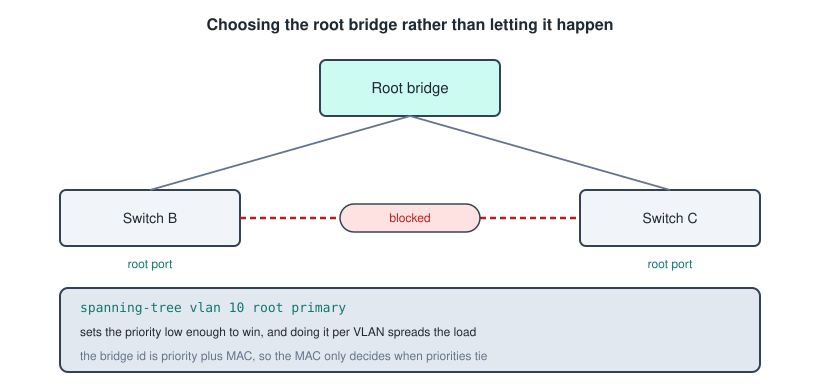

```text
S1(config)# spanning-tree vlan 10 root primary
S1(config)# spanning-tree vlan 10 root secondary
```

Those are macros. `root primary` lowers the priority far enough to win the current election, and `root secondary` sets a value that becomes root only if the primary fails. You can also set the priority by hand, and it must be a multiple of 4096.

```text
S1(config)# spanning-tree vlan 10 priority 4096
```

Because each VLAN runs its own STP instance, making different switches root for different VLANs spreads the traffic instead of funnelling everything through one box.

```text
S1(config)# spanning-tree vlan 10 root primary
S1(config)# spanning-tree vlan 20 root secondary
S2(config)# spanning-tree vlan 20 root primary
S2(config)# spanning-tree vlan 10 root secondary
```

Selecting the mode, where rapid PVST converges in seconds rather than the 30 to 50 seconds of the original.

```text
S1(config)# spanning-tree mode rapid-pvst
```

### PortFast And BPDU Guard

A port with a single PC on it has no business waiting through listening and learning, and it has no business receiving BPDUs either.

```text
S1(config)# interface fastEthernet 0/1
S1(config-if)#  spanning-tree portfast
S1(config-if)#  spanning-tree bpduguard enable
```

Or as a default for every access port.

```text
S1(config)# spanning-tree portfast default
S1(config)# spanning-tree portfast bpduguard default
```

**These two belong together.** PortFast puts the port straight into forwarding, which is exactly what an attacker would want in order to inject BPDUs and become root. BPDU guard err-disables the port the moment a BPDU arrives on it, which is what makes PortFast safe. Never put PortFast on a link to another switch.

Verifying.

```text
S1# show spanning-tree
S1# show spanning-tree vlan 10
S1# show spanning-tree summary
```

`show spanning-tree` tells you the root bridge id, this switch's own bridge id, and whether the two are the same. A line saying this bridge is the root is your confirmation the priority took.

---

## EtherChannel

Bundling links means configuring both ends compatibly, and the mode pairs are the part that catches people.

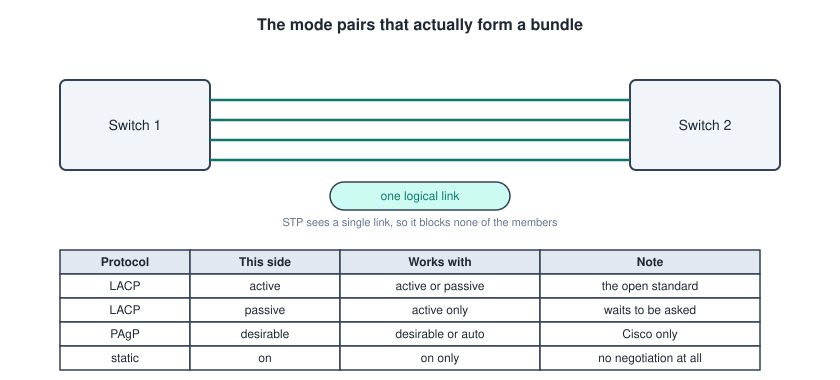

```text
S1(config)# interface range fastEthernet 0/1 - 4
S1(config-if-range)#  shutdown
S1(config-if-range)#  channel-group 1 mode active
S1(config-if-range)#  no shutdown
S1(config-if-range)# exit
S1(config)# interface port-channel 1
S1(config-if)#  switchport mode trunk
S1(config-if)#  switchport trunk allowed vlan 10,20,99
```

Shutting the ports before grouping them and bringing them back afterward avoids the flapping that otherwise happens while the two sides negotiate.

The `channel-group` command creates the logical `port-channel` interface automatically. From then on **you configure the port-channel, not the members**. Setting a VLAN or a trunk on one physical member and not the others is the classic way to stop a bundle forming.

The requirement is that every member port has the same speed, the same duplex, the same allowed VLANs and the same trunk or access mode. LACP checks this and refuses to bring up a mismatched bundle, which is exactly what you want it to do.

Verifying.

```text
S1# show etherchannel summary
S1# show interfaces port-channel 1
S1# show etherchannel port-channel
```

In `show etherchannel summary` the flags matter. `SU` means the port-channel is in use, `P` means a member port is bundled, and `I` means a member is standalone and has not joined, which is the sign of a mismatch.

---

## Port Security

Port security limits which MAC addresses may use a port and reacts when an unexpected one appears. The port must be a fixed access port first, since IOS refuses to apply it to a port that could still negotiate a trunk.

```text
S1(config)# interface fastEthernet 0/1
S1(config-if)#  switchport mode access
S1(config-if)#  switchport port-security
S1(config-if)#  switchport port-security maximum 2
S1(config-if)#  switchport port-security mac-address sticky
S1(config-if)#  switchport port-security violation restrict
S1(config-if)#  switchport port-security aging time 60
```

- **`maximum`** sets how many MAC addresses the port accepts. The default is 1, and 2 is common where an IP phone sits between the switch and the PC.
- **`mac-address sticky`** learns the address currently in use and writes it into the running config, which saves typing it by hand. Save the config afterward or the learning is lost on reload.
- **`violation`** picks the reaction.
- **`aging`** drops learned addresses after a period, which suits a desk that different laptops use.

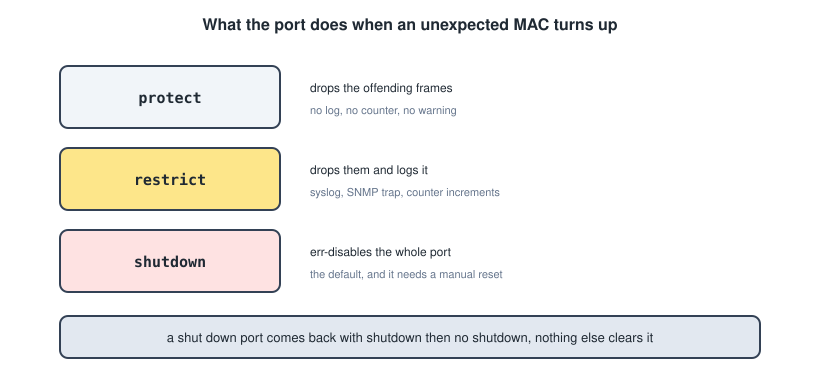

The default is `shutdown`, and a port in `err-disabled` state does not recover on its own.

```text
S1(config)# interface fastEthernet 0/1
S1(config-if)#  shutdown
S1(config-if)#  no shutdown
```

Verifying.

```text
S1# show port-security
S1# show port-security interface fastEthernet 0/1
S1# show port-security address
```

---

## The Other Switch Attacks

The networks file listed four attacks and their countermeasures. Three of them are single commands and the fourth is DTP, covered under trunks above.

**DHCP snooping** stops a rogue DHCP server handing out bad gateways. You enable it globally, enable it per VLAN, and then mark the ports where a legitimate server is allowed to answer.

```text
S1(config)# ip dhcp snooping
S1(config)# ip dhcp snooping vlan 10,20
S1(config)# interface gigabitEthernet 0/1
S1(config-if)#  ip dhcp snooping trust
S1(config-if)#  ip dhcp snooping limit rate 6
```

**Every port is untrusted by default**, which is the right way round. Only the uplink toward the real DHCP server gets `trust`.

**Dynamic ARP inspection** validates ARP replies, and it uses the table that DHCP snooping builds, so snooping has to be on first.

```text
S1(config)# ip arp inspection vlan 10,20
S1(config)# interface gigabitEthernet 0/1
S1(config-if)#  ip arp inspection trust
```

**BPDU guard** is the STP one, already covered above.

---

## DHCP

A router can be the DHCP server, a DHCP relay, or a DHCP client, and all three come up in practice.

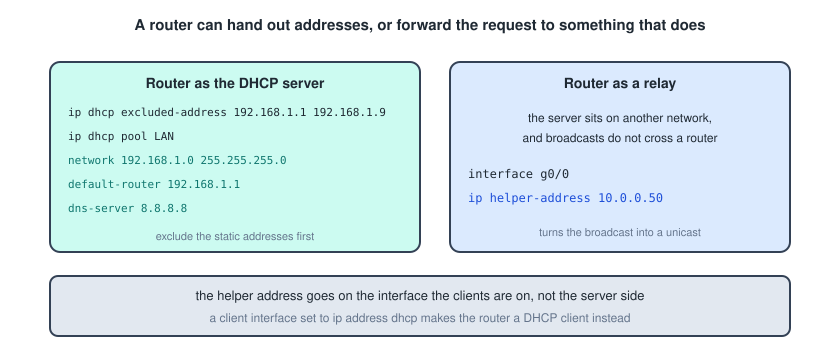

```text
R1(config)# ip dhcp excluded-address 192.168.1.1 192.168.1.9
R1(config)# ip dhcp pool LAN-POOL
R1(dhcp-config)#  network 192.168.1.0 255.255.255.0
R1(dhcp-config)#  default-router 192.168.1.1
R1(dhcp-config)#  dns-server 8.8.8.8
R1(dhcp-config)#  domain-name example.com
R1(dhcp-config)#  lease 3
```

**Exclude before you pool.** The router will otherwise happily hand out the address of its own interface. The excluded range covers the static addresses you have reserved for gateways, servers and printers.

When the DHCP server sits on a different network, the clients' broadcasts cannot reach it, because routers do not forward broadcasts.

```text
R1(config)# interface gigabitEthernet 0/0/0
R1(config-if)#  ip helper-address 10.0.0.50
```

**The helper address goes on the interface the clients are on**, facing them, not on the interface facing the server. It converts the broadcast into a unicast aimed at the server.

An interface can also be a client, which is normal on the link to an ISP.

```text
R1(config-if)# ip address dhcp
```

Verifying.

```text
R1# show ip dhcp binding
R1# show ip dhcp pool
R1# show ip dhcp conflict
```

For IPv6 the equivalents are stateless SLAAC, which needs no server at all, and stateful DHCPv6. Enabling `ipv6 unicast-routing` is what makes the router send the router advertisements that SLAAC depends on.

---

## NAT

Every NAT configuration has the same three parts: say what to translate, say into what, and mark which interface is inside and which is outside.

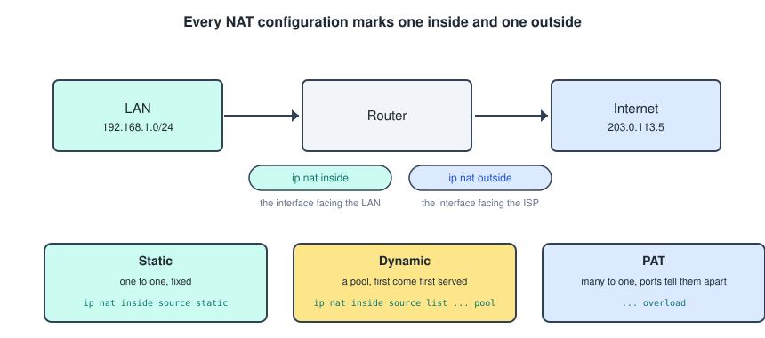

### Static NAT

A fixed one to one mapping, used when a server inside has to be reachable from outside at a predictable address.

```text
R1(config)# ip nat inside source static 192.168.1.10 209.165.200.5
R1(config)# interface gigabitEthernet 0/0/0
R1(config-if)#  ip nat inside
R1(config-if)# exit
R1(config)# interface serial 0/1/0
R1(config-if)#  ip nat outside
```

### Dynamic NAT

A pool of public addresses handed out first come first served, which needs an ACL to say which internal addresses qualify.

```text
R1(config)# ip nat pool PUBLIC 209.165.200.5 209.165.200.10 netmask 255.255.255.248
R1(config)# access-list 1 permit 192.168.1.0 0.0.0.255
R1(config)# ip nat inside source list 1 pool PUBLIC
```

When the pool is exhausted the next device simply fails, since there is nothing left to give it.

### PAT

Many private addresses behind one public address, with port numbers keeping the sessions apart. This is what a home router does, and it is what `overload` means.

```text
R1(config)# access-list 1 permit 192.168.1.0 0.0.0.255
R1(config)# ip nat inside source list 1 interface serial 0/1/0 overload
```

Using the interface rather than a pool means the router uses whatever public address it currently holds, which matters when the ISP assigns it dynamically. The pool form also works.

```text
R1(config)# ip nat inside source list 1 pool PUBLIC overload
```

Verifying.

```text
R1# show ip nat translations
R1# show ip nat statistics
R1# clear ip nat translation *
```

`show ip nat translations` prints the NAT table with exactly the four columns from the networks file: inside local, inside global, outside local and outside global. If the table is empty, the usual causes are a missing `ip nat inside` or `ip nat outside`, or an ACL that does not match the traffic.

---

## Access Control Lists

An ACL is a numbered or named list of permit and deny statements, checked in order against every packet crossing an interface.

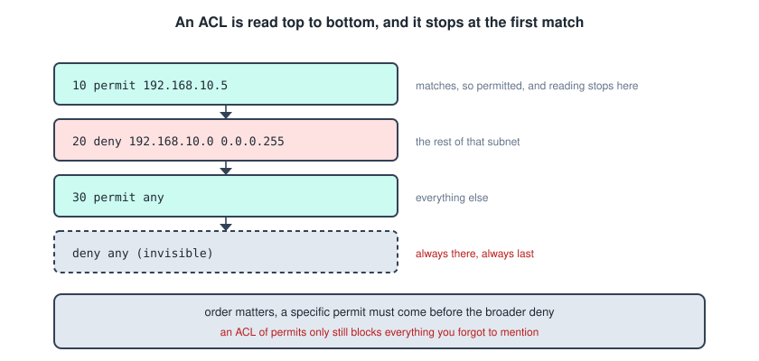

Three properties drive everything about how you write them.

- **Order matters**, because the list stops at the first match. A specific permit placed after a broad deny never runs.
- **There is an invisible `deny any` at the end.** An ACL containing only permits still blocks everything you did not mention.
- **A numbered ACL cannot be edited in place.** New lines append to the end, so fixing line 10 means deleting the whole list and retyping it. Named ACLs do not have this problem, which is the main reason to prefer them.

### Standard ACLs

Numbered 1 to 99, and they filter on the **source address only**.

```text
R1(config)# access-list 10 permit 192.168.10.0 0.0.0.255
R1(config)# access-list 10 deny host 192.168.20.5
R1(config)# access-list 10 permit any
```

Because they see only the source, they must be placed **as close to the destination as possible**. Putting one near the source would block that source from reaching everything, not just the network you meant to protect.

### Extended ACLs

Numbered 100 to 199, and they filter on source, destination, protocol and port.

```text
R1(config)# access-list 110 permit tcp 192.168.10.0 0.0.0.255 any eq 80
R1(config)# access-list 110 permit tcp 192.168.10.0 0.0.0.255 any eq 443
R1(config)# access-list 110 deny tcp any any eq 23
R1(config)# access-list 110 permit ip any any
```

The word order is fixed and worth memorising: **action, protocol, source, source wildcard, destination, destination wildcard, port**.

Because they can see the destination, they should be placed **as close to the source as possible**, so unwanted traffic dies before it crosses the network.

Port numbers may be written as numbers or as keywords, so `eq 80` and `eq www` are the same, as are `eq 22` and `eq ssh`. The operators are `eq`, `neq`, `gt`, `lt` and `range`.

**`permit ip any any` at the end is deliberate.** Without it the invisible deny drops everything else, and on a router that includes routing protocol traffic and your own management sessions.

### Named ACLs

Same behaviour, better ergonomics, and they let you edit individual lines by sequence number.

```text
R1(config)# ip access-list extended WEB-ONLY
R1(config-ext-nacl)#  10 permit tcp 192.168.10.0 0.0.0.255 any eq 80
R1(config-ext-nacl)#  20 permit tcp 192.168.10.0 0.0.0.255 any eq 443
R1(config-ext-nacl)#  30 deny ip any any
```

Removing or inserting one line.

```text
R1(config-ext-nacl)# no 20
R1(config-ext-nacl)# 15 permit tcp 192.168.10.0 0.0.0.255 any eq 53
```

Sequence numbers default to steps of 10 precisely so there is room to insert.

### Applying An ACL

Writing an ACL does nothing. It has to be attached somewhere.

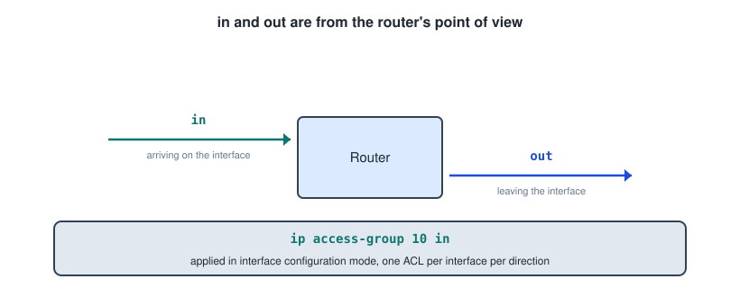

```text
R1(config)# interface gigabitEthernet 0/0/0
R1(config-if)#  ip access-group 110 in
```

The direction is relative to the router, so `in` filters packets arriving on that interface and `out` filters packets leaving it. **One ACL per interface, per direction, per protocol** is the hard limit.

### Protecting The VTY Lines

By default anything on the network can attempt to SSH into the router. Limiting that uses a standard ACL applied to the lines rather than to an interface, and the keyword changes from `ip access-group` to `access-class`.

```text
R1(config)# ip access-list standard ADMIN-ONLY
R1(config-std-nacl)#  permit 192.168.99.0 0.0.0.255
R1(config-std-nacl)# exit
R1(config)# line vty 0 15
R1(config-line)#  access-class ADMIN-ONLY in
R1(config-line)#  transport input ssh
```

This is more efficient than filtering SSH on every interface, since it protects every way in at once.

Verifying.

```text
R1# show access-lists
R1# show ip access-lists
R1# show ip interface gigabitEthernet 0/0/0
```

`show access-lists` shows a match counter next to each line, which tells you whether traffic is hitting the entry you expect. `show ip interface` tells you which ACL is applied in which direction, and it is where you find out that you attached it to the wrong interface.

---

## First Hop Redundancy

HSRP lets two routers share one virtual gateway address so hosts never have to change their configuration when one fails.

```text
R1(config)# interface gigabitEthernet 0/0/0
R1(config-if)#  ip address 192.168.1.2 255.255.255.0
R1(config-if)#  standby 1 ip 192.168.1.1
R1(config-if)#  standby 1 priority 150
R1(config-if)#  standby 1 preempt
```

On the second router the same virtual address is configured with a lower priority, and the hosts point at `192.168.1.1`, which belongs to neither router in particular.

- **`standby 1 ip`** sets the virtual address, and the group number must match on both routers.
- **`priority`** decides who is active, with the default 100 and higher winning.
- **`preempt`** lets a recovered router take the active role back. Without it, the router that took over keeps the job even after the preferred one returns.

Verify with `show standby brief`.

---

## IPv6 Configuration

IPv6 is off until you turn it on, and that single command is the one people forget.

```text
R1(config)# ipv6 unicast-routing
R1(config)# interface gigabitEthernet 0/0/0
R1(config-if)#  ipv6 address 2001:db8:acad:1::1/64
R1(config-if)#  ipv6 address fe80::1 link-local
R1(config-if)#  no shutdown
```

Three ways to get a **GUA** onto an interface, matching the three from the networks file.

```text
ipv6 address 2001:db8:acad:1::1/64            -- typed in full
ipv6 address 2001:db8:acad:1::/64 eui-64      -- host part built from the MAC
ipv6 address autoconfig                        -- learned by SLAAC
```

The **LLA** is generated automatically the moment IPv6 is enabled on an interface, so configuring one by hand is optional. It is still worth doing on routers, because a short readable `fe80::1` is far easier to use as a static route next hop than a MAC derived one.

Verifying.

```text
R1# show ipv6 interface brief
R1# show ipv6 route
R1# show ipv6 neighbors
```

`show ipv6 interface brief` lists both addresses per interface, the link local first.

---

## Verification And Troubleshooting

Most problems come down to one of a handful of causes, and a small set of commands finds all of them.

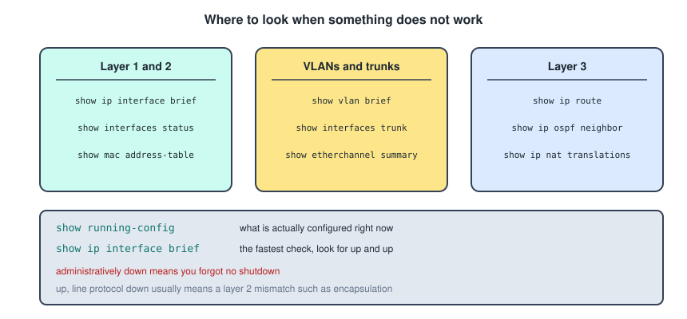

`show ip interface brief` is the fastest single check on any device, and the two status columns tell you where the fault is.

- **`administratively down`** means the interface is shut. You forgot `no shutdown`.
- **`down / down`** means a layer 1 problem, so a cable, a wrong port, or the far end being shut.
- **`up / down`** means layer 1 is fine and layer 2 is not, typically an encapsulation mismatch, a missing clock rate on a serial DCE, or a keepalive problem.
- **`up / up`** means the interface is working, and the fault is further up the stack.

The rest of the everyday set.

```text
S1# show running-config
S1# show vlan brief
S1# show interfaces trunk
S1# show mac address-table
S1# show cdp neighbors detail
R1# show ip route
R1# show ip protocols
R1# show ip ospf neighbor
```

`show cdp neighbors detail` is the one that saves time when you do not have a diagram, since it names the device on the other end of each cable, its model, and its IP address. It only works between Cisco devices, and `show lldp neighbors` is the vendor neutral equivalent once you have enabled LLDP.

Connectivity testing from the device itself.

```text
R1# ping 192.168.2.1
R1# ping 192.168.2.1 source 192.168.1.1
R1# traceroute 192.168.2.1
```

The `source` keyword matters when you are testing an ACL, because without it the router sources the ping from the outgoing interface rather than the network you intended to test.

An extended ping, reached by typing `ping` with no arguments in privileged EXEC, lets you set the repeat count, the packet size and the source interface interactively. It is the right tool for proving whether an ACL is doing what you think.

---

## A Full Worked Configuration

Everything above, on a small network with two VLANs, a router on a stick, OSPF to a second router, and PAT on the way out.

The switch first.

```text
Switch> enable
Switch# configure terminal
Switch(config)# hostname S1
S1(config)# no ip domain-lookup
S1(config)# enable secret class
S1(config)# service password-encryption
S1(config)# banner motd #Authorised access only#

S1(config)# vlan 10
S1(config-vlan)#  name Staff
S1(config-vlan)# exit
S1(config)# vlan 20
S1(config-vlan)#  name Students
S1(config-vlan)# exit
S1(config)# vlan 99
S1(config-vlan)#  name Management
S1(config-vlan)# exit

S1(config)# interface vlan 99
S1(config-if)#  ip address 192.168.99.2 255.255.255.0
S1(config-if)#  no shutdown
S1(config-if)# exit
S1(config)# ip default-gateway 192.168.99.1

S1(config)# interface range fastEthernet 0/1 - 8
S1(config-if-range)#  switchport mode access
S1(config-if-range)#  switchport access vlan 10
S1(config-if-range)#  spanning-tree portfast
S1(config-if-range)#  spanning-tree bpduguard enable
S1(config-if-range)# exit

S1(config)# interface range fastEthernet 0/9 - 16
S1(config-if-range)#  switchport mode access
S1(config-if-range)#  switchport access vlan 20
S1(config-if-range)#  spanning-tree portfast
S1(config-if-range)#  spanning-tree bpduguard enable
S1(config-if-range)# exit

S1(config)# interface range fastEthernet 0/17 - 24
S1(config-if-range)#  switchport mode access
S1(config-if-range)#  switchport access vlan 999
S1(config-if-range)#  shutdown
S1(config-if-range)# exit

S1(config)# interface gigabitEthernet 0/1
S1(config-if)#  switchport mode trunk
S1(config-if)#  switchport trunk native vlan 99
S1(config-if)#  switchport trunk allowed vlan 10,20,99
S1(config-if)#  switchport nonegotiate
S1(config-if)# end
S1# copy running-config startup-config
```

Then the router.

```text
Router> enable
Router# configure terminal
Router(config)# hostname R1
R1(config)# no ip domain-lookup
R1(config)# enable secret class
R1(config)# service password-encryption
R1(config)# ip domain-name example.com
R1(config)# username admin secret adminpass
R1(config)# crypto key generate rsa
R1(config)# ip ssh version 2
R1(config)# line vty 0 15
R1(config-line)#  transport input ssh
R1(config-line)#  login local
R1(config-line)# exit

R1(config)# interface gigabitEthernet 0/0/1.10
R1(config-subif)#  encapsulation dot1Q 10
R1(config-subif)#  ip address 192.168.10.1 255.255.255.0
R1(config-subif)# exit
R1(config)# interface gigabitEthernet 0/0/1.20
R1(config-subif)#  encapsulation dot1Q 20
R1(config-subif)#  ip address 192.168.20.1 255.255.255.0
R1(config-subif)# exit
R1(config)# interface gigabitEthernet 0/0/1.99
R1(config-subif)#  encapsulation dot1Q 99 native
R1(config-subif)#  ip address 192.168.99.1 255.255.255.0
R1(config-subif)# exit
R1(config)# interface gigabitEthernet 0/0/1
R1(config-if)#  no shutdown
R1(config-if)# exit

R1(config)# interface serial 0/1/0
R1(config-if)#  ip address 10.0.0.1 255.255.255.252
R1(config-if)#  no shutdown
R1(config-if)# exit

R1(config)# router ospf 10
R1(config-router)#  router-id 1.1.1.1
R1(config-router)#  network 192.168.10.0 0.0.0.255 area 0
R1(config-router)#  network 192.168.20.0 0.0.0.255 area 0
R1(config-router)#  network 192.168.99.0 0.0.0.255 area 0
R1(config-router)#  network 10.0.0.0 0.0.0.3 area 0
R1(config-router)#  passive-interface gigabitEthernet 0/0/1.10
R1(config-router)#  passive-interface gigabitEthernet 0/0/1.20
R1(config-router)# exit

R1(config)# interface gigabitEthernet 0/0/0
R1(config-if)#  ip address dhcp
R1(config-if)#  ip nat outside
R1(config-if)#  no shutdown
R1(config-if)# exit
R1(config)# interface gigabitEthernet 0/0/1.10
R1(config-subif)#  ip nat inside
R1(config-subif)# exit
R1(config)# interface gigabitEthernet 0/0/1.20
R1(config-subif)#  ip nat inside
R1(config-subif)# exit

R1(config)# access-list 1 permit 192.168.10.0 0.0.0.255
R1(config)# access-list 1 permit 192.168.20.0 0.0.0.255
R1(config)# ip nat inside source list 1 interface gigabitEthernet 0/0/0 overload

R1(config)# ip access-list standard ADMIN-ONLY
R1(config-std-nacl)#  permit 192.168.99.0 0.0.0.255
R1(config-std-nacl)# exit
R1(config)# line vty 0 15
R1(config-line)#  access-class ADMIN-ONLY in
R1(config-line)# end
R1# copy running-config startup-config
```

---

## Quick Recap

**Getting around**
- Modes go user EXEC, privileged EXEC, global config, then subconfig. `enable`, `configure terminal`, `interface`, and `exit` or `end` to come back.
- `?` lists what can come next, `Tab` completes, abbreviations work if unambiguous.
- **`no` in front of almost any command undoes it.**
- `do` runs an EXEC command from config mode.

**Saving**
- `running-config` is in RAM and takes effect instantly, `startup-config` is in NVRAM and survives a reload.
- `copy running-config startup-config` saves. Nothing saves on its own.

**Security basics**
- `enable secret` not `enable password`, and `login` on the line or the password is never asked for.
- SSH needs a hostname, a domain name, an RSA key, `transport input ssh` and `login local`.
- `service password-encryption` obscures, it does not secure.

**Interfaces**
- `ip address` takes a full dotted mask. **Router interfaces need `no shutdown`.**
- A switch gets its management address on an SVI, plus a global `ip default-gateway`.
- `interface range` configures many ports at once.

**VLANs**
- `vlan 10` creates, `switchport access vlan 10` assigns, `switchport mode access` fixes the role.
- Trunks: `switchport mode trunk`, then `native vlan` and `allowed vlan`. **The native VLAN must match on both ends.**
- `switchport nonegotiate` disables DTP, and unused ports go to a parking VLAN and get shut.

**Inter-VLAN routing**
- Router on a stick: a subinterface per VLAN, `encapsulation dot1Q` before `ip address`, `no shutdown` on the physical interface, trunk on the switch side.
- Layer 3 switch: an SVI per VLAN plus **`ip routing`**, and `no switchport` turns a port into a routed one.

**Routing**
- `ip route network mask next-hop`, and all zeroes for the default route.
- A trailing number is the administrative distance, which is how you make a floating backup route.
- Table codes: `C` connected, `L` local, `S` static, `S*` default, `O` OSPF.

**OSPF**
- The process id is local, the area number is not.
- `network` selects **interfaces** by wildcard, it does not advertise routes directly.
- Router id: the `router-id` command, then the highest loopback, then the highest interface. Changing it needs `clear ip ospf process`.
- `passive-interface` stops hellos while still advertising the network.
- `auto-cost reference-bandwidth` must match on every router in the area.

**STP and EtherChannel**
- `spanning-tree vlan 10 root primary` decides the root, and doing it per VLAN spreads the load.
- **PortFast and BPDU guard belong together**, on access ports only.
- `channel-group 1 mode active` is LACP. Configure the **port-channel**, not the members, and keep every member identical.

**Switch security**
- Port security needs a fixed access port first. `maximum`, `sticky`, `violation`, and the default `shutdown` needs a manual `shutdown` then `no shutdown`.
- DHCP snooping: enable globally, per VLAN, then `trust` only the uplink.
- DAI depends on the snooping table, so snooping goes on first.

**DHCP and NAT**
- Exclude addresses before creating the pool.
- **`ip helper-address` goes on the client side interface**, not the server side.
- NAT always needs `ip nat inside` and `ip nat outside` on the right interfaces, or the table stays empty.
- `overload` is what makes it PAT.

**ACLs**
- Read top to bottom, stop at first match, and there is an **invisible `deny any` at the end**.
- Standard is 1 to 99 and filters source only, so place it near the destination.
- Extended is 100 to 199 and filters source, destination, protocol and port, so place it near the source.
- Named ACLs let you edit by sequence number, which numbered ones do not.
- Apply with `ip access-group ... in|out` on an interface, or `access-class ... in` on the VTY lines.

**Wildcard masks**
- The subnet mask inverted. Subtract each octet from 255.
- `0.0.0.0` is one host, and `255.255.255.255` is anything. `host` and `any` are the same words.

**Troubleshooting**
- `show ip interface brief` first. `administratively down` means you forgot `no shutdown`, `up / down` means a layer 2 mismatch.
- `show cdp neighbors detail` tells you what is on the other end of the cable.
- `show access-lists` has hit counters, which prove whether traffic reaches the entry you expect.
